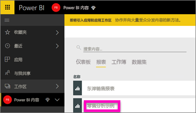
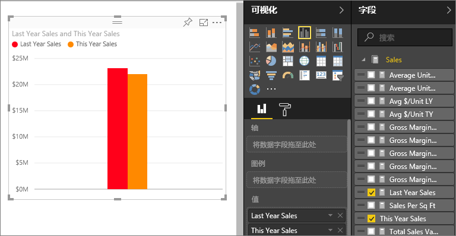
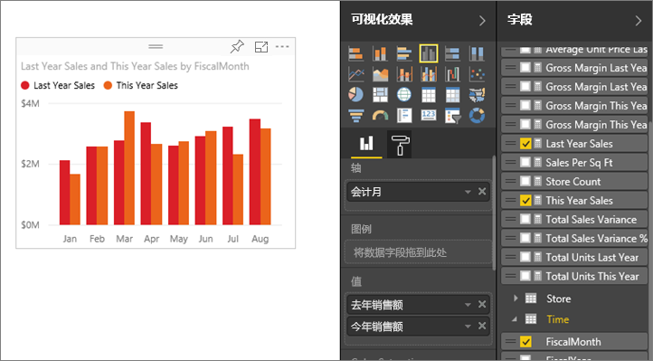
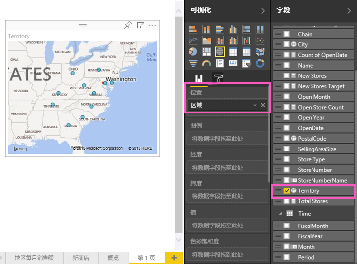
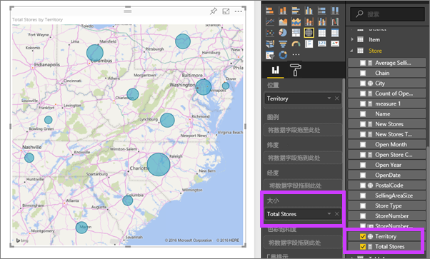
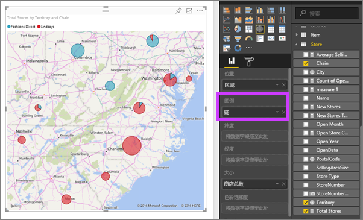

# 第 2 部分，向 Power BI 报表添加可视化效果
在[第 1 部分](power-bi-report-add-visualizations-ii.md)中，通过选中字段名称旁边的复选框来创建基本可视化对象。  在第 2 部分中，你将了解如何使用拖放功能并充分利用“字段”和“可视化对象”窗格创建和修改可视化对象。

### 先决条件
- [第 1 部分](power-bi-report-add-visualizations-ii.md)
- Power BI 服务 - 可使用 Power BI 服务或 Power BI Desktop 将可视化效果添加到报表。 本教程使用 Power BI 服务。 
- 零售分析示例

## 创建新的可视化对象
在本教程中，我们将深入探讨我们的零售分析数据集并创建几个关键的可视化对象。

### 打开报表并添加新的空白页。
1. 打开保存零售分析示例的工作区。 选择“零售分析示例”，在阅读视图中打开报表。
   
   
2. 选择**编辑报表**在编辑视图中打开报表。
   
   
3. 通过选择画布底部的黄色加号图标[添加新页面](power-bi-report-add-page.md)。
   
   

### 添加查看本年度销售额（与上一年相比）的可视化对象。
1. 从“销售额”表中，选择“本年度销售额” > **值**和“去年销售额”。 Power BI 将创建柱形图。  这挺有趣的，你可能想要深入了解。 每月销售额看上去如何？  
   
   
2. 从“时间”表中，将“月”拖动到“轴”区域。  
   
3. [将可视化对象更改](power-bi-report-change-visualization-type.md)为“区域”图表。  有许多可视化类型可供选择 - 请参阅[每种类型的描述、最佳做法提示和教程](power-bi-visualization-types-for-reports-and-q-and-a.md)，获取类型选择相关帮助。 从“可视化对象”窗格中，选择区域图表图标。
4. 选择省略号，然后选择“按月进行排序”，对视觉对象排序。
5. [调整可视化对象的大小](power-bi-visualization-move-and-resize.md)，方法是选择可视化对象，抓取其中一个边框圈并进行拖动。 使其宽度足以消除滚动条，同时足够小，从而使我们有足够的空间来添加其他可视化对象。
   
   
6. [保存报表](service-report-save.md)。

### 添加按位置查看销售额的地图可视化对象
1. 从“商店”表中，选择“区域”。 Power BI 识别出 Territory 是一个位置，并创建地图可视化对象。  
   
2. 将“总商店数”拖动至“大小”区域。  
   
3. 添加图例。  若要按商店名称查看数据，将“连锁店”拖动到“图例”区域。  
   

## 后续步骤
* 有关“字段”窗格的详细信息，请参阅[报告编辑器...教程](service-the-report-editor-take-a-tour.md)。   
* 若要了解如何筛选和突出显示你的可视化对象，请参阅[在 Power BI 报表中进行筛选和突出显示](power-bi-reports-filters-and-highlighting.md)。  
* [Power BI 报表中的可视化对象](power-bi-report-visualizations.md)的详细信息。  
* 更多问题？ [尝试参与 Power BI 社区](http://community.powerbi.com/)

