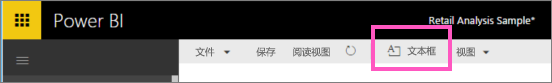
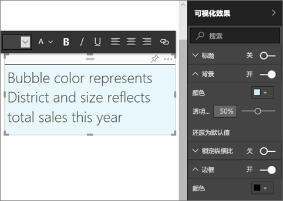
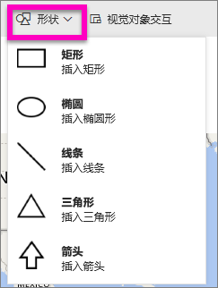
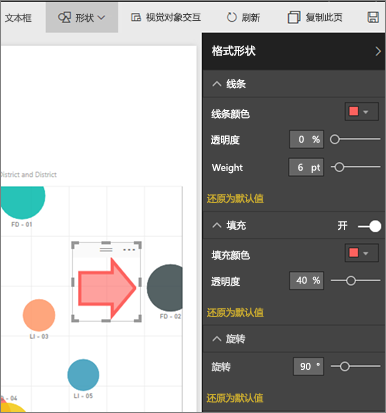

# Power BI 报表中的静态内容
使用 Power BI 服务和 Power BI Desktop 可将文本框和形状添加到报表。 在这两种情况下，必须具有报表的编辑权限。 如果已在 Power BI 服务中与你共享报表，你将没有编辑权限。 

Watch Will 使用 Power BI Desktop [向报表添加静态图像](guided-learning/visualizations.yml?tutorial-step=11)，然后按照以下步骤，改用 Power BI 服务亲自尝试一下。
> 
> <iframe width="560" height="315" src="https://www.youtube.com/embed/_3q6VEBhGew" frameborder="0" allowfullscreen></iframe>
> 

## 向报表添加文本框
1. 在“编辑”视图中打开报表。

2. 将光标置于报表画布中的任意空白区域，然后选择“文本框”。
   
   
2. 在文本框中键入文本，可以选择设置字体格式、颜色和文本对齐方式。 
   
   
3. 若要放置文本框，可选择顶部的灰色区域并拖动。 若要调整文本框大小，可选择并拖动任意边框手柄。 
   
   

4. 在文本框仍处于选中状态的情况下，在可视化效果窗格中添加其他格式设置。 在该示例中，我们设置了背景和边框的格式。 也可以为文本框创建准确大小和位置。  

   

5. 若要关闭文本框，可选择报表画布上的任意空白区域。 

5. 选择“大头针”图标  以将文本框固定到仪表板。 

## 向报表添加形状
1. 将光标置于报表画布中的任意位置，然后选择“形状”。
   
   
2. 在下拉列表中，选择要向报表画布添加的形状。 我们将添加一个箭头，指向总销售额差异最高的气泡。 
   
   在“设置形状格式”窗格中，自定义形状。 在此示例中，我们创建的是具有深红色边框且旋转了 90 度的红色箭头。
   
   
3. 若要放置形状，请选择顶部的灰色区域，然后拖动。 若要重设形状大小，请选择并拖动任意边框图柄。 在文本框中，也可以为形状创建准确大小和位置。

> 注意：形状无法固定到仪表板（除非在[固定活动页面](service-dashboard-pin-live-tile-from-report.md)时作为视觉对象之一）。 
> 
> 

### 后续步骤
[向文本框添加超链接](service-add-hyperlink-to-text-box.md)

[Power BI - 基本概念](service-basic-concepts.md)

更多问题？ [尝试参与 Power BI 社区](http://community.powerbi.com/)
