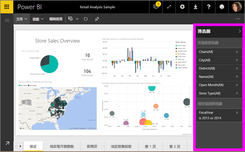
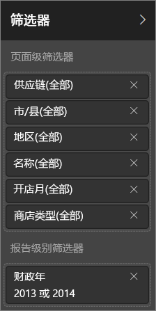
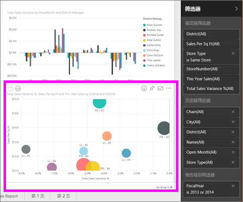
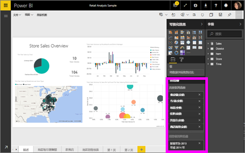

# 关于 Power BI 报表中的筛选器和突出显示
***筛选器***可保留你最关切的数据，而将其他所有数据删除。  ***突出显示***与筛选不同，因为它不会删除数据，而会将一部分可见数据突出显示；未突出显示的数据会保持可见但变暗。

有多种不同的方法可对 Power BI 中的报表进行筛选并对其突出显示。 将所有这些信息放入到一篇文章中会令人困惑，因此我们将其划分如下：

* 筛选器和突出显示的介绍（你现在正在阅读的文章）
* [创建和使用筛选器并在自己的编辑视图/报表中突出显示](power-bi-report-add-filter.md) 的方法。 当你具有报表的编辑权限时，你可以创建、修改和删除筛选器并在报表中突出显示。
* [使用筛选器并在与你共享的报表中或报表“阅读视图”中突出显示](service-interact-with-a-report-in-reading-view.md) 的方法。 你可以执行的操作更有限，但是 Power BI 仍给你较大范围的筛选和突出显示选项。  
* [编辑视图中可用的筛选器和突出显示控件的详细教程](power-bi-how-to-report-filter.md)，包含对筛选器类型（例如，日期和时间、数字、文本）的深入了解以及基本和高级选项之间的区别。
* 现在，你已经了解了筛选器和突出显示如何在默认状态下运行，[了解如何更改页面筛选器上的可视化效果并突出显示彼此](service-reports-visual-interactions.md)

> [!TIP]
> Power BI 如何知道数据的关联方式？  它利用基础 [数据模型](https://support.office.com/article/Create-a-Data-Model-in-Excel-87e7a54c-87dc-488e-9410-5c75dbcb0f7b?ui=en-US&rs=en-US&ad=US) 中不同表和字段之间的关系，使报表页面上的项目相互交互。
> 
> 

## 使用“筛选器”窗格的报表中的筛选器和突出显示的介绍

可通过使用“**筛选器**”窗格或直接在报表本身上进行选择（即席，参见页面底部）以应用筛选器和突出显示。 “筛选器”窗格显示报表中使用的表和字段，以及已应用的任何筛选器。 筛选器划分为“**页面级别筛选器**”、“**报表级别筛选器**”和“**视觉对象级别筛选器**”。  如果在报表画布上选择了可视化效果，则仅能看到视觉对象级别筛选器。

> [!TIP]
> 如果筛选器的旁边有“**所有**”字样，这意味着整个字段包括为一个筛选器。  例如，下面的屏幕截图中的 **Chain(All)** 告诉我们该报表页包括有关所有存储链的数据。  从另一方面来说，“**FiscalYear 为 2013 或 2014**”的报表级别筛选器告诉我们该报表仅包括 2013 和 2014 的财政年的数据。
> 
> 

## “阅读视图”和“编辑视图”中的筛选器
可使用下列两种模式与报表交互：[阅读视图](service-interact-with-a-report-in-reading-view.md)和[编辑视图](service-interact-with-a-report-in-editing-view.md)。  而筛选功能会根据你所用的模式来提供。

* 在“编辑视图”中，可以添加报表、页面和视觉对象筛选器。 保存报表时，筛选器将随之一起保存。 而在“阅读视图”中查看报表的人可以与你添加的筛选器交互，但不能保存他们所做的更改。
* 在“阅读视图”中，可以与报表中已存在的任何页面和视觉对象筛选器进行交互，但不能保存筛选器所做的更改。

### “阅读视图”中的“筛选器”窗格
如果你只有“阅读视图”中报表的访问权限，则“筛选器”窗格如下所示：

因此该报表页有 6 个页面级别筛选器和 1 个报表级别筛选器。

若要查看是否存在视觉对象级别筛选器，请选择一个视觉对象。 在下图中，气泡图具有 6 个应用的筛选器。

在“阅读视图”中，通过修改现有筛选器来浏览数据。 在 [与阅读视图中的筛选器进行交互](service-interact-with-a-report-in-reading-view.md) 一文中了解如何操作

### “编辑视图”中的“筛选器”窗格
当你具有某个报表的所有者权限并将其在“编辑视图”中打开时，会看到“**筛选器**”只是几个可用的编辑窗格之一。

因为在“阅读视图”（上述）中，我们看到该报表页有 6 个页面级别筛选器和 1 个报表级别筛选器。 通过选择气泡图，我们看到它具有 6 个应用的视觉对象级别筛选器。

但在“编辑视图”中，我们对筛选器和突出显示还可以进行更多的操作。 主要区别是，我们可以添加新的筛选器。 在 [向报表添加筛选器](power-bi-report-add-filter.md) 一文中了解如何操作以及更多信息

## 即席筛选和突出显示
在报表画布上选择字段以进行筛选并突出显示剩余页。 在同一视觉对象中选择任何空格以将其删除。 该筛选和突出显示类型未通过报表保存，但却是快速浏览数据影响的有趣的方法。 若要对此类交叉筛选和交叉突出显示的工作方式进行微调，请参阅 [视觉对象交互](service-reports-visual-interactions.md)

## 后续步骤
[与筛选器和突出显示交互（使用“阅读视图”）](service-interact-with-a-report-in-reading-view.md)

[向报表添加筛选器（使用“编辑视图”）](power-bi-report-add-filter.md)

[了解报表筛选器](power-bi-how-to-report-filter.md)

[更改报表视觉对象相互交叉筛选和交叉突出显示的方式](service-reports-visual-interactions.md)

了解有关 [Power BI 中的报表](service-reports.md)的详细信息

更多问题？ [尝试参与 Power BI 社区](http://community.powerbi.com/)

