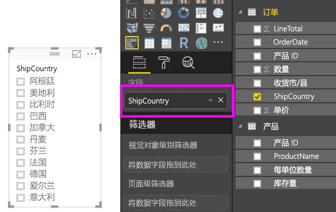
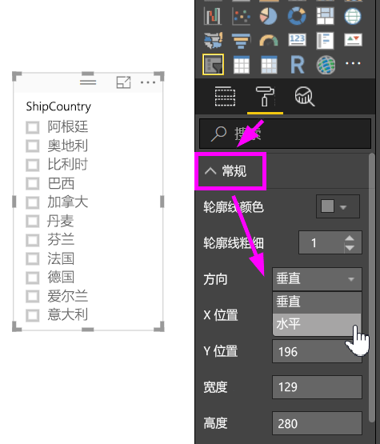
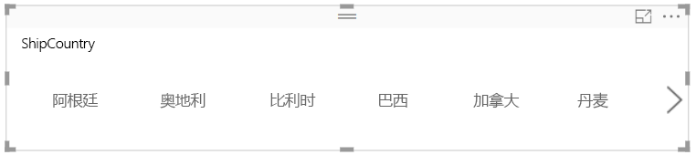
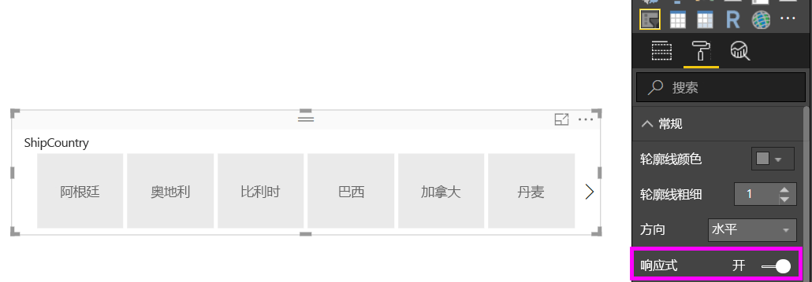
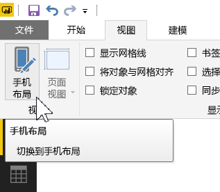
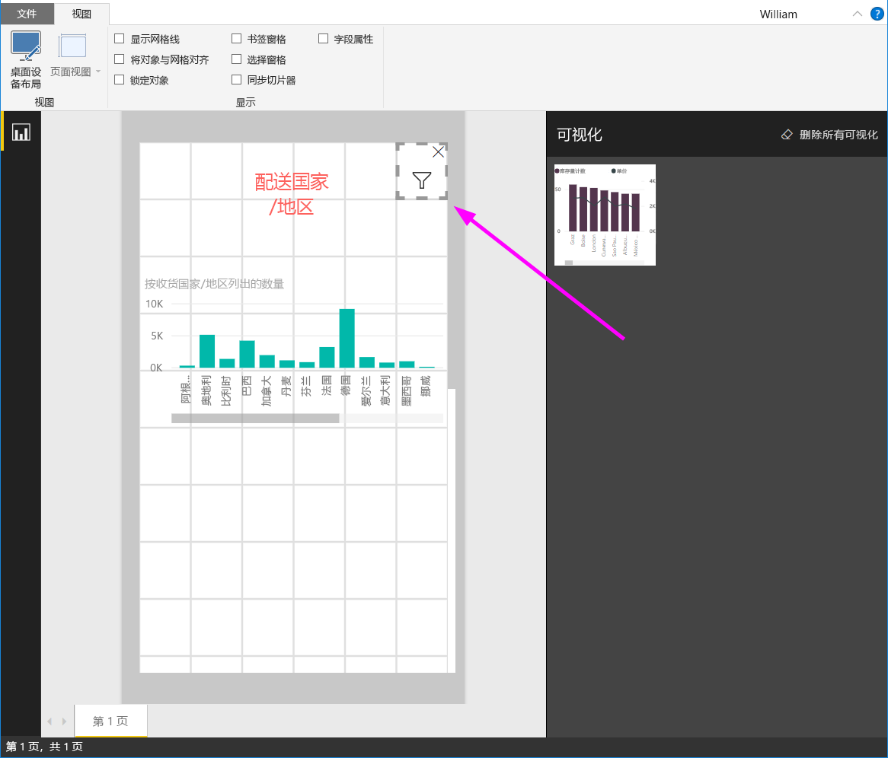

# 在 Power BI 中创建可以重设大小的响应式切片器

重设响应式切片器的大小以适合报表上的任意空间。 你可以将响应式切片器重设为不同的大小和形状，从水平到方形再到垂直均可，切片器中的值可按照你的操作重新排列。 在 Power BI Desktop 和 Power BI 服务中，你可以使水平切片器和日期/范围切片器响应。 日期/范围切片器也具有改进的触摸区域，所以用指尖更换它们更容易。 可以根据需要变换响应式切片器的大小，它们还会自动重设大小以适应 Power BI 服务以及 Power BI 移动应用中的报表。 

## 创建切片器

创建动态切片器的第一步是创建基本切片器。 

1. 在“可视化效果”窗格中，选择切片器图标。
2. 将要筛选的字段拖动到“字段”。

    

## 转换为水平切片器

1. 选择切片器后，在“可视化效果”窗格中选择“格式”选项卡。
2. 展开“常规”部分，然后为“方向”选择“水平”。

     

1.  你可能想要将其变宽，以显示更多的值。

     

## 将其设置为响应式并对其进行试验

此步骤很容易。 

1. 在“常规”部分“格式”选项卡中的“方向”下，将“响应”滑动到“打开”。  

    

1. 现在你可以使用它了。 拖动边角可使其变短、变高、变宽及变窄。 如果将其调整得足够小，则它会变为一个筛选器图标。

    

## 将其添加到手机报表布局

在 Power BI Desktop 中，你可以为报表的每个页面创建一个手机布局。 如果页面具有电话布局，则以纵向视图显示在手机上。 否则，你需要在横向视图中查看它。 

1. 在“视图”菜单中，选择“手机布局”。

     
    
1. 将手机报表中所需的全部视觉对象拖动到网格中。 当拖动响应式切片器时，请将其设置为所需的大小 - 在这种情况下，所需的是筛选器图标大小。

    

阅读有关如何创建[针对 Power BI 手机应用的优化报表](desktop-create-phone-report.md)的详细信息。

## 将时间或范围切片器设置为响应式

你可以按照相同的步骤将时间或范围切片器设置为响应式。 将“响应”设置为“打开”之后，请注意下列事项：

- 视觉对象将根据画布允许的尺寸来优化输入框的顺序。 
- 数据元素显示已经过优化，以根据画布允许的尺寸使切片器尽可能地适用。 
- 切片器上新的圆形手柄优化了触摸交互。 
- 当视觉对象变得太小而无法使用时，它将变成一个表示其位置视觉对象类型的图标。 要与其进行交互，只需双击在焦点模式中打开它即可。 这样既可节省报表页面的宝贵空间而又不会丢失功能。

## 后续步骤

- [Power BI 服务中的切片器](visuals/power-bi-visualization-slicers.md)
- 更多问题？ [尝试咨询 Power BI 社区](http://community.powerbi.com/)