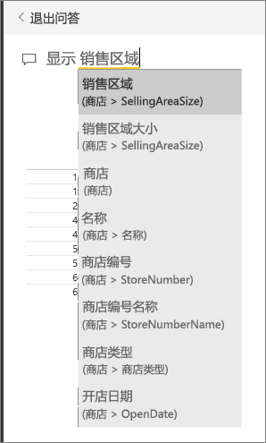
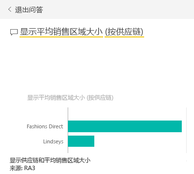
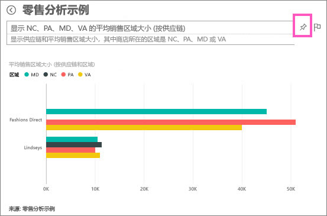
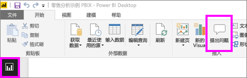
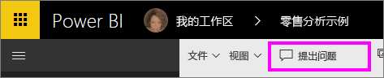
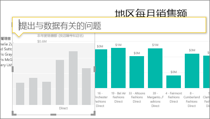
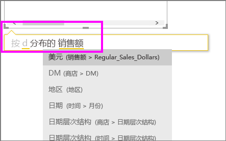
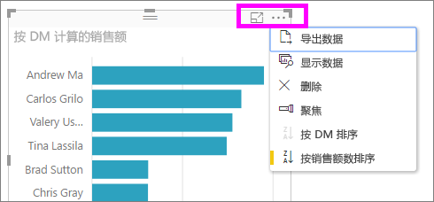

# 教程：如何使用 Power BI 问答创建可视化效果和生成报表
[问答概述](power-bi-q-and-a.md)介绍了 Power BI 问答，并对使用者（与其共享了仪表板和报表）和创建者（拥有基础报表和数据集）进行了区分。 本教程的第一部分主要是面向通过 Power BI 服务使用仪表板的用户。 第二部分是面向使用 Power BI 服务或 Power BI Desktop 创建报表的用户。 [Power BI 问答和 Power BI 移动版](mobile-apps-ios-qna.md)以及 [Power BI Embedded 中的 Power BI 问答](developer/qanda.md)均通过单篇文章进行介绍。

问答是交互式的且十分有趣，而且一个问题会导致许多其他问题以可视化效果显示要查找的有趣路径。 请观看 Amanda 是如何使用 Power BI 问答创建可视化效果、向下钻取这些视觉对象，并将它们固定到仪表板的。

<iframe width="560" height="315" src="https://www.youtube.com/embed/qMf7OLJfCz8?list=PL1N57mwBHtN0JFoKSR0n-tBkUJHeMP2cP" frameborder="0" allowfullscreen></iframe>

## 第 1 部分：在 Power BI 服务 (app.powerbi.com) 中的仪表板上使用 Power BI 问答
由于仪表板包含从一个或多个数据集固定的磁贴，因此可以就其中任一数据集中的任何数据提问。 若要查看用于创建仪表板的报表和数据集，请选择菜单栏中的“查看相关项”。

Power BI 问答的提问框位于仪表板的左上角，这就是用户使用自然语言键入问题的地方。 “问答”可以组织你键入的词语并指出可以在哪里（哪个数据集）找到答案。 “问答”还有助于你使用自动完成、重述以及其他文本和视觉对象组织你的问题。

问题的答案以交互式可视化效果显示并会在你修改问题时进行更新。

1. 打开仪表板，并将光标置于提问框中。 在开始键入前，“问答”会显示新的屏幕，上面有帮助你提问的一些建议。 将会看到[一个或多个基础数据集](service-get-data.md)中的表名称，甚至还能看到有完整问题列出（如果数据集所有者已创建[特别推荐问题](service-q-and-a-create-featured-questions.md)的话）。

   

   你始终可以选择这些问题之一作为起点并继续优化问题，以找出你要查找的特定答案。 或者，使用表名称帮助你组织一个新问题。

2. 从数据集选项中选择一个，或开始键入自己的问题，并从下拉列表建议的问题中选择一个。

   

3. 在用户键入问题的同时，Power BI 问答会挑选最佳[可视化效果](power-bi-visualization-types-for-reports-and-q-and-a.md)作为答案显示；并且可视化效果会随着用户修改问题而动态变化。

   

4. 在用户键入问题时，Power BI 会在有磁贴固定到仪表板的所有数据集中查找最佳答案。  如果所有磁贴都是来自 datasetA，则答案也将来自 datasetA。  如果有的磁贴源自数据集 A，有的磁贴源自数据集 B，那么问答功能将会从这 2 个数据集中搜索最佳答案。

   > [!TIP]
   > 请务必谨慎，如果从仪表板中删除唯一一个源自*数据集 A* 的磁贴，那么问答功能将不再有权访问数据集 A。
   >
   >
5. 如果对结果满意，则可以通过选择右上角的大头针图标[将可视化效果固定到仪表板](service-dashboard-pin-tile-from-q-and-a.md)。 如果仪表板已与你共享，或者仪表板是应用的一部分，将无法固定。

   

##    第 2 部分：在 Power BI 服务或 Power BI Desktop 的报表中使用 Power BI 问答

使用 Power BI 问答可以浏览数据集，并将可视化效果添加到报表和仪表板。 报表是根据一个数据集创建而成，既可能是完全空白，也可能页面上有大量可视化效果。 不过，不能仅仅因为报表是空白的，就断定其中没有任何要浏览的数据。要知道，数据集已与报表相关联，可供浏览和创建可视化效果。  若要查看用于创建报表的数据集，请在 Power BI 服务的阅读视图中打开报表，并选择菜单栏中的“查看相关项”。

若要在报表中使用 Power BI 问答，必须拥有对报表和基础数据集的编辑权限。 [Power BI 问答概述](power-bi-q-and-a.md)主题将此区分为创建者方案。 因此，如果是使用与自己共享的报表，Power BI 问答则不可用。

1. 在编辑视图（Power BI 服务）或报表视图（Power BI Desktop）中打开报表，并选择菜单栏中的“提问”。

    **Power BI Desktop**    
    

    **Power BI 服务**    
    

2. 此时，Power BI 问答的提问框显示在报表画布上。 在下面的示例中，提问框显示在另一个可视化效果上方。 虽然这没什么关系，但最好在提问前，先[向报表添加空白页](power-bi-report-add-page.md)。

    

3. 将光标放在问题框上。 在用户键入问题的同时，Power BI 问答会显示建议，以帮助用户形成自己的问题。

   

4. 在用户键入问题的同时，Power BI 问答会挑选最佳[可视化效果](power-bi-visualization-types-for-reports-and-q-and-a.md)作为答案显示；并且可视化效果会随着用户修改问题而动态变化。

   

5. 选定所需的可视化效果后，按 Enter。 若要将可视化效果与报表一起保存，请依次选择“文件”>“保存”。

6. 与新可视化效果进行交互。 无论是如何创建可视化效果的，都不要紧，因为可交互性、格式设置和功能全都完全相同。

   

   如果已在 Power BI 服务中创建了可视化效果，甚至可以[将它固定到仪表板](service-dashboard-pin-tile-from-q-and-a.md)。

## 告知问答要使用哪个可视化效果。
使用 Power BI 问答，不仅可以让数据为自己“发声”，还可以指示 Power BI 如何显示答案。 只需将“以<visualization type>显示”添加到问题的末尾即可。  例如，“显示工厂的库存量（以地图形式）”和“显示总库存（以卡片形式）”。  亲自动手。

##  注意事项和疑难解答
- 如果已使用实时连接或网关连接到数据集，需要[为相应数据集启用](service-q-and-a-direct-query.md) Power BI 问答。

- 如果已打开报表，但看不到 Power BI 问答选项。 如果使用的是 Power BI 服务，请务必在编辑视图中打开报表。 如果无法打开编辑视图，即说明无权编辑此报表，因此无法对特定报表使用 Power BI 问答。

## 后续步骤
返回到 [Power BI 问答](power-bi-q-and-a.md)   
[教程：通过“零售销售额示例”使用 Power BI 问答](power-bi-visualization-introduction-to-q-and-a.md)   
[在 Power BI 问答中提问的提示](service-q-and-a-tips.md)   
[准备问答的工作簿](service-prepare-data-for-q-and-a.md)  
[准备本地数据集以供 Power BI 问答使用](service-q-and-a-direct-query.md)
[通过 Power BI 问答将磁贴固定到仪表板](service-dashboard-pin-tile-from-q-and-a.md)
