# 在 Power BI 服务和 Power BI Desktop 中创建 ESRI ArcGIS 地图
本教程是从 ArcGIS 地图创建者的角度进行编写。 创建者与同事共享 ArcGIS 地图后，此同事便可以查看相应的地图并与之交互，但无法保存更改。 若要详细了解如何查看 ArcGIS 地图，请参阅[与 ArcGIS 地图交互](power-bi-visualizations-arcgis.md)。

ArcGIS 地图和 Power BI 的结合将超越地图点表示法的地图绘制技术提升到全新水平。 从基本地图、位置类型、主题、符号样式和引用层中进行选择，创建丰富多彩的信息性地图可视化效果。 地图上权威数据层与空间分析的结合可传达出可视化效果中数据的更深层次的理解。

 虽然无法在移动设备上创建 ArcGIS 地图，但可以查看它并与之交互。 请参阅[与 ArcGIS 地图交互](power-bi-visualizations-arcgis.md)。

> [!TIP]
> GIS 指的是地理信息科学。

下面的示例使用深灰色画布针对 2016 年可支配收入中间值的人口统计层以热度地图形式显示区域销售情况。 随着你不断阅读本教程，你会发现使用 ArcGIS 地图可提供几乎无限制的改进的地图功能、人口数据和更炫的地图可视化功能，这样可以更加完美地讲述你的案例。

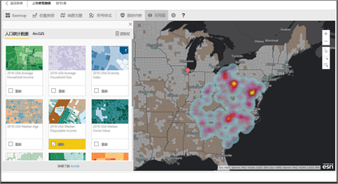

> [!TIP]
> 请访问 [ESRI 上的 Power BI 页面](https://www.esri.com/powerbi)，查看多个示例并阅读用户感言。 然后查看 ESRI 的[适用于 Power BI 的 ArcGIS 地图入门页](https://doc.arcgis.com/en/maps-for-powerbi/get-started/about-maps-for-power-bi.htm)。

## 用户须知
ArcGIS Maps for Power BI 由 Esri (www.esri.com) 提供。 你使用 ArcGIS Maps for Power BI 必须遵守 Esri 的条款和隐私策略。 Power BI 用户如果希望使用适用于 Power BI 的 ArcGIS 地图视觉对象，则需要接受同意对话框。

资源

[条款](https://go.microsoft.com/fwlink/?LinkID=826322)

[隐私策略](https://go.microsoft.com/fwlink/?LinkID=826323)

[适用于 Power BI 的 ArcGIS 地图产品页](https://www.esri.com/powerbi)

 

## 启用 ArcGIS 地图
ArcGIS 地图当前在 Power BI 服务、Power BI Desktop 和 Power BI 移动中可用。 本文提供了适用于 Pover BI 服务和 Desktop 的说明。

### 在 Power BI 服务 (app.powerbi.com) 中启用 ArcGIS 地图
本教程使用[零售分析示例](sample-retail-analysis.md)。 若要启用适用于 Power BI 的 ArcGIS 地图，请执行以下操作：

1. 从菜单栏的右上方部分，选择齿轮图标并打开“设置”
   
    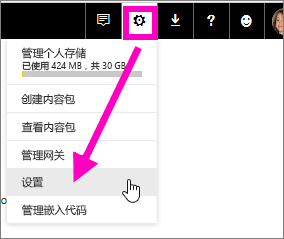
2. 选择“ArcGIS Maps for Power BI”复选框。 完成选择后需要重启 Power BI。
   
    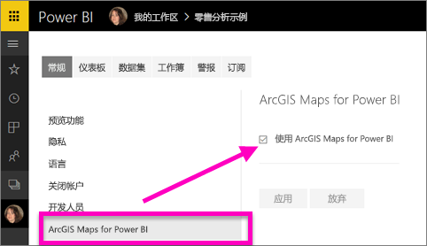
3. 在[编辑视图](service-reading-view-and-editing-view.md)中打开报表，并从“可视化效果”窗格中选择适用于 Power BI 的 ArcGIS 地图图标。
   
    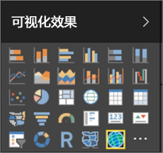
4. Power BI 向报表画布中添加空的 ArcGIS 地图模板。
   
   

 

## 创建 ArcGIS 地图视觉对象
Watch 将创建几个不同的 ArcGIS 地图可视化效果，然后使用以下步骤通过[零售分析示例](sample-datasets.md)亲自尝试一下。

<iframe width="560" height="315" src="https://www.youtube.com/embed/EKVvOZmxg9s" frameborder="0" allowfullscreen></iframe>

1. 从“**字段**”窗格中，拖动一个数据字段到“**位置**”或“**纬度**”和/或“**经度**”框。 在此示例中，我们使用 存储 > 城市。
   
   > [!NOTE]
   > ArcGIS Maps for Power BI 会自动检测已选字段显示为地图上的形状或点是否是最佳方式。 可以调整设置中的默认值（如下所示）。
   > 
   > 
   
    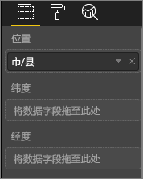
2. 从“可视化效果”窗格中，选择模板 ，将可视化效果转换为 ArcGIS 地图。
3. 从“字段”窗格中，拖动一个度量值到“大小”框，以调整数据的显示方式。 在本示例中，我们使用的是“销售额 > 去年销售额”。
   
    

## AcrGIS 地图设置和格式
若要访问 ArcGIS Maps for Power BI 的格式化功能，请执行以下操作：

1. 通过选择可视化效果右上角的省略号，然后选择“编辑”，来访问其他功能。
   
   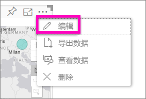
   
   可视化效果的顶部显示了可用的功能。 当选择每个功能时，可打开相应的任务窗格，其中提供详细的选项。 
   
   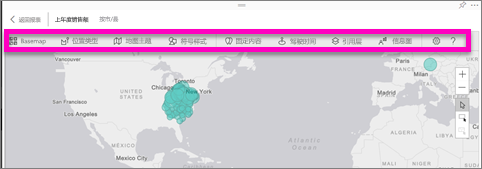
   
   > [!NOTE]
   > 有关设置和功能的详细信息，请参阅下面的**详细的文档**。
   > 
   > 
2. 若要返回到报表，请选择报表画布左上角的“返回报表”。

 

## 详细的文档
Esri 针对 ArcGIS Maps for Power BI 的功能集提供[综合文档](https://go.microsoft.com/fwlink/?LinkID=828772)。

## 功能概述
### 基本地图
提供了四个基本地图：暗灰色画布、浅灰色画布、OpenStreetMap 和街道。  街道是 ArcGIS 的标准基本地图。

若要应用基本地图，在任务窗格中选择它。

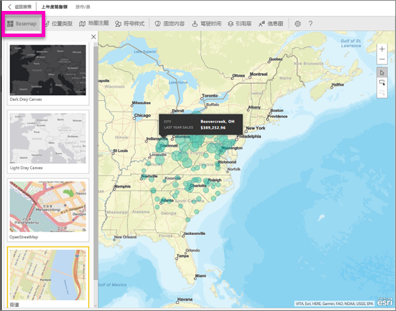

### 位置类型
ArgGIS Maps for Power BI 自动检测在地图上显示数据的最佳方法。 从点或边界中进行选择。 可以使用位置类型选项微调这些选择。

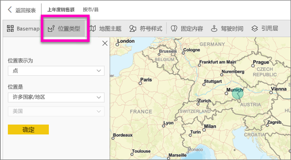

仅当数据包含标准地理位置值时，边界才可使用。 Esri 自动找出要在地图上显示的形状。 标准地理位置值包括国家/地区、省、邮政编码等。但是和 GeoCoding 一样，默认情况下 Power BI 不会为数据检测字段是否为边界，或者是否有边界。  

### 地图主题
提供了四个地图主题。 根据绑定到位置以及添加到 Power BI“字段”窗格中大小框的字段，自动选择仅位置主题和大小主题。 当前使用的是大小主题，因此请切换到热图主题。  

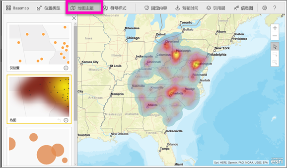

<table>
<tr><th>主题</th><th>说明</th>
<tr>
<td>仅位置</td>
<td>根据位置类型中的设置，在地图上绘制数据点和已填充的边界。</td>
</tr>
<tr>
<td>热图</td>
<td>在地图上绘制数据的热度图。</td>
</tr>
<tr>
<td>尺寸</td>
<td>在根据“字段”窗格中“大小”框里的值调整大小的地图上绘制数据点。</td>
</tr>
<tr>
<td>聚类</td>
<td>在地图的各个区域中绘制数据点的数目。 </td>
</tr>
</table>

### 符号样式
使用符号样式可以对地图上数据的显示方式进行精细调整。 根据所选的位置类型和地图主题，符号样式会有所不同。 下面的示例展示了如何将“位置类型”设置为“大小”，以及如何调整透明度、样式和大小。

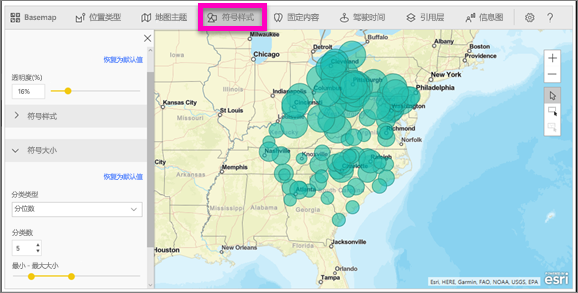

### 固定内容
通过添加固定内容引起对地图上点的注意。  

1. 选择“固定内容”选项卡。
2. 在搜索框中键入关键字（如地址、地点和兴趣点），再从下拉列表中进行选择。 地图上会显示一个符号，并会自动缩放到相应位置。 搜索结果将会保存为“大头针”窗格中的位置卡。 最多可以保存 10 张位置卡。
   
   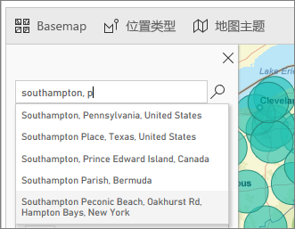
3. Power BI 将固定内容添加到该位置，你可以更改固定内容的颜色。
   
   
4. 添加和删除固定内容。
   
   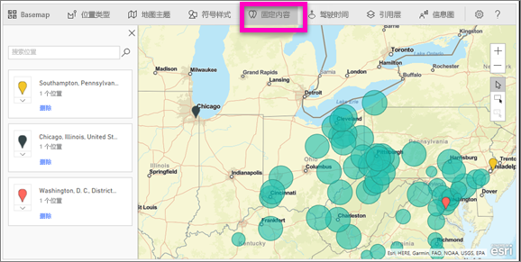

### 驾驶时间
使用“驾驶时间”窗格，可以选择一个位置，然后确定在指定半径区域或驾驶时间内可用的其他地图功能。  
    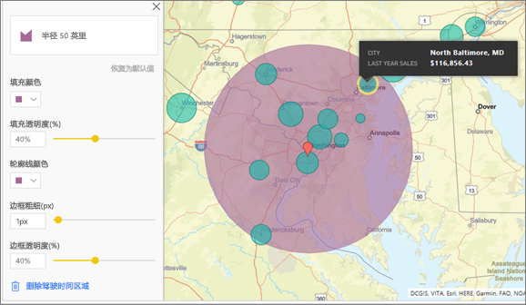

1. 选择“驾驶时间”选项卡，再选择单选或多选工具。 单选华盛顿特区的大头针。
    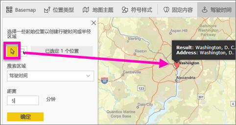
   
   > [!TIP]
   > 如果放大地图（使用“+”图标），选择位置将更加容易。
   > 
   > 
2. 假设要乘飞机到华盛顿特区 呆几天，并要确定在合理行驶范围内有哪些商店。 将“搜索区域”更改为“半径区域”，并将“距离”更改为“50 英里”，再选择“确定”。    
   
    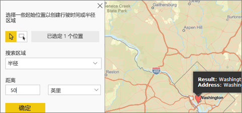
3. 半径区域显示为紫色。 选择任何一个位置，显示它的详细信息。 （可选）更改颜色和边框，设置半径区域格式。
   
    

### 引用层
#### 引用层 — 人口统计
ArcGIS Maps for Power BI 中可选择人口统计信息层，这些图层可以为 PowerBI的数据提供相关的对照信息。

1. 选择“引用层”选项卡，然后选择“人口统计”。
2. 所列出的每一个图层都带有一个复选框。 勾选图层即可将该图层添加到地图中。  在此示例中，我们已将家庭平均收入图层添加到地图中。 
   
    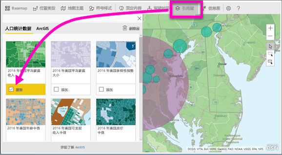
3. 每一个图层都可以进行交互式操作。 正如可以将鼠标悬停在气泡图以查看详细信息，同样也可以单击地图上的阴影区域查看明细。 
   
    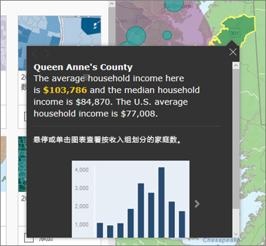

#### 引用层 — ArcGIS
ArcGIS Online 允许组织发布公共的 Web 地图。 另外，Esri 还通过 Living Atlas 提供了一套精选的 Web 地图集。 在 ArcGIS 选项卡中，可以搜索所有的公共 Web 地图或 Living Atlas 地图，并将搜索到的地图作为引用层添加到地图中。

1. 选择“引用层”选项卡，然后选择“ArcGIS”。
2. 输入搜索词，然后选择一个地图图层。 在本例中我们选择美国参议院选区分布图。
   
    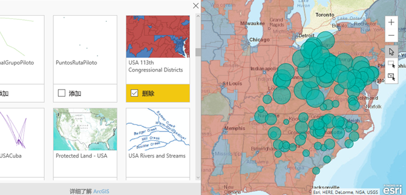
3. 若要查看详细信息，请选择阴影区域以打开“从引用层选择”：对引用层上的所选区域的边界或对象使用引用层选择工具。

 

## 选择数据点
ArcGIS Maps for Power BI 有三种选择模式。

使用切换的方式更改选择模式：

 选择单个数据点。

 在地图上绘制一个矩形框来选择包含的数据点。

 利用引用层中的边界或多边形来选择所包含的数据点。

> [!NOTE]
> 一次最多可选择 250 个数据点。
> 
> 

 

## 获取帮助
Esri 针对 ArcGIS Maps for Power BI 的功能集提供[综合文档](https://go.microsoft.com/fwlink/?LinkID=828772)。

可以在 [Power BI 社区中与**适用于 Power BI 的 ArcGIS 地图**相关的帖子](https://go.microsoft.com/fwlink/?LinkID=828771)中提问题和查找最新信息，报告问题并查找答案。

如果有改进建议，可以将建议提交到 [Power BI 建议列表](https://ideas.powerbi.com)。

 

## 管理组织中的 ArcGIS Maps for Power BI 的使用方式
Power BI 允许用户、租户管理员、IT 管理员设置是否要使用 ArcGIS Maps for Power BI。

用户选项 在 Power BI Desktop 中，用户可以停止使用 ArcGIS Maps for Power BI，方法是在选项中的“安全”选项卡中禁用此组件。 禁用后，默认不会加载 ArcGIS Maps。

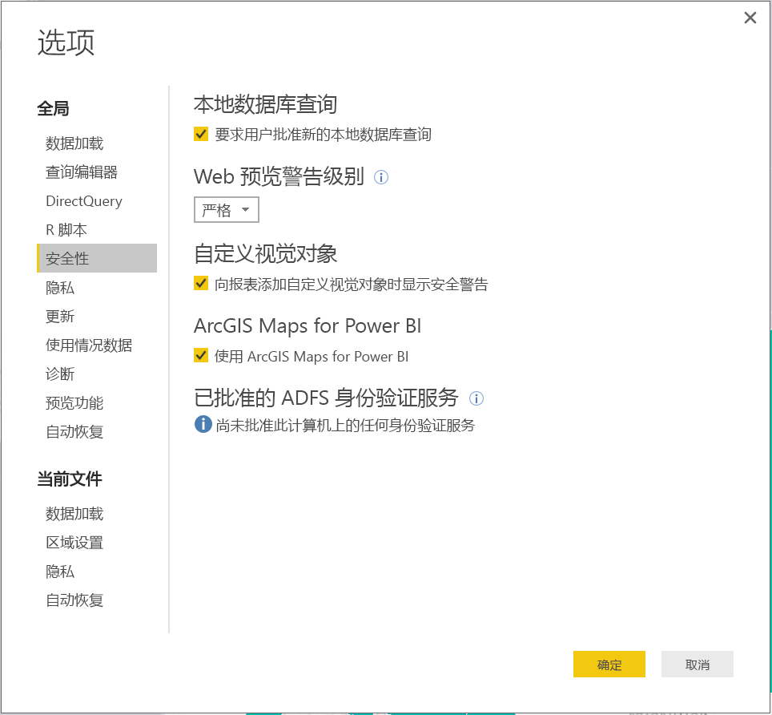

在 Power BI 服务中，用户可以在用户设置中的“适用于 Power BI 的 ArcGIS 地图”选项卡上禁用适用于 Power BI 的 ArcGIS 地图，从而停止使用此类地图。 禁用后，默认不会加载 ArcGIS Maps。

租户管理员选项 在 PowerBI.com 中，租户管理员可以通过禁用 ArcGIS Maps for Power BI 来阻止所有租户使用此组件。 禁用后，Power BI 不再能在“可视化效果”窗格中看到 ArcGIS Maps for Power BI 图标。

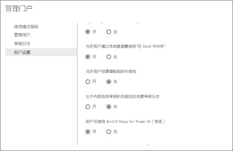

IT 管理员选项 Power BI Desktop 支持使用组策略在整个组织内的已部署计算机上禁用 ArcGIS Maps for Power BI。

<table>
<tr><th>属性</th><th>值</th>
</tr>
<tr>
<td>键</td>
<td>Software\Policies\Microsoft\Power BI Desktop\</td>
</tr>
<tr>
<td>值名称</td>
<td>EnableArcGISMaps</td>
</tr>
</table>

值为 1（十进制），启用 ArcGIS Maps for Power BI。

值为 0（十进制），禁用 ArcGIS Maps for Power BI。

## 注意事项和限制
以下服务和应用支持适用于 Power BI 的 ArcGIS 地图：

<table>
<tr><th>服务/应用</th><th>是否支持</th></tr>
<tr>
<td>Power BI Desktop</td>
<td>是</td>
</tr>
<tr>
<td>Power BI 服务 (PowerBI.com)</td>
<td>是</td>
</tr>
<tr>
<td>Power BI 移动应用程序</td>
<td>是</td>
</tr>
<tr>
<td>Power BI 发布到 Web</td>
<td>否</td>
</tr>
<tr>
<td>Power BI Embedded</td>
<td>否</td>
</tr>
<tr>
<td>Power BI 服务嵌入 (PowerBI.com)</td>
<td>否</td>
</tr>
</table>

在不支持适用于 Power BI 的 ArcGIS 地图的服务或应用中，可视化效果将显示为带 Power BI 徽标的空视觉对象。

对街道地址进行地理编码时，只会对前 1500 个地址进行地理编码。 对地名或国家/地区进行地理编码时，没有前 1500 个地址限制。

 

**ArcGIS Maps for Power BI 如何运作？**
ArcGIS Maps for Power BI 由 Esri (www.esri.com) 提供。 使用 ArcGIS Maps for Power BI 时，必须遵守 Esri 的[条款](https://go.microsoft.com/fwlink/?LinkID=8263222)和[隐私策略](https://go.microsoft.com/fwlink/?LinkID=826323)。 Power BI 用户如果希望使用适用于 Power BI 的 ArcGIS 地图视觉对象，则需要接受同意对话框（有关详细信息，请参阅《用户同意》）。  使用 Esri 的 ArcGIS Maps for Power BI 时，必须遵守 Esri 的条款和隐私策略，同意对话框具有相关链接。 每个用户在首次使用 ArcGIS Maps for Power BI 之前，必须同意条款和隐私策略。 一旦用户接受同意，绑定到视觉对象的数据至少会发送到 Esri 的服务以进行地理编码，这意味着将位置信息转换为可以在地图中表示经度和纬度的信息。 应该假定可以将绑定到数据可视化效果的任意数据发送到 Esri 的服务。 Esri 提供基本地图、空间分析和地理编码之类的服务。ArcGIS Maps for Power BI 视觉对象与使用 SSL 连接的这些服务进行交互，该连接由 Esri 提供和维护的证书保护。 可以从 Esri 的 [ArcGIS Maps for Power BI 产品页](https://www.esri.com/powerbi)获取 ArcGIS Maps for Power BI 的其他信息。

当用户通过 ArcGIS Maps for Power BI 注册由 Esri 提供的 Plus 订阅时，他们与 Esri 建立了直接关系。 Power BI 不向 Esri 发送有关用户的个人信息。 用户使用自己的 AAD 身份登录并信任 Esri 提供的 AAD 应用程序。 通过此操作，用户直接与 Esri 共享其个人信息。 一旦用户将 Plus 内容添加到 ArcGIS Maps for Power BI 视觉对象，其他 Power BI 用户也需要 Esri 的 Plus 订阅才能查看或编辑该内容。 

有关 ArcGIS Maps for Power BI 的工作原理的详细技术问题，请通过其支持站点与 Esri 联系。

使用适用于 Power BI 的 ArcGIS 地图需要付费吗？

所有 Power BI 用户都可以使用适用于 Power BI 的 ArcGIS 地图，无需额外付费。 此组件由 Esri 提供，应在本文前面所述的由 Esri 提供的使用条款及隐私政策的限制下使用此组件。

**我在 Power BI Desktop 中看到关于缓存已满的错误消息**

我们正在修复此 bug。  在此期间，若要清除缓存，请尝试删除 C:\Users\\AppData\Local\Microsoft\Power BI Desktop\CEF 位置中的文件，再重启 Power BI。

适用于 Power BI 的 ArcGIS 地图是否支持 Esri 形状文件？

ArcGIS Maps for Power BI 自动检测诸如国家/地区、州/省，以及邮政编码等标准边界。 如果需要提供自定义的形状，可以使用 [Shape Maps for Power BI Desktop（预览版）](desktop-shape-map.md) 来操作。

是否能够离线查看 ArcGIS 地图？

否，Power BI 需要网络连接才能显示地图。

可以从 Power BI 连接我的 ArcGIS Online 帐户吗？

目前还不行。 [投票支持此建议](https://ideas.powerbi.com/forums/265200-power-bi-ideas/suggestions/9154765-arcgis-geodatabases)吧。等我们着手开发此功能时，我们会向你发送一封电子邮件。  

## 后续步骤
[与已与你共享的 ArcGIS 地图交互](power-bi-visualizations-arcgis.md)

[宣布推出适用于 Power BI 的 ArcGIS 地图的博客文章](https://powerbi.microsoft.com/blog/announcing-arcgis-maps-for-power-bi-by-esri-preview/)

更多问题？ [尝试咨询 Power BI 社区](http://community.powerbi.com/)

