# 设计报表和视觉对象的最佳做法
<!-- Shared newnav Include -->
[!INCLUDE [newnavbydefault](./includes/newnavbydefault.md)]

## 简介
本白皮书介绍了有关如何在 Power BI 中设计报表的最佳做法。 它从规划入手，介绍了可应用于报表及其页面和各个视觉对象的设计原则。  其中许多最佳做法同样适用于设计仪表板。

我们希望你可以本白皮书为起点，将所掌握的知识活学活用，设计你自己的报表和可视化效果，同时访问 community.powerbi.com 继续相关交流。BI 报表设计和可视化效果用法是最近的热门话题，许多舆论导向者、博主和网站都对本主题进行了有广度、有深度的探究（我们在本文末尾处列出了几个示例）。   

> [!NOTE]
> 本白皮书中的建议是你在适用情况下遵循的准则。 对于下述每个原则，通常有令人信服的理由才能“违反规则”。
> 
> 

信息让我们不知所措，不是因为信息太多，而是因为我们不知道如何让信息为自己所用。
-- Stephen Few

## 背景知识和术语概述
在 Power BI 中，报表可以有一个或多个报表页面，所有页面一起统称为报表。 报表的基本元素包括视觉对象（亦称为“可视化效果”）、独立图像和文本框。 从各个数据点到报表元素，再到报表页面本身，有数不清的格式选项可供选择。

我们将先介绍报表规划阶段，接着介绍基本的报表设计原则，然后介绍视觉对象设计原则，最后介绍各种视觉对象类型的最佳做法。

有关生成和使用 Power BI 报表的详细指南和说明，请访问 powerbi.com 中的“学习”。

## 生成第一个可视化效果前重点了解需求
报表生成工作在生成第一个视觉对象之前就开始了，因为优质的报表需要提前规划。  请了解需要处理哪些数据，并记下要满足的报表需求。 仔细想想，业务需求是什么？此类数据的使用方式是什么？读者是谁？ 要回答的一个关键问题是，读者希望能够根据此报表做出哪些决策？

这些问题的答案决定了你的设计方向。 每个报表都需要向读者传达信息。 请确保所传达的信息能够满足业务需求。 我们可能很容易就会添加提供引人注目的见解的视觉对象，但如果这些见解不能满足业务需求，报表就是没用的，实际上这些视觉对象可能会分散用户注意力。 此外，你可能会发现，无法从此类数据中获得做决策时所需的信息。 这样的报表能用来衡量所需指标吗？

报表可用于监视、发现、跟踪、预测、衡量、管理、测试等用途。 例如，如果业务需求是要生成可衡量业绩的销售报表，可以采用如下报表设计：着眼于当前销售额，与之前的销售额进行对比，与竞争对手进行对比，添加一些可触发警报的 KPI。  读者可能会深入了解销售数据，以发现可能会影响销售额的店面关闭或供应链问题。  另一种深入了解数据的方式或许是按商店、地区、产品、季节等因素查看销售额。

请了解使用报表的客户，使用客户熟悉的术语设计数据细化和复杂程度与客户的认知水平相当的报表。 客户类型不止一种？ 没有一种放之四海皆准的原则。可以根据专业知识类别设计单独的报表页面。请务必为每个页面添加明确的标签，以便客户可以自行识别。 也可以使用切片器，以便客户能够根据自己的需求定制页面。 请在规划阶段仔细考虑客户需求，避免生成自以为客户需要的报表的错误做法。  请做好重新开始和不断迭代的准备。

在确认业务需求、客户以及要添加的指标后，下一步是选择合适的视觉对象传达信息，并尽可能以最有效的方式呈现这些视觉对象。 这涉及很多方面，我们将从一些基本的报表设计原则入手。

## 报表设计原则
报表页面的空间有限，最困难的就是要在此空间内呈现所需的全部元素，同时还易于读者理解。 亦不能漠视“美观”的价值所在。 关键是要在美观和实用性之间找到平衡。

接下来，我们要了解布局、清晰度和美观。

### 布局 - 报表画布
报表画布的空间有限。  如果无法在一个报表页面上呈现所有元素，请将报表划分成多个页面。  报表页面可针对特定的受众（例如，HR、IT、销售人员、SLT）或业务问题（例如，缺陷对我们的故障时间造成了怎样的影响？我们的市场营销活动对人气有什么影响？），或用于渐进式传达信息（例如，第 1 页为概述或引人注目的引子，第 2 页继续传达数据信息，第 3 页深入传达数据信息等）。  如果使用一个页面就能呈现整个报表，那太棒了。 如果不能，请创建对内容进行逻辑分块的各个报表页面。  另外，别忘了为页面命名有意义的实用名称。

想想我们是如何布置美术馆的。 你不会将 50 幅艺术作品放在一个小房间内，也不会在房间里放满椅子，更不会每面墙涂不同的颜色。 作为管理者，你只会选择主题相同的艺术作品，将它们陈列在空间足以访客走动和思考的房间内，并放置描述艺术作品概况的信息卡。 这就是大多数现代美术馆采用素色墙面的原因所在！
对于本文，我们将从有多处需要改进的示例报表入手。  在我们遵循最佳做法和设计原则修改报表后，我们的报表将会有所改进。

图 1：此报表页面非常难看，有许多需要改进的地方

上述示例存在许多与空间相关的（布局）设计问题，具体如下：

* 对齐、有序和邻近区域
* 空间和排序使用不当
* 杂乱无章

### 对齐、有序和邻近区域
报表元素的布局不仅会左右读者对报表的理解，还是读者浏览报表页面时的导引。 元素的布置方式也在向读者传达信息。  信息可能是“从这里开始查看，然后查看这里”，也可能是“这 3 个元素彼此相关”。

* 在大多数文化中，人们从左往右、从上往下进行浏览。 请将最重要的元素放置在报表左上角。 其他视觉对象的排列方式要有助于读者有逻辑地浏览和理解信息。
* 将需要读者选择的元素置于受读者选择影响的可视化效果的左侧：例如，切片器。
* 将相关元素置于邻近位置；邻近区域内的元素相关。
* 另一种表示关系的方法是在相关元素周围添加边框或颜色背景。 相反，添加分隔条可以区分报表的不同部分。
* 使用空白区域在视觉上对报表页面的各部分进行分块。
* 填满整个报表页面。 如果发现有大量额外的空白区域，请放大可视化效果或缩小画布。
* 精心调整报表元素大小。 不要通过可用空间大小来决定可视化效果大小。
* 让重要元素大于其他元素，或添加视觉元素（如箭头），以吸引读者注意力。
* 在报表页面上以对称方式或精心设计的不对称方式对齐元素。

接下来，我们将进一步了解对齐。

#### 对齐
对齐并不意味着不同组件的尺寸必须相同，也不是说报表上的每一行都必须有相同数量的组件。 只是说，页面采用有助于读者浏览和提高可读性的结构。

在下面的更新报表中，我们会发现报表组件现在采用两端对齐，并且每个报表行也都采用水平对齐和垂直对齐。 切片器位于受其影响的视觉对象的左侧。

图 2：改进并修改了难看的示例报表的布局

Power BI 提供帮助你对齐视觉对象的工具。 在 Power BI Desktop 中，如果选择多个视觉对象，可以使用“视觉对象”功能区选项卡上的“对齐和分布”选项来对齐视觉对象。

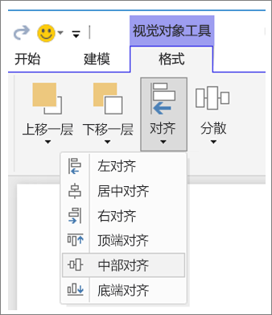

图 3：在 Power BI Desktop 中对齐视觉对象

在联机 Power BI 和 Power BI Desktop 中，还可以使用格式窗格上的“常规”选项卡精确控制所有视觉对象的大小和位置：

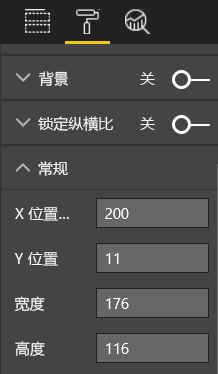

图 4：设置视觉对象的确切位置

在我们的示例报表页面（图 2）中，2 张卡片和一个大边框的“X 位置”设置为 200。

#### 填满整个空间
请充分利用现有空间。  如果已确定报表的查看/显示方式，请在设计时注意这一点。 减少空白区域，填满整个画布。  尽量不要对各个视觉对象使用滚动条。  在填满整个空间的同时，确保视觉对象看起来没有狭促感。

##### 调整页面尺寸
缩小页面后，各个元素相对于整个页面就会放大。 为此，可取消选择页面上的所有视觉对象，然后使用格式窗格中的“页面尺寸”选项卡。  

下面展示的报表页面先是采用了 4:3 的页面宽高比，然后采用了 16:9 的页面宽高比。 请注意，布局更适应 16:9。 空间足够，可以从第二个视觉对象中删除滚动条。

图 5a：采用 4:3 页面宽高比的报表

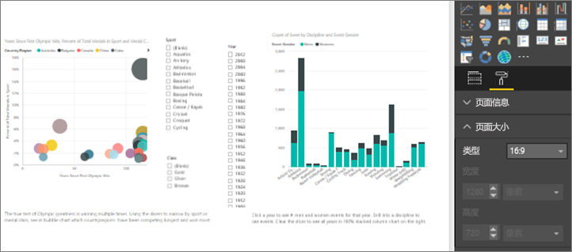

图 5b：采用 16:9 页面宽高比的报表

你的报表是采用 4:3、16:9，还是其他宽高比？ 小屏幕还是大屏幕？ 还是要适应所有可能的屏幕宽高比和尺寸？  请在设计时注意这一点。

我们的示例报表页面看起来有点狭促。 在未选择任何视觉对象的情况下，选择滚动油漆刷图标，打开格式窗格。 展开“页面尺寸”，然后将“高度”更改为 900。

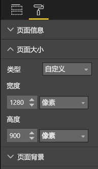

图 6：增加页面高度

#### 整齐有序
杂乱无章的报表页面很难一眼就理解，甚至可能会令读者感到不知所措，干脆不看。  请删除所有不必要的报表元素。 不要添加对信息理解或浏览没有促进作用的附加项。 报表页面必须尽可能明确、快速、一致地传达信息。

Edward Tufte 在他的《定量信息的视觉显示》一书中将这称为“数据/墨迹比率”。  其实就是删除所有不必要的内容。

让内容整齐有序会增加报表页面上的空白区域，让你有更多实际空间来遵循上述“对齐、有序和邻近区域”部分中介绍的最佳做法。

此时，我们的示例报表已经美观多了。 我们已让内容整齐有序许多，并添加了形状对元素进行分组。  我们删除了背景图像以及不必要的箭头形状和文本框，并将一个视觉对象移至报表中的另一页面，等等。我们还延长了页面，增加了空白（黄色？）空间。

图 7：难看的示例报表变得整齐有序

### 信息传达一目了然
总体测试应为，在事先完全不知道的情况下，无需其他人说明解释即可快速理解报表。 读者应能够在快速概览后迅速获取页面以及每个图表/表所要传达的信息。   

在查看报表时，读者应首先注意到你希望他们看到的元素，然后继续从左往右从上往下进行扫视。  通过添加文本框标签、形状、边框、字号和颜色等视觉提示可以更改此行为。  

#### 文本框
有时，可视化效果的标题不足以传达信息。  请添加文本框，向报表读者传达信息。  文本框可以描述报表页面、一组视觉对象或单个视觉对象。 可用于阐述结果或更好地定义视觉对象、视觉对象中的组件或视觉对象之间的关系。 文本框可用于根据文本框中突出显示的不同条件来吸引读者注意力。

在 Power BI 服务中，选择顶部菜单栏中的“文本框”。 （在 Power BI Desktop 中，选择“插入”功能区中的“文本框”。）

图 8：添加文本框

在空框中键入内容，然后使用底部控件设置字体、字号、对齐方式等。 使用图柄可调整文本框的大小。

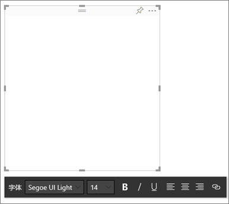

图 9：设置文本框格式

不过，也不要矫枉过正！ 如果报表上有太多的文本，会分散读者对视觉对象的注意力。 当你发现报表页面需要大量文本才能被读者理解时，请重新开始。  能否选取其他视觉对象来更好地传达信息？ 能否调整视觉对象的原生标题，使其更易于理解？   

#### 文本
请创建文字样式指南，应用于所有报表页面。 只选取少量字体、字号和颜色。  此样式指南不仅可应用于文本元素，还可用于为可视化效果的标题和标签选择字体（见下文中的“可视化效果的标题和标签”）。 请设置规则，规定何时使用粗体、斜体、特定颜色、增大字号等。  尽量避免全部字母大写或使用下划线。

#### 形状
形状也有助于信息浏览和理解。 使用形状可以将相关信息归到一起、突出显示重要数据，还可以使用箭头引导读者视线。 形状有助于读者了解从何处开始查看以及如何理解报表。 在设计术语中，这通常称为 对比。

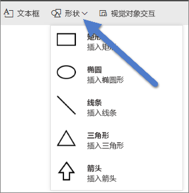

图 10a：Power BI 服务中的“形状”

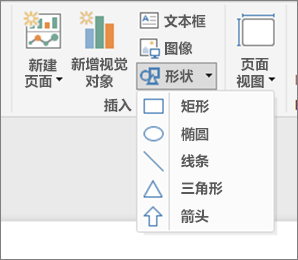

图 10b：Power BI Desktop 中的“形状”

我们的示例页面现在看上去怎么样？  图 11 展示的页面更加清晰明确、整齐有序，其中字体、字号和颜色的使用一致。  左上角的页面标题对页面进行了介绍。

图 11：应用了文本指南并添加了标题的示例报表

在示例报表中，报表页面标题添加在左上角，即读者首先注意到的位置。 标题的字号为 28，字体为 Segoe Bold，有助于与页面的其余内容区分开来。  我们的文本样式指南要求无背景、黑色标题、图例和标签，应用于页面上的所有可编辑视觉对象（组合图坐标轴和标签不可编辑）。  此外：

* 卡片：将“类别标签”设置为“关”，将“标题”设置为“开”，将文本样式设置为 12 磅、黑色、居中。
* 视觉对象标题：如果启用，将文本样式设置为 12 磅、左对齐。
* 切片器：将“标头”设置为“关”，将“标题”设置为“开”。 保留“项” > “文本”设置，即为灰色和 10 磅。
* 散点图和柱形图：如果使用，将 X 轴和 Y 轴以及对应标题设置为黑色字体。

#### 颜色
使用颜色是为了保持一致性。  我们将在下文中的“可视对象设计原则”中详细介绍颜色。 不过，在这一部分中，我们指的是精心选择颜色，确保颜色不会干扰读者快速理解报表。  过多明亮的颜色会妨碍理解。 这一部分更侧重于颜色使用禁忌。

#### 背景
设置报表页面的背景时，请选择不会令报表黯然失色、与页面上的其他颜色不冲突或一般不会引起眼部不适的颜色。 请注意某些颜色内在的固有含义。  例如，在美国，如果在报表中使用红色，通常会被理解为“不好”。

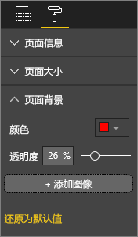

图 12：设置报表背景

你不是要创作艺术作品，而是要生成功能报表。 请选择可提高可读性并突出报表元素的颜色。  

调查网页中颜色和可视化效果的使用情况后发现，颜色对比度越高，理解速度就越快（请参阅文本和背景色对网页视觉搜索的影响和确定用户对网页视觉复杂度和审美特征的看法）。

我们已在下面的示例报表（图 20 和 21）中应用了一些有关颜色的最佳做法。 最明显的是，我们将背景色改成了黑色。  黄色太明亮，会引起眼部不适。  此外，“按年份和奖牌等级划分的运动员姓名计数”图表上的黄色条部分会与黄色背景融为一体。  使用黑色（或白色）背景可实现最高对比度，让视觉对象成为焦点。

下面是我们为了改进示例报表所执行的其他步骤：

页面标题

当我们将背景更改为黑色时，标题会消失，因为文本框字段只允许黑色字体。   若要解决此问题，请改为添加文本框标题。  选择文本框后，清除文本，然后在“可视化效果”选项卡中选择“标题”，将其设置为“开”。 选择箭头以展开“标题”选项，在“标题文本”字段中键入“夏季奥运会”，然后选择白色作为“字体颜色”。

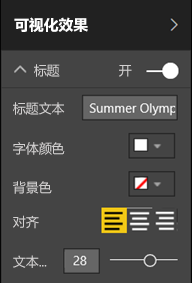

图 13：添加页面标题

卡片

对于卡片视觉对象，打开格式窗格（滚动油漆刷图标），然后将“背景”设置为“开”。 选择白色，透明度为 0%。 然后，将“标题”设置为“开”，选择白色作为“字体颜色”，选择黑色作为“背景色”。

切片器

到目前为止，两个切片器的格式不同，没有任何设计意义。 对于这两个切片器，请将背景色更改为水绿色。  最好选择水绿色，因为着色地图、树状图和柱形图使用了这种颜色，进而页面调色板中也有这种颜色。

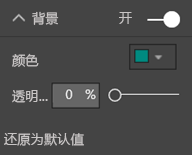

图 14：更改切片器背景色

添加细白框。

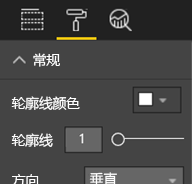

图 15：为切片器添加边框

由于在水绿色背景上灰色字体显示不清，因此，请将“项”颜色更改为白色。

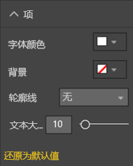

图 16：更改切片器字体颜色

最后，在“标题”下方，将“字体颜色”更改为白色，并添加黑色作为“背景色”。

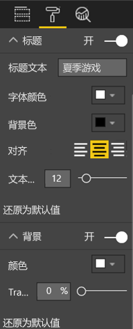

图 17：设置切片器标题格式

矩形

矩形也会与黑色背景融为一体。  若要解决此问题，请选择矩形，然后在“设置形状格式”窗格中，将“背景”设置为“开”。

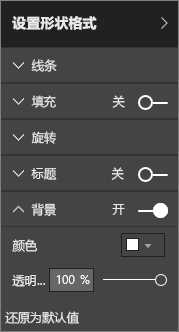

图 18：设置形状格式

柱形图、气泡图、着色地图和树状图

为报表页面上的其余视觉对象添加白色背景。 在格式窗格中，展开“线”选项，然后将“线条颜色”设置为白色，并将“线条粗细”设置为 3。

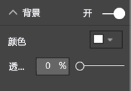

图 19：为其余可视化效果添加白色背景

图 20：应用了颜色最佳做法（黑色背景）的示例报表

图 21：应用了颜色最佳做法（白色背景）的示例报表
 

### 美观
上文已介绍我们要考虑的大部分美观问题，如对齐、颜色、字体选择、让内容整齐有序。  不过，还有其他一些有关报表设计的最佳做法值得介绍，这些最佳做法针对的是报表的整体外观。  

请注意，报表旨在满足业务需求，而不是为了追求美观。  不过，追求一定程度的美观还是有必要的，尤其是在涉及第一印象时。 Nashville 顾问 Tony Bodoh 解释道：“情绪先于逻辑产生。”  读者首先对报表页面有情绪反应，然后才会花更多时间深入了解。 如果页面看起来杂乱无章、令人困惑、不专业，读者可能永远不会发现它要传达的重要信息。

TDI 博主和 TechTarget 行业分析师 Wayne Eckerson 打了一个非常形象的比方。  设计报表就像是在装饰房间。  随着时间的推移，你会购买花瓶、沙发、茶几、油画。  所有这些元素单看起来你都很喜欢。 尽管选定的每个元素都有意义，但将这些对象放在一起来看便会产生冲突或分散注意力。

请集中精力执行以下操作：

* 创建通用报表主题或外观，并将其应用于所有报表页面
* 使用独立图像和其他图形来帮助传达信息，而不分散读者注意力
* 应用本文到目前为止介绍的所有最佳做法。

## 可视对象设计原则
我们已经介绍了报表设计原则，即如何布置报表元素，以便读者能够轻松快速地获取报表所要传达的信息。  现在，我们将了解视觉对象本身的设计原则。  然后，在下一部分中，我们将深入了解各个视觉对象，以及与一些更常用视觉对象类型有关的最佳做法。

在本部分中，我们将暂时不看示例报表页面，而是看看其他示例。  在了解可视对象设计原则后，我们将重新回到示例报表页面，并应用我们所掌握的最佳做法（按分步说明操作）。  

### 规划 - 选择合适的视觉对象
每个视觉对象同样需要规划，就像开始生成报表前的规划一样重要。  仔细想想，我要通过这个视觉对象传达什么信息？ 然后确定哪种类型的视觉对象能够最形象地传达信息。 虽然可以条形图的形式显示销售周期进度，但瀑布图或漏斗图是不是更形象？ 有关这方面的帮助，请参阅本白皮书的最后一部分“视觉对象类型和最佳做法”，其中介绍了与一些更常用视觉对象类型有关的最佳做法。  经常出现的状况是，选择的第一个视觉对象类型到头来不是最佳选择，不必对此感到惊讶。  请尝试多种视觉对象类型，看看哪个才是最佳选择。

了解分类数据和定量数据的区别，知道哪些视觉对象类型最适用于哪些数据类型。 定量数据通常称为“度量值”，一般是数值。 分类数据通常称为“维度”，可进行分类。 下面的“选择合适的度量值”中对此进行了更深入的介绍。

避免只出于让报表更令人印象深刻的目的而使用花哨或更复杂的视觉对象类型。 只需选择能够传达信息的最简单选项即可。 水平条形图和简单的折线图就能快速传达信息。  这两种类型的图表为人们所熟悉，大多数读者都可以轻松理解。  还有一个好处就是，大多数读者都是从左往右和从上往下进行阅读，因此可以快速扫视和理解这两种类型的图表。

你选择的视觉对象是否需要通过滚动才能传达信息？ 请尽量避免使用滚动条。  尝试应用筛选器和层次结构/向下钻取。如果还是无法避免使用滚动条，请考虑选择其他类型的视觉对象。 如果一定要使用滚动条，水平滚动比垂直滚动更易于被接受。

即使你的选择绝对是最适合传达相应信息的视觉对象，也仍可能需要借助其他元素的力量。  这就是需要设置标签、标题、菜单、颜色和字号的原因所在。 我们稍后将在“设计元素”部分中介绍这些设计元素。

### 选择合适的度量值
视觉对象传达的信息是否引人入胜？ 这重要吗？  不要为了构建视觉对象而构建视觉对象。 你或许会认为数据传达的信息非常吸引人，但事实并非如此。 不要害怕重新开始来尝试更吸引人的信息传达方式。 或者，信息传达方式不是最佳，可能需要采用不同的衡量方式。

例如，假设你想要衡量销售经理的业绩。 为此，你会使用什么度量值呢？  最好的度量方式是以总销售额/总利润、同比增长，还是以目标实现率为依据呢？ 销售人员 Sally 可能创造了最大的利润，如果你在条形图中按销售人员划分总利润，相比其他销售人员，她将成为销售之星。  不过，如果 Sally 的销售成本（差旅费、运费、制造成本等）也非常高，仅以销售额为依据并不是传达信息的最佳方式。

#### 反映事实/不歪曲事实
构建的视觉对象可能会歪曲事实。 有一个网站，上面全是数据狂热分子共享的“歪曲事实”视觉对象。 评论中的常见主旋律是，对创建并分发此类视觉对象的公司感到十分失望。  这也是在暗示无法信任这些公司。

因此，不要创建有意歪曲事实以及按你的要求传达信息的视觉对象。  示例如下：

图 22：歪曲事实的图表

在此示例中，好像 4 家公司之间的差距巨大，而且公司 B 的业绩要远远高于其他 3 家公司。  但请注意，X 轴并不是从 0 开始，所以各家公司之间的差距很可能就在误差范围之内。  下面是数据相同但 X 轴从零开始的图表。

图 23：反映事实的图表

读者往往认为 X 轴是从零开始的。 如果你决定不从零开始，请不要歪曲事实，考虑添加视觉提示或文本框，提醒读者注意这一非常规做法。  

### 设计元素
选择类型和度量值并创建视觉对象后，是时候微调外观以达到最佳效果了。  本部分介绍了：

* 布局、空间和尺寸
* 文本元素：标签、批注、菜单、标题
* 排序
* 可视交互
* 颜色

#### 调整视觉对象，最大限度地利用空间
如果要尝试在报表中显示多个图表，最大限度地提高数据/墨迹比率将有助于突出显示要传达的数据信息。如上所述，Edward Tufte 首创“数据/墨迹比率”这一概念，即以从图表中删除尽可能多的标记为目标，同时还不影响读者对数据的理解。

在下面的第一组图表中，有多余的坐标轴标签（“2014 年 1 月”、“2014 年 4 月”等）和标题（“按日期”）。 每个图表的标题还需要占用图表中的专用水平空间。 通过删除图表标题和启用各个坐标轴标签，我们减少了一些墨迹，更好地利用了整体空间。 还可以删除前两个图表的坐标轴标签，进一步减少墨迹，为数据腾出更多空间。

如果你想要突出显示特定时间段，可绘制线条或矩形作为所有图表的背景，这样有助于引导读者上下浏览并比较图表。

图 24：改进前

图 25：改进后

启用和禁用坐标轴标题的具体操作

选择视觉对象，使其处于活动状态，然后打开格式窗格。 展开“X 轴”或“Y 轴”选项，然后将“标题”的滑块拖至“开”或“关”。

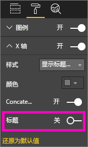

图 26：启用和禁用坐标轴标题

启用和禁用坐标轴标签的具体操作

选择视觉对象，使其处于活动状态，然后打开格式窗格。 “X 轴”和“Y 轴”旁边为滑块。  拖动滑块来启用或禁用坐标轴标签。

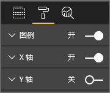

图 27：启用和禁用坐标轴标签

> [!TIP]
> 如果启用了“数据标签”，可能需要禁用 Y 轴标签。
> 
> 

删除视觉对象标题的具体操作

选择视觉对象，使其处于活动状态，然后打开格式窗格。 将“标题”的滑块设置为“关”。

图 28：从视觉对象中删除标题

请考虑读者是如何查看报表的，并确保视觉对象和文本的大小和颜色深浅足以方便读者阅读。 如果页面上有一个比例较大的视觉对象，读者可能会认为它是最重要的。 请在视觉对象之间留有足够的空白区域，让报表看起来整齐有序、易于理解。  对齐视觉对象有助于引导读者视线。

调整视觉对象大小的具体操作

选择视觉对象，使其处于活动状态。 捕捉并拖动其中一个图柄来调整大小。

图 29：调整视觉对象大小

移动视觉对象的具体操作

选择视觉对象，使其处于活动状态。 选择并按住视觉对象中间顶部的控制手柄条，将视觉对象拖到新位置上。

图 30：移动视觉对象

#### 可视化效果的标题和标签
请确保标题和标签清晰可辨、直观明了。 标题和标签中的文本必须采用最适合的字号，以及可突出显示的颜色（如黑色，而不是默认的灰色）。 还记得我们的样式指南（见上文中的“文本”）吗？ 请限制颜色和字号的数量。太多不同的字号和颜色会让页面看起来有狭促感，且令人困惑。  请考虑对报表页面上所有视觉对象的标题使用相同的字体颜色和字号，并对报表页面上的所有标题使用相同的对齐方式。  

格式窗格

若要执行下列各项格式调整，请选择滚动油漆刷图标来打开格式窗格。

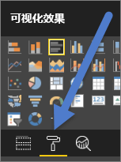

图 31：打开格式窗格

然后，选择要调整的视觉对象元素，并确保将其设置为“开”。 可视对象元素示例包括“X 轴”、“Y 轴”、“标题”、“数据标签”和“图例”。 以下示例展示了“标题”元素。

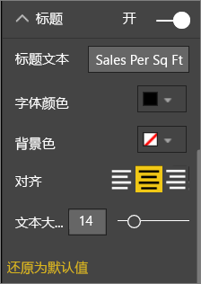

图 32：设置视觉对象的标题格式

设置字号

可调整标题和数据标签的字号，但无法调整 X 轴/Y 轴或图例的字号。  对于数据标签，具体来说，在确定最适合的报表数据细化程度前，可以轻率对待“显示单位”和“小数位数”。   

设置文本对齐方式

标题对齐方式包括左对齐、右对齐和居中对齐。  请选择一种对齐方式，然后将同样的设置应用于页面上的所有视觉对象。  

设置文本位置

可以调整某些 Y 轴和图例的文本位置。   无论如何选择，请对页面上的其他 Y 轴和其他任何图例执行相同的操作。

设置标题和标签长度

请调整标题、坐标轴标题、数据标签和图例的长度。 如果你决定显示其中任何元素，请调整长度（以及字号），以确保元素不会被截断。 对于“标题”和“图例”，需要设置的是“标题文本”，你可以在其中键入视觉对象上实际显示的标题。 对于“X 轴”和“Y 轴”，需要设置的是“样式”，你可以在其中的下拉列表中进行选择。 对于“数据标签”，需要设置的是“显示单位”和“小数位数”。 使用“显示单位”下拉列表可选择度量单位，包括“百万”、“千”、“无”、“自动”等。使用“小数位数”字段可以指示 Power BI 显示多少位小数。

设置文本颜色

可以调整标题、坐标轴和数据标签的文本颜色。  

#### 不属于可视化效果的标题和标签
在本白皮书的前面部分中，我们介绍了如何向报表页面添加文本框。 有时，可视化效果的标题不足以传达信息。  添加文本框可以向报表读者传达其他信息。  
为了防止报表页面看起来太有狭促感或太令人困惑，请使用一致的文本框字体、字号、颜色和对齐方式。 若要调整文本框中的文本，请选择文本框调出格式菜单。

图 33：设置文本框中的字体格式

#### 排序
若要更快速地提供见解，真正简单的方式是设置视觉对象排序。 例如，按升序或降序对条形图中的值进行排序，可快速显示重要的增量信息，而无需占用更多实际空间。

若要对图表进行排序，请依次选择图表右上角的省略号（...）和“排序”，然后选择要作为排序依据的字段和排序方向。 有关详细信息，请参阅[更改视觉对象的排序方式](power-bi-report-change-sort.md)。

#### 图表交互和相互作用
Power BI 最具吸引力的功能之一就是，能够修改图表的相互交互方式。  默认情况下，图表可交叉突出显示。也就是说，在你选择数据点后，其他图表中的相关数据会变亮，而不相关的数据则会变暗。 可以替换此行为，将任何图表用作真正的筛选器，从而节省页面上的实际空间。 为此，请选择菜单栏中的“视觉对象交互”。

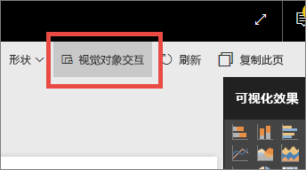

图 34：视觉对象交互

然后，对于页面上的每个视觉对象，确定要让选定视觉对象进行筛选、突出显示，还是不执行任何操作。 并非所有视觉对象都可以突出显示。对于无法突出显示的视觉对象，突出显示控件将不可用。 有关详细信息，请参阅 [Power BI 中的视觉对象交互](service-reports-visual-interactions.md)。

> [!TIP]
> 对于刚接触 Power BI 的读者，可能一下子还不知道可以单击报表与之交互。 请添加文本框，帮助他们了解可以单击哪些对象来获取更多见解。
> 
> 

#### 视觉对象中使用的颜色
在本白皮书的前面部分中，我们介绍了务必要对报表中使用的颜色进行提前规划。 本部分介绍的内容会有一些重复，但主要侧重的还是各个视觉对象中使用的颜色。 原则同样适用：使用颜色可以使报表成为一个整体，并能突出显示重要数据，以及促进读者对视觉对象的理解。 太多不同的颜色会分散读者的注意力，让读者不知道该从何处开始看起。 不要为了追求美观而牺牲读者对信息的理解。 只添加可促进理解的颜色。

> [!TIP]
> 了解受众和颜色内在的固有含义规则。  例如，在美国，绿色通常表示“好”，红色通常表示“不好”。
> 
> 

本主题分为：

1. 数据颜色
2. 数据标签颜色
3. 分类值的颜色
4. 数字值的颜色

使用颜色突出显示读者感兴趣的数据

使用颜色的最简单方法是，更改一个或多个数据点的颜色来吸引读者注意力。 在下面的示例中，4 年一届的夏季奥运会和 2 年一届的冬季奥运会的颜色不同。

图 35：使用颜色传达信息

可以在格式窗格的“数据颜色”选项卡中更改数据点颜色。 若要单独自定义各个数据点，请务必将“全部显示”设置为“开”。

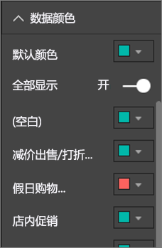

图 36：设置数据点颜色

> [!NOTE]
> Power BI 对报表视觉对象应用默认主题。  已选择的主题颜色可以确保多样性和对比度。 若不想使用默认主题调色板，请选择“自定义颜色”。
> 
> 

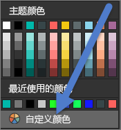

图 37：选择自定义颜色

在 Power BI Desktop 中，你甚至可以使用第二个序列突出显示离群值或一部分线条：

图 38：使用 Desktop 绘制离群值

其中，只有当平均 8 月温度低于 60，“离群值”序列中才有值。 为此，请使用以下公式创建 DAX 计算列：

离群值 = if(Editions[Temp]<60, Editions[Temp], BLANK())

在我们的示例中，有 3 个离群值：1952、1956 和 2000。

标签和标题的颜色

浏览所有可用的格式选项后，你会发现可以为许多不同对象的标题和图例设置颜色。 例如，你可以更改数据标签和坐标轴标题的颜色。 请谨慎操作。  通常情况下，不妨对所有视觉对象标题使用同一种颜色。  与本白皮书中的所有准则一样，总会遇到要“违反规则”的情形和原因。不过，如果你决定要违反规则，请给出令人信服的理由。

分类值的颜色

包含序列的图表通常图例中有分类值。 例如，以下图例中的每种颜色分别代表不同类别的国家/地区。

图 39：应用了默认颜色

Power BI 默认使用的颜色可以很好地区分分类值，以便读者可以轻松区分。 有时，为了与企业架构匹配等原因，有人会更改这些颜色，但这样做可能会导致问题出现。

图 40：应用了一种颜色的不同色调

此视觉对象只使用颜色浓度不同的一种色调，这会让读者误以为分类之间存在排序关系。 它会暗示深色调气泡在某方面高于或低于浅色调气泡。 与按字母顺序排序不同，这种分类值通常没有固有的排序顺序。
若要更改默认颜色，请打开格式窗格，然后选择“数据颜色”。

数字值的颜色

对于确实存在某种固有顺序的数值字段，你也可以按值对数据点进行着色。 这样做有助于显示数据中值的分散情况，并能在一个图表上显示两个变量。 例如，以下图表明确指出，尽管中国的奖牌数最多，但日本和泰国参加奥运会的次数更多。

图 41：按值对数据点进行着色

若要创建此图表，请在“颜色饱和度”字段中添加值，然后在格式窗格中调整这些颜色。

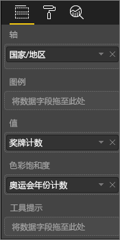

图 42：在“颜色饱和度”字段中添加值

图 43：调整对饱和度使用的颜色

此外，还可以使用颜色来强调与中间值的偏差。 例如，将正值设置为绿色，将负值设置为红色。 为正值或负值设置颜色时，请注意文化差异；并非在所有文化中，红色都表示“不好”，而绿色都表示“好”！

图 44：强调与中间值偏差的着色
 

### 可视对象设计原则 - 应用于示例报表页面
现在，让我们将上文所述的可视对象设计原则应用于我们的示例报表。

改进前

图 45：示例报表（改进前）

改进后

图 46：示例报表（改进后）

#### 我们做了哪些改进？
1. 切片器：通过添加页面级别筛选器，并且只选择了金牌、银牌、铜牌，从切片器中删除了“空白”选项。 对于“单选”和“全选”，将“选择控件”更改为“关”。
2. 气泡图：图例项过多，屏幕无法显示全。  删除了图例，改为启用了“类别标签”。 客户可以将鼠标悬停在气泡之上查看详细信息。 缩短了标题并删除了“按国家/地区”，因为这一点显而易见。 为 X 轴和 Y 轴启用了坐标轴标签，让图表更易于理解。
3. 着色地图：更改了“数据颜色”，使其更加突出。 启用了“散射”，并将“最小”设置为粉色，将“最大”设置为红色。
4. 树状图：删除了仅为美国设置的筛选器。 将“数据标签”设置为显示 1 位小数。 可视对象使用的等级字段并不十分有用，因为它几乎始终都显示 33%（金牌/银牌/铜牌）。  选择了读者更感兴趣的其他字段，即性别字段。 出于设计目的，将“水上运动”更改为蓝色，将“田径运动”更改为灰色。
5. 顶部条形图：缩短了标题，删除了数据标签，禁用了图例标题。 为了与下面的图表匹配，更改了标题的字词顺序。
6. 底部条形图：为了与上面的图表匹配，按年份进行升序排序。 更改了颜色以匹配等级。 更改了标题。 禁用了图例，为数据腾出更多空间。 启用了不会在报表中显示的数据标签（因为视觉对象过小，导致标签无法辨识），但当视觉对象在焦点模式下打开时数据标签会显示。 [了解焦点模式](service-focus-mode.md)。 在“工具提示”中添加了“比赛计数(非重复)”，因此现在如果将鼠标悬停在堆积柱形图之上，工具提示还会提示相应年份有多少比赛。
7. 视觉对象交互：对两张卡片禁用了交互，因为我想一直显示奥运会总届数和总比赛数。

## 视觉对象类型和最佳做法
Power BI 在本地提供许多视觉对象类型。  可以添加 Microsoft 和 Power BI 社区中提供的自定义视觉对象。本白皮书并未收录全部的视觉对象选项，因为太多了。 不过，我们将了解其中一些最常用的本地视觉对象类型。  

### 折线图

折线图是用于呈现一段时间内数据变化的一种强大方式。  实际上，表中数据无法让读者快速扫视峰值、谷值、周期和模式。  
以下示例展示了获得的奖牌数和赢得这些奖牌的运动员人数的变化趋势。  

图 47：折线图

#### 最佳做法
* 查看折线图时，读者首先会注意到曲线形状。  也就是说，你需要设置让曲线有意义的 X 轴，如时间或分布类别。  如果在 X 轴上设置产品或地理位置等分类字段，折线图就不引人入胜，因为曲线形状未提供任何有意义的信息。
* 如果你选择像这样竖放多个图表（这样更易于跨序列进行比较），使 X 轴排成一行。 使用筛选器来确保显示相同范围的值。  例如，如果要显示日期范围，请确保采用相同的日期范围。  两个示例图表的日期范围均为“1896 年到 2012 年”。
* 请充分利用空间。  如果可以的话，请设置 Y 轴的起点和终点，在图表的顶部和底部不留空白区域，从而聚焦实际数据点。 为此，请选择滚动油漆刷图标，打开格式窗格。 展开“Y 轴”区域，然后设置“起点”和“终点”。
  
  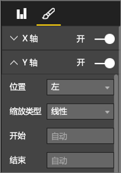
  
  图 48：设置起点和终点
* 明确设置起点和终点的另一个原因是，需要通过相同的 Y 轴字段比较同一页面上的两个或多个图表。  例如，如果显示的是累积比赛计数，英国的计数范围介于 1 到 70，而澳大利亚的计数范围介于 1 到 12，那么这两个折线图将显示截然不同的 Y 轴（图 x）。 这样一来，就很难一目了然地进行比较。 请将图表设置为改用相同的 Y 轴范围（图 x）。
  
  
  
  图 49：Y 轴不同的折线图
  
  
  
  图 50：Y 轴相同的折线图

有关详细信息，请参阅：

* [自定义 X 轴和 Y 轴](power-bi-visualization-customize-x-axis-and-y-axis.md)
* [折线图和不规则区间](http://www.perceptualedge.com/articles/visual_business_intelligence/line_graphs_and_irregular_intervals.pdf)
* [折线图 101 系列](http://www.columnfivemedia.com/data-visualization-101-line-charts)

### 条形图/柱形图

如果说折线图是用于呈现一段时间内数据变化的标准图表，那么条形图就是用于呈现不同类别的具体值的标准图表。  如果按数值对条形图进行排序，可立即了解最高值和分布。  水平条形图可以与较长的标签很好地搭配使用。  

图 51：水平条形图

#### 最佳做法
* 请显示值的数据标签。  这样更易于标识特定值。 为此，请打开格式窗格，然后将“数据标签”设置为“开”。
  
  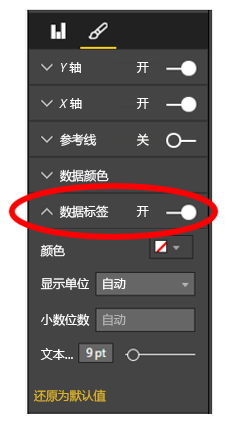
  
  图 52：启用数据标签
* 上述条形图非常适用于在一个时间点比较一个度量值与多个度量值。  上述折线图展示了一段时间内的数据变化，而上述条形图则展示了一个类别在特定时间点的变化趋势。  在条形图中，我们一眼就会发现西班牙是世界上失业率最高的国家之一，其失业率高达 25%。
* 如果所分配的空间不够显示整个条形图/柱形图，Power BI 会添加滚动条。 如果可以，尽量生成能够显示整个图表的视觉对象和报表，以便读者可以概览整个分布。  遗憾的是，鉴于全世界有太多的国家/地区，我们的示例还是需要使用滚动条。
  
  一种限制所包含的值的方法是使用筛选器。 例如，添加视觉对象级别筛选器，仅显示失业率高于 20% 的国家/地区。
* 可以向下钻取条形图/柱形图（然后重新备份）。  这种方式可以在视觉对象中显示更多信息，而不额外占用实际空间。  以下示例采用了“地区 > 国家”层次结构。  双击地区条可以向下钻取到该地区内的各个国家。  有关钻取的详细信息，请参阅[在可视化效果中向下钻取](power-bi-visualization-drill-down.md)。
  
  
  
  图 53：向下钻取

如需了解条形图和柱形图的更多详情，请参阅：

* [条形图 101 系列](http://blog.newscred.com/article/data-visualization-101-bar-charts/3c53044d4add7c31e79a3f80128771f4?page=thankyou)
* [数据可视化效果目录：条形图](http://www.datavizcatalogue.com/methods/bar_chart.html#.VYV-hY3bLJw)
* [数据可视化效果目录：多重集条形图](http://www.datavizcatalogue.com/methods/multiset_barchart.html#.VYV_gI3bLJw)

### 堆积条形图/柱形图

通过在条形图或柱形图中堆积不同的类别，可以在条形图/柱形图中添加其他维度。  现在，图表既可呈现一种总体趋势（以高度/长度为依据），还可以显示各个类别对该趋势的影响。 下面的图表展示了 2014 年收入超过 60 亿的顶级足球队的整体增长情况。

图 54：堆积柱形图

此堆积柱形图显示总收入随着时间的推移不断增长，而且商业和广播类别收入也随着时间的推移稳定增长，使得总收入不断增长。  不过，此图表难以比较 3 个类别的相互影响。 例如，商业收入增长相比广播或比赛日的收入增长如何？  最好使用折线图或将折线图用作伴随视觉对象来呈现此数据。  

图 55：转换成折线图

在此折线图中，更容易看出商业收入增长的幅度最大，随后是广播和比赛日收入增长。

#### 最佳做法
* 与柱形图/条形图一样，可以视情况选择水平显示或垂直显示。   如果有长标签，最好选择水平显示；如果有时序数据，最好选择垂直显示。  
* 如果要呈现一段时间内的变化趋势和其他变化模式，请避免使用堆积条形图/柱形图。  其他图表（如折线图）的效果更好。
* 还可以让分布以总量或占总数的百分比为依据。  
* 少数人指出， 难以比较堆积条形图的各段。*如果各段并排显示，且所有段的基线相同，则可以轻松比较段的高度。不过，如果各段相互堆积，就难以比较了。此外，尽管（收入）的每月变化情况相当显而易见，但（收入）在其他（类别）中的变化情况则很难看出。*  
* 如果总和为 100，最好使用百分比堆积图。  在以下示例中，我们看到的是按球队划分的类别分布。  百分比是相对的，以便我们能够一眼看出模式来。 例如，Everton 的收入主要来自广播（超过 70%），而 PSG 的广播收入占比仅为 20%。  选择水平显示更易于适应球队标签显示和了解收入类型的影响。
  
  
  
  图 56：水平堆积图

有关堆积图的详细信息，请参阅：

* [数据可视化效果目录：堆积条形图](http://www.datavizcatalogue.com/methods/stacked_bar_graph.html#top)
* [百分比堆积条形图何时有用？](http://www.perceptualedge.com/blog/?p=2239)

### 组合条形图/柱形图

在 Power BI 中，可以将柱形图和折线图合并到组合图中。 可以选择生成折线图和堆积柱形图，以及折线图和簇状柱形图。 将两个单独的视觉对象合并为一个，可以节省宝贵的画布空间。

下面的两个屏幕截图展示了合并前后的情况。  第一个屏幕截图中有两个单独的视觉对象，分别是呈现一段时间内人口变化情况的柱形图，以及呈现一段时间内 GDP 变化情况的折线图。 这两个图表非常适合合并到组合图中，因为它们的 X 轴（年）和值（2002 年到 2012 年）均相同。  为什么不合并这两个图表呢？这样一来，就可以在一个视觉对象上比较这两大趋势了。  合并这两个图表后，可以更快速地比较数据。

新的报表页面上有一个视觉对象，即折线图和堆积柱形图的组合图。 我们可以同样轻松地创建折线图和簇状柱形图的组合图。  现在，两种趋势之间的关系更加显而易见。   我们可以看出，2008 年前，人口和 GDP 的增长趋势类似。 但从 2009 年开始，人口增长变缓，GDP 更加多变。  

 图 57：两个单独的图表

 图 58：一个组合图

#### 最佳做法
当两个视觉对象至少有一个坐标轴相同时，组合图的效果最佳。

看看你的坐标轴吧！ 你的组合图是否易于阅读和理解？  是否使用不同的范围和值？ 例如，如果柱形图的 Y 轴比例比折线图的 Y 轴比例小得多，组合图便毫无意义。  例如，请注意底部的第三条线（水绿色）。

   

   图 59：不成功的折线图

同样，如果柱形图和折线图使用 2 个不同的度量值，而且你也没有创建双轴，那么组合图也将毫无意义。  例如，美元与百分比。 请务必添加双轴，这样有助于读者理解图表，同时还请考虑添加坐标轴标签。

为此，请打开格式窗格，展开“Y 轴”选项，然后将“显示次级内容”设置为“开”（如果尚未启用的话）。 此设置有时很难找到。请展开“Y 轴（列）”，然后向下滚动，直到看到“显示次坐标轴”为止。 此外，还请将“Y 轴（列）”的“标题”设置为“开”，并将“Y 轴（行）”的“标题”设置为“开”。

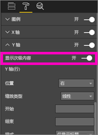

图 60：显示次坐标轴

图 61：改为创建组合图

* 请充分利用双轴。 它可用于比较值范围不同的多个度量值。 还可用于阐释一个视觉对象中两个度量值之间的关联。

有关详细信息，请参阅：

* [教程：Power BI 中的组合图](power-bi-visualization-combo-chart.md)
* [在视觉对象中使用双比例坐标轴存在的危险](http://www.perceptualedge.com/articles/visual_business_intelligence/dual-scaled_axes.pdf)

### 散点图

有时，我们希望能够同时看到多个变量，而散点图就非常实用，可方便你同时看到所有变量。  散点图显示 2 个（散点）或 3 个（气泡）定量度量值之间的关系。  散点图始终具有两个数值轴以显示水平轴上的一组数值数据和垂直轴上的另一组数值数据。 图表在 x 和 y 数值的交叉处显示点，将这些值单独合并到各个数据点。 根据数据，这些数据点可能均衡或不均衡地分布在水平轴上。

气泡图将数据点替换为气泡，用气泡大小表示数据的其他维度。

以下气泡图着眼于南美，按南美的各个国家/地区比较人均 GDP（Y 轴）、GDP 总值（X 轴）和人口。  气泡大小表示相应国家/地区的总人口。 巴西人口最多（气泡最大），在南美 GDP 中所占的份额也最大（位于 X 轴最远端）。  不过，请注意，乌拉圭、智利和阿根廷的人均 GDP 高于（在 Y 轴上的位置远于）巴西。

图 62：显示南美 GDP 和人口的气泡图

如果添加播放轴，你就可以假装自己是 Hans Rosling，呈现数据在一段时间内的变化情况 (https://www.youtube.com/watch?v=PbaDBJWCeD4)。 若要添加播放轴，请将日期时间字段也拖到“播放轴”中。

#### 最佳做法
* 散点图和气泡图是很好的信息传达方式。 不过，若要浏览数据，便会发现这两种图表并不实用。  Stephen Few 在下面的段落中指出了这一点：*此方法的优势在于传达信息。Rosling 讲述了在气泡移动和值变化时图表中所发生的情况，同时指向他希望我们看到的内容时，让信息成为动态信息。不过，当我们自己浏览和理解数据时，就会发现动态气泡图的效果不太好。我怀疑虽然 Rosling 使用这种方法发现信息，但传达的只是已知信息。我们一次顾不了多个气泡，因为它们在移动，因此我们不得不反复播放动画，试图了解所发生的情况。我们可以向选定气泡添加痕迹，以便能够查看这些气泡的完整路径。不过，如果对多个气泡使用痕迹，图表很快就会变得太杂乱了。从根本上讲，我要表达的意思是，这不是显示信息以供浏览和分析的最佳方式。*
* 添加 X 轴和 Y 轴标签可有助于传达信息。  尤其是在使用气泡图的情况下，其中有多个组件起作用，标签有助于读者理解视觉对象。
* 添加数据标签，让视觉对象更易于理解。  尤其是在使用气泡图的情况下，当有多个图例项时，可能很难区分相似的颜色。  在上述视觉对象中，苏里南、哥伦比亚和厄瓜多尔的图例颜色就非常相似。
* 你创建的散点图中是否只有一个聚合了 X 轴和 Y 轴上所有值的数据点？ 或者，你的图表是否聚合了一条横线或竖线上的所有值？  若要解决此问题，请将字段添加到“详细信息”区域，指示 Power BI 如何对值进行分组。 每个要绘制的点必须具有唯一的字段。 若要获取帮助，请参阅 [Power BI 散点图和气泡图教程](power-bi-visualization-scatter.md)。

### 树状图

树状图可能非常有用，可便于你概览一个整体中不同组成部分的相对大小，尤其是当你按类别对它们进行分组时。  每当我尝试理解新业务时，都会创建包含主要组成部分的树状图。此图表非常有用，方便我了解总体分布情况。

在下面的第一个图表中，显而易见的是，巴西约占南美 GDP 的一半，委内瑞拉和阿根廷的 GDP 大致相同。

如果你想扩大上下文范围，但仍想了解占比排名前几的国家/地区，可以创建在地区内嵌套类别成员（国家/地区）的视觉对象层次结构。 第二个树状图有助于我们了解地区的相对大小（首要信息），然后了解每个地区内占比排名前几的国家。 我们可以看出有三个非常大的地区（欧洲、亚洲和北美），并能轻松了解每个地区内占比排名前几的国家。

树状图的主要限制是，除了靠前的矩形之外，可比较的不同矩形有限。  此图表非常适合信息概览，但如果要更精确地了解不同组成部分的相对大小，柱形图和条形图的效果可能更好。
 例如，第一个树状图概述了 GDP 大小排序，但读者很难了解国家之间的具体差异，尤其是当遇到较小的未标记框时。 对于此数据，若要比较一个分组，条形图或柱形图的效果可能更好。

图 63：比较南美 GDP 的树状图

在此图表中，我们还添加了一个级别的数据，即地区。我们可以了解各地区在 GDP 总值中的占比，以及每个地区内的各国家/地区在 GDP 总值中的占比。 请务必使用非求和度量值（如平均值），因为汇总详细信息可能无法反映聚合一级的实际值。

图 64：按地区和国家显示 GDP 的树状图

有关树状图的详细信息，请单击以下链接。

* [树状图概述](http://www.perceptualedge.com/articles/b-eye/treemaps.pdf)
* [数据可视化效果目录：树状图](http://www.datavizcatalogue.com/methods/treemap.html#.VYhylI3bL7Y)

### 其他图表
#### 饼图或环形图

一般情况下，条形图/柱形图/折线图可满足大多数需求。 这很好理解，因为饼图和环形图很难正确理解，事实上这两种图表经常会歪曲数据。 请尽量避免使用这两种图表。 Stephen Few 在《把饼图留给甜点》([www.percetualedge.com/articles/08-21-07.pdf](http://www.perceptualedge.com/articles/08-21-07.pdf)) 中精彩介绍了饼图的发展历史和危害

他确实有一次提及到饼图在比较部分与整体关系时非常有用。 但即使是这一点也强不到哪里去。例如，与百分比堆积条形图相比。

[Darkhorse Analytics 站点](http://www.darkhorseanalytics.com/blog/salvaging-the-pie)上发布了另一篇有关饼图的有趣文章（和动画）。

或者，了解一下截然相反的观点（[《为什么 Tufte 对饼图的看法完全错误》](http://speakingppt.com/2013/03/18/why-tufte-is-flat-out-wrong-about-pie-charts/)）

#### 径向仪表和 KPI

径向仪表是适合指示目标完成比例的视觉对象，常用于执行仪表板。 但存在两个方面的缺陷。 与饼图一样，在对比完整 180 度弧线或目标线的情况下很难理解阴影区域的角度。 此外，径向仪表占用的空间大，但却只显示了一个度量值。

可以改为选择简单的 KPI 视觉对象

KPI 占用的空间相同，但却显示了值、状态、目标、与目标的偏差、趋势。 如果达不到目标，绿色会变成红色；如果达到某中间目标，绿色会变成黄色。 与仪表相比，它更易于阅读和理解。

有关详细信息，请参阅：

* [教程：Power BI 中的径向仪表图表](power-bi-visualization-radial-gauge-charts.md)
* [教程：Power BI 中的 KPI](power-bi-visualization-kpi.md)

## 结论
现在，是时候验证这些最佳做法了。  请与我们保持联系，分享你自己的最佳做法。 不同意我们的建议，或有令人信服的理由来“违反规则”？  我们也很想听听你的这些想法。  

### 书籍推荐
现今有很多非常好的书籍可以帮助团队研究可视对象设计技术。 Stephen Few 的《信息仪表板设计》 一书是必读的。 他在其他两本书（《向我展示数据》和《现在你明白了》）中更深入地进行了探究。 Few 和其他作者均从 Edward R. Tufte 身上汲取灵感。Tufte 的《定量信息的视觉显示》被视为该领域的经典之作。 此外，Tufte 还编写了《视觉解释》、《构想信息》和《美丽的证据》。 Andy Kirk 的新书 数据可视化效果：数据驱动设计手册》也是不错的选择。 我们还推荐了其他一些作者，包括 Lachlan James、William McKnight、Boris Evelson (Forrester) 和 Darkhorse Analytics。

更多问题？ [尝试参与 Power BI 社区](http://community.powerbi.com/)

