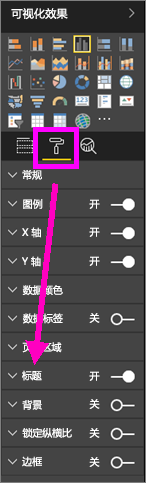
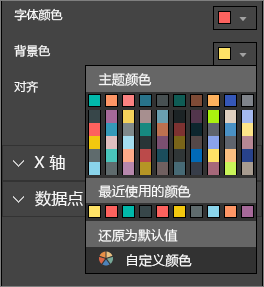
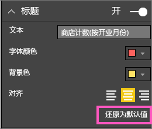
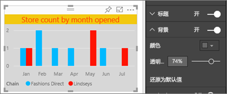
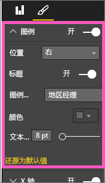
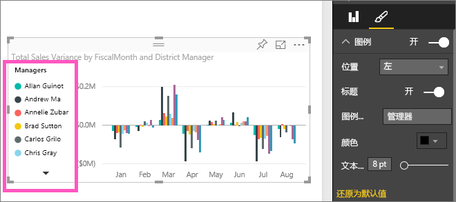

# 自定义可视化效果的标题、图例和背景
在本教程中，你将学习一些用于自定义可视化效果的不同方式。   有许多选项用于自定义可视化效果，了解所有这些选项的最佳方法是：浏览格式设置窗格（选择 paintroller 图标）。  为了帮助你入门，本文演示了如何自定义可视化效果的标题、图例和背景。  

并非所有可视化效果都可以进行自定义，[查看完整列表](#list)。  

请观看下面的视频，Amanda 将演示如何在报表中自定义可视化效果（快进到视频的 4:50）。 然后，按照视频下方的分步说明操作，用自己的数据自行尝试一下。

<iframe width="560" height="315" src="https://www.youtube.com/embed/IkJda4O7oGs" frameborder="0" allowfullscreen></iframe>

### 先决条件
- Power BI 服务或 Power BI Desktop
- 零售分析示例

## 在报表中自定义可视化效果标题
若要跟着介绍一起操作，请登录到 Power BI 服务 (app.powerbi.com) 并在[编辑视图](service-interact-with-a-report-in-editing-view.md)中[打开零售分析示例](sample-datasets.md)报表。

> [!NOTE]
> 将可视化效果固定到仪表板时，它会成为仪表板磁贴。  磁贴本身还可以使用[新标题和副标题进行自定义，可以是超链接并且可以调整大小](service-dashboard-edit-tile.md)。
> 
> 

1. 导航到报表的“新建商店”页面，并选择“按开业月份划分的开业商店计数...”柱形图。
2. 在可视化效果窗格中，选择 paintroller 图标以显示格式设置选项。  然后选择“标题”展开此部分。  
   
   
3. 通过选择“打开”（或“关闭”）滑块来打开和关闭**标题**。 现在，将它保留为**打开**。  
   
   
4. 通过在文本字段中输入**按开业月份划分的商店计数**来更改**标题文本**。  
5. 将**字体颜色**更改为橙色，并将**背景色**更改为黄色。
   
   * 选择下拉菜单，然后从**主题颜色**、**最近使用的颜色**或**自定义颜色**中选择颜色。
   * 选择下拉菜单以关闭颜色窗口。  
     
   
   始终可以通过在颜色窗口中选择**恢复到默认值**，来恢复为默认颜色。
6. 将文本大小增加到 12。
7. 我们对图表标题进行的最后一个自定义是使它在可视化效果中居中。 标题位置默认为左对齐。  
   
   
    此时在教程中，柱形图“标题”应如下所示：  
    
   
    要恢复目前为止我们进行的所有标题自定义，请在**标题**自定义窗格底部选择**默认到默认值**。  
    

## 自定义可视化效果背景
在选择相同柱形图的情况下，展开背景选项。

1. 通过选择“打开”（或“关闭”）滑块来打开和关闭背景。 现在，将它保留为**打开**。
2. 将背景色更改为 74% 灰色。
   
   * 选择下拉菜单，然后从“主题颜色”、“最近使用的颜色”或“自定义颜色”中选择灰色。
   * 将透明度更改为 74%。   
     
   
   要恢复目前为止我们进行的所有背景自定义，请在**背景**自定义窗格底部选择**默认到默认值**。

## 自定义可视化效果图例
1. 打开**概述**报告页面并选择“按会计月份和区域经理划分的总销售额差异”图表。
2. 在“可视化效果”选项卡中，选择画笔图标以打开格式设置窗格。  
3. 展开**图例**选项。
   
      
4. 通过选择“打开”（或“关闭”）滑块来打开和关闭图例。 现在，将它保留为**打开**。
5. 将图例移动到可视化效果左侧。    
6. 通过将**标题**切换为**打开**，然后在**图例名称**字段中输入**经理**，来添加图例标题。
   
   
   要恢复目前为止我们进行的所有图例自定义，请在**图例**自定义窗格底部选择**默认到默认值**。

## 可以自定义的可视化效果类型
| 可视化效果 | 标题 | 背景 | 图例 |
|:--- |:--- |:--- |:--- |
| 分区图 |是 |是 |是 |
| 条形图 |是 |是 |是 |
| 卡片图 |是 |是 |n/a |
| 多行卡片图 |是 |是 |n/a |
| 柱形图 |是 |是 |是 |
| 组合图 |是 |是 |是 |
| 圆环图 |是 |是 |是 |
| 着色地图 |是 |是 |是 |
| 漏斗图 |是 |是 |n/a |
| 仪表盘 |是 |是 |n/a |
| kpi |是 |是 |n/a |
| 折线图 |是 |是 |是 |
| 映射图 |是 |是 |是 |
| 矩形图 |是 |是 |n/a |
| 饼图 |是 |是 |是 |
| 散点图 |是 |是 |是 |
| 切片器 |是 |是 |n/a |
| 表 |是 |是 |n/a |
| 文本框 |否 |是 |n/a |
| 树状图 |是 |是 |是 |
| 瀑布图 |是 |是 |是 |

## 后续步骤
[自定义 X 轴和 Y 轴](power-bi-visualization-customize-x-axis-and-y-axis.md)  
[自定义颜色和轴属性](service-getting-started-with-color-formatting-and-axis-properties.md)  
[Power BI - 基本概念](service-basic-concepts.md)  
更多问题？ [尝试参与 Power BI 社区](http://community.powerbi.com/)

