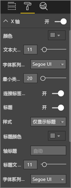
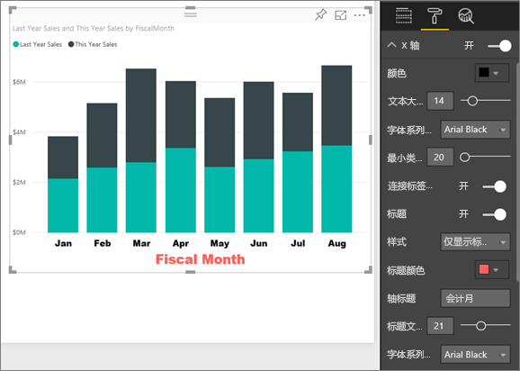
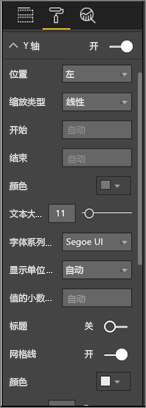
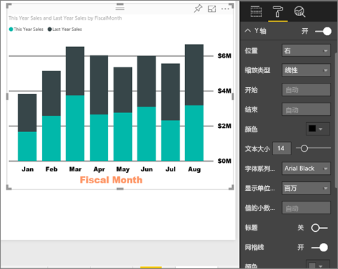
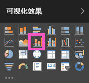
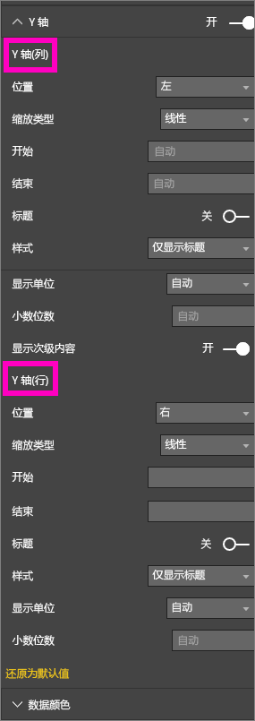
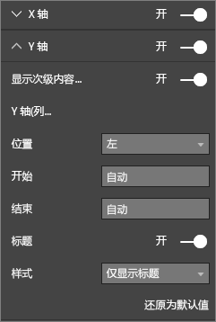

# 自定义 X 轴和 Y 轴属性
在本教程中，你会学习很多用于自定义视觉对象的 X 轴和 Y 轴的不同方式。 并非所有视觉对象都具有轴或是可以自定义；例如，饼图没有轴。 而且自定义选项因视觉对象而异，选项太多，无法在一篇文章中进行介绍。 因此我们讨论一些最常用的轴自定义，使你可以熟练地在 Power BI 报表画布中使用视觉对象格式设置选项卡。  

> [!NOTE]
> 此页面适用于 Power BI 服务和 Power BI Desktop。 这些自定义在选择”**格式**”（滚筒刷图标 ）时可用，在 Power BI Desktop 中也可用。  
>
>

请观看下面的视频，Amanda 将演示如何自定义 X 和 Y 轴，以及各种用于在使用向上钻取和向下钻取时控制串联的方法。 然后，按照视频下方的分步说明操作，用“零售分析”示例自行尝试一下。

<iframe width="560" height="315" src="https://www.youtube.com/embed/9DeAKM4SNJM" frameborder="0" allowfullscreen></iframe>

## 在报表中自定义可视化效果 X 轴
## 创建堆积图可视化效果
登录到 Power BI 服务，在[编辑视图](service-interact-with-a-report-in-editing-view.md)中打开**零售分析示例**报表。 要遵循示例执行操作，请[连接到零售分析示例](sample-datasets.md)。

1. 新建一个柱形图，按会计月份显示今年和去年的销售额。
2. 转换为堆积柱形图。

    

## 自定义 X 轴
1. 在“可视化效果和筛选器”窗格中，选择“**格式**”（滚筒刷图标 ）以显示自定义选项。
2. 展开 X 轴选项。

   
3. 通过选择“打开”（或“关闭”）滑块来打开和关闭 X 轴。 现在，将它保留为**打开**。  导致用户想要禁用 Y 轴的一个原因是，节省空间以显示更多数据。

    
4. 设置文字颜色、文本大小和字体。 在此示例中，我们已将“文字颜色”设置为“黑色”，将“文本大小”设置为“14”，并将“字体”设置为“Arial Black”。  
5. 启用 X 轴标题，并显示 X 轴的名称（在此例中，为 FiscalMonth）。  
6. 设置标题的文字颜色、文本大小和字体。  在此示例中，我们已将“标题颜色”设置为“橙色”，将“轴标题”更改为“会计月份”，并将“标题文本大小”设置为“21”。
7. 若要按 FiscalMonth 排序，请依次选择图表右上角的省略号 (...) 和“按 FiscalMonth 排序”。

    进行这些自定义之后，柱形图应如下所示：

     

若要还原现已完成的所有 X 轴自定义，请选择“X 轴”自定义窗格底部的“还原为默认值”。

## 自定义 Y 轴
1. 展开“Y 轴”选项。

   

2. 选择“开”（或“关”）滑块，启用（或禁用）Y 轴。 现在，将它保留为**打开**。  导致用户要禁用 Y 轴的一个原因是，为了节省空间以显示更多数据。
   
    
3. 将 Y 轴的“位置”改为“右”。
4. 设置文字颜色、文本大小和字体。 在此示例中，我们已将“文字颜色”设置为“黑色”，将“文本大小”设置为“14”，并将“字体”设置为“Arial Black”。  
5. 保持“显示单元”设置为“百万”，且“值小数位”设置为“零”不变。
6. 对于此可视化效果，显示 Y 轴标题并不会优化视觉对象，所以保持“标题”设置为“关”不变。  
7. 让我们将“颜色”更改为“深灰色”，并将“笔划”增至“2”，以突出显示网格线。

    进行这些自定义之后，柱形图应如下所示：

     

## 自定义具有双 Y 轴的可视化效果
首先会创建一个组合图，它显示商店计数对销售额的影响。  此图表与[组合图教程](power-bi-visualization-combo-chart.md)中创建的图表相同。 随后你会对双 Y 轴设置格式。

### 创建具有两个 Y 轴的图表
1. 新建折线图，按“时间 > FiscalMonth”跟踪“销售额 > 去年毛利率”。
2. 通过选择省略号 (...)，然后选择“**按月进行排序**”来按月对视觉对象排序。

    

>[NOTE]: For help sorting by month, see [sorting by other criteria](power-bi-report-change-sort.md#other)
1. 一月的 GM% 是 35%，在四月达到峰值 45%，在七月下降，在八月再次达到峰值。 去年和本年度的销售额是否会呈现类似模式？
2. 将**本年度销售额 > 值**和**去年销售额**添加到折线图。 “去年毛利率”的比例尺（沿 0% 去年毛利率网格线的蓝线）比“销售额”的比例尺小得多，这样就更难比较了。 而且，Y 轴标签百分比很不合理。      

   
5. 若要使视觉对象更易于查看和解释，请将折线图转换为折线和堆积柱形图。

   

6. 将**去年毛利率**从**列值**拖动到**行值**中。 现在拥有的是上面创建的堆积柱形图和折线图。  （可以视需要利用上面学到的知识，设置坐标轴的字体颜色和文本大小。）
   

   Power BI 会创建两个轴，从而允许数据集以不同方式缩放；左侧度量值是美元，右侧度量值是百分比。

   

### 对辅助 Y 轴设置格式
1. 在“**可视化效果**”窗格中，选择滚筒刷图标来显示格式选项。
2. 通过选择向下箭头来展开 Y 轴选项。
3. 滚动此列表，直到找到“**显示辅助对象**”选项。 将“**显示辅助对象**”从**关闭**切换为**打开**。

   

   
4. （可选）自定义两个轴。 如果切换列轴或行轴的**位置**，则两个轴将交换位置。

   

### 向两个轴添加标题
对于十分复杂的可视化效果，添加轴标题会有所帮助。  标题可帮助你的同事了解可视化效果所表达的意思。

1. 将 **Y 轴（列）** 和 **Y 轴（行）** 的**标题**切换到**打开**。
2. 将**样式**设置为**仅显示标题**。

   
3. 组合图现在显示双轴，它们都具有标题。

   

有关详细信息，请参阅[颜色格式设置、标签和轴属性的提示和技巧](service-tips-and-tricks-for-color-formatting.md)。

## 注意事项和疑难解答
如果报表所有者按日期类型对 X 轴进行分类，则“**类型**”选项将显示，并可以在连续或分类之间进行选择。

## 后续步骤
有关 [Power BI 报表中的可视化效果](power-bi-report-visualizations.md)的详细信息

[自定义](power-bi-visualization-customize-title-background-and-legend.md)[标题、背景和图例](power-bi-visualization-customize-title-background-and-legend.md)

[自定义颜色和轴属性](service-getting-started-with-color-formatting-and-axis-properties.md)

[Power BI - 基本概念](service-basic-concepts.md)

更多问题？ [尝试参与 Power BI 社区](http://community.powerbi.com/)
