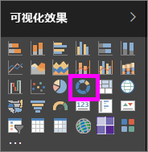
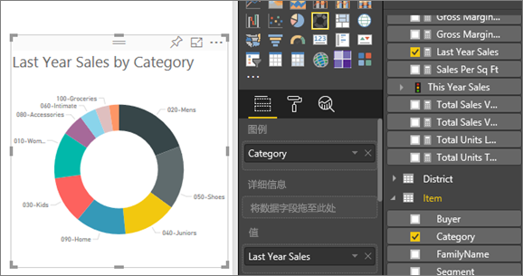

# Power BI 中的圆环图
圆环图类似于饼图，因为它显示部分与整体的关系。 唯一的区别是中心为空，因而有空间可用于标签或图标。

## 创建圆环图
这些说明使用零售分析示例创建一个按类别显示本年度销售额的圆环图。 若要继续学习，请[下载](sample-datasets.md)适用于 Power BI 服务 (app.powerbi.com) 或 Power BI Desktop 的示例。

1. 从[空白报表页](power-bi-report-add-page.md)开始，选择“SalesStage”\>“销售阶段”字段。 如果使用的是 Power BI 服务，请确保在 [“编辑视图”](service-interact-with-a-report-in-editing-view.md) 中打开报表。

2. 在“字段”窗格中，选择“销售额”\>“去年销售额”。  
   
3. 从可视化对象窗格中，选择圆环图的图标，将条形图转换为圆环图。 如果“去年销售额”不在“值”区域中，请将它拖动到其中。
     
   

4. 依次选择“**项**”\>“**类别**”，将其添加到**图例**区域中。 
     
    

5. （可选）[调整大小和图表文本的颜色](power-bi-visualization-customize-title-background-and-legend.md)。 

## 注意事项和疑难解答
* 圆环图值的总和相加必须达到 100%。
* 类别太多会难以查看和解释。
* 圆环图最适用于将特定部分与整体进行比较，而不是将各个部分相互比较。 

## 后续步骤
[Power BI 中的报表](service-reports.md)

[Power BI 中的可视化效果类型](power-bi-visualization-types-for-reports-and-q-and-a.md)

[Power BI 报表中的可视化效果](power-bi-report-visualizations.md)

[Power BI - 基本概念](service-basic-concepts.md)

更多问题？ [尝试参与 Power BI 社区](http://community.powerbi.com/)

