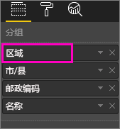
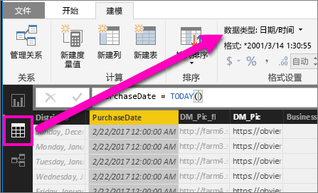

# 在 Power BI 中深入探索可视化效果
## 向下钻取要求具有层次结构
视觉对象具有层次结构时，可以向下钻取以显示其他详细信息。 例如，你可能有一个可视化效果，该可视化效果按由运动、专业和事件组成的层次结构查看奥运会奖牌数。 默认情况下，可视化效果将按运动（体操、滑冰、水上项目等）显示奖牌数。 但是，因其具有层次结构，选择其中一个可视元素（如条形图、行或气泡图）将显示更多包含详细信息的图片。 选择“**水上运动**”元素可以查看游泳、潜水和水球的数据。  选择“**潜水**”元素可以查看跳板、跳台和双人跳水活动项目的详细信息。

可以向你拥有的报表添加层次结构，但不能向与你共享的报表添加层次结构。
不确定哪个 Power BI 可视化效果包含层次结构？  将鼠标悬停在可视化效果上，如果在顶部边角看到这些钻取控件，则你的可视化效果具有层次结构。

    
   

日期是层次结构的唯一类型。 向可视化效果添加日期字段时，Power BI 自动添加包含年、季度、月和天的时间层次结构。 有关详细信息，请参阅[视觉对象层次结构和向下钻取行为](guided-learning/visualizations.yml?tutorial-step=18)或观看下面的视频。

  <iframe width="560" height="315" src="https://www.youtube.com/embed/MNAaHw4PxzE?list=PL1N57mwBHtN0JFoKSR0n-tBkUJHeMP2cP" frameborder="0" allowfullscreen></iframe>

> [!NOTE]
> 若要了解如何使用 Power BI Desktop 创建层次结构，请观看视频[如何创建和添加层次结构](https://youtu.be/q8WDUAiTGeU)
> 
> 

## 向下钻取的两种方法
在可视化效果中向下（上）钻取有两种不同方法。  本文中两种均有描述。 这两种方法完成同样的操作，因此请使用你最喜欢的任何一种。

> [!NOTE]
> 为此，打开 Power BI 服务中的[打开零售分析示例](sample-datasets.md)并创建一个树图，该树图按**区域**、**城市**、**邮政编码**和**名称**（组）显示**本年度单位总数**（值）。  
> 
> 

## 向下钻取的第一种方法
此方法使用钻取图标，该图标显示在可视化效果本身的顶部边角。

1. 在 Power BI 中，以[阅读视图或编辑视图](service-reading-view-and-editing-view.md)打开报表。 钻取需要具有层次结构的可视化效果。 
   
   层次结构如下面的动画中所示。  可视化效果具有一个由区域、城市、邮政编码和城市名称所组成的层次结构。 每个区域均包含一个或多个城市，而每个城市均包含一个或多个邮政编码等。 默认情况下，可视化效果仅显示区域数据，因为在列表中首先显示“区域”。
   
   
2. 要启用钻取，请选择可视化效果右上角的箭头图标。 当图标变成深色时，则钻取已启用。 如果不打开钻取，则选择可视元素（如条形图或气泡图）将交叉筛选报表页上的其他图表。    
   
   
3. 要一次向下钻取一个字段，请选择可视化效果中的一个元素。 在条形图中，这意味着单击一个条形。 在树状图中，这意味着单击一个树叶。 请注意，标题随向下钻取和再次向上钻取而进行更改。 在此动画中，它从“按区域的本年度单位总数”更改为“按区域和城市的本年度单位总数”，然后更改为“按区域、城市和邮政编码的本年度单位总数”，更改为“按区域、城市、邮政编码和名称的本年度单位总数”。 要向上钻取，请选择可视化效果左上角的“向上钻取”图标 ，如下所示。
   
   
4. 要一次性向下钻取所有字段，请选择可视化效果左上角的双箭头。
   
   
5. 要向上钻取，请选择可视化效果左上角的向上箭头。
   
   

## 向下钻取的第二种方法
此方法使用顶部 Power BI 菜单栏的“浏览”下拉列表。

1. 在 Power BI 中，以[阅读视图或编辑视图](service-reading-view-and-editing-view.md)打开报表。 钻取需要具有层次结构的可视化效果。 
   
   层次结构如下图所示。  可视化效果具有一个由区域、城市、邮政编码和城市名称所组成的层次结构。 每个区域均包含一个或多个城市，而每个城市均包含一个或多个邮政编码等。 默认情况下，可视化效果仅显示区域数据，因为在列表中首先显示“区域”。
   
   
2. 要启用向下钻取，请选择可视化效果并将其激活，然后从 Power BI 顶部菜单栏选择“浏览” > “向下钻取”。 可视化效果右上角的钻取图标变为黑色背景。   
   
   
3. 启用后，通过选择其中一个树状图树叶一次向下钻取一个字段。 在本示例中，已选择名为“NC”的区域，以按城市查看北卡罗来纳州本年度销售的单位总数。
   
   
4. 若要一次向下性钻取所有字段，请选择“**浏览**” > “**显示下一级别**”。
   
   
5. 若要向上钻取，请选择“**浏览**” > “**向上钻取**”。
   
   

6. 要查看用于创建视觉对象的数据，请选择“查看数据”。 该数据显示在视觉对象下方的窗格中。 在视觉对象中继续进行钻取时，此窗格将保持不变。 有关详细信息，请参阅[显示所使用的数据以创建视觉对象](service-reports-show-data.md)。

## 了解层次结构轴和层次结构组
可以将层次结构轴和层次结构组视为可以用来增加和减少要查看的数据的粒度的机制。 任何可以按类别和子类别组织的数据都具有层次结构。 这当然包括日期和时间。

可以在 Power BI 中创建具有层次结构的可视化效果，方法是选择一个或多个要添加到“轴”井或“组”井以及想要作为“值”井中的数据字段检查的数据。 如果钻取模式图标显示在可视化效果的左上角和右上角，你将知道数据是否分层。 

实际上，这可以方便地考虑两种类型的分层数据：
- 日期和时间数据 - 如果具有日期/时间数据类型的数据字段，则已经具有分层数据。 Power BI 自动为任何数据字段创建一个层次结构，这些数据字段的值可以解析为[日期/时间](https://msdn.microsoft.com/library/system.datetime.aspx)结构。 仅需将一个“日期/时间”字段添加到“轴”或“组”井。
- 分类数据 - 如果数据派生自包含子集合的集合，或者具有多行共享公用值的数据，则具有分层数据

Power BI 使你可通过一个或所有子集扩展。 可以通向下钻取过数据以查看每个级别的单个子集，或同时查看每个级别的所有子集。 例如，可以向下钻取特定年份，或沿着层次结构查看每年的所有结果。 相反，可以用相同方式向上钻取。

以下各节介绍从最高视图、中间视图和最低视图向下钻取。

### 分层数据和时间数据
在此示例中，请按照[零售分析示例](sample-datasets.md)操作并创建堆积柱形图可视化效果，按总销售额（值）显示月份（轴）。  

即使轴数据字段为“月份”，它仍在“轴”井中创建“年份”。 这是因为 Power BI 为它读取的所有值提供完整的日期/时间结构。 层次结构的顶部显示年份的数据。

启用向下钻取模式后，单击图表中的条形图以转到层次结构的下一级别。 随即显示三个可用的季度数据条形图。 然后从左上角图标选择“将层次结构的下一级别全部展开”。 然后再执行一次该操作，以达到层次结构的最低级别，其中显示每月的结果。

除了可视化效果，我们还可以看到每个报表呈现的数据中反映的层次结构。 下表显示从单个月份或所有月份向下钻取的报表中“显示数据”的结果。 

请注意，季度和年度报表的数据相同，但向下钻取到为“值”指定的详细级别后，你就会明白单个报表如何变得更为具体，“所有月份”报表如何包含更多数据。

|展开模式|年份|季度|月份|日|
| ---|:---:|:---:|:---:|---|
|单向|||||
|全部|||||

### 分层类别数据
从集合和子集合建模的数据是分层的。 位置数据就是一个很好的例子。 请考虑其列是“国家/地区”、“省/自治区/直辖市”、“城市”和“邮政编码”的数据源中的表。 共享相同的“国家/地区”、“省/自治区/直辖市”、“城市”的数据是分层的。

在此示例中，请按照[零售分析示例](sample-datasets.md)操作。 创建堆积柱形图可视化效果，按“区域”、“城市”、“邮政编码”和“名称”（组）显示“本年度单位总数”（值）。  

启用向下钻取模式后，从左上角图标选择三次“将层次结构的下一级别全部展开”。
你应该处于层次结构的最低级别，该级别显示“区域”、“城市”、“邮政编码”的结果。

除了可视化效果，我们还可以看到每个报表呈现的数据中反映的层次结构。 下表显示向下钻取单个区域或所有区域的报告中“显示数据”的结果。 向下钻取时，你就会明白单个报表如何变得更为具体，“所有区域”如何包含更多数据。

| 展开模式|区域|城市|邮政|Name|
| ---|:---:|:---:|:---:|---|
|单向|||||
|全部|||||

## 注意事项和限制
* 如果向可视化效果添加日期字段不会创建层次结构，则可能是因为“日期”字段实际上并未另存为日期。 如果拥有数据集，则在 Power BI Desktop 中的“数据”视图下打开，选择包含日期的列，然后在“建模”选项卡中将“数据类型”更改为“日期”或“日期/时间”。 如果已与你共享该报表，则与所有者联系以请求更改。  
  
  

## 后续步骤
[Power BI 报表中的可视化效果](power-bi-report-visualizations.md)

[Power BI 报表](service-reports.md)

[Power BI - 基本概念](service-basic-concepts.md)

更多问题？ [尝试参与 Power BI 社区](http://community.powerbi.com/)

