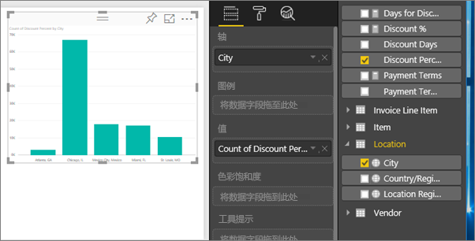
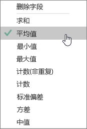
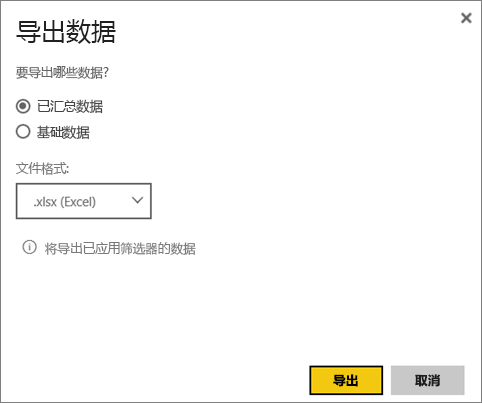

# 从可视化效果导出数据
若要查看用于创建可视化效果的数据，可以[在 Power BI 中显示该数据](service-reports-show-data.md)或将这些数据以 .xlsx 或.csv 文件形式导出到 Excel。   

Watch 将从其报表中的其中一个可视化效果导出数据，将其保存为 .xlsx 文件，并在 Excel 中打开它。 然后按照视频下面的分步说明来自己尝试一下。

<iframe width="560" height="315" src="https://www.youtube.com/embed/KjheMTGjDXw" frameborder="0" allowfullscreen></iframe>

## Power BI 仪表板上的可视化效果
1. 选择可视化效果右上角的省略号。

    
2. 选择导出数据图标。

    
3. 数据导出到.csv 文件中。 如果筛选了视觉对象，那么下载的数据也将进行筛选。    
4. 你的浏览器将提示你保存该文件。  保存后，在 Excel 中打开该 .csv 文件。

    

## 从报表中的可视化效果
为此，打开“[编辑视图](service-reading-view-and-editing-view.md)”中的“[采购分析示例报表](sample-procurement.md)”。 [添加新的空白报表页](power-bi-report-add-page.md)。 然后按照以下步骤来添加聚合和可视化效果级别筛选器。

1. 创建一个新的柱形图。  从字段窗格中，选择“位置 > 城市”和“发票 > 折扣百分比”。  需要将“折扣百分比”移动到“值”一列中。 

    
2. 将折扣百分比的聚合从“计数”更改为“平均”。 在“值”一列中，选择“折扣百分比”右侧的箭头（它可能显示“折扣百分比计数”），然后选择“平均”。

    
3. 向“城市”添加筛选器以删除“亚特兰大”。

   

   现在准备尝试使用两个选项导出数据。 

4. 选择可视化效果右上角的省略号。 选择导出数据。

   
5. 在 Power BI 在线版中，如果可视化效果具有聚合（一个示例是如果将“计数”更改为“平均”、“总和”或“最小”），则具有两个选项：汇总数据和基础数据。 在 Power BI Desktop 中，将仅有“汇总数据”选项。有关聚合的详细信息，请参阅 [Power BI 中的聚合](service-aggregates.md)。

    
6. 选择“汇总数据” > “导出”并选择 .xlsx 或 .csv。 Power BI 导出数据。  如果已将筛选器应用到可视化效果，则导出的数据将在筛选后导出。 选择“导出”时，浏览器会提示你保存文件。 保存后，在 Excel 中打开该文件。

   **汇总数据**：希望导出在该视频中看到的数据时可选择此选项。  这种类型的导出仅显示所选用于创建视觉对象的数据（列和度量值）。  如果视觉对象具有聚合，则将导出聚合数据。 例如，如果有一个显示 4 条的条形图，则将获得 4 行数据。 汇总数据可作为 .xlsx 和 .csv。

   在此示例中，Excel 导出会显示每个城市的总计。 由于已筛选出亚特兰大，因此它并不包含在结果中。  电子表格的第一行显示的是我们在从 Power BI 提取数据时所使用的筛选器。

   
7. 现在尝试选择“基础数据” > “导出”并选择 .xlsx。 Power BI 导出数据。 如果已将筛选器应用到可视化效果，则导出的数据将在筛选后导出。 选择“导出”时，浏览器会提示你保存文件。 保存后，在 Excel 中打开该文件。

   >[!WARNING]
   >使用导出基础数据功能，用户可以查看所有详细的数据（数据中的每列）。 Power BI 服务管理员可以为其组织关闭此功能。 如果你是数据集的所有者，则可以将专有列设置为“隐藏”，这样它们就不会出现在 Desktop 或 Power BI 服务的“字段”列表中。

   **基础数据**：希望查看视觉对象中的数据***和***模型中的其他数据时可选择此选项（请参阅下表了解详细信息）。  如果可视化效果具有聚合，则选择基础数据会删除聚合。 选择“导出”时，数据将导出到 .xlsx 文件，并且你的浏览器会提示你保存该文件。 保存后，在 Excel 中打开该文件。

   在此示例中，Excel 导出显示我们的数据集中每一个城市行的一行，以及该单个条目的折扣百分比。 换言之，数据平展而不聚合。 电子表格的第一行显示的是我们在从 Power BI 提取数据时所使用的筛选器。  

   

## 导出基础数据的详细信息
选择基础数据时看到的内容可能会有所不同。 如需了解这些内容的详细信息，请联系管理员或 IT 部门获取帮助。 在 Power BI Desktop 或 Power BI 服务中，在报表视图中，带有计算器图标  的字段中将显示一个度量值。 度量值是在 Power BI Desktop 中而不是 Power BI 服务中创建的。

| 视觉对象包含 |                                                                              将在导出中看到的内容                                                                              |
|-----------------|-------------------------------------------------------------------------------------------------------------------------------------------------------------------------------------|
|   聚合    |                                                 第一个聚合和来自该聚合的整个表的非隐藏数据                                                  |
|   聚合    | 相关数据 - 如果视觉对象使用的是其他数据表中的数据，即与包含聚合的数据表 *\*\*相关*\*（只要该关系是\*: 1 个或 1:1） |
|    度量值     |                                      视觉对象中的所有度量值和任何数据表中的所有度量值，其中数据表包含在视觉对象中使用的某个度量值                                      |
|    度量值     |                                       包含该度量值的表中的所有非隐藏数据（只要该关系是 \*: 1 或 1:1）                                       |
|    度量值     |                                      与包含度量值的表相关的所有表中的所有数据（只要该关系为 \*: 1 或 1:1）                                      |
|  仅度量值  |                                                   所有相关表中的所有非隐藏列（以便展开度量值）                                                   |
|  仅度量值  |                                                             模型度量值的任何重复行的汇总数据。                                                              |

## 限制和注意事项
* 最多可将 30,000 行从 **Power BI Desktop** 和 **Power BI 服务**导出到 .csv。
* 可以导出到 .xlsx 的最大行数是 150,000。
* 如果数据源是 Analysis Services 实时连接、版本低于 2016 且模型中的表没有唯一键，则无法使用“基础数据”进行导出。  
* 如果为要导出的可视化效果启用了“显示不含数据的项”选项，则无法使用“基础数据”进行导出。
* 使用 DirectQuery 时，最多可以导出 16MB 数据。 这可能会导致导出的行数少于上限，尤其是当有许多列、难以压缩的数据以及其他增加文件大小但减少导出行数的因素时。
* 如果视觉对象使用的数据来自多个数据表，并且这些表在数据模型中不存在任何关系，则只导出第一个表中的数据。 
* 目前不支持自定义视觉对象和 R 视觉对象。
* 不可以对使用已与其共享的仪表板的组织外用户导出数据。 
* 在 Power BI 中，双击字段并键入新的名称，即可对该字段（列）进行重命名。  这个新的名称叫作别名。 Power BI 报表可以包含重复的字段名称，但 Excel 不允许重复。  因此，将数据导出到 Excel 后，字段别名将还原为其原始字段（列）名称。  
* 如果 .csv 文件中存在 unicode 字符，那么 Excel 中的文本可能不会正常显示。 不过，在记事本中打开它则会正常显示。 Unicode 字符的示例是货币符号和外语单词。 对此的解决方法是将 csv 文件导入到 Excel 中，而不是直接打开 csv 文件。 如何执行此操作：

  1. 打开 Excel
  2. 从“数据”选项卡上，选择“获取外部数据” > “从文本”。
* Power BI 管理员可以禁用数据导出功能。

## 后续步骤
[Power BI 中的仪表板](service-dashboards.md)  
[Power BI 中的报表](service-reports.md)  
[Power BI - 基本概念](service-basic-concepts.md)

更多问题？ [尝试咨询 Power BI 社区](http://community.powerbi.com/)

