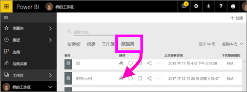
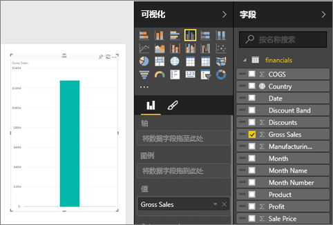
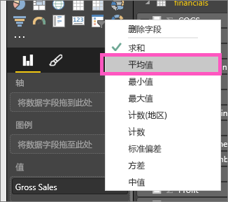
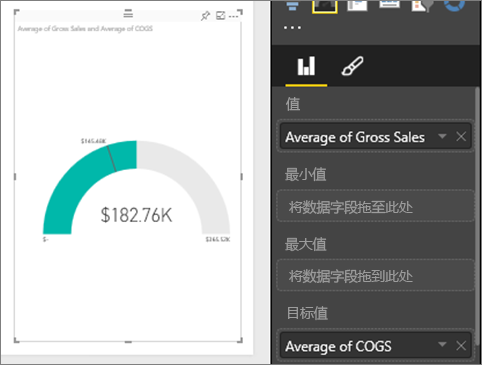
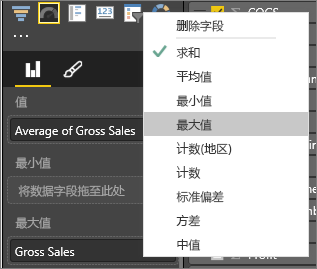
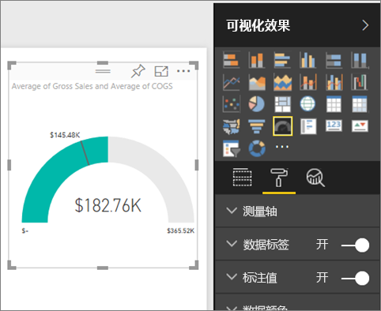
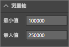
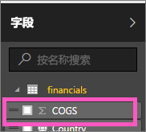
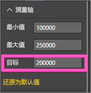

# Power BI 中的径向仪表图
径向仪表盘有一个圆弧，并且显示单个值，该值用于衡量针对目标/KPI 的进度。  使用直线（针）表示目标或目标值。 使用明暗度表示针对目标的进度。  表示进度的值在圆弧内以粗体显示。所有可能的值沿圆弧均匀分布，从最小值（最左边的值）到最大值（最右边的值）。

在下面的示例中，我们是汽车零售商，需要跟踪销售团队每月的平均销量。 我们的目标是 140，用黑色针表示。  可能的最小平均销量为 0，我们已将最大值设为 200。  蓝色显示本月的平均销量接近 120。 幸运的是，我们仍有一周的时间来实现这一目标。

## 何时使用径向仪表盘
径向仪表适用情况：

* 显示某个目标的进度。
* 表示百分比指标值，如 KPI。
* 显示单个指标的健康状况。
* 显示可以快速扫描和理解的信息。

### 先决条件
 - Power BI 服务或 Power BI Desktop
 - 财务示例 Excel 工作簿：[直接下载该示例](http://go.microsoft.com/fwlink/?LinkID=521962)。

## 创建基本的径向仪表盘
本文中的说明将使用 Power BI 服务。 若要跟着介绍一起操作，请登录 Power BI，并打开“Excel 财务示例”文件。  

或观看 Will 介绍如何创建单个指标视觉：仪表、卡片和 KPI。

<iframe width="560" height="315" src="https://www.youtube.com/embed/xmja6EpqaO0?list=PL1N57mwBHtN0JFoKSR0n-tBkUJHeMP2cP" frameborder="0" allowfullscreen></iframe>

### 第 1 步：打开“Excel 财务示例”文件
1. [下载“Excel 财务示例”文件](sample-financial-download.md)（如果还没有的话）。 记住此文件的保存位置。

2. 在 Power BI 服务中打开此文件，具体方法是依次选择“获取数据”\>“文件”，并转到此文件的保存位置。 选择“导入”。 会将该财务示例作为数据集添加到你的工作区。

3. 在“数据集”内容列表中，选择“财务示例”，在浏览模式下打开它。

    

### 步骤 2：创建仪表盘来跟踪总销售额
1. 在**字段**窗格中，选择**总销售额**。
   
   
2. 将聚合函数更改为**平均值**。
   
   
3. 选择仪表盘图标  将柱形图转换为一个仪表盘。
   
   默认情况下，Power BI 创建的仪表盘的当前值（在本例中为平均总销售额）假定在仪表盘的中间点上。 由于平均总销售额为 $182.76K，因此起始值（最小值）设为 0，结束值（最大）设为双倍的当前值。
   
   

### 步骤 3：设置目标值
1. 将 **COGS** 拖放到**目标值**框。
2. 将聚合函数更改为**平均值**。
   Power BI 添加了一个针用于表示我们的目标值 **$145.48K**。 请注意，我们已经超过了我们的目标。
   
   
   
   > [!NOTE]
   > 也可以手动输入目标值。  请参阅下文的“使用格式选项手动设置最小值、最大值和目标值”。
   > 
   > 

### 步骤 4：设置最大值
在步骤 2 中，Power BI 使用“值”字段自动设置最小值（起始）和最大值（结束）。  但是如果你想要设置自己的最大值应如何操作？  举例来说，将最大值设置为数据集中的最大总销售额，而不使用双倍的当前值作为可能的最大值。 

1. 将**字段**列表中的**总销售额**拖放到**最大值**框。
2. 将聚合函数更改为**最大值**。
   
   
   
   将重新绘制仪表盘，其新的结束值为总销售额 121 万。
   
   

### 步骤 5：保存报表
1. [保存报表](service-report-save.md)。
2. [将仪表盘添加为仪表板磁贴](service-dashboard-tiles.md)。 

## 使用格式选项手动设置最小值、最大值和目标值
1. 将**最大总销售额**从**最大值**框中删除。
2. 选择滚动油漆刷图标，打开“格式”窗格。
   
   
3. 展开**仪表盘轴**，然后输入**最小值**和**最大值**。
   
    
4. 通过取消选中 **COGS** 旁边的复选标记来删除当前的目标值。
   
    
5. 当**仪表盘轴**下方显示**目标值**字段时，请输入一个值。
   
    
6. 或者，继续设置仪表盘的格式。

## 后续步骤
[Power BI 中的可视化效果类型](power-bi-visualization-types-for-reports-and-q-and-a.md)

[向报表添加可视化效果](power-bi-report-add-visualizations-i.md)

[将可视化效果固定到仪表板](service-dashboard-pin-tile-from-report.md)

[Power BI - 基本概念](service-basic-concepts.md)

更多问题？ [尝试参与 Power BI 社区](http://community.powerbi.com/)

