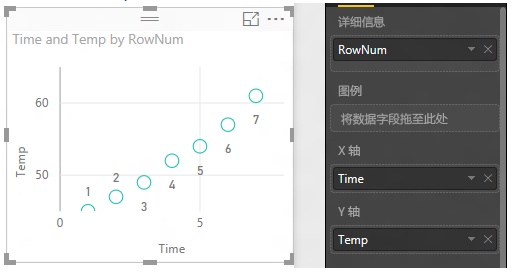
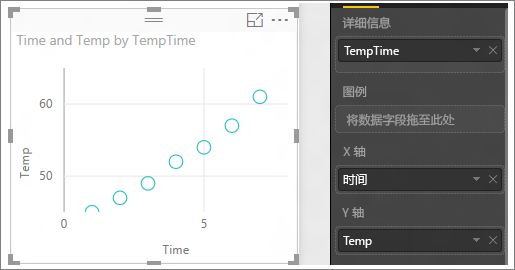

# Power BI 中的散点图和气泡图（教程）
散点图始终具有两个数值轴以显示水平轴上的一组数值数据和垂直轴上的另一组数值数据。 图表在 x 和 y 数值的交叉处显示点，将这些值单独合并到各个数据点。 根据数据，这些数据点可能均衡或不均衡地分布在水平轴上。

气泡图将数据点替换为气泡，用气泡大小表示数据的其他维度。

## 何时使用散点图或气泡图
### 以下情况下，散点图是一个不错的选择：
* 要显示 2（散点）或 3（气泡）**数**值之间的关系。
* 要将两组数绘制为 xy 坐标的一个系列。
* 要更改水平轴刻度，但不是绘制成折线图。    
* 要将水平轴转换为对数刻度。
* 要显示包含成对或分组的值的工作表数据。 在散点图中，你可以调整轴的自由刻度来显示分组值的详细信息。
* 要显示大组数据中的模式，例如要显示线性或非线性趋势、群集和离群值。
* 要在不考虑时间的情况下比较大量数据点。在散点图中包含的数据越多，比较效果更好。

### 在以下情况下，气泡图是一个不错的选择：
* 如果数据具有 3 个分别含有一组值的数据系列。
* 要展示财务数据。  不同的气泡大小对增强特定值的视觉效果很有成效。
* 要使用象限。

## 创建散点图
<iframe width="560" height="315" src="https://www.youtube.com/embed/PVcfPoVE3Ys?list=PL1N57mwBHtN0JFoKSR0n-tBkUJHeMP2cP" frameborder="0" allowfullscreen></iframe>

1. 在[“编辑视图”](service-interact-with-a-report-in-editing-view.md)中打开零售分析示例，然后[添加一个新的报表页](power-bi-report-add-page.md)。
2. 从字段窗格中，依次选择“销售额” > “每平方英尺的销售额”和“销售额” > “总销售额的方差 %”。
3. 从字段窗格中，选择“地区>地区”。
   
    
4. 转换为散点图。 在可视化组件窗格中，选择散点图图标
   .
5. 将“地区”从“详细信息”拖动到“图例”。
   
    

现在，我们绘制了一个散点图，其中销售总额方差 % 沿 Y 轴绘制，每平方英尺的销售额沿 X 轴绘制。  数据点的颜色表示地区。  现在让我们添加第三个维度。

## 创建气泡图
1. 从字段窗格中，依次将“销售额” > “今年销售额” > “值”拖动到“大小”区域。 
   
   
2. 将鼠标悬停在一个气泡上。  该气泡的大小反映了“今年销售额”的值。
   
    
3. 根据需要，可以[设置可视化颜色、标签、标题、背景等等](service-getting-started-with-color-formatting-and-axis-properties.md)。

## 注意事项和疑难解答
### **散点图只有一个数据点**
你的散点图是否只有一个聚合 X 和 Y 轴上的所有值的数据点？  或者，也许聚合了水平线或垂直线上的所有值？

将字段添加到“详细信息”区域以告知 Power BI 应如何对值进行分组。 每个要绘制的点必须具有唯一的字段。  
例如可以是简单的行号或 ID 字段：

或者，如果数据中没有这些内容，则可以创建一个字段，将 X 和 Y 值全部连接到每个点对应的唯一字段中：

要创建新字段，请[使用 Power BI Desktop 查询编辑器将索引列添加到数据集](desktop-add-custom-column.md)。  然后将该列添加到你的可视化效果的**详细信息**区域。

## 后续步骤
 [Power BI 中的可视化效果类型](power-bi-visualization-types-for-reports-and-q-and-a.md)

[试用一下 - 完全免费！](https://powerbi.com/)  

更多问题？ [尝试参与 Power BI 社区](http://community.powerbi.com/)

