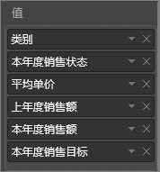
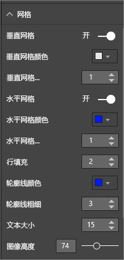
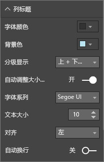
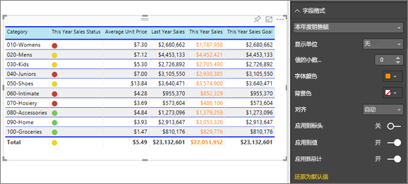
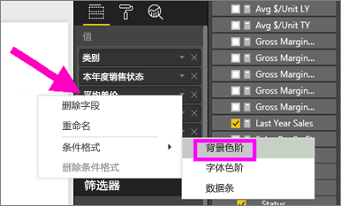
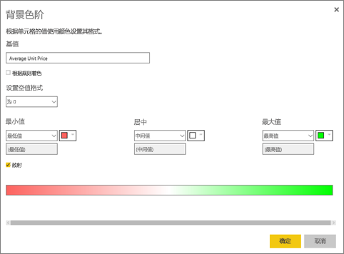
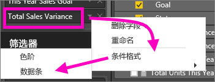
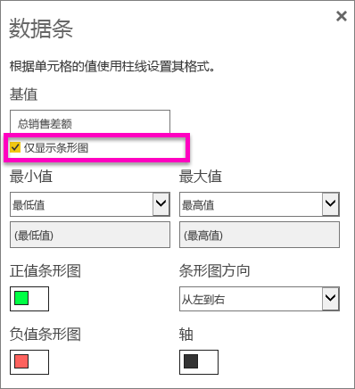

# 使用 Power BI 报表和仪表板中的表
表是以逻辑序列的行和列表示的包含相关数据的网格。 它还包含标头和合计行。 表格可以进行数量比较，可以在其中查看单个类别的多个值。 例如，该表显示了**类别**的 5 个不同的度量值。

## 何时使用表
在以下情况下选择表是不错的选择：

* 查看并比较详细数据和精确值（而不是可视化表示形式）时
* 以表格格式显示数据时
* 按类别显示数值数据时   

> [!NOTE]
> 如果表格具有过多值，请考虑将其转换为矩形图和/或使用向下钻取。
> 
> 
## 先决条件
 - Power BI 服务或 Power BI Desktop
 - 零售分析示例

## 创建表
我们将创建上图所示的表，以按项目类别显示销售值。 若要跟着介绍一起操作，请登录 Power BI 服务，并依次选择“获取数据”**\>“示例”“零售分析示例”>“连接”\>**，再选择“转至仪表板”。 创建可视化效果需要对数据集和报表拥有编辑权限。 幸运的是，所有 Power BI 示例都是可以编辑的。 如果报表已与你共享，则无法在报表中创建可视化效果。

1. 在左侧导航窗格中，选择“工作区 > 我的工作区”。    
2. 选择“数据集”选项卡，然后向下滚动到你刚才添加的“零售分析示例”数据集。  选择“创建报表”图标。
   
    
2. 在报表编辑器中，选择“项” > “类别”。  Power BI 会自动创建一个表，该表列出所有类别。
   
    
3. 选择“**销售 > 平均单价**和“**销售 > 去年销售额**”以及“**销售 > 本年度销售额**”，并选择所有 3 个选项（值、目标和状态）。   
4. 在可视化效果窗格中，找到“**值**”一列并拖放值，直到图表列的顺序与该页的第一个图像相匹配。  “值”列应如下所示。
   
    
5. 通过选择大头针图标将该表固定到仪表板  
   
     

## 设置表格格式
有多种设置表格格式的方法，这里只介绍其中几种。 若要了解其他格式设置选项，请打开“格式设置”窗格（滚动油漆刷图标 ）并进行浏览。

* 尝试设置表格中网格的格式。 此处我们已添加蓝色垂直网格，为行添加了空间，并稍微增加了边框和文本的大小。
  
    
  
    
* 对于列标题，我们更改了背景色、添加了边框，并增加了字体大小。 
  
    

  
    

* 甚至可以将格式设置应用于单个列和列标题。 首先展开“字段格式设置”，并从下拉列表选择要设置格式的列。 根据列值，字段格式设置允许你设置以下内容：显示单位、字体颜色、小数位数、背景、对齐方式等等。 在调整设置后，确定是否将这些设置应用到标头和总计行。

    

* 进行了一些其他格式设置后，最终表格如下。 由于格式设置选项较多，最好的了解方法是从默认信息入手，打开“格式设置”窗格 ，然后开始浏览。 
  
    

### 条件格式设置
一种类型的格式设置称为条件格式设置，可应用于 Power BI 服务或桌面的“可视化效果”窗格的“值”框的字段中。 

通过表的条件格式设置，可以根据单元格值指定自定义单元格背景色和字体颜色，包括使用渐变色。 

1. 在 Powr BI Desktop 服务或桌面的“可视化效果”窗格中，在要设置其格式的“值”框中，选择值旁边的向下箭头（或右键单击该字段）。 只能管理“字段”格的“值”区域中字段的条件格式。
   
    
2. 选择“背景色阶”。 在随即显示的对话框中，可以配置颜色，以及最小和最大值。 如果选择“散射”框，还可以配置一个可选的“居中”值。
   
    
   
    我们将某些自定义格式设置应用于“平均单价”值。 选择“散射”，添加一些颜色，然后选择“确定”。 
   
    
3. 将新字段添加到具有正值和负值的表中。  选择“销售额”>“总销售差额”。 
   
    
4. 添加数据条条件格式设置，方法是选择“总销售差额”旁边的向下箭头，然后选择“条件格式设置”>“数据条”。
   
    
5. 在出现的对话框中，依次设置“正值条形图”、“负值条形图”的颜色，在“仅显示数据条”旁边放置一个选中标记，并进行所需的任何其他更改。
   
    
   
    当选择“确定”时，数据条会替换表格中的数字值，使其更易于扫描。
   
    
6. 若要从可视化效果中删除条件格式，只需再次右键单击该字段，并选择**删除条件格式**即可。

> [!TIP]
> 还可以在“格式设置”窗格（滚动油漆刷图标）中进行条件格式设置。 选择要设置其格式的值，然后将“色阶”或“数据条”设置为“打开”以应用默认设置，或者，若要自定义设置，请选择“高级控件”。
> 
> 

## 调整表的列宽度的大小
有时 Power BI 会截断仪报表中或仪表板上的列标题。 若要显示整个列名称，将鼠标悬停在标题右侧的空白处以显示双箭头，然后选择并拖动它。

更多问题？ [尝试参与 Power BI 社区](http://community.powerbi.com/)

