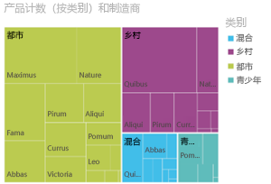
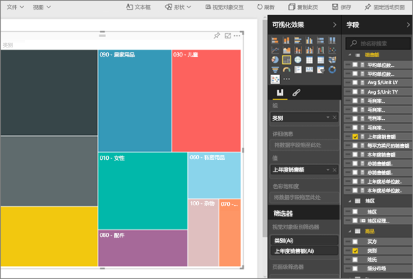
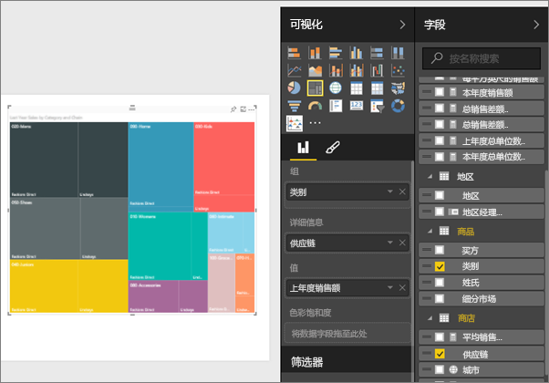
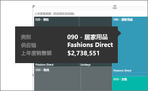
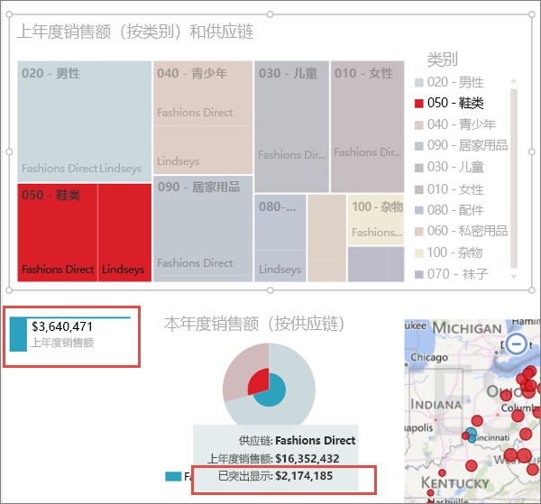

# Power BI 中的树状图
树状图将分层数据显示为一组嵌套矩形。  一个有色矩形（通常称为“分支”）代表层次结构中的一个级别，该矩形包含其他矩形（“叶”）。  根据所测量的定量值分配每个矩形的内部空间，从左上方（最大）到右下方（最小）按大小排列矩形。

例如，如果我正在分析销量，我可能会为服装类别设置顶层矩形（分支）：**城市**、**乡村**、**青年**和**混合**。  我的类别矩形将包含代表服装厂商的较小的矩形（叶），这些较小的矩形将根据销量设置大小和明暗度。  在上面提到的**城市**分支中，售出了大量 Maximus 服装，Natura 和 Fama 较少，Leo 则非常少。  因此，我的树状图的**城市**分支将具有代表 Maximus 的最大矩形（位于左上角）、代表 Natura 和 Fama 的稍微小点的矩形、代表所有其他销售的服装的大量其他矩形以及代表 Leo 的一个很小的矩形。  通过比较每个叶节点的大小和明暗度我可以比较其他服装类别销售的服装数量；矩形越大，颜色越深，则值越大。

## 何时使用树状图
当存在以下情况时，树状图是一个不错的选择：

* 要显示大量的分层数据。
* 条形图不能有效地处理大量值。
* 要显示每个部分与整体之间的比例。
* 要显示层次结构中指标在各个类别层次的分布的模式。
* 要使用大小和颜色编码显示属性。
* 要发现模式、离群值、最重要因素和异常。

### 先决条件
 - Power BI 服务或 Power BI Desktop
 - 零售分析示例

## 创建一个基本的树状图
想要先观看别人创建一个树状图？  跳到此视频的 2:10 处观看 Amanda 创建一个树状图。

<iframe width="560" height="315" src="https://www.youtube.com/embed/IkJda4O7oGs" frameborder="0" allowfullscreen></iframe>

或者，创建你自己的树状图。 以下说明使用零售分析示例。 若要跟着介绍一起操作，请登录 Power BI 服务（不是 Power BI Desktkop），并依次选择“获取数据”**\>“示例”“零售分析示例”\>\>“连接”“转至仪表板”\>**。 在报表中创建可视化效果需要对数据集和报表拥有编辑权限。 幸运的是，Power BI 示例是可以编辑的。 但如果有人与你共享报表，你将无法添加新的可视化效果。

1. 选择“总商店数”磁贴，打开“零售分析示例”报表。    
2. 打开[编辑视图](service-interact-with-a-report-in-editing-view.md)并选择“销售” > “上年度销售额”指标。   
      
3. 将图表转换为树状图。  
      
4. 将**项目**  >  **类别**拖放到**组**中。 Power BI 将创建一个树状图，其中矩形的大小反映总销售额，颜色代表类别。  实际上你已创建以可视化方式描述按类别的总销售额的相对大小的层次结构。  **男装**类的销售额最高，**袜**类销售额最低。   
      
5. 将“商店”  >  “连锁店”拖放到“详细信息”以完成树状图。 现在你可以按类别和连锁店比较上年度的销售额。   
   
   
   > [!NOTE]
   > 不能同时使用色彩饱和度和详细信息。
   > 
   > 
5. 将鼠标悬停在**连锁店**区域上方以显示**类别**中该部分的工具提示。  例如，将鼠标悬停在 **040-Juniors** 矩形中的 **Lindseys** 上方可显示青少年类别的 Lindsey 部分的工具提示。  
   
6. [将树状图添加为仪表板磁贴（固定视觉对象）](service-dashboard-tiles.md)。 
7. [保存报表](service-report-save.md)。

## 突出显示和交叉筛选
有关使用筛选器窗格的信息，请参阅[向报表添加筛选器](power-bi-report-add-filter.md)。

突出显示树状图中的一个类别或详细信息可交叉突出显示和交叉筛选报表页上的其他可视化效果…，反之亦然。 若要执行此操作，可将一些视觉对象添加到同一页，或者将树状图复制/粘贴到已有其他视觉对象的报表页面。

1. 在树状图中，选择一个类别或类别中的一个连锁店。  这样可以交叉突出显示页面上的其他可视化效果。 例如，选择 **050-Shoes** 可显示鞋子的上年度销售额为 $3,640,471，其中 $2,174,185 来自 Fashions Direct。  
   

2. 在按连锁店的上年度销售额饼图中，选择“Fashions Direct”切片，交叉筛选树状图。  
       

3. 若要管理图表相互交叉突出显示和交叉筛选的方式，请参阅 [Visualization interactions in a Power BI report（Power BI 报表中的可视化效果交互）](service-reports-visual-interactions.md)

## 后续步骤
[将可视化效果固定到仪表板](service-dashboard-pin-tile-from-report.md)  
[Power BI - 基本概念](service-basic-concepts.md)  

更多问题？ [尝试参与 Power BI 社区](http://community.powerbi.com/)  

