# Power BI 中的可视化效果类型
## Power BI 可视化效果
我们将添加新的可视化效果，请继续关注！

同时可以浏览 [Microsoft AppSource](https://appsource.microsoft.com/marketplace/apps?product=power-bi-visuals)，上面有不断扩增的[自定义视觉对象](power-bi-custom-visuals.md)列表。可以下载并在自己的仪表板和报表中使用这些视觉对象。 有创造性的点子？ [了解如何创建并将自己的视觉对象添加到此社区网站](developer/office-store.md)。  

## Power BI 中可用的可视化效果列表
所有这些可视化效果可以被添加到 Power BI 报表、在问答中指定和固定到仪表板。

### 分区图：基本（分层）和堆积
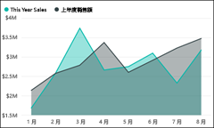

>[!TIP]
>基本分区图是在折线图的基础上增加了坐标轴和填充的线之间的区域。

有关详细信息，请参阅[教程：基本分区图](power-bi-visualization-basic-area-chart.md)。

### 条形图和柱形图
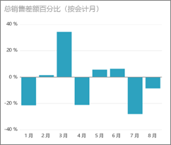 

 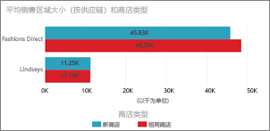

>[!TIP]
>条形图是查看跨不同类别的特定值的标准格式。

### 卡片：多行

### 卡片：一个数字

有关详细信息，请参阅[创建卡片（大数字磁贴）](power-bi-visualization-card.md)。

### 组合图
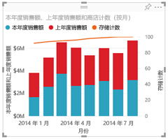

>[!TIP]
>组合图将柱形图和折线图结合在一起。 请在折线图和堆积柱形图和折线图和簇状柱形图中选择。

有关详细信息，请参阅 [Tutorial: Combo charts in Power BI（教程：Power BI 中的组合图）](power-bi-visualization-combo-chart.md)。

### 圆环图
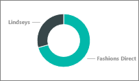

>[!TIP]
>圆环图类似于饼图。  它们显示部分与整体的关系。

有关详细信息，请参阅 [Tutorial: Doughnut charts in Power BI（教程：Power BI 中的圆环图）](power-bi-visualization-doughnut-charts.md)。

### 漏斗图
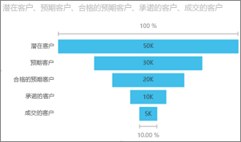

>[!TIP]
>漏斗图用于可视化包含阶段和从一个阶段按顺序流到下一个阶段的项目的流程。  当阶段之间存在顺序流时使用漏斗图，例如销售过程以潜在客户为起点，以购买完成为终点。

有关详细信息，请参阅 [Tutorial: Funnel Charts in Power BI（教程：Power BI 中的漏斗图）](power-bi-visualization-funnel-charts.md)。

### 仪表盘
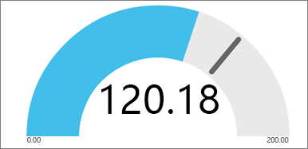

>[!TIP]
>显示相对于目标的当前状态。

有关详细信息，请参阅 [Tutorial: Gauge Charts in Power BI（教程：Power BI 中的仪表盘）](power-bi-visualization-radial-gauge-charts.md)。

### KPI
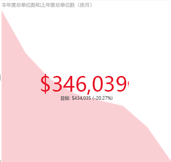

>[!TIP]
>显示可衡量目标的进程。

有关详细信息，请参阅[教程：Power BI 中的 KPI](power-bi-visualization-kpi.md)。

### 折线图
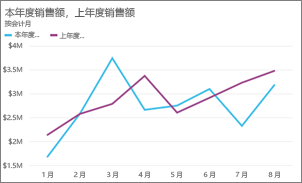

>[!TIP]
>强调一系列值的整体形状，通常以时间的推移来显示。

### 地图：基本地图
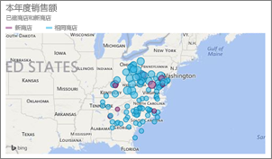

>[!TIP]
>用于将分类和定量信息与空间位置相关联。

有关详细信息，请参阅[映射视觉对象的提示和技巧](power-bi-map-tips-and-tricks.md)。

### 地图：ArcGIS 地图
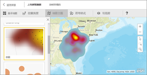

有关详细信息，请参阅[教程：Power BI 中的 ArcGIS 地图](power-bi-visualization-arcgis.md)。

### 地图：着色地图（地区分布图）
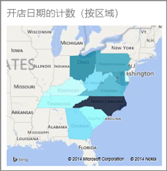

>[!TIP]
>颜色越深表示值越大。

有关详细信息，请参阅 [Tutorial: Filled Maps in Power BI（教程：Power BI 中的着色地图）](power-bi-visualization-filled-maps-choropleths.md)。

### 矩形图
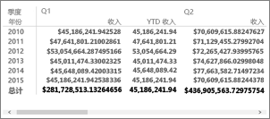

### 饼图
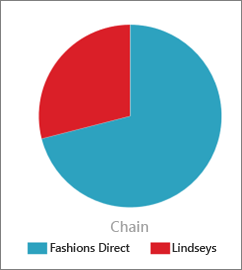

### 散点图和气泡图
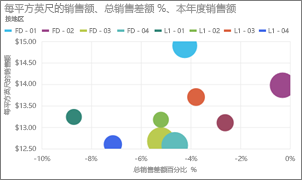

>[!TIP]
>显示两个（散点）或三个（气泡）量化指标之间的关系 -- 是否存在关系，按什么顺序等等

有关详细信息，请参阅 [Tutorial: Scatter Charts in Power BI（教程：Power BI 中的散点图）](power-bi-visualization-scatter.md)。

### 切片器
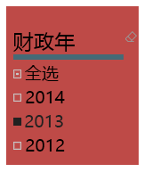

有关详细信息，请参阅 [Tutorial: Slicers in Power BI（教程：Power BI 中的切片器）](power-bi-visualization-slicers.md)。

### 独立图像

有关详细信息，请参阅 [Add an image widget to a dashboard（将图像小组件添加到仪表板）](service-dashboard-add-widget.md)。

### 表格
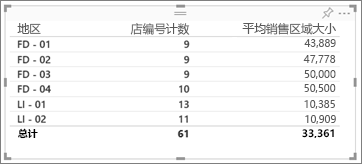

>[!TIP]
>适用于多种类别项目之间的定量比较。

有关详细信息，请参阅[使用 Power BI 中的表](power-bi-visualization-tables.md)。

### 树状图
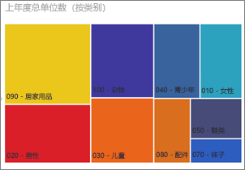

有关详细信息，请参阅 [Tutorial: Treemaps in Power BI（教程：Power BI 中的树状图）](power-bi-visualization-treemaps.md)。

>[!TIP]
>包含带颜色的矩形的图，用矩形大小表示值。  具有层次结构，主矩形内可以嵌套矩形。

### 瀑布图

>[!TIP]
>瀑布图显示随着值的增加或减少的不断变化的总数。

有关详细信息，请参阅 [Tutorial Waterfall Charts in Power BI（教程：Power BI 中的瀑布图）](power-bi-visualization-waterfall-charts.md)。

## 告知问答要使用哪个可视化效果
使用 Power BI 问答键入自然语言查询时，可以在查询中指定可视化效果类型。  例如：

“***以树状图表示的每个州的销售额***”

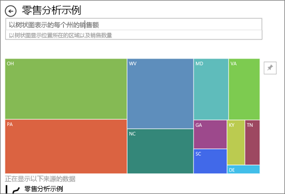

## 后续步骤
[Power BI 报表中的可视化效果](power-bi-report-visualizations.md)    
[sqlbi.com 中正确的视觉对象引用](http://www.sqlbi.com/wp-content/uploads/videotrainings/dashboarddesign/visuals-reference-may2017-A3.pdf)

[Power BI 中的报表](service-reports.md)

[Power BI - 基本概念](service-basic-concepts.md)

更多问题？ [尝试参与 Power BI 社区](http://community.powerbi.com/)

