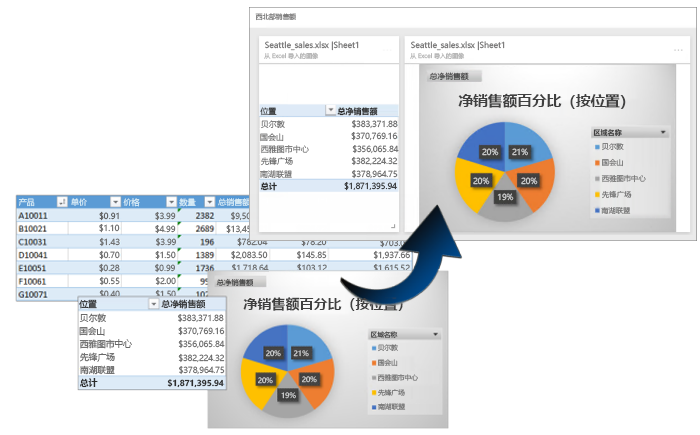
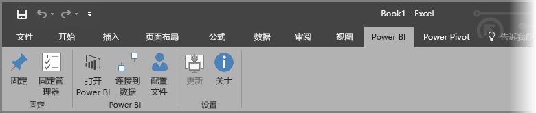
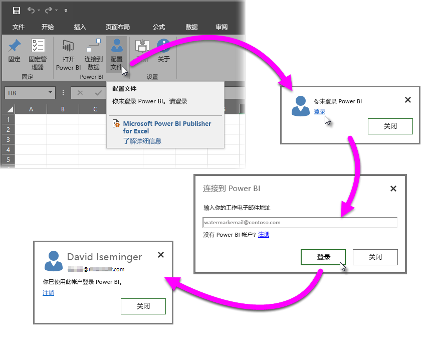
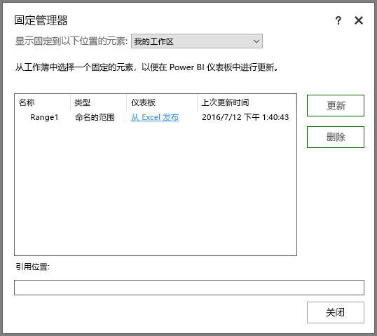
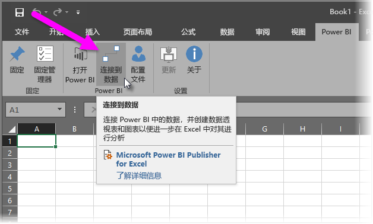
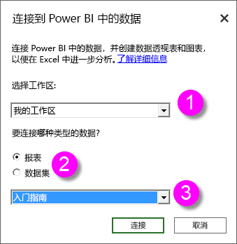
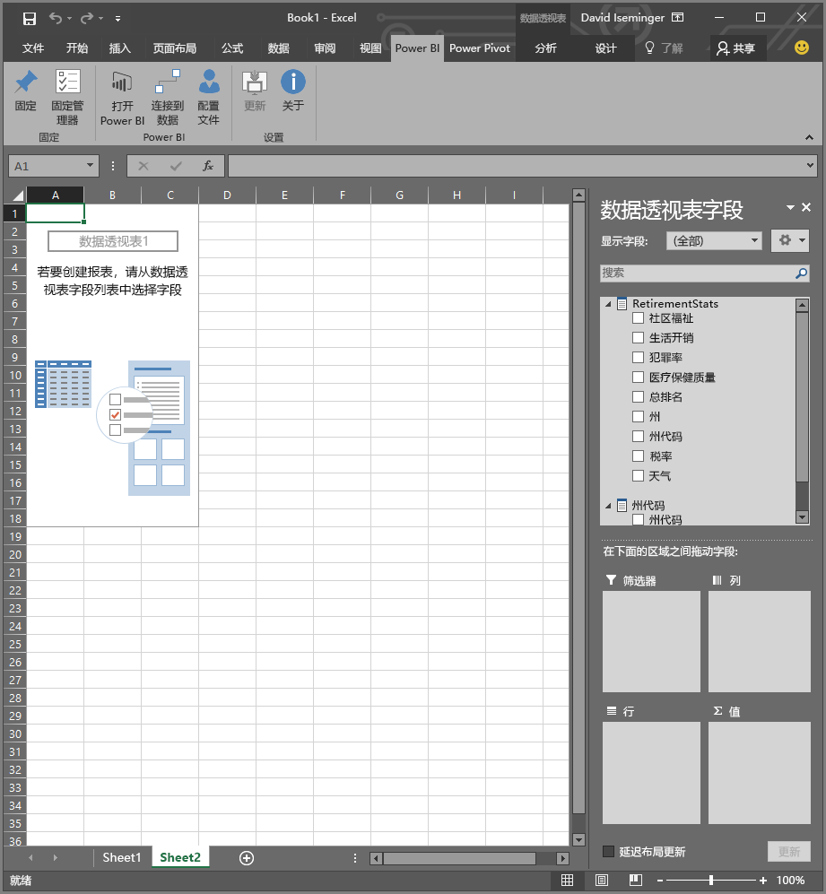
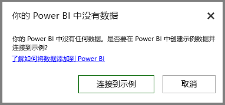

# 适用于 Excel 的 Power BI 发布服务器
使用 Microsoft **Power BI Publisher for Excel**，可以在 Excel 中获取最重要的数据洞察快照，如数据透视表、图表和区域，并将它们固定到 Power BI 中的仪表板。

你可以固定什么？ Excel 工作表中几乎所有项目。 你可以从一个简单的工作表或表、数据透视表或数据透视图、图例和图像、文本中选择单元格区域。

你不能固定：不能在 Power View 工作表中固定 3D 地图或可视化效果。 你还可以固定一些元素，但是固定这些元素意义不大，如切片器或时间线筛选器。

当固定 Excel 中的元素时，将在 Power BI 中的新仪表板或现有的仪表板中添加新的磁贴。 新的磁贴是快照，因此它不是动态的，但是仍可以更新它。 例如，如果更改已固定的数据透视表或图表，那么 Power BI 中的仪表板磁贴不会自动更新，但是仍可以使用**固定管理器**来更新已固定的元素。 你将在以下章节中了解有关**固定管理器**的详细信息。

## 下载和安装
Power BI Publisher for Excel 是一个可以下载并在 Microsoft Excel 2007 和更高版本的桌面版上安装的加载项。

[下载 Power BI Publisher for Excel](http://go.microsoft.com/fwlink/?LinkId=715729)

安装此发布服务器后，你会在 Excel 中看到一个新的 **Power BI** 功能区，可以在其中登录（或注销）Power BI、将元素固定到仪表板，以及管理已固定的元素。

默认情况下已启用 **Power BI Publisher for Excel** 外接程序，但是如果因为某些原因未在 Excel 中看见 Power BI 功能区选项卡，则需要启用它。 单击**文件**  >  **选项**  >  **加载项**  >  **COM 加载项**。选择“Microsoft Power BI Publisher for Excel”。

## 将区域固定到仪表板
你可以从工作表中选择任何单元格区域，然后将该区域的快照固定到 Power BI 中的现有或新的仪表板。 也可以将同一个快照固定到多个仪表板。

若要开始操作，需确保已登录到 Power BI。

1. 从 Excel 中的“Power BI”功能区选项卡中选择“配置文件”。 如果已登录到 Power BI，你将看到一个对话框，其中显示了当前的登录帐户。 如果这正是你想使用的帐户，那太好了 — 请转到下一组步骤，以固定你的区域。 如果想要使用其他 Power BI 帐户，请选择“注销”。 如果尚未登录，请转到下一步（步骤 2）。
   
   
2. 如果你尚未登录，请选择在从 Excel 中的“Power BI”功能区选项卡中选择“配置文件”时所显示的“登录”链接，接着在“连接到 Power BI”对话框中键入要使用的 Power BI 帐户的电子邮件地址，然后选择“登录”。
   
   

登录后，按照下列步骤将区域固定到仪表板：

1. 在 Excel 中，选择“Power BI”功能区选项卡即可看到“固定”功能区按钮。
2. 从 Excel 工作簿中选择一个区域。
3. 从“Power BI”功能区中单击“固定”按钮，以显示“固定到仪表板”对话框。 如果你尚未登录 Power BI，系统将提示你登录。 从“工作区”下拉列表中选择一个工作区。 如果想要固定到自己的仪表板，请确认选择的是**我的工作区**。 如果想要固定到组工作区中的仪表板，请从下拉列表中选择组。
4. 选择是想固定到现有仪表板还是创建新仪表板。
5. 单击“确定”将所选内容固定到仪表板。
6. 在“固定到仪表板”中，选择工作区中的现有仪表板或创建一个新的仪表板，然后单击“确定”按钮。
   
   

## 将图表固定到仪表板
只需单击图表，然后单击“固定”图标 。

## 管理固定的元素
使用**固定管理器**，可以更新（刷新）Power BI 中已固定元素的关联磁贴。 你还可以对已固定到 Power BI 中的仪表板的元素取消固定。

若要更新仪表板中的磁帖，请在**固定管理器**中选择一个或多个元素，然后选择“更新”。

若要删除 Excel 中已固定的元素和仪表板中相关联的磁贴之间的映射，请单击“删除”。 选择“删除”不会从 Excel 的工作表中删除元素，也不会从仪表板中删除相关联的磁贴。 你删除的是固定或两者之间的映射。 已删除的元素将不再显示在**固定管理器**中。 如果再次固定该元素，它将显示为新的磁贴。

若要从仪表板中删除固定的元素（磁贴），需要在 Power BI 中执行此操作。 在你想要删除的磁贴中，选择“打开菜单”图标 ，然后选择“删除磁贴   ”。

## 连接到 Power BI 中的数据
从 2016 年 7 月发行的 **Power BI Publisher for Excel** 起（包括前面链接到的最新版本），你可以直接连接到 Power BI 服务中的数据，并在 Excel 中使用数据透视表和数据透视图分析该数据。 借助此功能，你可以轻松地将 Power BI 数据和 Excel 搭配使用，以分析对你而言最重要的数据。

改进功能包括：

* 将在每个版本中自动更新连接到 Power BI 中的数据所需的任何驱动程序 — 无需自行安装或管理这些驱动程序。
* 不再需要下载 .odc 文件来创建连接 — 在你选择要使用的报表或数据集后，**Power BI Publisher for Excel** 将自动创建连接。
* 现在可以在同一工作簿中创建多个连接和数据透视表
* 对错误进行了改进并且特定于 **Power BI Publisher for Excel**，而不是使用默认的 Excel 消息

### 如何连接到 Excel 中的 Power BI 数据
若要使用 **Power BI Publisher for Excel** 连接到 Power BI 数据，请执行下面这些简单的步骤：

1. 确保你已登录到 Power BI。 本文前面部分提供了描述如何登录（或使用其他帐户登录）的步骤。
2. 通过要使用的帐户登录到 Power BI 之后，从 Excel 中的“Power BI”功能区选项卡中选择“连接到数据”。
   
   
3. Excel 将使用 HTTPS 连接连接到 Power BI，并显示“连接 Power BI 中的数据”对话框，你可以在其中选择要从中选择数据的工作区（下图中的 1），并选择要连接到的数据类型（“报表”或“数据集”）(2)，该对话框中有一个下拉列表 (3)，你可以通过下拉列表选择要连接到的可用报表或数据集。
   
   
4. 在完成选择后，从“连接 Power BI 中的数据”对话框中选择“连接”，Excel 将准备一个数据透视表，并显示“数据透视表字段”窗格，你可以从该窗格中已连接的 Power BI 数据中选择字段，并创建表或图表来帮助你分析数据。
   
   

如果 Power BI 中没有任何数据，Excel 将进行检测并创建示例数据，以便你连接并尝试执行操作。

在此版 **Power BI Publisher for Excel** 中，需要注意以下几个事项：

* **共享数据** — 已共享给你、但不会直接显示在 Power BI 中且在“连接到数据”中不可用的数据。
* **本地 SSAS** — 如果所选数据集来自本地 SQL Server Analysis Services (SSAS)，并且 Power BI 中的数据集使用 DirectQuery 来访问数据，**Power BI Publisher for Excel** 将通过本地网络连接连接到该数据，而不会通过 Power BI 连接到该数据。 同样地，尝试连接到此类数据集的任何用户都必须连接到本地网络，并且在经过用于存储数据的 Analysis Services 实例所使用的身份验证方法的身份验证后，才能访问该数据。
* **所需的驱动程序** - **Power BI Publisher for Excel** 会自动安装运行此功能所需的所有驱动程序。 在这些自动安装的驱动程序之中，Excel OLE DB 驱动程序用于 Analysis Services；如果该驱动程序被用户删除（或由于其他任何原因而被删除），到 Power BI 数据的连接将不起作用。
* **数据集必须有度量值** - 数据集必须定义模型度量值，这样 Excel 才能在数据透视表中将度量值作为值来处理，并正确分析数据。 详细了解[度量值](desktop-measures.md)。
* **支持组** - 与指定组以外的人共享的数据集不受支持，并且不能连接。
* **免费订阅与专业订阅** - 与组相关的活动对于 Power BI 免费用户不受支持，因此他们将不会其工作区中看到任何与组共享的数据集和报表。
* **共享的报表或数据集** - 不能连接与你共享的报表或数据集。
* **使用表而不是数据模型** - 通过从 Excel 仅导入表（不带数据模型）创建的数据集和报表当前不受支持，并且不能连接。

在创建了引人注目的图表或其他视觉效果（例如一系列数据）后，可以轻松地将它们固定到 Power BI 中的仪表板，如本文前面部分中所述。

## 相关的文章
有多种方法可以将 Excel 和 Power BI 一起使用，并获取两者最大的价值。 有关详细信息，请参阅以下文章。

* [在 Excel 中分析](service-analyze-in-excel.md)
* [“在 Excel 中分析”疑难解答](desktop-troubleshooting-analyze-in-excel.md)

