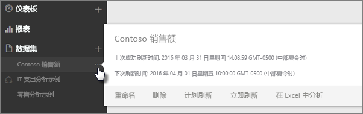
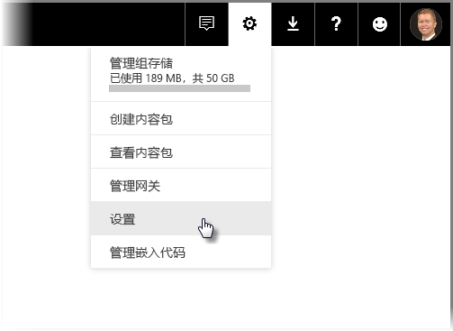
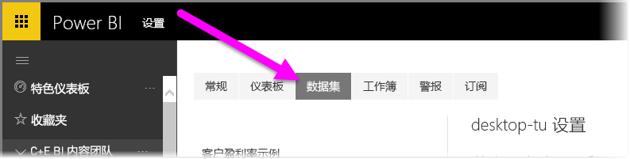
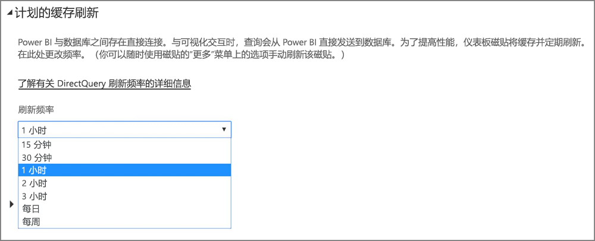

# Power BI 中的数据刷新
确保始终获得最新数据对于制定正确决策通常是至关重要的。 你可能已在 Power BI 中使用“获取数据”连接到并上载一些数据，创建了一些报表和仪表板。 现在，你要确保数据确实是最新且最好的。

在许多情况下，完全无需执行任何操作。 某些数据（如来自 Salesforce 或 Marketo 内容包的数据）会自动为你刷新。 如果连接使用了实时连接或 DirectQuery，则数据会更新为最新状态。 但是在其他情况下，与连接到外部联机或本地数据源的 Excel 工作簿或 Power BI Desktop 文件一样，需要手动刷新或设置刷新计划，以便 Power BI 可以为你刷新报表和仪表板中的数据。

本文以及一些其他文章旨在帮助你了解 Power BI 中的数据刷新的实际工作原理、是否需要设置刷新计划以及成功刷新数据所需要完成的工作。

## 了解数据刷新
设置刷新之前，请务必了解所刷新的内容以及在何处获取数据。

数据源是在报表和仪表板中浏览的数据的实际来源；例如，联机服务（如 Google Analytics 或 QuickBooks）、云中的数据库（如 Azure SQL 数据库）或者自己组织中的本地计算机或服务器上的数据库或文件。 这些都是数据源。 数据源的类型确定如何刷新其中的数据。 稍后我们会在[可以刷新的内容](#what-can-be-refreshed)部分中介绍每种数据源类型的刷新。

使用“获取数据”连接到数据以及从内容包、文件上载数据或是连接到实时数据源时，会自动在 Power BI 中创建数据集。 在 Power BI Desktop 和 Excel 2016 中，还可以将文件直接发布到 Power BI 服务（就如同使用“获取数据”一样）。

在每种情况下，都会在 Power BI 服务中的“我的工作区”（或“组”）容器中创建并显示数据集。 对数据集选择**省略号 (...)** 时，可以浏览报表中的数据、编辑设置以及设置刷新。

数据集可以从一个或多个数据源获取数据。 例如，可以使用 Power BI Desktop 从组织中的 SQL 数据库中获取数据，并从联机 OData 源获取其他数据。 随后在将文件发布到 Power BI 中时，会创建单个数据集，但是它同时包含用于 SQL 数据库和 OData 源的数据源。

数据集包含有关数据源的信息、数据源凭据以及（在大多数情况下）从数据源复制的数据的子集。 在报表和仪表板中创建可视化效果时，你会查看数据集中的数据，或对于实时连接（如 Azure SQL 数据库），数据集会定义你直接从数据源查看的数据。 对于与 Analysis Services 之间的实时连接，数据集定义直接来自 Analysis Services。

> *刷新数据时，会从数据源更新存储在 Power BI 中的数据集中的数据。此刷新是完全刷新，不是增量刷新。*
> 
> 

每次刷新数据集中的数据时（无论是使用“立即刷新”还是通过设置刷新计划），Power BI 都会使用数据集中的信息连接到为其定义的数据源，查询更新的数据，然后将更新的数据加载到数据集中。 报表或仪表板中基于这些数据的任何可视化效果都会自动更新。

继续讨论之前，有其他一些需要了解的重要事项：

> *无论以何种频率刷新数据集，或是以何种频率查看实时数据，都必须首先更新数据源中的数据。*
> 
> 

大多数组织一天处理一次数据（通常在晚上）。 如果针对从连接到本地数据库的 Power BI Desktop 文件创建的数据集计划刷新，并且 IT 部门在晚上对该 SQL 数据库运行一次处理，则只需将计划的刷新设置为一天运行一次。 例如，对数据库进行处理之后，但是在你进入工作之前。 当然，并非总是这种情况。 Power BI 提供了许多方法来连接到经常更新甚至是实时更新的数据源。

## 刷新的类型
在 Power BI 中进行的刷新有四种主要类型。 包刷新、模型/数据刷新、磁贴刷新和视觉对象容器刷新。

### 包刷新
这会在 Power BI 服务与 OneDrive（或 SharePoint Online）之间同步 Power BI Desktop（或 Excel）文件。 这不会从原始数据源请求数据。 Power BI 中的数据集只使用 OneDrive（或 SharePoint Online）中的文件内容进行更新。

### 模型/数据刷新
这指的是在 Power BI 服务中使用来自原始数据源的数据刷新数据集。 这使用计划的刷新或立即刷新来进行。 对于本地数据源，这需要网关。

### 磁贴刷新
在数据更改之后，磁贴刷新会为仪表板上的磁贴视觉对象更新缓存。 这大约每十五分钟进行一次。 还可以通过选择仪表板右上角的“省略号 (...)”并选择“刷新仪表板磁贴”来强制进行磁贴刷新。

有关常见磁贴刷新错误的详细信息，请参阅[磁贴错误故障排除](refresh-troubleshooting-tile-errors.md)。

### 视觉对象容器刷新
在数据更改之后，刷新视觉对象容器会在报表中更新缓存的报表视觉对象。

## 可以刷新的内容
在 Power BI 中，通常使用“获取数据”从位于本地驱动器、OneDrive 或 SharePoint Online 上的文件导入数据、从 Power BI Desktop 发布报表或直接连接到你自己组织的云环境中的数据库。 可以刷新 Power BI 中的几乎任何数据，不过是否需要则取决于创建数据集的方式以及它连接到的数据源。 我们来看看在每种情况下如何刷新数据。

继续讨论之前，下面是一些需要了解的重要定义：

**自动刷新** - 这表示无需进行任何用户配置，数据集即可定期刷新。 由 Power BI 为你配置数据刷新设置。 对于联机服务提供程序，刷新通常一天进行一次。 对于从 OneDrive 加载的文件，大约每小时针对不是来自外部数据源的数据进行一次自动刷新。 虽然可以配置不同的计划刷新设置以及手动刷新，不过可能不需要。

**用户配置的手动或计划的刷新** – 这表示可以使用“立即刷新”来手动刷新数据集，或是使用数据集设置中的“计划刷新”来设置刷新计划。 对于连接到外部联机和本地数据源的 Power BI Desktop 文件和 Excel 工作簿，需要这种类型的刷新。

> [!NOTE]
> 配置计划刷新的时间后，可能会滞后长达 1 小时才能开始刷新数据。
> 
> 

**实时/DirectQuery** – 这表示 Power BI 与数据源之间存在实时连接。 对于本地数据源，管理员需要在企业网关中配置数据源，但是可能不需要用户交互。

> [!NOTE]
> 为了增强性能，具有使用 DirectQuery 连接的数据的仪表板会自动更新。 你也可以随时使用磁贴上的“**更多**”菜单手动刷新该磁贴。
> 
> 

## 本地文件和 OneDrive 或 SharePoint Online 上的文件
对于连接到外部联机或本地数据源的 Power BI Desktop 文件和 Excel 工作簿，支持数据刷新。 这只会为 Power BI 服务中的数据集刷新数据。 它不会更新本地文件。

将文件保留在 OneDrive（或 SharePoint Online）上并从 Power BI 连接到它们可提供非常高的灵活性。 不过与这一灵活性随之而来的，是它也成为最难以理解的情况之一。 针对存储在 OneDrive（或 SharePoint Online）中的文件的计划的刷新与包刷新不同。 可以在[刷新的类型](#types-of-refresh)部分中了解详细信息。

### Power BI Desktop 文件
| **数据源** | **自动刷新** | **用户配置的手动或计划的刷新** | **需要网关** |
| --- | --- | --- | --- |
| “获取数据”（在功能区中）用于连接到任何列出的联机数据源并从中查询数据。 |否 |是 |否（见下文） |
| “获取数据”用于连接到并浏览实时 Analysis Services 数据库。 |是 |否 |是 |
| “获取数据”用于连接到并浏览支持的本地 DirectQuery 数据源。 |是 |否 |是 |
| “获取数据”用于连接到 Azure SQL 数据库、Azure SQL 数据仓库、Azure HDInsight Spark 并从中查询数据。 |是（每小时） |否 |否 |
| “获取数据”用于连接到任何列出的本地数据源（Hadoop 文件 (HDFS) 和 Microsoft Exchange 除外）并从中查询数据。 |否 |是 |是 |

> [!NOTE]
> 使用 [**Web.Page**](https://msdn.microsoft.com/library/mt260924.aspx) 功能时，如果已重新发布 2016 年 11 月 18 日之后的数据集或报表，将需要网关。
> 
> 

有关详细信息，请参阅[刷新从 OneDrive 上的 Power BI Desktop 文件创建的数据集](refresh-desktop-file-onedrive.md)。

### Excel 工作簿
| **数据源** | **自动刷新** | **用户配置的手动或计划的刷新** | **需要网关** |
| --- | --- | --- | --- |
| 未加载到 Excel 数据模型中的工作表中的数据表。 |是，每小时*（仅限 OneDrive/SharePoint Online）* |仅限手动*（仅限 OneDrive/SharePoint Online）* |否 |
| 链接到 Excel 数据模型中的表（链接表）的工作表中的数据表。 |是，每小时*（仅限 OneDrive/SharePoint Online）* |仅限手动*（仅限 OneDrive/SharePoint Online）* |否 |
| Power Query* 用于连接到任何列出的联机数据源并从中查询数据，以及将数据加载到 Excel 数据模型中。 |否 |是 |否 |
| Power Query* 用于连接到任何列出的本地数据源（Hadoop 文件 (HDFS) 和 Microsoft Exchange 除外）并从中查询数据，以及将数据加载到 Excel 数据模型中。 |否 |是 |是 |
| Power Pivot 用于连接到任何列出的联机数据源并从中查询数据，以及将数据加载到 Excel 数据模型中。 |否 |是 |否 |
| Power Pivot 用于连接到任何列出的本地数据源并从中查询数据，以及将数据加载到 Excel 数据模型中。 |否 |是 |是 |

*\*Power Query 在 Excel 2016 中名为“获取并转换数据”。*

有关详细信息，请参阅[刷新从 OneDrive 上的 Excel 工作簿创建的数据集](refresh-excel-file-onedrive.md)。

### OneDrive 或 SharePoint Online 上的逗号分隔值 (.csv) 文件
| **数据源** | **自动刷新** | **用户配置的手动或计划的刷新** | **需要网关** |
| --- | --- | --- | --- |
| 简单的逗号分隔值 |是，每小时 |仅限手动 |否 |

有关详细信息，请参阅[刷新从 OneDrive 上的逗号分隔值 (.csv) 文件创建的数据集](refresh-csv-file-onedrive.md)。

## 内容包
Power BI 中有两种类型的内容包：

**来自联机服务的内容包**：如 Adobe Analytics、SalesForce 和 Dynamics CRM Online。 从联机服务创建的数据集一天自动刷新一次。 尽管可能不需要，不过可以手动刷新或设置刷新计划。 由于联机服务处于云中，因此不需要网关。

**组织内容包**：由你自己组织中的用户创建并共享。 内容包使用者无法设置刷新计划或手动刷新。 只有内容包创建者才能为内容包中的数据集设置刷新。 刷新设置随数据集一起继承。

### 来自联机服务的内容包
| **数据源** | **自动刷新** | **用户配置的手动或计划的刷新** | **需要网关** |
| --- | --- | --- | --- |
| “获取数据”&gt;“服务”中的联机服务 |是 |是 |否 |

### 组织内容包
包含在组织内容包中的数据集的刷新功能取决于数据集。 请参阅上面与本地文件、OneDrive 或 SharePoint Online 相关的信息。

若要了解详细信息，请参阅[组织内容包简介](service-organizational-content-pack-introduction.md)。

## 与本地数据源之间的实时连接和 DirectQuery
借助本地数据网关，可以从 Power BI 向本地数据源发出查询。 与可视化效果交互时，查询会从 Power BI 直接发送到数据库。 随后会返回更新的数据并更新可视化效果。 由于 Power BI 与数据库之间存在直接连接，因此无需计划刷新。

使用实时连接连接到 SQL Service Analysis Services (SSAS) 数据源与使用 DirectQuery 不同，与 SSAS 源的实时连接可以针对缓存运行，即使是在加载报表后，也不例外。 此行为提升了报表的加载性能。 可以使用“刷新”按钮，从 SSAS 数据源请求获取最新数据。 SSAS 数据源的所有者可以为数据集配置计划缓存刷新频次，确保报表按照所需的频次不断更新。 

使用本地数据网关配置数据源时，可以将该数据源用作计划的刷新选项。 这会代替使用个人网关。

> [!NOTE]
> 如果为数据集配置了实时或 DirectQuery 连接，数据集大约会每小时刷新一次，或在发生数据交互时进行刷新。 可以在 Power BI 服务的“计划的缓存刷新”选项中手动调整刷新频率。
> 
> 

| **数据源** | **实时/DirectQuery** | **用户配置的手动或计划的刷新** | **需要网关** |
| --- | --- | --- | --- |
| Analysis Services 表格 |是 |是 |是 |
| Analysis Services 多维 |是 |是 |是 |
| SQL Server |是 |是 |是 |
| SAP HANA |是 |是 |是 |
| Oracle |是 |是 |是 |
| Teradata |是 |是 |是 |

若要了解详细信息，请参阅[本地数据网关](service-gateway-onprem.md)。

## 云中的数据库
使用 DirectQuery 时，Power BI 与云中的数据源之间存在直接连接。 与可视化效果交互时，查询会从 Power BI 直接发送到数据库。 随后会返回更新的数据并更新可视化效果。 而且，由于 Power BI 服务和数据源都处于云中，因此不需要个人网关。

如果可视化效果没有发生用户交互，数据大约会每小时自动刷新一次。 可以使用“计划的缓存刷新”选项更改刷新频率，并能设置刷新频率。

若要设置刷新频率，请选择 Power BI 服务右上角的**齿轮**图标，然后选择“**设置**”。

此时，你会看到“**设置**”页，可以在其中选择要调整其刷新频率的数据集。 在此页上，选择最上面一列中的“**数据集**”选项卡。

选择数据集，然后右窗格中会显示此数据集适用的一组选项。 对于 DirectQuery/实时连接，可以使用相关的下拉菜单设置刷新频率（从 15 分钟刷新一次到每周刷新一次），如下图所示。

| **数据源** | **实时/DirectQuery** | **用户配置的手动或计划的刷新** | **需要网关** |
| --- | --- | --- | --- |
| SQL Azure 数据仓库 |是 |是 |否 |
| HDInsight 上的 Spark |是 |是 |否 |

若要了解详细信息，请参阅 [Azure 和 Power BI](service-azure-and-power-bi.md)。

## 实时仪表板
实时仪表板使用 Microsoft Power BI REST API 或 Microsoft Stream Analytics 来确保数据是最新状态。 由于实时仪表板不需要用户配置刷新，因此它们不在本文讨论范围之内。

| **数据源** | **自动** | **用户配置的手动或计划的刷新** | **需要网关** |
| --- | --- | --- | --- |
| 使用 Power BI Rest API 或 Microsoft Stream Analytics 开发的自定义应用 |是，实时流式处理 |否 |否 |

若要了解详细信息，请参阅[在 Power BI 中创建实时仪表板](https://msdn.microsoft.com/library/mt267603.aspx)。

## 配置计划的刷新
若要了解如何配置计划的刷新，请参阅[配置计划的刷新](refresh-scheduled-refresh.md)

## 常见数据刷新方案
有时，了解 Power BI 中的数据刷新的最佳方法是查看示例。 下面是一些较常见的数据刷新方案：

### 包含数据表的 Excel 工作簿
你的 Excel 工作簿包含多个数据表，但它们都未加载到 Excel 数据模型中。 你使用“获取数据”将工作簿文件从本地驱动器上载到 Power BI 中，然后创建一个仪表板。 但是，现在你在本地驱动器上对工作簿的几个表进行了一些更改，要使用新数据在 Power BI 中更新仪表板。

遗憾的是，此方案中不支持刷新。 若要为仪表板刷新数据集，你必须重新上载工作簿。 但是，有一个确实很棒的解决方案：将工作簿文件置于 OneDrive 或 SharePoint Online 上！

连接到 OneDrive 或 SharePoint Online 上的文件时，报表和仪表板会按照文件中的形式显示数据。 在此例中，这是你的 Excel 工作簿。 Power BI 会大约每小时自动检查文件是否存在更新。 如果对工作簿（存储在 OneDrive 或 SharePoint Online 中）进行了更改，则这些更改会在一小时内反映在仪表板和报表中。 完全无需设置刷新。 但是，如果需要在 Power BI 中立即看到更新，则可以使用“立即刷新”来手动刷新数据集。

有关详细信息，请参阅 [Power BI 中的 Excel 数据](service-excel-workbook-files.md)或[刷新根据 OneDrive 上 Excel 工作簿创建的数据集](refresh-excel-file-onedrive.md)。

### Excel 工作簿连接到公司中的 SQL 数据库
我们假设你在本地计算机上具有一个名为 SalesReport.xlsx 的 Excel 工作簿。 Excel 中的 Power Query 用于连接到公司中服务器上的 SQL 数据库，并查询加载到数据模型中的销售数据。 每天早上，你会打开该工作簿并点击“刷新”来更新数据透视表。

现在你要在 Power BI 中浏览销售数据，因此你使用“获取数据”连接到并上载本地驱动器中的 SalesReport.xlsx 工作簿。

在这种情况下，可以手动刷新 SalesReport.xlsx 数据集中的数据或设置刷新计划。 因为数据实际来自公司中的 SQL 数据库，所以你需要下载并安装网关。 安装并配置了网关之后，你需要进入 SalesReport 数据集的设置并登录数据源；但是，你只需要执行此操作一次。 随后可以设置刷新计划，以便 Power BI 自动连接到 SQL 数据库并获取更新的数据。 报表和仪表板也会自动更新。

> [!NOTE]
> 此操作仅会更新 Power BI 服务中数据集内的数据。 本地文件不会作为刷新的一部分进行更新。
> 
> 

若要了解详细信息，请参阅 [Power BI 中的 Excel 数据](service-excel-workbook-files.md)、[Power BI Gateway - Personal](personal-gateway.md)、[本地数据网关](service-gateway-onprem.md)、[刷新从本地驱动器上的 Excel 工作簿创建的数据集](refresh-excel-file-local-drive.md)。

### 包含来自 OData 源的数据的 Power BI Desktop 文件
在此例中，使用 Power BI Desktop 中的“获取数据”连接到 OData 源并从中导入人口普查数据。  在 Power BI Desktop 中创建多个报表，随后将文件命名为 WACensus 并将它保存在公司中的共享上。 随后将该文件发布到 Power BI 服务。

在这种情况下，可以手动刷新 WACensus 数据集中的数据或设置刷新计划。 因为数据源中的数据来自联机 OData 源，所以无需安装网关，但需要进入 WACensus 数据集的设置并登录 OData 数据源。 随后可以设置刷新计划，以便 Power BI 自动连接到 OData 源并获取更新的数据。 报表和仪表板也会自动更新。

若要了解详细信息，请参阅[从 Power BI Desktop 发布](desktop-upload-desktop-files.md)、[刷新从本地驱动器上的 Power BI Desktop 文件创建的数据集](refresh-desktop-file-local-drive.md)、[刷新从 OneDrive 上的 Power BI Desktop 文件创建的数据集](refresh-desktop-file-onedrive.md)。

### 来自组织中其他用户的共享内容包
你已连接到一个组织内容包。 它包含一个仪表板、几个报表和一个数据集。

在此方案中，你无法为数据集设置刷新。 创建内容包的数据分析师负责确保根据使用的数据源来刷新数据集。

如果未更新内容包中的仪表板和报表，则你要与创建内容包的数据分析师进行讨论。

若要了解详细信息，请参阅[组织内容包简介](service-organizational-content-pack-introduction.md)、[使用组织内容包](service-organizational-content-pack-copy-refresh-access.md)。

### 来自联机服务提供程序（如 Salesforce）的内容包
在 Power BI 中，你已使用“获取数据”连接到联机服务提供程序（如 Salesforce）并从中导入数据。 好了，现在没有太多工作要做。 Salesforce 数据集自动计划为一天刷新一次。 

与大多数联机服务提供程序一样，Salesforce 一天更新数据一次（通常在夜间）。 可以手动刷新 Salesforce 数据集，或设置刷新计划，但是这不是必需的，因为 Power BI 会自动刷新数据集，报表和仪表板也会进行更新。

若要了解详细信息，请参阅[适用于 Power BI 的 Salesforce 内容包](service-connect-to-salesforce.md)。

## 故障排除
出现问题时，通常是因为 Power BI 无法登录数据源，或数据集连接到本地数据源，而网关处于脱机状态。 确保 Power BI 可以登录数据源。 如果用于登录数据源的密码更改，或 Power BI 已从数据源注销，请务必在数据源凭据中再次尝试登录数据源。

有关故障排除的详细信息，请参阅[用于刷新问题故障排除的工具](service-gateway-onprem-tshoot.md)和[刷新方案故障排除](refresh-troubleshooting-refresh-scenarios.md)。

## 后续步骤
[用于解决刷新问题的工具](service-gateway-onprem-tshoot.md)  
[刷新方案故障排除](refresh-troubleshooting-refresh-scenarios.md)  
[Power BI Gateway - Personal](personal-gateway.md)  
[本地数据网关](service-gateway-onprem.md)  

更多问题？ [尝试咨询 Power BI 社区](http://community.powerbi.com/)

