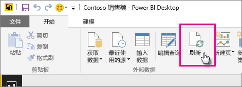

# 刷新从本地驱动器的 Power BI Desktop 文件创建的数据集
## 支持的功能有哪些？
在 Power BI 中，数据集是使用本地驱动器导入的 Power BI Desktop 文件创建的，它支持“立即刷新”和“计划刷新”功能。在本地驱动器中，“获取数据”/“查询编辑器”可用于连接到以下任一数据源并从以下任一数据源加载数据：

### Power BI Gateway - Personal
* Power BI Desktop“获取数据”和“查询编辑器”中显示的所有联机数据源。
* Power BI Desktop“获取数据”和“查询编辑器”中显示的所有本地数据源，Hadoop 文件 (HDFS) 和 Microsoft Exchange 除外。

<!-- Refresh Data sources-->
[!INCLUDE [refresh-datasources](./includes/refresh-datasources.md)]

> [!NOTE]
> 必须安装一个网关并运行该网关，才能使 Power BI 连接到本地数据源并刷新数据集。
> 
> 

你可以直接在 Power BI Desktop 中通过选择主页功能区上的“刷新”手动执行一次性刷新操作。 选择此处的“刷新”时，将用原始数据源中更新后的数据刷新*文件*模型中的数据。 这种类型的刷新完全是从 Power BI Desktop 应用程序自身内部进行，不同于在 Power BI 中进行的手动或计划内刷新，理解这种区别至关重要。

当从本地驱动器导入 Power BI Desktop 文件时，此数据以及有关模型的其他信息将被加载到 Power BI 服务中的数据集。 在 Power BI 服务中，而不是在 Power BI Desktop 中，建议刷新数据集中的数据，因为 Power BI 服务中的报表就是基于该数据集创建的。 由于该数据源是外部数据源，因此可以手动刷新该数据集，方法是通过使用**立即刷新**或者可以通过使用**计划刷新**设置刷新计划。

刷新数据集时，Power BI 不会连接到本地驱动器上的文件对更新后的数据进行查询。 而是使用数据集中的信息直接连接到数据源对更新后的数据进行查询，然后再将其加载到数据集。

> [!NOTE]
> 数据集中刷新的数据未同步回本地驱动器上的文件。
> 
> 

## 如何设置计划刷新？
设置刷新计划时，Power BI 将使用数据集中的连接信息和凭据直接连接到数据源，以对更新后的数据进行查询，然后再将更新后的数据加载到数据集。 此外，还会更新基于 Power BI 服务中该数据集的报表和仪表板中的所有可视化效果。

有关如何设置计划刷新的详细信息，请参阅[配置计划刷新](refresh-scheduled-refresh.md)。

## 出现问题时
出现问题时，通常是因为 Power BI 无法登录数据源，或数据集连接到本地数据源，而网关处于脱机状态。 确保 Power BI 可以登录数据源。 如果用于登录数据源的密码更改，或 Power BI 已从数据源注销，请务必在数据源凭据中再次尝试登录数据源。

请确保选中**刷新失败时发送电子邮件通知**。 你会想立即了解计划刷新是否失败。

## 故障排除
有时可能不会按预期方式刷新数据。 通常，这会是与网关连接出现的问题。 请查看网关故障排除文章，了解相关工具和已知问题。

[本地数据网关故障排除](service-gateway-onprem-tshoot.md)

[Power BI Gateway - Personal 故障排除](service-admin-troubleshooting-power-bi-personal-gateway.md)

更多问题？ [尝试咨询 Power BI 社区](http://community.powerbi.com/)

