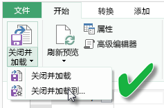

# 刷新使用本地驱动器上的 Excel 工作簿创建的数据集
## 支持的功能有哪些？
在 Power BI 中，数据集是使用本地驱动器导入的 Excel 工作簿创建的，它支持“立即刷新”和“计划刷新”功能。在本地驱动器中，Power Query（在 Excel 2016 中获取和转换数据）可用于连接到以下任一数据源并将数据加载到 Excel 数据模型：  

### Power BI Gateway - Personal
* Power Query 中显示的所有联机数据源。
* Power Query 中显示的所有本地数据源，Hadoop 文件 (HDFS) 和 Microsoft Exchange 除外。
* Power Pivot 中显示的所有联机数据源。\*
* Power Pivot 中显示的所有本地数据源，Hadoop 文件 (HDFS) 和 Microsoft Exchange 除外。

<!-- Refresh Data sources-->
[!INCLUDE [refresh-datasources](./includes/refresh-datasources.md)]

> **注意：**  
> 
> * 必须安装一个网关并运行该网关，才能使 Power BI 连接到本地数据源并刷新数据集。
> * 当使用 Excel 2013 时，请确保你已将 Power Query 更新到了最新版本。
> * 从本地驱动器导入的 Excel 工作簿不支持刷新，在本地驱动器中，数据只存在于工作表或链接表中。 如果工作表数据是从 OneDrive 存储和导入的，则不支持刷新。 有关详细信息，请参阅[刷新使用 OneDrive 或 SharePoint Online 上的 Excel 工作簿创建的数据集](refresh-excel-file-onedrive.md)。
> * 刷新使用从本地驱动器导入的 Excel 工作簿创建的数据集时，只刷新从数据源查询的数据。 如果更改 Excel 或 Power Pivot 中的数据模型结构（例如，创建新的度量值或更改列名称），这些更改将不会复制到数据集。 如果进行此类更改，需要重新上传或重新发布该工作簿。 如果希望对你的工作簿结构进行规律性更改，并且希望这些更改反映在 Power BI 中的数据集中而无需重新上传，则可以考虑将你的工作簿放在 OneDrive 上。 Power BI 会自动刷新从 OneDrive 存储和导入的工作簿中的结构和工作表数据。
> 
> 

## 如何确保已将数据加载到了 Excel 数据模型？
使用 Power Query（在 Excel 2016 中获取和转换数据）连接到数据源时，有好几个数据加载位置的选项可供选择。 若要确保将数据加载到数据模型，必须选择**加载到**对话框中的**将此数据添加到数据模型**选项。

> [!NOTE]
> 此图显示的是 Excel 2016。
> 
> 

在**导航器**中，单击**加载到...**  
    

或者，单击导航器中的**编辑**，将打开查询编辑器。 你可以单击其中的**关闭并加载到...**  
    

然后在**加载到**中，确保选中**将此数据添加到数据模型**。  
    

### 如果使用“通过 Power Pivot 获取外部数据”该怎样？
没问题。 无论何时使用 Power Pivot 连接到本地或联机数据源以及从这些数据源查询数据时，此数据将自动加载到数据模型。

## 如何设置计划刷新？
设置刷新计划时，Power BI 将使用数据集中的连接信息和凭据直接连接到数据源，以对更新后的数据进行查询，然后再将更新后的数据加载到数据集。 此外，还会更新基于 Power BI 服务中该数据集的报表和仪表板中的所有可视化效果。

有关如何设置计划刷新的详细信息，请参阅[配置计划刷新](refresh-scheduled-refresh.md)。

## 出现问题时
出现问题时，通常是因为 Power BI 无法登录数据源，或数据集连接到本地数据源，而网关处于脱机状态。 确保 Power BI 可以登录数据源。 如果用于登录数据源的密码更改，或 Power BI 已从数据源注销，请务必在数据源凭据中再次尝试登录数据源。

请确保选中**刷新失败时向我发送电子邮件通知**。 你会想立即了解计划刷新是否失败。

>[!IMPORTANT]
>连接到 Power Pivot 和通过 Power Pivot 查询的 OData 数据源不支持刷新。 当使用 OData 数据源作为数据源时，请使用 Power Query。

## 故障排除
有时可能不会按预期方式刷新数据。 通常，这会是与网关连接出现的问题。 请查看网关故障排除文章，了解相关工具和已知问题。

[本地数据网关故障排除](service-gateway-onprem-tshoot.md)

[Power BI Gateway - Personal 故障排除](service-admin-troubleshooting-power-bi-personal-gateway.md)

## 后续步骤
更多问题？ [尝试参与 Power BI 社区](http://community.powerbi.com/)

