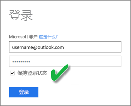
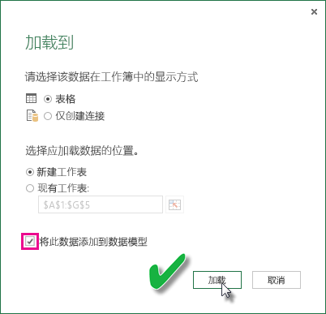

# 刷新使用 OneDrive 或 SharePoint Online 上的 Excel 工作簿创建的数据集
可导入存储在本地计算机或云存储（如 OneDrive for Business 或 SharePoint Online）中的 Excel 工作簿。 下面讨论使用云存储处理 Excel 文件的优点。 有关如何将 Excel 文件导入 Power BI 的详细信息，请参阅[从 Excel 工作簿文件获取数据](service-excel-workbook-files.md)。

## 有什么好处？
从 OneDrive 或 SharePoint Online 导入文件是确保在 Excel 上所做的工作与 Power BI 服务保持同步的好方法。 已加载到文件模型的任何数据都将被导入到数据集并且在文件中创建的任何报表都会被加载到 Power BI 中的报表中。 如果对 OneDrive 或 SharePoint Online 上的文件进行更改，如添加新度量值、更改列名称，或编辑可视化效果，则保存更改后，通常在大约 1 小时内，这些更改就会被更新到 Power BI 中。

当从个人 OneDrive 中导入 Excel 工作簿时，该工作簿中的任何数据（如工作表中的表和/或被加载到 Excel 数据模型中的数据以及数据模型结构）都将被导入到 Power BI 中的新数据集。 任何 Power View 可视化效果都将在报表中重新创建。 Power BI 会自动连接到 OneDrive 或 SharePoint Online 上的工作簿，大约每隔一个小时就会检查更新一次。 如果工作簿已更改，Power BI 将刷新 Power BI 服务中的数据集和报表。

你可以在 Power BI 服务中的数据集上执行刷新。 当在数据集上手动刷新或计划刷新时，Power BI 会直接连接到外部数据源，以对更新后的数据进行查询，然后再将其加载到数据集。 从 Power BI 内部刷新数据集不会刷新 OneDrive 或 SharePoint Online 上的工作簿中的数据。 

## 支持的功能有哪些？
在 Power BI 中，数据集是使用本地驱动器导入的 Power BI Desktop 文件创建的，它支持“立即刷新”和“计划刷新”功能。在本地驱动器中，“获取数据”/“查询编辑器”可用于连接到以下任一数据源并从以下任一数据源加载数据：  

### Power BI Gateway - Personal
* Power BI Desktop“获取数据”和“查询编辑器”中显示的所有联机数据源。
* Power BI Desktop“获取数据”和“查询编辑器”中显示的所有本地数据源，Hadoop 文件 (HDFS) 和 Microsoft Exchange 除外。

<!-- Refresh Data sources-->
[!INCLUDE [refresh-datasources](./includes/refresh-datasources.md)]

> [!NOTE]
> 必须安装一个网关并运行该网关，才能使 Power BI 连接到本地数据源并刷新数据集。
> 
> 

## OneDrive 或 OneDrive for Business。 有什么区别？
如果同时拥有个人 OneDrive 和 OneDrive for Business，建议保留要导入到 OneDrive for Business 中的 Power BI 的所有文件。 原因如下：你有可能使用两个不同的帐户登录到它们。

连接到 Power BI 中的 OneDrive for Business 通常是无缝的，因为你用于登录 Power BI 的同一个帐户通常是用来登录 OneDrive for Business 的同一个帐户。 但使用个人 OneDrive 时，你可能需要使用其他 [Microsoft 帐户](https://account.microsoft.com)才能登录。

当使用 Microsoft 帐户登录时，请确保选中“使我保持登录状态”。 随后，Power BI 会将在 Power BI Desktop 文件中进行的所有更新与 Power BI 中的数据集同步。  
    

如果对无法与 Power BI 中的数据集或报表进行同步的 OneDrive 文件进行更改，由于 Microsoft 帐户凭据可能已更改，你需要连接到个人 OneDrive 并再次从个人 OneDrive 导入文件。

## 用于连接到 Excel 文件的选项
当连接到 OneDrive for Business 或 SharePoint Online 中的 Excel 工作簿时，有两种关于如何将工作簿中的数据加载到 Power BI 工作簿的选项可供选择。

[**将 Excel 数据导入到 Power BI**](service-excel-workbook-files.md#import-or-connect-to-an-excel-workbook-from-power-bi) – 从 OneDrive for Business 或 SharePoint Online 导入 Excel 工作簿时，它的工作原理如上所述。

[**在 Power BI 中连接、管理和查看 Excel**](service-excel-workbook-files.md#one-excel-workbook--two-ways-to-use-it) – 使用此选项时，将立即在 Power BI 与 OneDrive for Business 或 SharePoint Online 上的工作簿之间创建连接。

选用此方法连接到 Excel 工作簿时，Power BI 中不会创建任何数据集。 但是，该工作簿将显示在 Power BI 服务的“报表”下面，并且将在名称旁显示 Excel 图标。 与 Excel Online 不同，当从 Power BI 连接到工作簿时，如果工作簿已连接到外部数据源（用于将数据加载到 Excel 数据模型中），则可以设置刷新计划。

采用这种方法设置刷新计划时，唯一的区别在于：刷新的数据将进入 OneDrive 或 SharePoint Online 上的工作簿数据模型，而不会进入 Power BI 中的数据集。

## 如何确保已将数据加载到了 Excel 数据模型？
使用 Power Query（在 Excel 2016 中获取和转换数据）连接到数据源时，有好几个数据加载位置的选项可供选择。 若要确保将数据加载到数据模型，必须选择**加载到**对话框中的**将此数据添加到数据模型**选项。

> [!NOTE]
> 此图显示的是 Excel 2016。
> 
> 

在**导航器**中，单击**加载到...**  
    

或者，单击导航器中的**编辑**，将打开查询编辑器。 你可以单击其中的**关闭并加载到...**  
    

然后在**加载到**中，确保选中**将此数据添加到数据模型**。  
    

### 如果使用“通过 Power Pivot 获取外部数据”该怎样？
没问题。 无论何时使用 Power Pivot 连接到本地或联机数据源以及从这些数据源查询数据时，此数据将自动加载到数据模型。

## 如何设置计划刷新？
设置刷新计划时，Power BI 将使用数据集中的连接信息和凭据直接连接到数据源，以对更新后的数据进行查询，然后再将更新后的数据加载到数据集。 此外，还会更新基于 Power BI 服务中该数据集的报表和仪表板中的所有可视化效果。

有关如何设置计划刷新的详细信息，请参阅[配置计划刷新](refresh-scheduled-refresh.md)。

## 出现问题时
出现问题时，通常是因为 Power BI 无法登录数据源，或数据集连接到本地数据源，而网关处于脱机状态。 确保 Power BI 可以登录数据源。 如果用于登录数据源的密码更改，或 Power BI 已从数据源注销，请务必在数据源凭据中再次尝试登录数据源。

请确保选中**刷新失败时向我发送电子邮件通知**。 你会想立即了解计划刷新是否失败。

## 重要说明
\*连接到 Power Pivot 和通过 Power Pivot 查询的 OData 数据源不支持刷新。 当使用 OData 数据源作为数据源时，请使用 Power Query。

## 故障排除
有时可能不会按预期方式刷新数据。 通常，这会是与网关连接出现的问题。 请查看网关故障排除文章，了解相关工具和已知问题。

[本地数据网关故障排除](service-gateway-onprem-tshoot.md)

[Power BI Gateway - Personal 故障排除](service-admin-troubleshooting-power-bi-personal-gateway.md)

更多问题？ [尝试参与 Power BI 社区](http://community.powerbi.com/)

