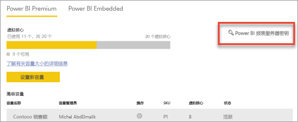

# 如何查找报表服务器产品密钥
了解如何查找 Power BI 报表服务器产品密钥，以便在生产环境中安装服务器。

<iframe width="640" height="360" src="https://www.youtube.com/embed/6CQnf-NGtpU?rel=0&amp;showinfo=0" frameborder="0" allowfullscreen></iframe>

已下载 Power BI 报表服务器，并已购买 SQL Server Enterprise 软件保障协议。 或者，已购买 Power BI Premium。 希望在生产环境中安装服务器，但需要产品密钥才能进行安装。 产品密钥在哪里？ 

产品密钥位于两个位置之一，具体视所购买的产品而定。

## 已购买 Power BI Premium
如果已购买 Power BI Premium，则可以在 Power BI 管理门户的“容量设置”选项卡中访问 Power BI 报表服务器产品密钥。 这将仅适用于分配了 Power BI 服务管理员角色的全局管理员或用户。

选择“Power BI 报表服务器密钥”将显示包含产品密钥的对话框。 可以复制该密钥并用来进行安装。

## 已购买软件保障协议
如果有 SQL Server Enterprise SA 协议，则可以从[批量许可服务中心](https://www.microsoft.com/Licensing/servicecenter/)获取产品密钥。 在最新服务包下查找最新版 SQL Server。 如果找不到，请在最新 RTM 版 SQL Server 下查找。

> [!NOTE]
> 需要在下载部分下查找。 不是密钥部分。
> 
> 

## 后续步骤
[快速入门：安装 Power BI 报表服务器](quickstart-install-report-server.md)  
[安装更适合 Power BI 报表服务器的 Power BI Desktop](install-powerbi-desktop.md)  
[安装报表生成器](https://docs.microsoft.com/sql/reporting-services/install-windows/install-report-builder)  
[下载 SQL Server Data Tools (SSDT)](http://go.microsoft.com/fwlink/?LinkID=616714)

更多问题？ [尝试咨询 Power BI 社区](https://community.powerbi.com/)

