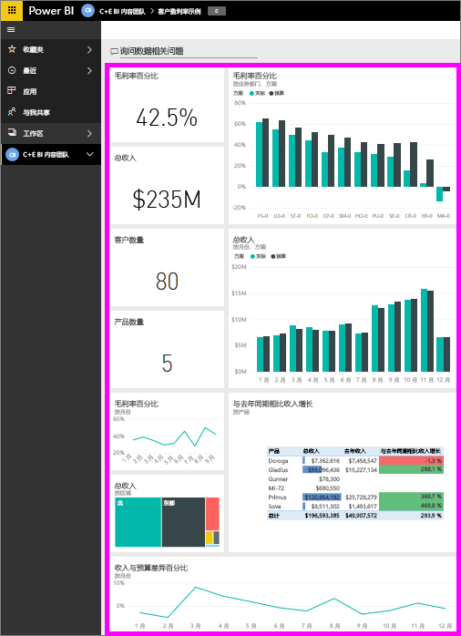
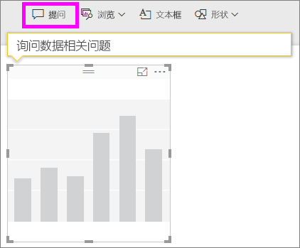
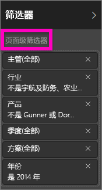
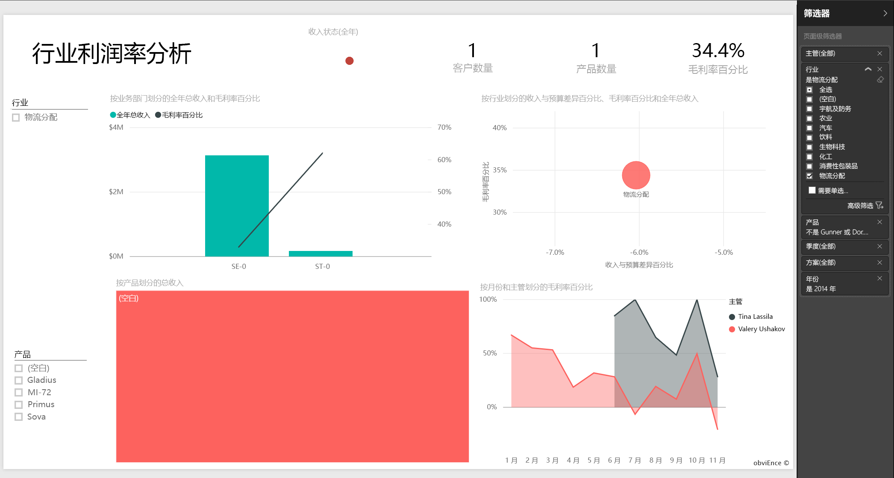
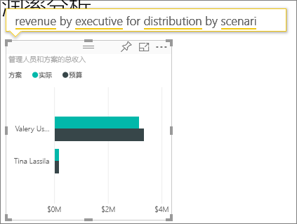

# Power BI 的客户盈利率示例：教程

## 客户盈利率示例概述
“客户盈利率示例”内容包包括生产营销材料的一家公司的仪表板、报表和数据集。 此仪表板由 CFO 创建，用于查看有关她的 5 名业务部门经理（即主管人员）、产品、客户和毛利 (GM) 的关键指标。 她一眼就能看出影响盈利性的因素所在。

此示例是一系列教程的一部分，该系列教程阐明如何将 Power BI 与面向业务的数据、报表及仪表板搭配使用。 这些来自 obviEnce [(www.obvience.com)](http://www.obvience.com/) 的真实数据都已进行匿名处理。 数据可采用以下几种格式：内容包/应用程序、 Excel 工作簿或 .pbix Power BI Desktop 文件。 参阅[示例数据集](sample-datasets.md)。

## 先决条件
想要跟着做吗？ 本教程使用 Power BI 服务和“客户盈利率”示例内容包。  因为报表体验非常相似，所以也可以使用 Power BI Desktop 和示例 PBIX 文件按步骤操作。 连接到内容包和 PBIX 文件的操作说明如下。

### 获取内容包形式的此示例

1. 打开并登录 Power BI 服务 (app.powerbi.com)。
2. 在左下角，选择“**获取数据**”。
   
    
3. 在显示的“获取数据”页上选择“**示例**”图标。
   
   
4. 依次选择“客户盈利率示例”和“连接”。  
   
   
5. Power BI 导入内容包，并将新的仪表板、报表和数据集添加到当前工作区。 新的内容会以黄色星号标记。 使用这些示例对 Power BI 进行测试运行。  
   
   
  
### 获取 .pbix 文件形式的此示例

也可以将此示例下载为 .pbix 文件，这是专为 Power BI Desktop 量身定制的文件格式。 [客户盈利能力示例](<http://download.microsoft.com/download/6/A/9/6A93FD6E-CBA5-40BD-B42E-4DCAE8CDD059/Customer>> Profitability Sample PBIX.pbix)

### 获取 Excel 工作簿形式的此示例

如果想要深入探究本示例的数据源，还以[（Excel 工作簿）](http://go.microsoft.com/fwlink/?LinkId=529781)的形式提供此示例。 该工作簿包含你可以查看和修改的 Power View 工作表。 若要查看原始数据，请选择“Power Pivot”>“管理”。

## 仪表板告诉我们什么？

在“我的工作区”下，找到“客户盈利率示例”仪表板：

### 公司范围仪表板磁贴
1. 打开 Power BI 服务中的仪表板。 仪表板磁贴为 CFO 提供了对她而言至关重要的高级别公司指标概览。  当她看到感兴趣的内容时，她可以选择磁贴以进一步研究该数据。

2. 查看仪表板左侧的磁贴。

    

- 我们公司的毛利率是 42.5%。
- 我们有 80 个客户。
- 我们销售 5 种不同的产品。
- 我们在二月份收入与预算的差额最小，三月份收入与预算的差额最大。
- 我们的大部分收入来自于东部和北部区域。 毛利从未超出过预算，其中 ER-0 和 MA-0 需要进一步调查。
- 该年的总收入接近预算。

### 特定于经理的仪表板磁贴
仪表板右侧的磁贴提供团队计分卡。 CFO 需要对她的经理进行跟踪，而这些磁贴使用 GM% 为她提供了利润的高级别概述。 如果对任一经理的 GM% 趋势在意料之外，她就会进一步调查。

- 除 Carlos 外，所有管理人员均已超过目标销售额。 但 Carlos 的实际销售额是最高的。 
- Annelie 的毛利润百分比最低，但从 3 月开始我们可以看到稳定的增长。
- 另一方面，可以看到 Valery 的 GM % 在显著下降。 
- 而 Andrew 经过了多变的一年。 

## 浏览仪表板的基础数据
此仪表板含有链接到报表和 Excel 工作簿的磁贴。 

### 打开 Excel Online 数据源
该仪表板上的“目标与实际”和“年度同比收入增长量”这两个磁贴是从 Excel 工作簿固定的。 因此，在选择其中一个磁贴时，Power BI 将打开数据源（在该示例中，将打开 Excel Online）。

1. 选择从 Excel 固定的这两个磁贴之一。 将在 Power BI 服务中打开 Excel Online。
2. 请注意，该工作簿含有 3 个选项卡的数据。 打开“收入”。
3. 让我们来看看为什么 Carlos 尚未达到其目标。  
    a. 在“管理人员”滑块中，选择“Carlos Grilo”。   
    b. 第一个数据透视表告诉我们 Carlos 的热销产品 Primus 的收入同比去年下降了 152%。 而年同比图表显示其大部分月份都低于预算。  

    

    

4. 继续浏览，如果发现感兴趣的内容，请从右上角选择“固定”以[将该内容固定到仪表板](service-dashboard-pin-tile-from-excel.md)。

5. 使用浏览器的上一步箭头返回到仪表板。 

### 打开基础 Power BI 报表
客户盈利率示例仪表板上的大部分磁贴是从基础客户盈利率示例报表固定的。 

1. 选择其中的一个磁贴以在阅读视图中打开报表。 

2. 报表有 3 页。 报表底部的每个选项卡表示一个页面。 

    

    * “队记分卡”关注 5 名经理的绩效及其“业务记录”。
    * “行业利润率分析”通过比较整个行业的发展，提供了一种分析盈利率的方法。
    * 在 Cortana 中，“经理记分卡”提供了每个经理的视图浏览格式。

### “团队记分卡”页

我们来了解一下零售团队成员中的两名成员，看一看可以获得哪些见解。 在左侧的扇区中，选择 Andrew 名字，筛选仅显示 Andrew 相关数据的报表页。

* 为快速了解 KPI，可查看 Andrew 的**收入状态** - 显示为绿色。 表明他的表现还不错。
* “按月份划分的收入与预算差额”分区图显示，除 2 月份有所下降以外，Andrew 的整体绩效都非常不错。 他的主要区域是东部并负责 49 个客户和 5 款产品（共 7 款）。 但他的 GM% 并不是最高的，也不是最低的。
* “按月份划分的收入与预算差额”显示了一种稳定的盈亏平衡情况。但当通过选择区域树状图中的**中部**方块时，你将发现 Andrew 仅在 3 月才有收入，并且仅限于印地安那州。 这是有意为之还是别有隐情？

现在转向 Valery。 选择扇区中的 Valery 名字，筛选仅显示关于她的数据的报表页。  

* 请注意，**总收入状态**的 KPI 为红色。 这肯定需要进一步调查。
* 她的收入差也令人担心 – 她未满足其收入毛利率。
* Valery 只有 9 个客户，只负责 2 款产品，合作的客户几乎全部位于北部。 这种特殊性可以解释她的指标中存在的大范围波动。
* 选择树状图中的**北部**方块，显示 Valery 在北部的毛利润与她的整体利润保持一致。
* 选择其他**区域**方块出现了很有趣的现象：她的 GM% 范围为 23% 到 79%，她在除北部外的所有区域中的收入数字非常具有季节性。

继续探索，找出 Valery 的区域表现不佳的原因。 看一看各个区域、其他业务部门以及该报表的下一页“行业利润率分析”。

### 行业利润率分析
此报表页提供了不同的数据片段。 通过分析细分市场，介绍了整个行业的毛利率。 CFO 利用此页将公司和业务部门指标与行业指标进行比较，以帮助其阐释趋势和盈利性。 你可能会想“按月份和主管姓名划分的毛利率”分区图为什么会出现在此页，因为它是特定于团队的。 在此处列出可让我们按业务部门经理筛选页面。  

盈利性如何随行业而变化？ 如何按行业细分产品和客户？ 从左上方选择一个或多个行业。 （从 CPG 行业开始）若要清除筛选器，可选择橡皮擦图标。

在气泡图中，CFO 要查找最大的气泡，因为这些气泡代表对收入产生最大影响的气泡。 通过单击分区图中各经理的名字按经理筛选页面，这样做很容易看出行业细分市场对各经理产生的影响。

* Andrew 受影响的区域跨度许多不同行业的细分市场，GM%（大部分是正面影响）和 Var% 变化都很大。 
* Annelie 的图表与此相似，只是她只集中在一小部分行业细分市场，侧重于“联邦”细分市场且主要着重 Gladius 产品。 
* Carlos 主要侧重于“服务”细分市场，利润很好。 他显著提高了“高科技”细分市场和他的新市场（工业）的方差比率，与预算相比，表现异常出色。 
* Tina 负责少量细分市场，GM% 最高，但她的气泡大部分都是小气泡，这表示她对公司的账本底线产生的影响最小。 
* Valery 只负责一款产品，并且仅在 5 个行业细分市场工作。 她的行业影响也具有季节性，但始终会产生大气泡，表明对公司的账本底线影响较大。 行业是否能解释她的消极表现？

### 管理人员记分卡
将此页的格式设置为 Cortana 的回复卡。 若要了解详细信息，请参阅[为 Cortana 创建回复卡](service-cortana-answer-cards.md)

## 请通过“问答”提问进一步分析数据
我们的分析有助于确定哪个行业为 Valery 带来的收入最多。 使用“问答”提问。

1. 在编辑视图中打开报表，方法是选择“编辑报表”。 编辑视图仅在该报表由你“所有”的情况下才可用，这有时被称为创建者模式。 相反，如果该报表是与你共享的，则你无法在编辑视图中打开它。

2.  从顶部菜单栏中，选择“提问”打开“问答”问题框。

    

3. 键入 **Valery 的按行业划分的总收入**。 请注意当你键入问题时，可视化效果更新的方式。
   
    
   
   分销是 Valery 的最大收入区域。

### 通过添加筛选器深入分析
我们来看一看 *分销* 行业。  

1. 打开“行业利润率分析”报表页。
2. 不选择报表页上的任何可视化效果，在右侧展开“筛选器”窗格（如果它尚未展开）。 “筛选器”窗格应仅显示页面级别筛选器。  
   
   
3. 找到“行业”筛选器并选择箭头以展开该列表。 让我们为分销行业添加页面筛选器。 首先，通过清除“全选”复选框来清除所有选择。 然后仅选择“分销”。  
   
   
4. “按月份和主管姓名划分的毛利率”分区图表明，只有 Valery 和 Tina 在这个行业有客户，而 Valery 仅在 6 月到 11 月负责了该行业。   
5. 在“按月份和主管划分的毛利率”分区图图例中，依次选择“Tina”和“Valery”。 我们发现，Tina 的“按产品划分的总收入”部分相较于 Valery 真的很少。 
6. 若要查看实际收入，请使用“问答”提问按方案划分的管理人员分销总收入。  
   
     

    我们可以采用相似的方式分析其他行业，甚至将客户加入到我们的视觉对象分析当中，以了解 Valery 的表现的原因。

这是一个安全的试验环境。 你可以始终选择不保存所做的更改。 但是，如果保存更改，则可以始终转到**获取数据**来获取本示例的新副本。

还可以[仅下载本示例的数据集（Excel 工作簿）](http://go.microsoft.com/fwlink/?LinkId=529781)。

## 后续步骤：连接到你的数据
本教程介绍了 Power BI 仪表板、问答和报表如何能够帮助深入了解客户数据。 现在轮到你了 — 连接到你自己的数据。 借助 Power BI，你可以连接到各种数据源。 了解 [Power BI 入门](service-get-started.md)的详细信息。

[回到 Power BI 中的示例](sample-datasets.md)  

