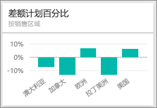
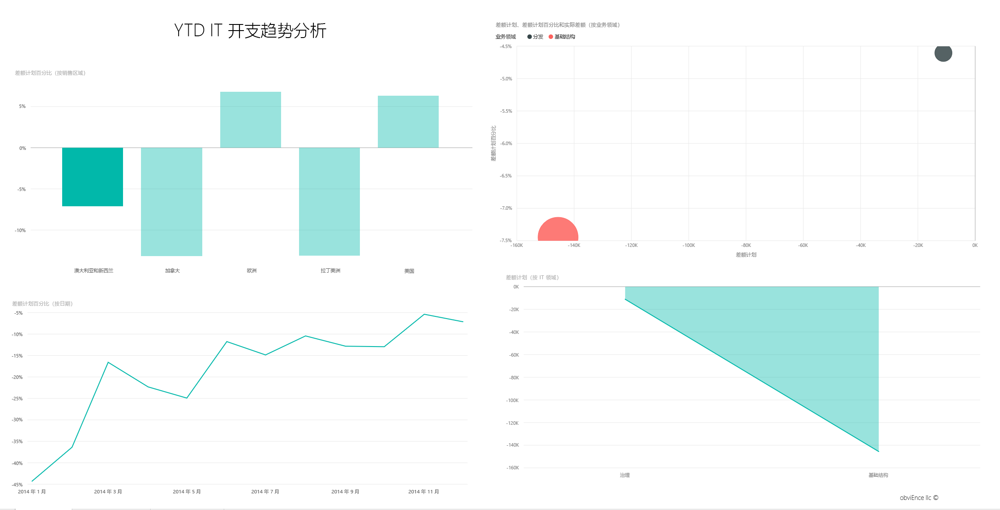
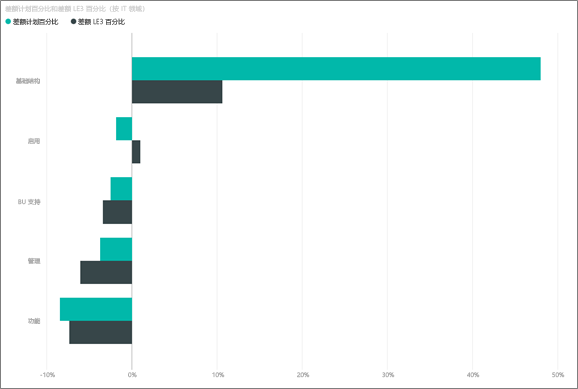
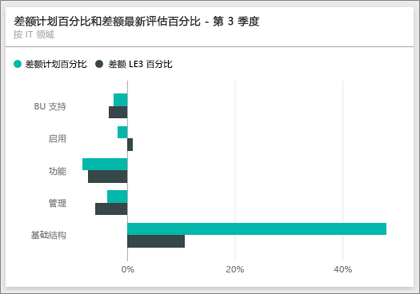
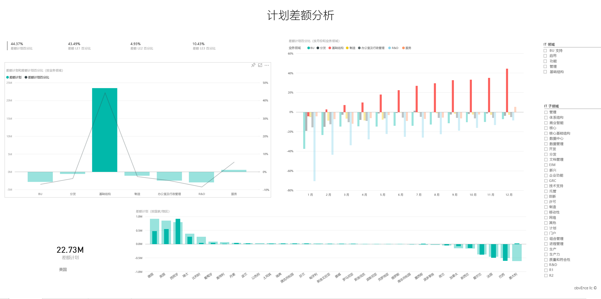

# Power BI 的 IT 支出分析示例教程

## “IT 支出分析示例”概述
IT 支出分析[内容包](service-organizational-content-pack-introduction.md)（仪表板、报表和数据集）分析比较了 IT 部门的计划成本与实际成本。 这种比较可以帮助我们了解公司年度计划的效果如何并调查与计划有巨大偏差的区域。 在此示例中，公司将经历年度计划周期，然后分季度生成新的最新估计 (LE)，以帮助分析过去财年中 IT 支出的变化。

此示例是一系列教程的一部分，该系列教程阐明如何将 Power BI 与面向业务的数据、报表及仪表板搭配使用。 这些来自 obviEnce (<http://obvience.com/>) 的真实数据均已进行匿名处理。

## 先决条件

 必须先将示例下载为[内容包](https://docs.microsoft.com/en-us/power-bi/sample-it-spend#get-the-content-pack-for-this-sample)、[.pbix 文件](http://download.microsoft.com/download/E/9/8/E98CEB6D-CEBB-41CF-BA2B-1A1D61B27D87/IT-Spend-Analysis-Sample-PBIX.pbix)或 [Excel 工作簿](http://go.microsoft.com/fwlink/?LinkId=529783)，然后才能使用它。

### 获取内容包形式的此示例

1. 打开并登录 Power BI 服务 (app.powerbi.com)。
2. 在左下角，选择“**获取数据**”。
   
    
3. 在显示的“获取数据”页上选择“**示例**”图标。
   
   
4. 依次选择“IT 支出分析示例”和“连接”。  
  
   
   
5. Power BI 导入内容包，并将新的仪表板、报表和数据集添加到当前工作区。 新的内容会以黄色星号标记。 
   
   
  
### 获取 .pbix 文件形式的此示例

也可以将此示例下载为 .pbix 文件，这是专为 Power BI Desktop 量身定制的文件格式。 

 * [IT 支出分析示例](http://download.microsoft.com/download/E/9/8/E98CEB6D-CEBB-41CF-BA2B-1A1D61B27D87/IT%20Spend%20Analysis%20Sample%20PBIX.pbix)

### 获取 Excel 工作簿形式的此示例
还可以针对此示例[仅下载该数据集（Excel 工作簿）](http://go.microsoft.com/fwlink/?LinkId=529783)。 该工作簿包含你可以查看和修改的 Power View 工作表。 若要查看原始数据，请选择“Power Pivot”>“管理”。

## IT 支出分析示例仪表板
仪表板上的两个数字磁贴，**差额计划 %** 和**第 3 季度最新估计差额 %**，为我们提供了和计划和最新的季度评估（LE3 = 第 3 季度最新估计）相比，我们的表现程度的概况。 总体上，我们与计划大约有 6% 的差额。 让我们按时间、地点和类别研究一下导致此差额的原因。

## “YTD IT 开支趋势分析”页
选择**按销售地区的差额计划 %** 仪表板磁贴将转到 IT 支出分析示例报表的“IT 支出趋势分析”页。 一眼就可以看出我们在美国和欧洲为正差额，而在加拿大、拉丁美洲和澳大利则为负差额。 美国最近估计约有 6% 的正差额，而澳大利亚最近估计约有 7% 的负差额。

但是，只凭查看此图表，就得出结论可能会产生误导。 我们需要查看实际的美元金额，才可透彻地了解状况。

1. 在“按销售地区划分的差额计划 (%)”图表中选择“**澳大利亚和新西兰**”，然后观察“按 IT 区域划分的差额计划”图表。

   
2. 现在，请选择**美国**。 这样你就了解了 - 与美国相比，澳大利亚真的只占了我们总体支出的很小一部分。

    因此我们把范围缩小到美国，下一步呢？ 我们来探讨一下是美国的哪类商品造成了差额。

## 提出有关数据的问题
1. 在顶部导航栏中选择“IT 支出分析示例”以返回到仪表板。
2. 在问题框中键入“显示 IT 区域、差额计划 % 和第 3 季度最新估计差额 % 条形图”。

   

   在第一个 IT 区域 - 即**基础结构**中，初始差额计划和最新估计差额计划之间的百分比变化巨大。

## “按成本元素的 YTD 支出”页
返回仪表板并查看**差额计划 %，第 3 季度最新估计差额 %** 仪表板磁贴。

即可看到基础结构对计划具有极大的正差额。

1. 单击此磁贴以转到 IT 支出分析示例报表的“按成本元素的 YTD 支出”页。
2. 单击左下角的“按 IT 区域的差额计划 % 和第 3 季度最新估计差额 %”图表中的**基础结构**栏，并观察左侧的“按销售地区的差额计划 %”中相对于计划的差额。

    
3. 单击切片器中成本元素组的名称以查找具有较大差额的成本元素。
4. 选择**其他**后，单击 IT 区域中的**基础结构**，并单击 IT 子区域切片器中的“子区域”以查找具有最大差额的子区域。  

   我们可以看到**网络**中存在巨大差额。

   显然，该公司决定为其雇员提供电话服务作为福利，但该措施并不在计划中。

## “计划差额分析”页
还是在该报表中，单击报表底部的“计划差额分析”选项卡以转到报表的第 3 页。

在左侧“按业务区域的差额计划和差额计划 %”组合图表中，单击“基础结构”列以在该页的其余部分突出显示基础结构值。

请注意，在“按月和业务区域的差额计划 %”图表中，基础结构约从 2 月开始有正差额，之后持续增加。 另外，请注意与所有业务区域的值相比，基础结构计划值的差额按国家浮动的方式。 使用右侧“IT 区域”和“IT 子区域”切片器来筛选页面上剩余部分中的值，而不是将其突出显示。 单击右侧的不同 IT 领域，以其他方法浏览数据。 你还可以单击“IT 子区域”，然后查看该级别下的差额。

## 编辑报表
单击左上角的**编辑报表**，并在“编辑视图”中浏览。

* 了解页面的组成部分，即每个图表中有哪些字段，每个页面上有哪些筛选器
* 以相同的数据为依据添加页面和图表
* 更改每个图表的可视化效果类型
* 将它们固定到仪表板

这是一个安全的试验环境。 你可以始终选择不保存所做的更改。 但是，如果保存更改，则可以始终转到“获取数据”来获得本示例的新副本。

## 后续步骤：连接到你的数据
我们希望本教程介绍了 Power BI 仪表板、问题解答和报表如何能够帮助深入了解 IT 支出数据。 现在轮到你了 — 连接到你自己的数据。 借助 Power BI，你可以连接到各种数据源。 了解 [Power BI 入门](service-get-started.md)的详细信息。
