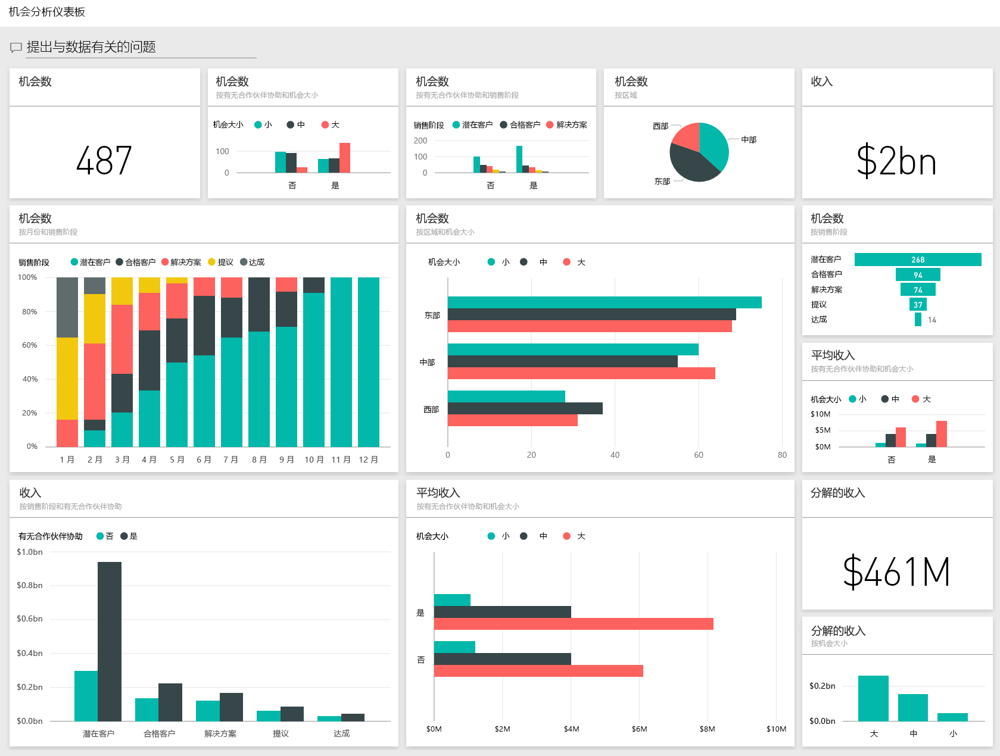
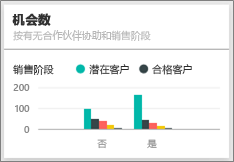

# Power BI 的机会分析示例：教程
**机会跟踪示例** 包含一个仪表板（和关联的报表），介绍了具有以下 2 种销售渠道的软件公司： *直接销售*  和 *合作伙伴销售* 。 销售经理创建此仪表板以按照区域、成交额和渠道来跟踪商机和收入。

销售经理依赖于 2 个收入度量值：

* **收入** – 这是销售人员对他认为的未来收入的估计值。
* **系数收入** – 该收入按“收入 X 概率百分比”计算，普遍认为这是对实际销售收入更为准确的预测指标。 概率由交易的当前***销售阶段***所决定。
  * 潜在客户 – 10%  
  * 授予资格 – 20%  
  * 解决方案 – 40%  
  * 提议 – 60%  
  * 达成 – 80%

此示例是一系列教程的一部分，该系列教程阐明如何将 Power BI 与面向业务的数据、报表及仪表板搭配使用。 这些来自 obviEnce [(www.obvience.com)](http://www.obvience.com/) 的真实数据都已进行匿名处理。

>[!Note] 
还可以[仅下载本示例的数据集（Excel 工作簿）](http://go.microsoft.com/fwlink/?LinkId=529782)。 该工作簿包含你可以查看和修改的 Power View 工作表。  若要查看原始数据，请选择“Power Pivot”>“管理”。 

## 仪表板告诉我们什么？
我们的销售经理已创建了一个仪表板，用于跟踪对她而言至关重要的这些指标。 当她看到感兴趣的内容时，她可以选择磁贴以进一步研究该数据。

1. 公司收入为 20 亿美元，系数收入为 46100 万美元。
2. 机会计数和收入遵循熟悉的漏斗模式，总计在每个后一阶段递减。
3. 大多数机会都在东部区域。 
4. 大型机会比中小型机会获得的收入更多。
5. 合作伙伴大型交易能产生更多收入：平均 800 万美元对比直接销售的 600 万美元。 

由于无论交易被划分为大型、中型还是小型，达成交易所做的工作都是一样的，因此公司应深入挖掘数据，以更多地了解大型机会。 

选择**合作伙伴驱动的机会计数和销售阶段**磁贴以打开报表的第 1 页。  

## 浏览报表中的各页
### 报表的第 1 页标题为“机会计数概述”。

* 就机会计数而言，东部是我们最大的区域。  
* 在饼图上，每次选择一个区域以筛选页面。 对于每个区域，合作伙伴都在寻找显著更多的大型机会。   
* “合作伙伴驱动的机会计数和机会大小”柱形图清楚表明，大部分大型机会都是合作伙伴驱动的，而大部分中小型机会则不是。 
* 选择左下方条形图中的每个销售阶段，查看区域计数中的差异。请注意，就计数而言，虽然东部是我们最大的区域，但“解决方案”、“提议”和“达成”阶段这所有 3 个区域的计数也不相上下。 这意味着我们在中部和西部的成交百分比更高。 

### 报表的第 2 页标题为“收入概述”。
此页使用收入方面而非计数来研究相似数据。  

* 东部是我们最大的区域，这不仅体现在机会计数方面，而且还体现在收入方面。  
* 按合作伙伴驱动筛选（选择图例右上方的**是**）显示的收入是 15 亿美元和 29400 万美元。 将此与非合作伙伴驱动的 6440 亿美元和 16600 万美元收入进行对比。  
* 如果机会是合作伙伴驱动的，那么针对大客户的平均收入（800 万）比非合作伙伴驱动的收入（600 万）更高。  
* 对于合作伙伴驱动的业务，大型机会的平均收入几乎是中型机会（400 万）的两倍。  
* 但合作伙伴驱动的和非合作伙伴驱动的小型和中型这两种业务的平均收入却大致相当。   

很明显，合作伙伴在销售给顾客这方面表现得更好。  这样就很容易理解漏斗图中通过合作伙伴的交易更多了。

### 报表第 3 页标题为“区域阶段计数”。
此页研究相似数据，但是是按区域和阶段细分说明的。  

* 按东部筛选（选择饼图中的**东部**）显示的是，东部机会在合作伙伴驱动和非合作伙伴驱动之间几乎相等。 
* 大型机会在中部区域最常见，小型机会在东部区域最常见，而中型机会在西部区域最常见。 

### 报表的第 4 页标题为“即将到来的机会”。
同样，我们也会采用相似的数据，但这一次是从日期/时间的角度来研究。  

我们的 CFO 使用此页来管理工作负荷。 通过查看按销售阶段和月份划分的收入机会，她可以进行适当规划。

* “达成”阶段的平均收入最高。 达成这些交易是第一优先。
* 按月份筛选（通过选择左扇区中的月份名称）显示的是，在“达成”阶段，1 月的大型交易比例较高，系数收入为 7500 万美元。 另一方面，在“解决方案”和“提议”阶段，2 月大部分都是中型交易。
* 一般来说，系数收入额会基于销售阶段、机会数和交易大小而波动。 针对这些方面添加筛选器（使用右侧的筛选器窗格），进一步研究这些数据。

这是一个安全的试验环境。 你可以始终选择不保存所做的更改。 但是，如果保存更改，则可以始终转到**获取数据**来获取本示例的新副本。

## 后续步骤：连接到你的数据
本教程讨论了 Power BI 仪表板、问答和报表如何能够帮助深入了解机会跟踪数据。 现在轮到你了 - 连接到你自己的数据。 借助 Power BI，你可以连接到各种数据源。 了解 [Power BI 入门](service-get-started.md)的详细信息。

[下载示例](sample-datasets.md)  

