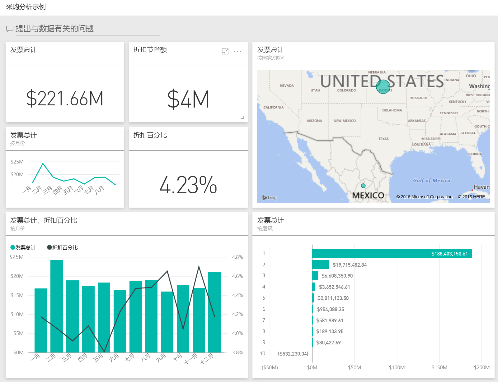
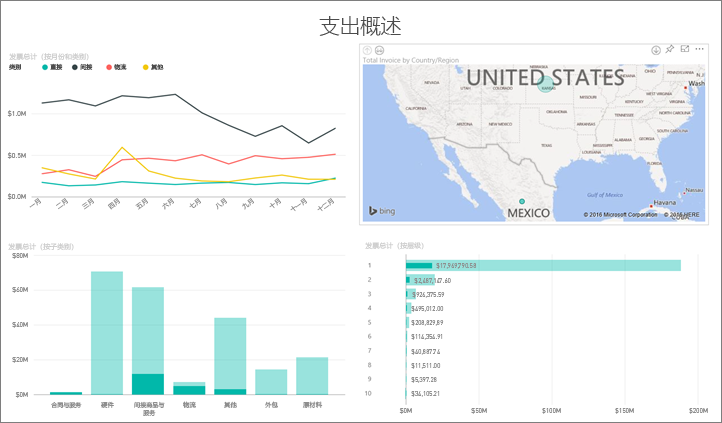
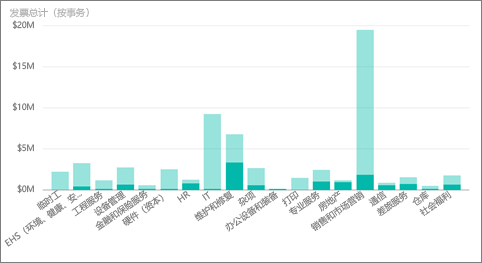
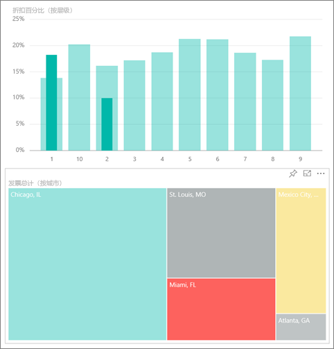
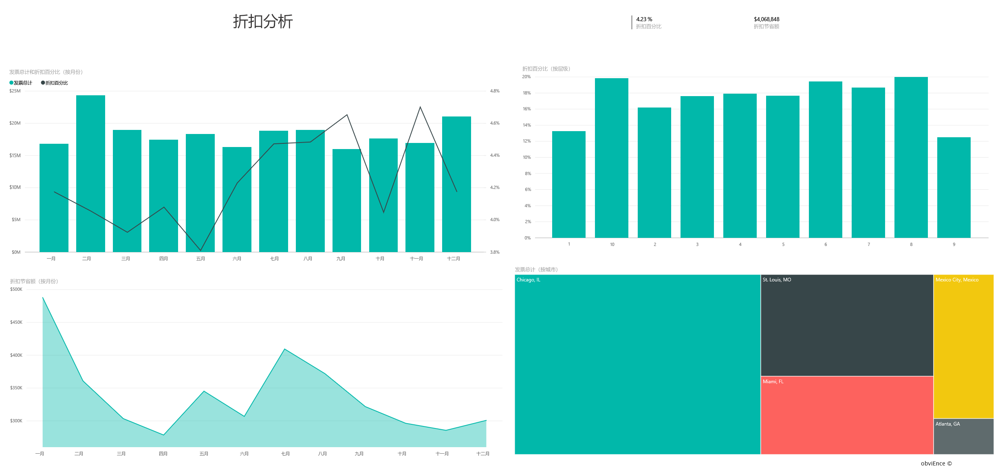
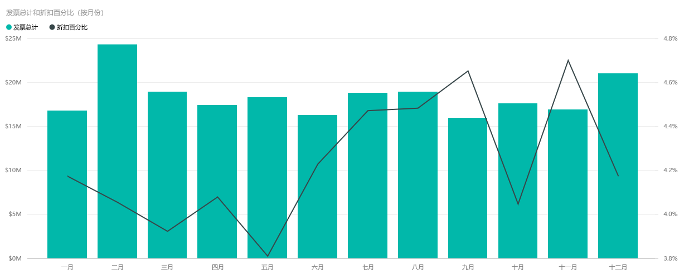
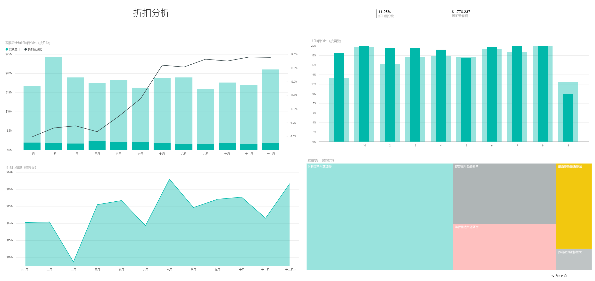

# Power BI 的采购分析示例：教程

## “采购分析示例”概述
此行业示例仪表板与基础报表按类别和位置来分析一家制造公司对供应商的花费。 本示例探讨以下几方面：

* 首选供应商有哪些
* 我们在哪些类别上的支出最多
* 哪些供应商给我们最高折扣以及在何时给我们最高折扣

此示例是一系列教程的一部分，该系列教程阐明如何将 Power BI 与面向业务的数据、报表及仪表板搭配使用。 这些来自 obviEnce [(www.obvience.com)](http://www.obvience.com/) 的真实数据都已进行匿名处理。

## 先决条件

 必须先将示例下载为[内容包](https://docs.microsoft.com/power-bi/sample-procurement#get-the-content-pack-for-this-sample)、[.pbix 文件](http://download.microsoft.com/download/D/5/3/D5390069-F723-413B-8D27-5888500516EB/Procurement-Analysis-Sample-PBIX.pbix)或 [Excel 工作簿](http://go.microsoft.com/fwlink/?LinkId=529784)，然后才能使用它。

### 获取内容包形式的此示例

1. 打开并登录 Power BI 服务 (app.powerbi.com)。
2. 在左下角，选择“**获取数据**”。
   
    
3. 在显示的“获取数据”页上选择“**示例**”图标。
   
   
4. 依次选择“采购分析示例”和“连接”。  
  
   
   
5. Power BI 导入内容包，并将新的仪表板、报表和数据集添加到当前工作区。 新的内容会以黄色星号标记。 
   
   
  
### 获取 .pbix 文件形式的此示例

也可以将此示例下载为 .pbix 文件，这是专为 Power BI Desktop 量身定制的文件格式。 

 * [采购分析示例](http://download.microsoft.com/download/D/5/3/D5390069-F723-413B-8D27-5888500516EB/Procurement%20Analysis%20Sample%20PBIX.pbix)

### 获取 Excel 工作簿形式的此示例
还可以针对此示例[仅下载该数据集（Excel 工作簿）](http://go.microsoft.com/fwlink/?LinkId=529784)。 该工作簿包含你可以查看和修改的 Power View 工作表。 若要查看原始数据，请选择“Power Pivot”>“管理”。

## 支出趋势
我们先来看按类别和位置划分的支出趋势。  

1. 在工作区中，打开“仪表板”选项卡并选择“采购分析”仪表板。
2. 选择仪表板磁贴**按国家/地区划分的发票总计**。 它会打开“采购分析示例”报表的“支出概况”页面。

    

请注意下列事项：

* 在**按月份和类别划分的发票总计**折线图中：**直接**类别的支出相当一致，**物流**的支出高峰为十二月，而**其他**支出在二月有所激增。
* 在**按国家/地区划分的发票总计**地图中：我们大部分的支出都是在美国。
* 在**按子类别划分的发票总计**柱形图中：**硬件**和**间接货物与服务**是最大的支出类别。
* 在“按层划分的发票总计”条形图中：我们大多数的业务都是与第 1 层（前 10 大）供应商合作完成的。 这有助于更妥善地管理供应商关系。

## 墨西哥的支出
让我们来浏览墨西哥的支出部分。

1. 在饼图中，选择地图中的**墨西哥**气泡。 请注意，在“按子类别划分的发票总计”柱形图中，大部分项目都在**间接货物与服务**子类别中。

   
2. 向下钻取到**间接货物与服务**列：

   * 选择图表右上角的向向下钻取箭头 。
   * 选择**间接货物与服务**列。

      到目前为止，此类别最大的支出是销售与市场营销。
   * 在地图上再次选择**墨西哥**。

      在墨西哥，此类别最大的支出是维护与修复。

      
3. 选择图表左上角的向上箭头，以重新向上钻取。
4. 再次选择该箭头，即可关闭向下钻取。  
5. 在顶部导航栏中选择“Power BI”以返回到工作区。

## 评估不同的城市
我们可以使用突出显示来评估不同的城市。

1. 选择仪表板磁贴**按月份划分的发票总计与折扣百分比**。 报表会打开“折扣分析”页面。
2. 在**按城市划分的发票总计**树状图中选择不同的城市，以查看城市的比较结果。 几乎所有迈阿密的发票都来自第 1 层供应商。

   

## 供应商折扣
接着，我们来探索供应商提供的折扣和我们获得最多折扣的时间段。

具体来说，就是讨论这些问题：

* 各个月份的折扣是不同还是相同？
* 部分城市的折扣比其他城市多吗？

### 按月份划分的折扣
查看**按月份划分的发票总计与折扣百分比**组合图时，我们发现**二月**是最繁忙的月份，而**九月**是最不忙的月份。 现在看一下这些月份期间的折扣百分比。
我们发现当销售量增加时，折扣会减少；当销售量较少时，折扣就增加。 在我们越需要折扣时，交易反而越不划算。

### 按城市划分的折扣
另一个要浏览的部分是按城市划分的折扣。 选择树状图中的每个城市，并查看其他图表有哪些变化。

* 密苏里州圣路易斯的二月发票总计大增，并在四月因为折扣节省而大降。
* 墨西哥的墨西哥城享有最高折扣率 (11.05%)，而佐治亚州的亚特兰大折扣率最低 (0.08%)。

### 编辑报表
选择左上角的**编辑报表**，并在“编辑视图”中浏览。

* 了解页面的组成部分
* 以相同的数据为依据添加页面和图表
* 更改图表的可视化效果类型（例如，将树状图更改为环形图）
* 将它们固定到仪表板

这是一个安全的试验环境。 你可以始终选择不保存所做的更改。 如果保存更改，则可以始终转到**获取数据**来获取本示例的新副本。

## 后续步骤：连接到你的数据
我们希望本教程已经演示 Power BI 仪表板和报表如何帮助深入了解采购数据。 现在轮到你了 — 连接到你自己的数据。 借助 Power BI，你可以连接到各种数据源。 了解 [Power BI 入门](service-get-started.md)的详细信息。
