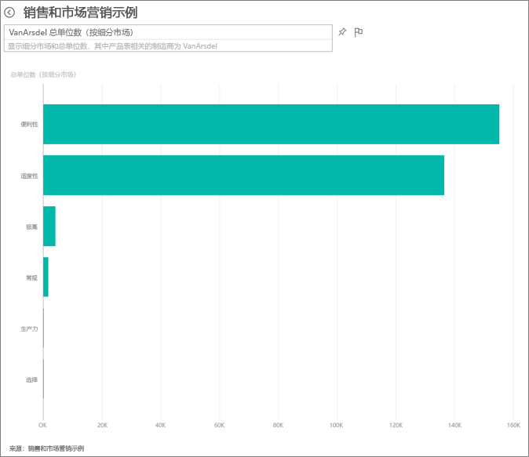
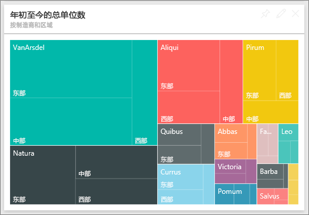
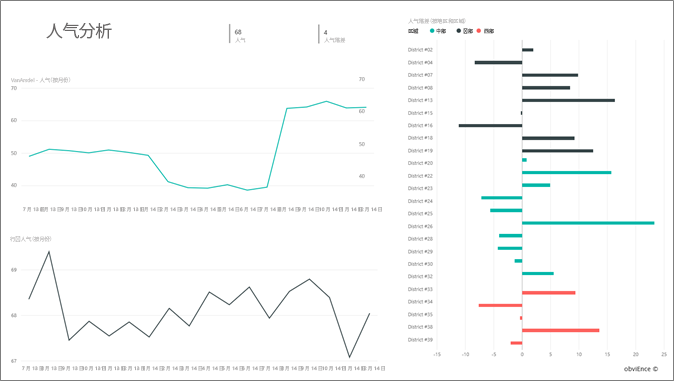
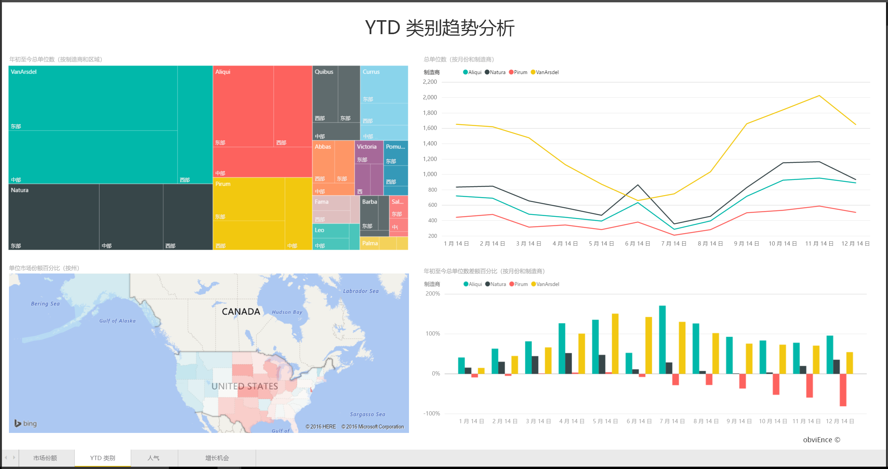
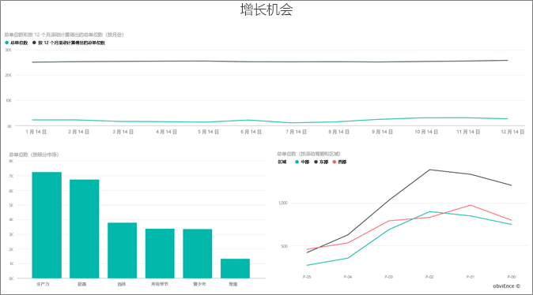

# Power BI 销售与市场营销示例：教程
**销售与市场营销示例**包含一家名为 VanArsdel Ltd 的虚构制造公司的仪表板和报表。此仪表板由 VanArsdel 首席市场官 (CMO) 创建，主要关注业界及其公司的市场份额、产品量、销售额和人气。

VanArsdel 有许多竞争对手，但仍是业内的市场领导者。 CMO 想要增加市场份额，探索发展的商机。 但由于某种原因，VanArsdel 的市场份额在 6 月份已开始大幅滑落。

此示例是一系列教程的一部分，该系列教程阐明如何将 Power BI 与面向业务的数据、报表及仪表板搭配使用。 这些来自 obviEnce (www.obvience.com) 的真实数据都已进行匿名处理。

[!Note] 还可以[仅下载本示例的数据集（Excel 工作簿）](http://go.microsoft.com/fwlink/?LinkId=529785)。 该工作簿包含你可以查看和修改的 Power View 工作表。 若要查看原始数据，请选择“Power Pivot”>“管理”。

## 仪表板告诉我们什么？
让我们开始浏览仪表板并查看 CMO 选择固定的磁贴。 我们可以看到我们的市场份额、销售和人气的相关信息。 接着，我们可以看到这些数据按地区、时间和竞争对手细分。

* 左侧列下方的数字磁贴显示去年行业销售量（5 万）、市场份额 (32.86%)、销售量 (16000)、人气指数 (68)、人气落差 (4) 以及销售单位总量（100 万）。
* 最上方的折线图显示我们的市场份额随时间波动的情况。 我们的市场份额在 6 月份大幅下滑。 此外，我们之前已上升一段时间的 R12M（循环 12 个月）份额则开始停滞。
* 我们最大的竞争对手是 Aliqui（如中间柱形图磁贴中所示）。
* 我们大多数的业务都在东部和中部地区。
* 底部折线图显示我们在 6 月份的下滑不是季节性情况 — 因为没有任何竞争对手显示相同的趋势。
* 其中两个“单位总量”磁贴按细分市场和地区/制造商显示销售单位数量。 我们行业最大的细分市场是**生产力**和**便利性**。

### 使用问答更深入地钻研
#### 哪些细分市场可带动销售？ 它符合行业趋势吗？
1. 选择“按细分市场划分的整体销售单位总量”磁贴以打开问答。
2. 在现有查询的末尾键入 **for VanArsdel**。 问答可解释该问题，并显示一个包含答案的已更新图表。 我们的产品量来自“便利性”和“适度性”两个类别。
   
   
3. 我们在**适度性**和**便利性**两个类别的份额非常高；这些是我们具有竞争力的细分市场。
4. 通过选择顶部导航栏（痕迹导航）中的仪表板名称，导航回该仪表板。

#### 按类别（与地区）划分的销售单位总量市场份额如何？
1. 请注意“按制造商和地区划分的单位总量 YTD”磁贴。 我想知道按类别划分的销售单位总量市场份额如何？ 
   
   
2. 在仪表板顶部的问题框中，键入问题“按制造商和类别划分的 2014 年单位总量树状图”。 请注意当你键入问题时，可视化效果更新的方式。
   
3. 若要比较其中的发现，可将图表固定到仪表板。 有趣的是，在 2014 年，VanArsdel 只有销售属于**都市**类别的产品。
4. 导航回仪表板。

仪表板也是报表的入口点。  如果磁贴是根据基础报表创建的，单击该磁贴即可打开报表。 

在我们的仪表板中，R12M（循环 12 个月）一行显示我们的市场份额已不再随时间增加，甚至有点衰退。 那么，为什么市场份额在 6 月会大幅下滑？ 若要进一步调查，请单击此可视化效果来打开基础报表。

### 我们的报表有 4 页
#### 报表的第 1 页着重于 VanArsdel 的市场份额。

1. 请看底部的“按月份划分的 VanArsdel 单位总量”柱形图。 黑色的列代表 VanArsdel（我们的产品），绿色代表我们的竞争对手。 2014 年 6 月 VanArsdel 的下滑情况并未发生在竞争对手身上。
2. 我们将右侧中间的“按细分市场划分的类别总量”条形图筛选为显示 VanArsdel 的前 2 大细分市场。 看一下该筛选器的创建方式：  
   
   a.  展开右侧的“筛选器”窗格。  
   b.  单击选择可视化效果。  
   c.  在“视觉级筛选器”下方，已将**细分市场**筛选为只包含**便利性**和**适度性**。  
   d.  通过以下方式修改筛选器：选择“细分市场”以展开该部分，然后选中“生产力”以添加该细分市场。  
3. 在“按月份划分的 VanArsdel 单位总量”中，选择图例中黑色的“是”，以按 VanArsdel 交叉筛选页面。 请注意，我们并未在“生产力”细分市场中参与竞争。
4. 再次选择黑色的“是”，以删除筛选器。
5. 查看折线图。 它显示我们的每月市场份额和循环 12 个月的市场份额。 循环 12 个月的数据可缓和每个月的波动并显示长期趋势。 选择条形图中的“便利性”和“适度性”，以查看每个细分市场的市场份额波动情况。 “适度性”细分市场显示的市场份额波动比“便利性”细分市场更大。

我们仍需找出市场份额在 6 月份下滑的原因。 让我们检查一下“人气”。

#### 报表第 3 页着重于人气。

其中两个折线图显示由 Tweets、Facebook、博客、文章等产生的人气状况。 左上方的人气图表显示我们的产品人气在 2 月以前还算高。 从 2 月开始到 6 月，就开始大幅下滑至低点。 是什么原因导致这种人气下滑的情况？ 我们需要查看外部来源。 2 月份，有几篇文章和博客将 VanArsdel 的客户服务评为业内最差。 这种负面媒体报导对客户人气和销售产生直接关联。 VanArsdel 努力改善客户服务，客户与业界皆有目共睹。 7 月份，正面的人气开始攀升，然后达到 60 年代以来的高峰。 我们可以发现这种人气攀升反映在第 1 页和第 3 页的“按月份划分的单位总量”。 或许这可以说明我们的市场份额在 6 月下滑的部分原因？

人气落差是另一个要浏览的重点：哪些区域有最高的人气落差，管理时该如何利用这项信息，并探索可复制应用于其他区域的方法。

#### 报表第 2 页着重于 YTD 类别趋势

* 在此类别的所有公司中，VanArsdel 是最大的公司，而主要竞争对手为 Natura、Aliqui 和 Pirium。 我们非常关注竞争对手的动态。
* Aliqui 业绩开始增加，但相较于我们的产品量仍然很低。
* 树状图的绿色表示 VanArsdel。 东部客户比较倾向我们的竞争对手，而我们在中部的业绩表现不错，因此我们在东部的份额最低。
* 地理位置对销售单位数量也有影响。 东部是大多数制造商的地盘，但 VanArsdel 在中部地区的势力也不小。
* 在右下方的“按月份和制造商划分的单位总量 YTD 浮动率”图表中，我们的浮动是正向的，这是个好预兆，表示我们比去年业绩更好，但另一个竞争对手 Aliqui 也是一样。

#### 报表第 4 页着重于竞争产品分析。

* 左下方图表显示 VanArsdel 表现最好的两个细分市场以外的所有类别细分市场。 单击条形图进行类别筛选，有助于识别 VanArsdel 仍可拓展业绩的潜力区域。 **极限**和**生产力**细分市场的增长速度比其他细分市场更快。
* 但我们并未参与这些细分市场的竞争。 如果我们想要切入这些区域，可以使用我们的数据来查看哪些地区有哪些细分市场比较热门。 我们可以进一步调查问题，例如哪个地区发展速度较快，以及在该细分市场中谁会是我们的最大竞争对手。
* 还记得我们在 6 月份的市场份额下滑吗？ 6 月是“生产力”细分市场的旺季，这是我们完全未参与竞争的细分市场。 这也有助于说明我们在 6 月份市场份额下滑的原因。

通过按 VanArsdel、细分市场、月份和地区筛选可视化效果，我们可以发现 VanArsdel 的发展商机。

这是一个安全的试验环境。 你可以始终选择不保存所做的更改。 但是，如果保存更改，则可以始终转到**获取数据**来获取本示例的新副本。

## 后续步骤：连接到你的数据
我们希望本教程已经演示 Power BI 仪表板、问答和报表如何帮助深入了解销售与市场营销数据。 现在轮到你了 - 连接到你自己的数据。 借助 Power BI，你可以连接到各种数据源。 了解 [Power BI 入门](service-get-started.md)的详细信息。  

