# Power BI 的供应商质量分析示例：教程

## “供应商质量分析示例”简要概述
此行业示例仪表板与基础报表着重于传统供应链的其中一项挑战 — 供应商质量分析。
有两个主要度量值在此分析中发挥作用：瑕疵品总数和瑕疵品所造成的停工时间总计。 此示例有两个主要目标：

* 确定质量最好和最差的供应商
* 确定可以更好地发现和避免缺陷的工厂，以便最大限度地减少故障时间

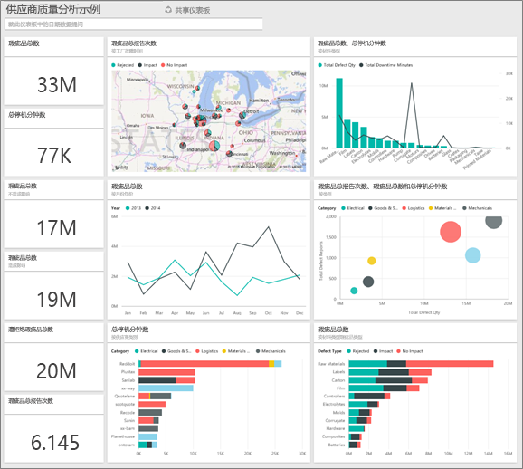

此示例是一系列教程的一部分，该系列教程阐明如何将 Power BI 与面向业务的数据、报表及仪表板搭配使用。
这些来自 obviEnce [(www.obvience.com)](http://www.obvience.com/) 的真实数据都已进行匿名处理。

## 先决条件

 必须先将示例下载为内容包、.pbix 文件或 Excel 工作簿，然后才能使用它。

### 获取内容包形式的此示例

1. 打开并登录 Power BI 服务 (app.powerbi.com)。
2. 在左下角，选择“**获取数据**”。
   
    
3. 在显示的“获取数据”页上选择“**示例**”图标。
   
   
4. 依次选择“供应商质量分析示例”和“连接”。  
  
   
   
5. Power BI 导入内容包，并将新的仪表板、报表和数据集添加到当前工作区。 新的内容会以黄色星号标记。 
   
   
  
### 获取 .pbix 文件形式的此示例

也可以将此示例下载为 .pbix 文件，这是专为 Power BI Desktop 量身定制的文件格式。 

 * [供应商质量分析示例](http://download.microsoft.com/download/8/C/6/8C661638-C102-4C04-992E-9EA56A5D319B/Supplier-Quality-Analysis-Sample-PBIX.pbix)

### 获取 Excel 工作簿形式的此示例
还可以针对此示例[仅下载该数据集（Excel 工作簿）](http://go.microsoft.com/fwlink/?LinkId=529779)。 该工作簿包含你可以查看和修改的 Power View 工作表。 若要查看原始数据，请选择“Power Pivot”>“管理”。

## 用料瑕疵所造成的停工时间
让我们来分析用料瑕疵所造成的停工时间，并查看应由哪些供应商负责。  

1. 在仪表板中，选择**瑕疵品总数**数字磁贴或**停工时间总分钟数**数字磁贴。  

   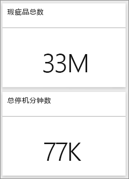  

   “供应商质量分析示例”报表会打开“停工时间分析”页面。 请注意，我们一共有 3300 万个瑕疵品，而这些瑕疵品所造成的停工时间总计为 77000 分钟。 虽然有些用料的瑕疵品较少，但它们会导致严重延误，从而导致停工时间更长。 让我们在报表页面上浏览这些项目。  
2. 查看**按用料类型划分的瑕疵品和停工时间(分钟)** 组合图中的**停工时间总分钟数**一行，我们发现起皱的用料会导致最多的停工时间。  
3. 选择相同组合图中的**起皱**列，查看哪些工厂受此瑕疵的影响最大，以及哪些供应商应负责。  

     
4. 选择地图中的个别工厂，查看哪家供应商或哪种用料该为这家工厂的停工时间负责。

### 哪些供应商最差？
 我们想要找出最差的八家供应商，并决定他们的停工时间百分比责任归属。 为此，我们可以将**按供应商划分的停工时间(分钟)** 分区图更改为树状图。  

1. 在报表的第 3 页“停工时间分析”中，选择左上角的**编辑报表**。  
2. 选择**按供应商划分的停工时间(分钟)** 分区图，并在“可视化效果”窗格中选择“树状图”。  

   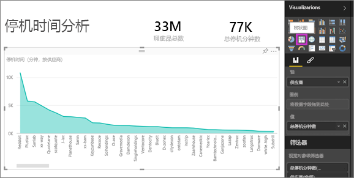  

    树状图会自动将**供应商**字段作为**组**。  

    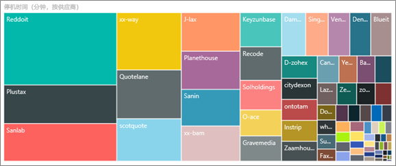  

   从此树状图中，我们可以看到前八个供应商是树状图左侧的八个区块。 我们也可以看到它们应为约 50% 的停工时间总分钟数承担责任。  
3. 在顶部导航栏中选择“供应商质量分析示例”，返回到仪表板。

### 工厂比较
现在让我们来探索哪些工厂在管理瑕疵用料方面表现较佳，从而缩短了停工时间。  

1. 选择**按工厂和瑕疵类型划分的总瑕疵报表**地图图块。  

    报表会打开“供应商质量”页面。  

   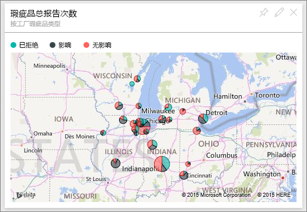  
2. 在地图图例中，选择**影响**圆圈。  

    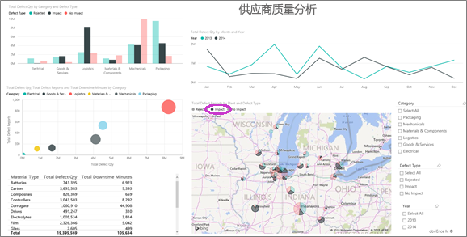  

    请注意，气泡图中的**物流**是最糟糕的类别 — 它在瑕疵品总量、总瑕疵报表和停工时间总分钟数上都居最高位置。 让我们进一步研究此类别。  
3. 在气泡图中选择“物流”气泡，并观察伊利诺斯州斯普林菲尔德市和内伯威尔市的工厂。 内伯威尔市似乎在管理瑕疵供货方面做得更好，因为它的退货量较高，影响量也较小，而斯普林菲尔德市的影响量就较大。  

   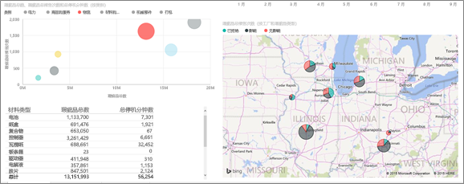  
4. 在顶部导航栏中选择“供应商质量分析示例”，返回到活动工作区。

## 哪种类型的用料管理最佳？
管理最佳的用料类型是指无论瑕疵品数量如何，都具有最低的停工时间或不造成任何影响的类型。

* 在仪表板中，查看**按用料类型和瑕疵类型划分的瑕疵品总数**磁贴。

  

请注意**原料**的瑕疵品总数很多，但大多数瑕疵品都会被退货或不造成任何影响。

由此确认，尽管瑕疵品数量高，原料仍不会造成大量的停工时间。

* 在仪表板中，查看**按用料类型划分的瑕疵品总数和停工时间总分钟数**磁贴。

  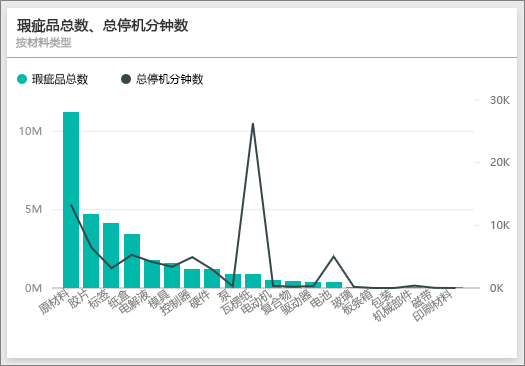

很显然，原料受到妥善管理：它们的瑕疵品虽然更多，但停工时间总分钟数较低。

### 按年份比较瑕疵品与停工时间的关系
1. 选择“按工厂和瑕疵类型划分的总瑕疵报表”地图图块，将报表打开至第一个报表页面“供应商质量”。
2. 请注意，2014 年的**瑕疵品数量**比 2013 年高。  

    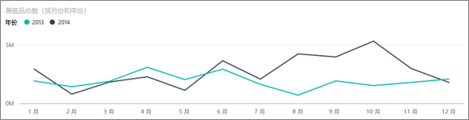  
3. 瑕疵品多代表停工时间一定也更多吗？ 我们可以在“问答”框中提问以找出答案。  
4. 在顶部导航栏中选择“供应商质量分析示例”，返回到仪表板。  
5. 既然我们知道“原料”具有最高数量的瑕疵品，可在问题框中键入“显示用料类型、年份和瑕疵品总数”。  

    2014 年的原料瑕疵品数量比 2013 年高很多。  

    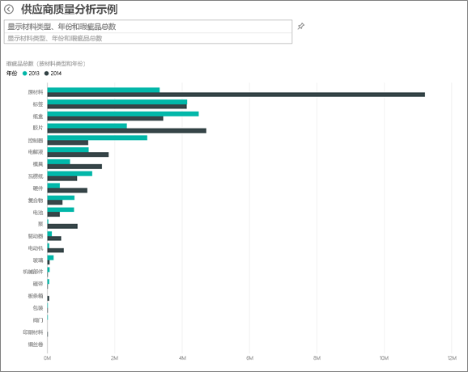  
6. 现在，将问题改为“显示用料类型、年份和停工时间总分钟数”。  

   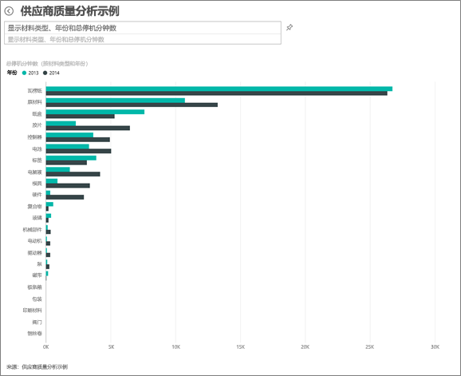

虽然 2014 年的原料瑕疵品更多，但 2013 年和 2014 年的原料停工时间差不多。

因此，即使 2014 年原料瑕疵品较多，也不会导致 2014 年的原料停工时间更长。

### 按月份比较瑕疵品与停工时间的关系
让我们看看另一个与瑕疵品总数相关的仪表板磁贴。  

1. 选择问题框上方左上角的返回箭头 ，返回仪表板。  

    进一步查看**按月份和年份划分的瑕疵品总数**磁贴，可发现 2014 年上半年的瑕疵品数与 2013 年非常接近，但 2014 年下半年的瑕疵品数大幅激增。  

    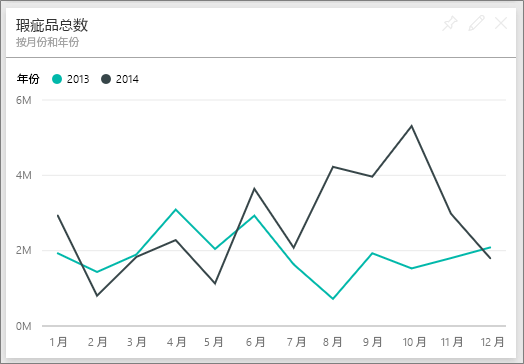  

    我们来看看瑕疵品数的增加是否会导致停工时间分钟数也跟着增加。  
2. 在问题框中键入“按月份和年份划分的停工时间总分钟数折线图”。  

   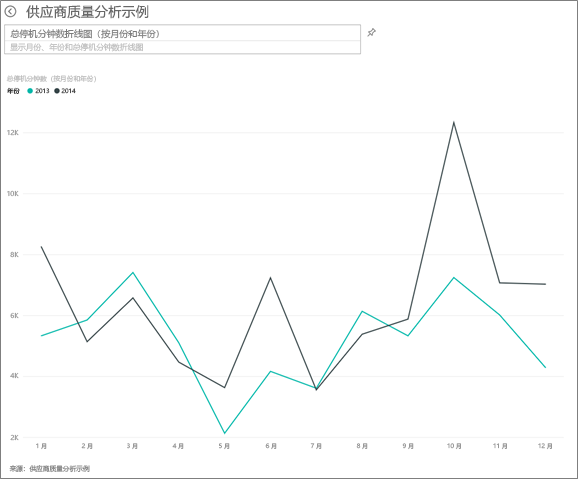

   在 6 月和 10 月间，我们发现停工时间分钟数大增，但除此之外，瑕疵品数并没有明显导致更长的停工时间。 这意味着我们管理瑕疵品的成效很好。  
3. 若要将此图表固定到仪表板，请选择问题框右侧的固定图标 。  
4. 若要浏览离群值月份，可提出问题（例如“工厂 10 月份的停工时间总分钟数”），按用料类型、工厂位置、类别等查看 10 月的停工时间分钟数。    
5. 选择问题框上方左上角的返回箭头 ，返回仪表板。

这是一个安全的试验环境。 你可以始终选择不保存所做的更改。 但是，如果保存更改，则可以始终转到**获取数据**来获取本示例的新副本。

## 后续步骤：连接到你的数据
我们希望本教程已经演示 Power BI 仪表板、问答和报表如何帮助深入了解供应商质量数据。 现在轮到你了 — 连接到你自己的数据。 借助 Power BI，你可以连接到各种数据源。 了解 [Power BI 入门](service-get-started.md)的详细信息。
