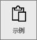
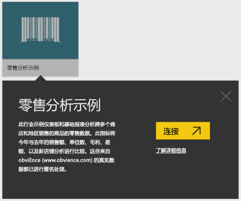
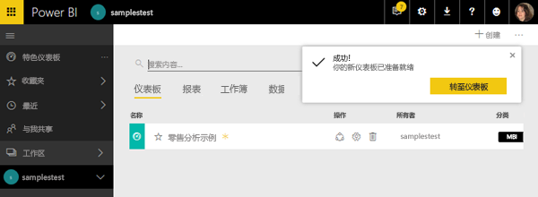
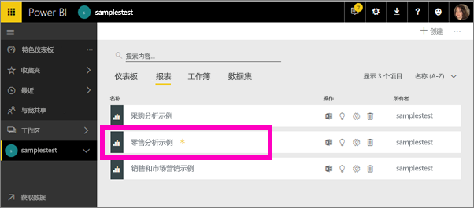
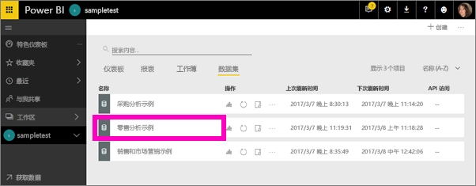
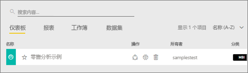
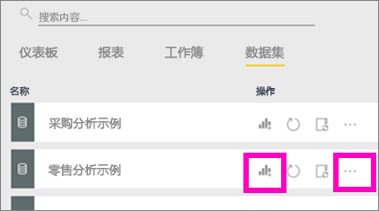
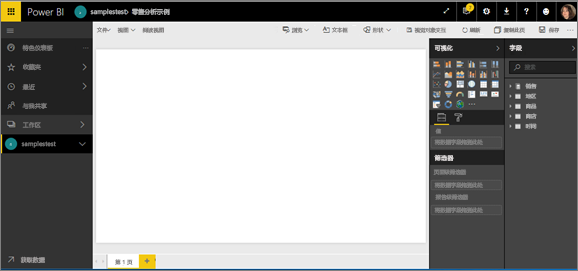

# Power BI 示例教程
<!-- Shared newnav Include -->
[!INCLUDE [newnavbydefault](./includes/newnavbydefault.md)]

我们建议从文章 [Power BI 示例数据集](sample-datasets.md)开始着手。 在本文章中，你将了解这些示例的全部信息；如何获取，在何处保存，如何使用这些示例，以及每个示例所表示的一些应用场景。 然后，请在了解基本知识后，再返回到本教程。   

## 关于本教程
本教程会告诉你如何导入示例内容包，如何将它们添加到 Power BI 服务，并打开内容。 内容包是一种示例类型，其中，数据集与仪表板和报表捆绑在一起。 使用获取数据即可从 Power BI 内获取这些示例内容包。

> [!NOTE]
> 本教程适用于 Power BI 服务，不适用于 Power BI Desktop。
> 
> 

本教程使用的零售分析示例内容包包含仪表板、报表和数据集。
为了熟悉此特定内容包及其应用场景，你可能需要在开始学习本教程之前先[浏览零售分析示例](sample-retail-analysis.md)。

## 获取数据（此处获取示例内容包）
1. 打开并登录到 Power BI 服务 (app.powerbi.com)。
2. 选择工作区，并创建新的仪表板。  
   
    
3. 将其命名为零售分析示例。
   
   
4. 在左侧导航窗格底部选择“获取数据”。 如果没有看到“获取数据”，请选择  展开导航窗格。
   
   
5. 选择“示例”。  
   
   
6. 选择“零售分析示例”，然后选择“连接”。   
   
   

## 到底导入了什么内容？
在选择“连接”时，借助示例内容包，Power BI 实际会导入该内容包的副本并将其存储在云中。 创建内容包的人员还会在其中包含数据集、报表和仪表板，而这些正是当你单击“连接”时所获取的内容。

1. Power BI 会创建新的仪表板并将其列在“仪表板”选项卡上。通过标注黄色星号，让你知道它是新建的。
   
   
2. 打开“报表”选项卡。你将在此处看到名为零售分析示例的新报表。
   
   
   
   点击“数据集”选项卡。还会出现新的数据集。
   
   

## 浏览新内容
现在可以自行浏览仪表板、数据集和报表。 有多种不同方法可以导航到仪表板、报表和数据集，下面将介绍其中一种方法。  

> [!TIP]
> 希望首先获得详细的指导？  请尝试[浏览零售分析示例](sample-retail-analysis.md)，了解有关此示例的分步演练。
> 
> 

1. 导航返回到“仪表板”选项卡并选择“零售分析示例”仪表板以将其打开。    
   
   
2. 将打开此仪表板。  它具有各种可视化效果磁贴。
   
   
3. 选择其中一个磁贴以打开基础报表。  在此示例中，我们将选择分区图（上图中以粉色突出显示）。 报表会打开包含该分区图的页面。
   
    
   
   > [!NOTE]
   > 如果磁贴是使用 [Power BI 问答](service-q-and-a.md)创建的，则会改为打开问答页面。
   > 
   > 
4. 重新返回“数据集”选项卡，你有多种选项可用于浏览数据集。  你将无法打开它和查看所有的行和列（在 Power BI Desktop 或 Excel 中可以执行这些操作）。  如果有人与同事共享内容包，他们通常想要共享见解，而不是让其同事直接访问数据。 但这并不意味着你不能浏览数据集。  
   
   
   
   * 浏览数据集的一种方法是从头开始创建你自己的可视化效果和报表。  选择图表图标  打开处于报表编辑模式的数据集。
     
       
   * 浏览数据集的另一种方法是运行[快速见解](service-insights.md)。 选择省略号 (…) 并选择“获取见解”。 见解就绪后，选择“查看见解”。
     
       

## 后续步骤
[Power BI 基本概念](service-basic-concepts.md)

[Power BI 服务示例](sample-datasets.md)

[Power BI 数据源](service-get-data.md)

更多问题？ [尝试参与 Power BI 社区](http://community.powerbi.com/)

