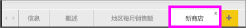
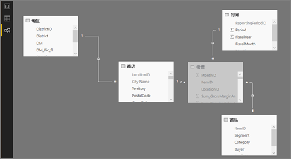

# Power BI 示例

我们建议从文章 [Power BI 示例数据集](sample-datasets.md)开始着手。 在本文章中，你将了解这些示例的全部信息；如何获取，在何处保存，如何使用这些示例，以及每个示例所表示的一些应用场景。 然后，请在了解基本知识后，再返回到本教程。   

### 先决条件
Power BI 服务和 Power BI Desktop 均支持该示例。 要继续学习，我们将使用零售分析示例。

本教程使用的零售分析示例内容包包含仪表板、报表和数据集。
为了熟悉此特定内容包及其应用场景，你可能需要在开始学习本教程之前先[浏览零售分析示例](sample-retail-analysis.md)。

## 关于本教程
本教程教你如何 
- 导入示例内容包、将其添加到 Power BI 服务、以及打开内容。 内容包是一种示例类型，其中，数据集与仪表板和报表捆绑在一起。 
-  在 Power BI Desktop 中打开示例 .pbix 文件。

## 示例和 Power BI 服务

1. 打开并登录到 Power BI 服务 (app.powerbi.com)。
2. 选择左侧导航窗格底部的**获取数据**。 如果没有看到“获取数据”，请选择  展开导航窗格。
   
   
5. 选择“示例”。  
   
   
6. 选择“零售分析示例”，然后选择“连接”。   
   
   

## 到底导入了什么内容？
在选择“连接”时，借助示例内容包，Power BI 实际会导入该内容包的副本并将其存储在云中。 创建内容包的人员还会在其中包含数据集、报表和仪表板，而这些正是当你单击“连接”时所获取的内容。 

1. Power BI 会创建新的仪表板并将其列在“仪表板”选项卡上。通过标注黄色星号，让你知道它是新建的。
   
   
2. 打开“报表”选项卡。你将在此处看到名为零售分析示例的新报表。
   
   
   
   点击“数据集”选项卡。还会出现新的数据集。
   
   

## 浏览新内容
现在可以自行浏览仪表板、数据集和报表。 有多种不同方法可以导航到仪表板、报表和数据集，下面将介绍其中一种方法。  

> [!TIP]
> 希望首先获得详细的指导？  请尝试[浏览零售分析示例](sample-retail-analysis.md)，了解有关此示例的分步演练。
> 
> 

1. 导航返回到“仪表板”选项卡并选择“零售分析示例”仪表板以将其打开。    
   
   
2. 将打开此仪表板。  它具有各种可视化效果磁贴。
   
   
3. 选择其中一个磁贴以打开基础报表。  在此示例中，我们将选择分区图（上图中以粉色突出显示）。 报表会打开包含该分区图的页面。
   
    
   
   > [!NOTE]
   > 如果磁贴是使用 [Power BI 问答](power-bi-q-and-a.md)创建的，则会改为打开问答页面。 如果磁贴是[从 Excel 固定](service-dashboard-pin-tile-from-excel.md)的，则 Excel Online 将在 Power BI 内打开。
   > 
   > 
1. 重新返回“数据集”选项卡，你有多种选项可用于浏览数据集。  你将无法打开它和查看所有的行和列（在 Power BI Desktop 或 Excel 中可以执行这些操作）。  如果有人与同事共享内容包，他们通常想要共享见解，而不是让其同事直接访问数据。 但这并不意味着你不能浏览数据集。  
   
   
   
   * 浏览数据集的一种方法是从头开始创建你自己的可视化效果和报表。  选择图表图标  打开处于报表编辑模式的数据集。
     
       
   * 浏览数据集的另一种方法是运行[快速见解](service-insights.md)。 选择省略号 (…) 并选择“获取见解”。 见解就绪后，选择“查看见解”。
     
       

## 示例和 Power BI Desktop 
首次打开示例 PBIX 文件时，它将在报表视图中显示，可在其中浏览、创建和修改可视化效果中的任何报表页数。 报表视图所提供的设计体验与 Power BI 服务中报表的编辑视图所提供的几乎相同。 可四处移动可视化内容，进行复制粘贴、合并等。

两者的区别在于当使用 Power BI Desktop 时，可运用查询并对数据建模以确保数据支持报表中的最佳见解。 无论在本地驱动器还是云中，都可在任何位置保存 Power BI Desktop 文件。

1. 打开 Power BI Desktop 中的[零售分析示例 .pbix 文件](http://download.microsoft.com/download/9/6/D/96DDC2FF-2568-491D-AAFA-AFDD6F763AE3/Retail%20Analysis%20Sample%20PBIX.pbix)。 

    

1. 将在报表视图中打开该文件。 注意到报表编辑器底部的 4 个选项卡了吗？ 这意味着该报表有 4 页，且“新商店”页面当前处于选中状态。 

    。

3. 若要深入了解报表编辑器，请参阅[报表编辑器教程](service-the-report-editor-take-a-tour.md)

## 到底导入了什么内容？
在 Desktop 中打开示例 PBIX 文件时，Power BI 实际会导入该数据的副本并将其存储在云中。 在 Desktop 中，你拥有访问报表和基础数据集的权限。 在加载数据时，Power BI Desktop 将尝试为你查找并创建关系。  

1. 选择表图标  切换到[数据视图](desktop-data-view.md)。
 
    

    数据视图有助于你检查、浏览和了解 Power BI Desktop 模型中的数据。 它与你在查询编辑器中查看表、列和数据的方式不同。 在数据视图中，你所看到的数据是在将其加载到模型之后的样子。

    建模数据时，有时想要在报表画布上未创建视觉对象的情况下，查看表或列中的实际内容，通常会查看到行级别。 特别是当你要创建度量值和计算列时，或者需要识别数据类型或数据类别时。

1. 选择图标  切换到[关系视图](desktop-relationship-view.md)。
 
    

    关系视图显示模型中的所有表、列和关系。 从此处，可以查看、更改和创建关系。

## 浏览新内容
现在可以自行浏览数据集、关系和报表。 有关入门帮助，请参阅 [Desktop 入门指南](desktop-getting-started.md)。    

## 后续步骤
[Power BI 基本概念](service-basic-concepts.md)

[Power BI 服务示例](sample-datasets.md)

[Power BI 数据源](service-get-data.md)

更多问题？ [尝试参与 Power BI 社区](http://community.powerbi.com/)

