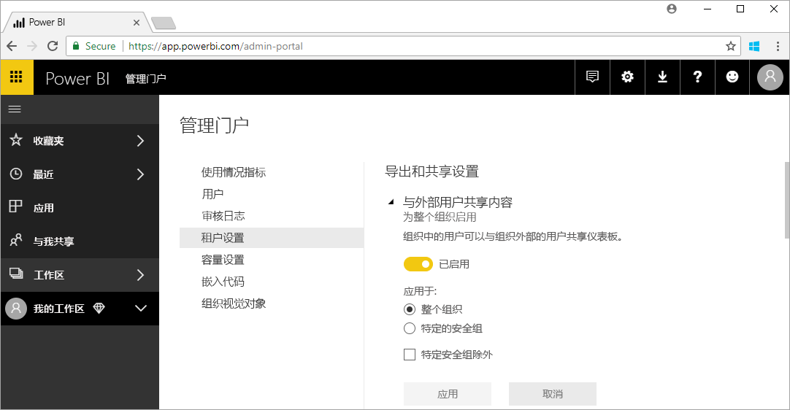

# 什么是 Power BI 管理？

Power BI 管理指的是 Power BI 租户管理，包括配置管理策略、使用情况监视以及许可证、容量和组织资源预配。 本文概述了管理角色、任务和工具；并提供了可以获取更多详细信息的文章链接。

Power BI 旨在用于自助式商业智能，而管理员是 Power BI 租户中数据、过程以及策略的保护者。 Power BI 管理员是团队的关键成员，包括 BI 开发人员、分析人员以及其他角色。 管理员可为组织提供支持帮助，以确保实现关键目标：

- 了解用户_实际_需要的 KPI 和指标
- 减少以 IT 为主导的企业报告的传递时间
- 通过 Power BI 部署增加采用率和投资回报

这项工作旨在提高业务用户的工作效率，并确保安全性和法律及法规的合规性。 职责可能包括提供帮助和支持，并在许多情况下，帮助业务用户执行正确操作。

## 与 Power BI 相关的管理员角色

有与 Power BI 管理相关的多个角色，如下表所述。

| **管理员类型** | **管理范围** | **Power BI 范围** |
| --- | --- | --- |
| Office 365 全局管理员 | Office 365 | 可以管理 Power BI 租户和其他服务的所有方面。 |
| Office 365 账务管理员 | Office 365 | 可以通过 Office 365 订阅获取 Power BI 许可证。 |
| Power BI 服务管理员 | Power BI 租户 | 可以完全控制对 Power BI 租户及其管理功能（授权除外）。 |
| Power BI Premium 容量管理员 | 单个 Premium 容量 | 可以完全控制高级容量及其管理功能。 |
| Power BI Embedded 容量管理员 | 单个 Embedded 容量 | 可以完全控制嵌入容量及其管理功能。 |

Office 365 或 Azure Active Directory 中的全局管理员在 Power BI 中具有管理员权限。 Office 365 全局管理员可以将其他用户分配到 Power BI 服务管理员角色，它仅对 Power BI 功能授予管理权限。

Power BI 服务管理员有权访问 Power BI 管理门户，其中包括有关功能、安全和监视的各种租户级设置。 服务管理员具有对 Power BI 租户所有资源的完全访问权限。 在大多数情况下，服务管理员确定问题，然后跟进资源所有者以便采取纠正措施。

Power BI 服务管理员角色不授予将许可证分配给用户或在 Office 365 中查看审核日志的功能。 因此，作为 Power BI 服务管理员角色单独成员的用户当前无法执行管理 Power BI 的任务。

## 管理任务

管理员执行许多任务来支持其组织的 Power BI 租户，如下表所述。

| **任务区域** | **典型任务** |
| --- | --- |
| 管理 Power BI 租户 |<ul><li>启用和禁用主要的 Power BI 功能 <li>报告使用情况和性能 <li>查看和管理事件审核</ul>|
| 获取和分配 Power BI 许可证 |<ul><li>管理用户注册 <li>购买和分配 Pro 许可证 <li>阻止用户访问 Power BI</ul>|
| 管理 Premium 容量 |<ul><li>获取和使用 Premium 容量 <li>确保服务质量|
| 管理 Embedded 容量 |<ul><li>获取 Embedded 容量来简化 ISV 和开发人员对 Power BI 功能的使用</ul>|
| 确保符合内部策略、法律和法规 | <ul><li>管理业务数据分类 <li>帮助强制实施内容发布和共享策略</ul>|
| 管理 Power BI 资源 |<ul><li>管理工作区 <li>发布自定义视觉对象 <li>验证用于在其他应用程序中嵌入 Power BI 的代码|
| 为租户用户提供帮助和支持 |<ul><li>数据访问和其他问题疑难解答</ul>|
| 其他任务 |<ul><li>部署 Power BI Desktop，例如，使用 System Center Configuration Manager <li>使用 Intune 管理 Power BI 移动应用部署 <li>管理数据隐私和安全，如源数据安全</ul>|

## 管理工具

有与 Power BI 管理相关的多个工具，如下表所述。 管理员通常在 Power BI 管理门户中花费大部分时间，并根据需要使用其他工具。

| **工具** | **典型任务** |
| --- | --- |
| Power BI 管理门户 |<ul><li>阻止用户访问 Power BI <li>获取和使用 Premium 容量 <li>确保服务质量 <li>管理业务数据分类 <li>帮助强制实施内容发布和共享策略 <li>管理工作区 <li>发布自定义视觉对象 <li>验证用于在其他应用程序中嵌入 Power BI 的代码 <li>数据访问和其他问题疑难解答</ul>|
| Office 365 管理中心 |<ul><li>管理用户注册 <li>购买和分配 Pro 许可证</ul>|
| Office 365 安全与合规中心 |<ul><li>查看和管理事件审核</ul>|
| Azure 门户中的 Azure Active Directory (AAD) |<ul><li>通过 AAD 配置对 Power BI 资源的条件访问 <li>设置 Power BI Embedded 容量</ul>|
| PowerShell cmdlet |<ul><li>通过脚本管理工作区和 Power BI 的其他方面</ul>|
| 管理 API |<ul><li>生成自定义管理工具，以便为 Power BI 管理员的工作提供便利。例如，Power BI Desktop 可以使用这些 API 基于与管理相关的数据来构建报表</ul>|

## 后续步骤

我们希望你通过本文快速深入了解 Power BI 管理员的工作，以及所涉及的特定角色、任务和工具。 建议参阅以下两个主题进行深入了解。

[使用 Power BI 管理门户](service-admin-portal.md)

[Power BI 管理常见问题](service-admin-faq.md)

更多问题？ [尝试咨询 Power BI 社区](http://community.powerbi.com/)

