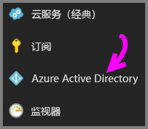
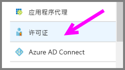
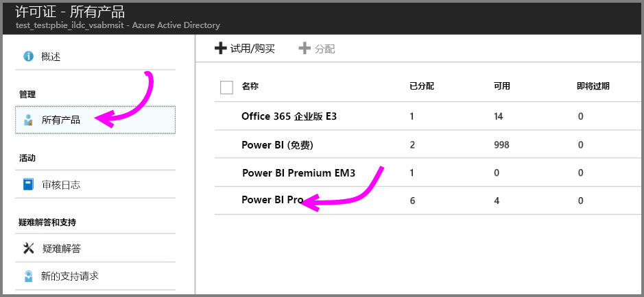
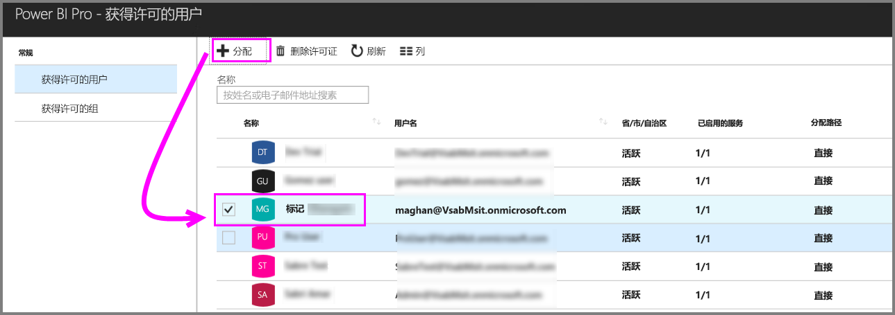

# 快速入门：在 Azure 中分配 Power BI Pro 许可证

Power BI Pro 是单个许可证，允许访问 Power BI 服务中的所有内容和功能，包括共享内容以及与其他 Pro 用户协作的功能。 只有 Pro 用户可以将内容发布到应用工作区，使用这些内容，共享仪表板并订阅仪表板及报表。 本文介绍了如何在 Azure 中分配 Power BI Pro 许可证。 还可以[在 Office 365 中分配许可证](service-admin-assigning-power-bi-pro-licenses.md)。

## 先决条件

你必须是 Power BI 用于 Active Directory 查找的 Azure 订阅的所有者。

开始之前，你必须[至少购买一个许可证](service-admin-purchasing-power-bi-pro.md)。

## 将许可证分配给个人用户帐户

按照以下步骤将 Power BI Pro 许可证分配给个人用户帐户：

1. 打开 [Azure 门户](https://ms.portal.azure.com/#@microsoft.onmicrosoft.com/dashboard/private/39bc3cf7-31a4-43f6-954c-f2d69ca2f0)。 

2. 在左侧导航栏中，选择“Azure Active Directory”。

    

3. 在“Azure Active Directory”下，选择“许可证”。

    

4. 在“许可证”下，选择“所有产品”，然后选择“Power BI Pro”以显示许可用户列表。

    

5. 选择“分配”将 Power BI Pro 许可证添加到其他用户帐户。

    

## 后续步骤

现已分配许可证，可以了解有关 Power BI Pro 的详细信息。

[组织中的 Power BI Pro](service-admin-power-bi-pro-in-your-organization.md)

[查找已登录的 Power BI 用户](service-admin-access-usage.md)

更多问题？ [尝试咨询 Power BI 社区](https://community.powerbi.com/)