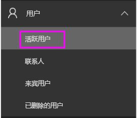
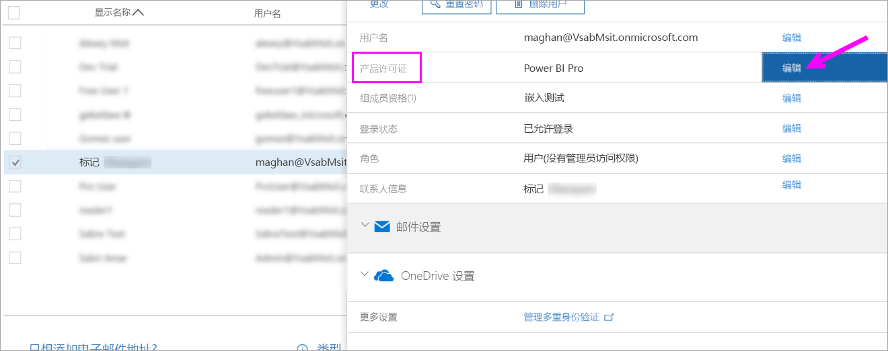
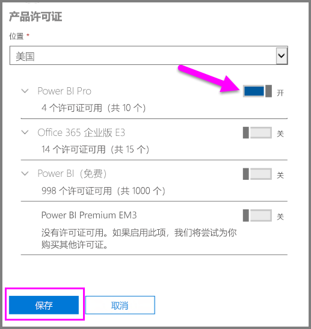
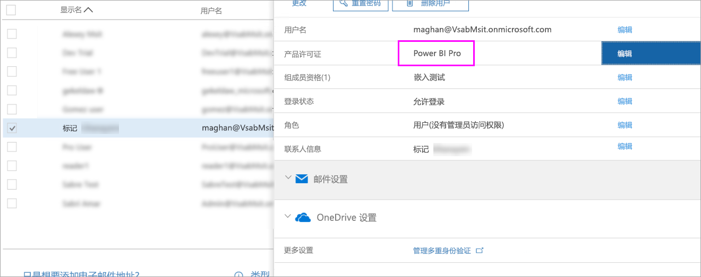

# 快速入门：在 Office 365 中分配 Power BI Pro 许可证

Power BI Pro 是单个许可证，允许访问 Power BI 服务中的所有内容和功能，包括共享内容以及与其他 Pro 用户协作的功能。 只有 Pro 用户可以将内容发布到应用工作区，使用这些内容，共享仪表板并订阅仪表板及报表。 本文介绍了如何在 Office 365 中分配 Power BI Pro 许可证。 还可以[在 Azure 中分配许可证](service-admin-assigning-power-bi-pro-licenses-azure.md)。

## 先决条件

你必须是 Office 365 中[全局管理员或用户帐户管理员](https://support.office.com/article/about-office-365-admin-roles-da585eea-f576-4f55-a1e0-87090b6aaa9d?ui=en-US&rs=en-US&ad=US)角色的成员。

开始之前，你必须[至少购买一个许可证](service-admin-purchasing-power-bi-pro.md)。

## 将许可证分配给个人用户帐户

按照以下步骤将 Power BI Pro 许可证分配给个人用户帐户：

1. 打开 [Office 365 管理中心](https://portal.office.com/adminportal/home#/homepage)。

2. 在左侧导航窗格中，展开“用户”，然后选择“活动用户”。

    

3. 选择一个用户，然后在“产品许可证”下选择“编辑”。

    

4. 在“Power BI Pro”下将设置切换为“开”，然后选择“保存”。

    

5. 根据所选帐户的**状态**，验证 Power BI Pro 许可证是否成功分配。

    

## 后续步骤

现已分配许可证，可以了解有关 Power BI Pro 的详细信息。

[组织中的 Power BI Pro](service-admin-power-bi-pro-in-your-organization.md)

[查找已登录的 Power BI 用户](service-admin-access-usage.md)

更多问题？ [尝试咨询 Power BI 社区](https://community.powerbi.com/)