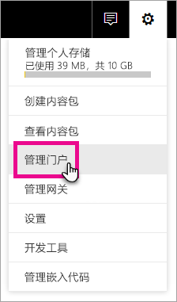
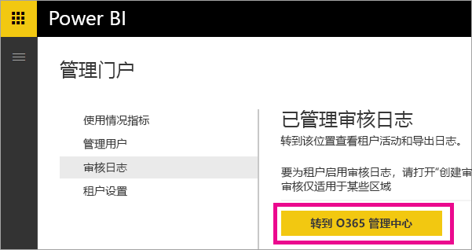
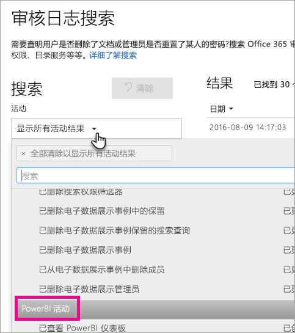
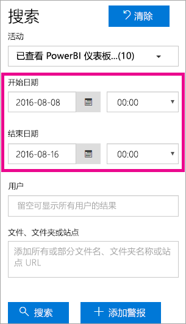
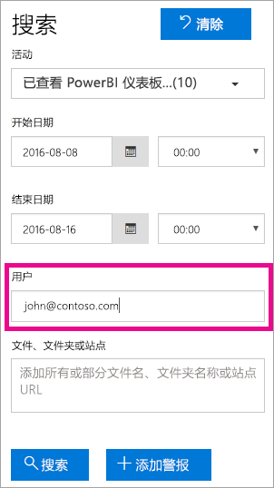
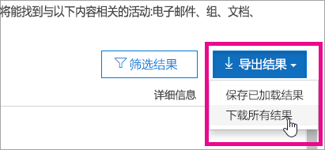

# <a name="using-auditing-within-your-organization"></a>在组织内使用审核

<iframe width="560" height="315" src="https://www.youtube.com/embed/zj4kA39jV_4?showinfo=0" frameborder="0" allowfullscreen></iframe>

了解如何使用 Power BI 的审核功能来监测和调查采取的操作。 可以使用安全与合规中心或使用 PowerShell。

了解 Power BI 租户中谁正在对何项目执行何种操作对帮助组织满足其需求非常关键（如满足法规遵从性和记录管理需求）。

可按日期范围、用户、仪表板、报表、数据集和活动类型筛选审核数据。 还可将活动下载到 CSV（逗号分隔值）文件供脱机分析。

> [!NOTE]
> Power BI 中的审核功能处于预览阶段，适用于所有数据区域。

## <a name="enabling-auditing-functionality-in-the-power-bi-admin-portal"></a>在 Power BI 管理门户中启用审核功能

需要为组织启用审核才能使用这些报表。 可在管理门户的租户设置中执行此操作。

1. 选择右上角的“齿轮图标”。

2. 选择**管理门户**。
   
   

3. 选择“租户设置”。
   
   

4. 开启“为内部活动审核和合规目的创建审核日志”。

5. 选择**应用**。

Power BI 开始记录你的用户在 Power BI 中执行的各种活动。 日志将在 48 小时内显示于 O365 安全与合规中心。 有关所记录活动的详细信息，请参阅 [Power BI 审核的活动列表](#list-of-activities-audited-by-power-bi)。

> [!NOTE]
> 若要在租户中启用 Power BI 审核功能，则租户中需要至少有一个 Exchange 邮箱许可证。

## <a name="accessing-your-audit-logs"></a>访问审核日志

若要审核 Power BI 日志，必须访问 O365 安全与合规中心。

1. 选择右上角的“齿轮图标”。

2. 选择**管理门户**。
   
   

3. 选择“审核日志”。
4. 
5. 选择“转到 O365 管理中心”。
   
   

或者，可以浏览到 [Office 365 | 安全与合规](https://protection.office.com/#/unifiedauditlog)。

> [!NOTE]
> 若要对非管理员帐户提供审核日志的访问权限，则必须在 Exchange Online 管理中心内分配权限。 例如，可以将用户分配至“组织管理”等现有角色组，或者可以创建一个新的包含“审核日志”角色的角色组。 有关详细信息，请参阅 [Exchange Online 中的权限](https://technet.microsoft.com/library/jj200692\(v=exchg.150\).aspx)。

## <a name="search-only-power-bi-activities"></a>仅搜索 Power BI 活动

执行以下操作可将结果限制为仅含 Power BI 活动。

1. 在“审核日志搜索”页上，选择“搜索”下的“活动”下拉列表。

2. 选择“PowerBI 活动”。
   
   

3. 选择选框外任意位置以将其关闭。

搜索现仅筛选 Power BI 活动。

## <a name="search-the-audit-logs-by-date"></a>按日期搜索审核日志

可使用“开始日期”和“结束日期”字段按日期范围搜索日志。 默认选择过去七天。 将以协调世界时 (UTC) 格式显示日期和时间。 可以指定的最大日期范围为 90 天。 如果所选日期范围大于 90 天，将显示错误。

> [!NOTE]
> 如果使用最大日期范围 90 天，请选择当前时间作为“开始日期”。 否则将收到错误，提醒开始日期早于结束日期。 如果你在最近 90 天内开启了审核，则最大日期范围不能从开启审核的日期之前开始。



## <a name="search-the-audit-logs-by-users"></a>按用户搜索审核日志

可搜索特定用户所执行活动的审核日志条目。 若要执行此操作，请在“用户”字段中输入一个或多个用户名。  即其用于登录 Power BI 的用户名。 其外观类似电子邮件地址。
将此框留空以返回组织中所有用户（和服务帐户）的条目。



## <a name="viewing-search-results"></a>查看搜索结果

点击搜索按钮后，将加载搜索结果并随即将其显示在“结果”之下。 搜索完成后，将显示找到的结果数。 

> [!NOTE]
> 将显示最多 1000 个事件；如果满足搜索条件的事件超过 1000 个，则会 显示最新的 1000 个事件。

结果包含有关搜索返回的每个事件的以下信息。

| **列** | **定义** |
| --- | --- |
| 日期 |事件发生的日期和时间（UTC 格式）。 |
| IP 地址 |记录活动记时所用设备的 IP 地址。 IP 地址以 IPv4 或 IPv6 地址格式显示。 |
| 用户 |执行触发该事件的操作的用户（或服务帐户）。 |
| 活动 |用户执行的活动。 此值对应于“活动”下拉列表所选的活动。 对于来自于 Exchange 管理审核日志的事件，此列中的值为 Exchange cmdlet。 |
| 项 |相应活动导致创建或修改的对象。 例如，已查看或修改的文件，或已更新的用户帐户。 并非所有活动在此列中都具有值。 |
| 详细信息 |有关活动的其他详细信息。 同样，并非所有活动都具有此值。 |

> [!NOTE]
> 在“结果”下选择一个列标题以对结果进行排序。 可按从 A 到 Z 或从 Z 到 A 的顺序对结果进行排序。单击“日期”标题可按从旧到新或从新到旧的顺序对结果进行排序。

## <a name="view-the-details-for-an-event"></a>查看事件的详细信息

在搜索结果列表中选择事件记录，可查看有关该事件的更多详细信息。 随即显示详细信息页，该页包含事件记录中的详细属性。 所显示的属性取决于事件发生于的 Office 365 服务。 若要显示其他详细信息，请选择“更多信息”。

下表详细介绍了可能会显示的内容。

| **参数或事件** | **说明** | **其他详细信息** |
| --- | --- | --- |
| 已下载 Power BI 报表 |每次下载报表时都将记录此活动 |报表名称、数据集名称 |
| 创建报表 |每次创建新的报表时都将记录此活动。 |报表名称、数据集名称 |
| 编辑报表 |每次编辑报表时都将记录此活动。 |报表名称、数据集名称 |
| 创建数据集 |每次创建数据集时都将记录此活动。 |数据集名称、DataConnectivityMode |
| 删除数据集 |每次删除数据集时都将记录此活动。 |数据集名称、DataConnectivityMode |
| 创建 Power BI 应用 |每次创建 Power BI 应用时都将记录此活动 |应用名称、权限、工作区名称 |
| 安装 Power BI 应用 |每次安装 Power BI 应用时都将记录此活动 |应用名称 |
| 更新 Power BI 应用 |每次更新 Power BI 应用时都将记录此活动 |应用名称、权限、工作区名称 |
| 已启动 Power BI 延期试用版 |每次用户接受运行有效期至 2018 年 5 月 31 日的 Pro 延期试用版时都将记录此活动 | |
| 已分析 Power BI 数据集 |每次在 Excel 中分析 Power BI 数据集时都将记录此活动。 | |
| 已创建 Power BI 网关 |每次创建新的网关时都将记录此活动。 |网关名称、网关类型 |
| 已删除 Power BI 网关 |每次删除网关时都将记录此活动。 |网关名称、网关类型 |
| 已将数据源添加到 Power BI 网关 |每次将数据源添加到网关时都将记录此活动 |网关名称、网关类型、数据源名称、数据源类型 |
| 已从 Power BI 网关删除数据源 |每次从网关删除数据源时都将记录此活动 |网关名称、网关类型、数据源名称、数据源类型 |
| 已更改 Power BI 网关管理员 |每次更改（添加/删除）网关的管理员时都会记录此活动 |网关名称、添加的用户、删除的用户 |
| 已更改 Power IB 网关数据源用户 |每次更改（添加/删除）网关的用户时都会记录此活动 |网关名称、添加的用户、删除的用户 |
| SetScheduledRefresh |每次为数据集安排新的计划刷新时都将记录此活动 |数据集名称、刷新频率（以分钟为单位） |

## <a name="using-powershell-to-search"></a>使用 PowerShell 进行搜索

可以使用 PowerShell 基于你的登录访问审核日志。 该操作通过访问 Exchange Online 完成。 以下是拉取 Power BI 审核日志条目的命令示例。

> [!NOTE]
> 为了使用 New-PSSession 命令，你的帐户需要分配有一个 Exchange Online 许可证，并且你需要访问租户的审核日志。

```
Set-ExecutionPolicy RemoteSigned

$UserCredential = Get-Credential

$Session = New-PSSession -ConfigurationName Microsoft.Exchange -ConnectionUri https://outlook.office365.com/powershell-liveid/ -Credential $UserCredential -Authentication Basic -AllowRedirection

Import-PSSession $Session
Search-UnifiedAuditLog -StartDate 9/11/2016 -EndDate 9/15/2016 -RecordType PowerBI -ResultSize 1000 | Format-Table | More
```

有关连接到 Exchange Online 的详细信息，请参阅[连接到 Exchange Online PowerShell](https://technet.microsoft.com/library/jj984289\(v=exchg.160\).aspx)。

有关 Search-UnifiedAuditLog 命令的参数和使用方法的详细信息，请参阅 [Search-UnifiedAuditLog](https://technet.microsoft.com/library/mt238501\(v=exchg.160\).aspx)。

若要查看使用 PowerShell 搜索审核日志，然后基于条目分配 Power BI Pro 许可证的示例，请参阅 [Using Power BI audit log and PowerShell to assign Power BI Pro licenses](https://powerbi.microsoft.com/blog/using-power-bi-audit-log-and-powershell-to-assign-power-bi-pro-licenses/)（使用 Power BI 审核日志和 PowerShell 以分配 Power BI Pro 许可证）。

## <a name="export-the-power-bi-audit-log"></a>导出 Power BI 审核日志

可将 Power BI 审核日志导出到 CSV 文件。

1. 选择“导出结果”。

2. 选择“保存已加载结果”或“下载所有结果”。
   
   

## <a name="record-and-user-types"></a>记录类型和用户类型

审核日志条目会将 RecordType 和 UserType 作为条目详细信息的一部分。 所有 Power BI 条目都将具有值为 20 的 RecordType。

有关完整列表，请参阅 [Office 365 审核日志中的详细属性](https://support.office.com/article/Detailed-properties-in-the-Office-365-audit-log-ce004100-9e7f-443e-942b-9b04098fcfc3)

## <a name="list-of-activities-audited-by-power-bi"></a>Power BI 审核的活动列表

| 活动 | 说明 | 更多详情 |
| --- | --- | --- |
| CreateDashboard |每次创建新仪表板时都将记录此活动。 |- 仪表板名称。 |
| EditDashboard |每次重命名仪表板时都将记录此活动。 |- 仪表板名称。 |
| DeleteDashboard |每次删除仪表板时都将记录此活动。 |- 仪表板名称。 |
| PrintDashboard |每次打印仪表板时都将记录该事件。 |- 仪表板名称。<br/>- 数据集名称 |
| ShareDashboard |每次共享仪表板时都将记录此活动。 |- 仪表板名称。<br/>-收件人电子邮件。<br/>- 数据集名称。<br>- 重新共享权限。 |
| ViewDashboard |每次查看仪表板时都将记录此活动。 |- 仪表板名称。 |
| ExportTile |每次从仪表板磁贴中导出数据时都会记录该事件。 |- 磁贴名称。<br/>- 数据集名称。 |
| DeleteReport |每次删除报表时都将记录此活动。 |- 报表名称。 |
| ExportReport |每次从报表磁贴中导出数据时都会记录该事件。 |- 报表名称。<br/>- 数据集名称。 |
| PrintReport |每次打印报表时都将记录该事件。 |- 报表名称。<br/>- 数据集名称。 |
| PublishToWebReport |每次将报表发布到 Web 时都将记录该事件。 |- 报表名称。<br/>- 数据集名称。 |
| ViewReport |每次查看报表时都将记录此活动。 |- 报表名称。 |
| ExploreDataset |每次选中数据集进行浏览时都将记录该事件。 |- 数据集名称 |
| DeleteDataset |每次删除数据集时都将记录该事件。 |- 数据集名称。 |
| CreateOrgApp |每次创建组织内容包时都将记录此活动。 |- 组织内容包名称。<br/>- 仪表板名称。<br/>- 报表名称。<br/>- 数据集名称。 |
| CreateGroup |每次创建组时都将触发此活动。 |- 组名称。 |
| AddGroupMembers |每次将成员添加到 Power BI 组工作区时都将记录此活动。 |- 组名称。<br/>- 电子邮件地址。 |
| UpdatedAdminFeatureSwitch |每次更改管理功能开关时都将记录该事件。 |- 开关名称。<br/>- 新的开关状态。 |
| OptInForProTrial |当用户选择在服务中试用 Power BI Pro，将记录此事件。 |- 电子邮件地址 |

## <a name="next-steps"></a>后续步骤

[Power BI 管理门户](service-admin-portal.md)  
[Power BI Premium 有哪些特权？](service-premium.md)  
[购买 Power BI Pro](service-admin-purchasing-power-bi-pro.md)  
[Exchange Online 中的权限](https://technet.microsoft.com/library/jj200692\(v=exchg.150\).aspx)  
[连接到 Exchange Online PowerShell](https://technet.microsoft.com/library/jj984289\(v=exchg.160\).aspx)  
[Search-UnifiedAuditLog](https://technet.microsoft.com/library/mt238501\(v=exchg.160\).aspx)  
[Office 365 审核日志中的详细属性](https://support.office.com/article/Detailed-properties-in-the-Office-365-audit-log-ce004100-9e7f-443e-942b-9b04098fcfc3)  

更多问题？ [尝试咨询 Power BI 社区](http://community.powerbi.com/)