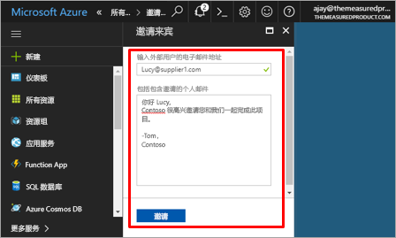
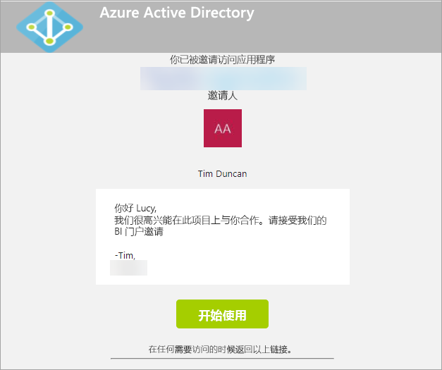
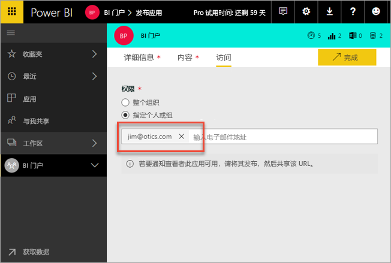
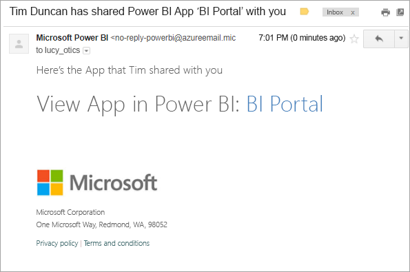
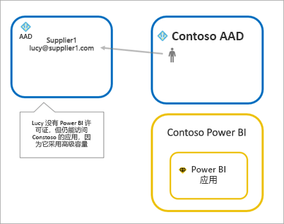
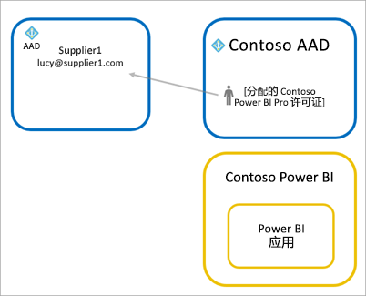
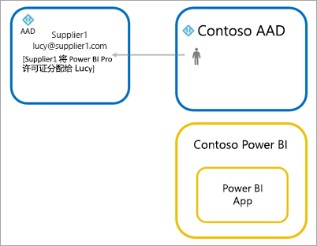

# 使用 Azure AD B2B 将 Power BI 内容分发给外部来宾用户

Power BI 与 Azure Active Directory 企业到企业 (Azure AD B2B) 集成后，即可将 Power BI 内容安全地分发给组织外的来宾用户，同时仍然可以控制内部数据。

> [!VIDEO https://www.youtube.com/embed/xxQWEQ1NnlY]

> [!NOTE]
> 邀请来宾用户之前，需要在 Power BI 管理门户的“租户”设置中启用[导出和共享设置](service-admin-portal.md#export-and-sharing-settings)。

> [!NOTE]
> 此功能目前不可用于 Power BI 移动应用。 在移动设备上，你可以在浏览器中查看使用 Azure AD B2B 共享的 Power BI 内容。 

## 可以邀请哪些用户？

可邀请使用任意电子邮件地址（包括个人帐户，如 gmail.com、outlook.com 或 hotmail.com）的来宾用户。在 Azure B2B 中，这称为“社交 ID”。 有关详细信息，请参阅[Azure B2B](https://docs.microsoft.com/en-us/azure/active-directory/active-directory-b2b-what-is-azure-ad-b2b)。

## 邀请来宾用户

有两种方法可将来宾用户邀请到 Power BI 租户：计划性邀请或临时邀请。 第一次将外部用户邀请到组织时才需要邀请。

### 计划性邀请

计划性邀请在 Microsoft Azure 门户的 Azure AD 中或使用 PowerShell 执行。 如果知道必须要邀请的用户，则使用此选项。 

只有成为租户管理员才能在 Azure AD 门户中创建来宾用户。

1. 导航到 [Azure 门户](https://portal.azure.com)，选择“Azure Active Directory”。

2. 导航到“用户和组” > “所有用户” > “新来宾用户”。

    

3. 输入“电子邮件地址”和“个人消息”。

    

4. 选择“邀请”。

若要邀请多个来宾用户，请使用 PowerShell。 有关详细信息，请参阅 [Azure Active Directory B2B 协作代码和 PowerShell 示例](https://docs.microsoft.com/azure/active-directory/active-directory-b2b-code-samples)。

来宾用户需要在他们收到的电子邮件邀请中选择“开始”。 然后就会将该来宾用户添加到租户。

### 临时邀请

通过共享 UI 将外部用户添加到仪表板或报表，或通过访问页面添加到应用，即可随时发出邀请。

以下示例说明邀请外部用户使用应用时要执行的操作。

该来宾用户将收到指示已与其共享应用的电子邮件。

该来宾用户必须使用其组织电子邮件地址进行登录。 完成登录后，将提示他们接受邀请。 登录后，系统会将来宾用户重定向到对应的应用内容。 若要返回该应用，可将链接设置为书签或保存该电子邮件。

## 许可

来宾用户需要获得相应的许可才能查看已共享的应用。 有三种获得许可的方式。

### 使用 Power BI Premium

将应用工作区分配到 Power BI Premium 容量后，来宾用户无需获取 Power BI Pro 许可证就能使用此应用。 使用 Power BI Premium 时，应用还可以使用其他功能（例如加快刷新速度、专用容量及较大的模型大小）。

### 向来宾用户分配 Power BI Pro 许可证

向租户内来宾用户分配 Power BI Pro 许可证后，该来宾用户即可查看内容。

> [!NOTE]
> 只有在来宾用户访问你的租户内的内容时，你的租户的 Power BI Pro 许可证才适用于来宾用户。

### 来宾用户拥有自己的 Power BI Pro 许可证

在来宾用户的租户中已向来宾用户分配 Power BI Pro 许可证。

## 注意事项和限制

* 邀请正在使用个人电子邮件帐户（如 gmail.com、outlook.com 或 hotmail.com）的来宾用户时，可观看此[嵌入视频](https://docs.microsoft.com/en-us/azure/active-directory/active-directory-b2b-redemption-experience)，查看介绍用户注册方式的示例。
* 外部 B2B 来宾仅限于使用内容。 外部 B2B 来宾可以查看应用、仪表板、报表，导出数据以及为仪表板和报表创建电子邮件订阅。 他们无法访问工作区或发布自己的内容。
* 此功能目前不可用于 Power BI 移动应用。 在移动设备上，你可以在浏览器中查看使用 Azure AD B2B 共享的 Power BI 内容。
* sovereign 云（政府）内不支持通过 Power BI 使用来宾用户。

## 后续步骤

有关详细信息（包括行级别安全性的工作方式），请查看[白皮书](https://aka.ms/powerbi-b2b-whitepaper)。

有关 Azure Active Directory B2B 的信息，请参阅[什么是 Azure AD B2B 协作？](https://docs.microsoft.com/azure/active-directory/active-directory-b2b-what-is-azure-ad-b2b)
