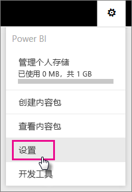
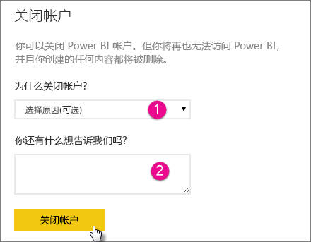
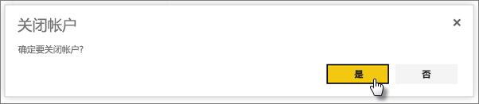
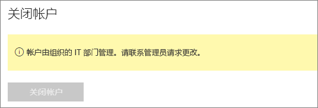

# 关闭 Power BI 帐户
如果你不希望再使用 Power BI，则可以要求我们关闭你的 Power BI 帐户。  关闭帐户之后，你无法再登录到 Power BI。  此外，你在 Power BI 中上载或创建的任何客户数据都会根据 Power BI 服务条款中的数据保留策略进行删除。

## Power BI 个人用户
可以在设置屏幕中关闭帐户。

1. 选择右上角的齿轮 。
2. 选择**设置**。
   
    
3. **常规**  >  **关闭帐户**
   
    
4. 从**为什么关闭帐户?** 中选择原因 (1) 下拉列表中选择原因。  可以选择提供进一步的信息 (2)。 然后选择**关闭帐户**。
   
    
5. 确认你要关闭帐户。
   
    
6. 你会看到确认帐户关闭的消息。 系统还会向你提供用于重新打开帐户的链接。
   
    

## 托管租户用户
你需要与租户管理员联系，要求他们从你的帐户中取消分配许可证。

更多问题？ [尝试咨询 Power BI 社区](http://community.powerbi.com/)

