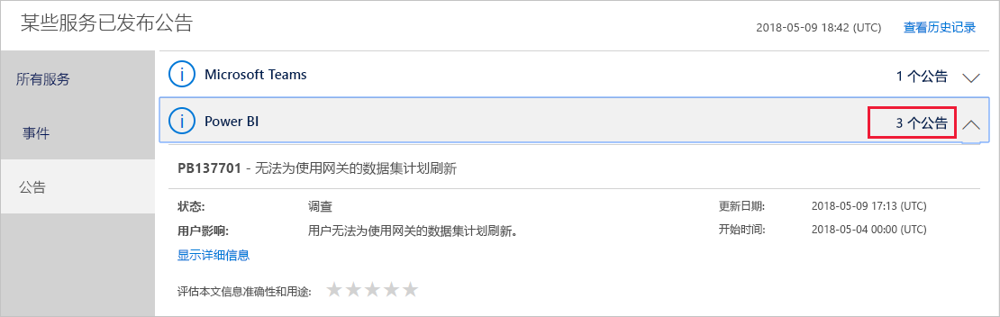

# 跟踪 Office 365 中的 Power BI 服务运行状况

Office 365 管理中心为 Power BI 管理员提供重要工具，包括有关服务运行状况的当前和历史信息。 若要访问此信息，你必须是以下角色之一：Power BI 服务管理员或 Office 365 全局管理员。 有关角色的详细信息，请参阅[与 Power BI 相关的管理员角色](service-admin-administering-power-bi-in-your-organization.md#administrator-roles-related-to-power-bi)。

1. 注册到 [Office 365 管理中心](https://portal.office.com/adminportal)。

2. 选择“服务运行状况”磁贴。

    

3. 在当前列表中，选择“N 个公告”或“N 个事件”，并查看结果。 在下面的图形中，可以查看三个活动公告之一。

    

4. 若要查看详细信息，请选择项的“显示详细信息”。 在下图中，可以查看其他详细信息，包括最近状态更新。

    

    向下滚动以查看更多信息，完成时关闭窗格。

5. 若要查看所有服务的历史信息，在主列表右上方选择“查看历史记录”。 然后，选择“过去 7 天”或“过去 30 天”。 若要返回到当前服务运行状况，请选择“查看当前状态”。