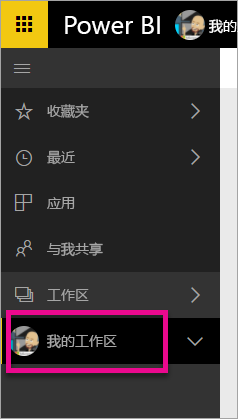
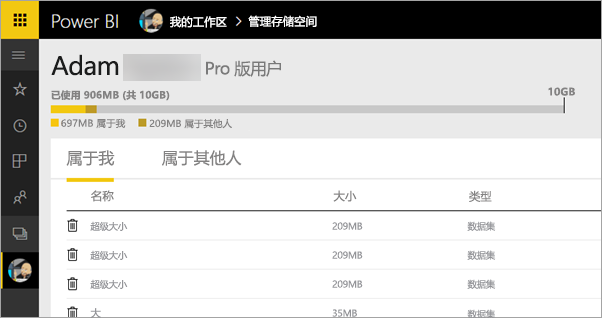
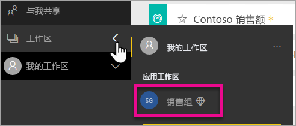
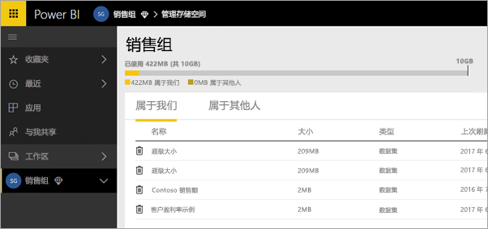
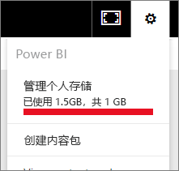
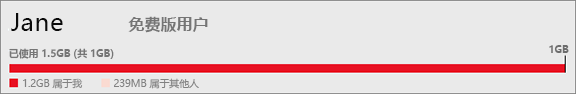
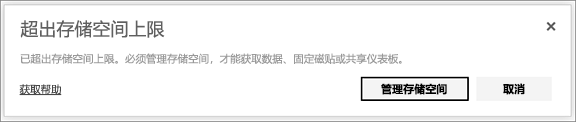

# 管理数据存储
了解如何管理个人数据存储或应用工作区，以确保可以继续发布报表和数据集。

用户和应用工作区有自己的数据容量

* 免费和 Pro 版用户的数据存储上限为 10GB。
* Pro 版用户可以创建应用工作区，每个工作区的数据存储上限为 10GB。

在租户一级，跨租户中的所有 Pro 版用户和应用工作区，每个 Pro 版用户的总使用量不能超过 10GB。

了解有关 [Power BI 定价模型](https://powerbi.microsoft.com/pricing)的其他功能。

数据存储中包含你自己的数据集和 Excel 报表，以及其他人与你共享的内容。 数据集是你已上载或连接到的任何数据源，包括你使用的 Power BI Desktop 文件和 Excel 工作簿。 以下内容也包含在数据容量中。

* 固定到仪表板的 Excel 范围。
* 固定到 Power BI 仪表板的 Reporting Services 本地可视化效果。
* 已上载的图像。

共享仪表板的大小因其上固定内容而有所不同。 例如，如果固定分属两个数据集的两个报表中的项，则其大小将可包括这两个数据集。

<a name="manage"/>

## 管理你所拥有的项目
确定你 Power BI 帐户中的数据存储使用情况，并管理帐户。

1. 若要管理你自己的存储，请转到左侧导航窗格中的“我的工作区”。
   
    
2. 依次选择右上角的齿轮图标  \>“管理个人存储”。
   
    顶部栏会显示你已使用的存储限制量。
   
    
   
    数据集和报表会分为两个选项卡：
   
    **由我所有：**这些是你已上载到 Power BI 帐户的报表和数据集，包括服务数据集（如 Salesforce 和 Dynamics CRM）。  
    **由他人所有：**其他人与你共享了这些报表和数据集。
3. 若要删除数据集或报表，请选择垃圾桶图标 。

请记住，你或其他人可能会具有基于某个数据集的报表和仪表板。 如果删除该数据集，则这些报表和仪表板将无法再正常工作。

## 管理应用工作区
1. 依次选择“工作区”旁边的箭头 \> 应用工作区的名称。
   
    
2. 依次选择右上角的齿轮图标  \>“管理组存储”。
   
    顶部栏会显示已使用的组存储限制量。
   
    
   
    数据集和报表会分为两个选项卡：
   
    **由我们所有：**这些是你或其他人已上传到组的 Power BI 帐户的报表和数据集，包括服务数据集（如 Salesforce 和 Dynamics CRM）。
    **由他人所有：**其他人与你的组共享了这些报表和数据集。
3. 若要删除数据集或报表，请选择垃圾桶图标 。
   
   > [!NOTE]
   > 应用工作区中拥有编辑权限的任何成员都有权从应用工作区中删除数据集和报表。
   > 
   > 

请记住，你或组中的其他人可能会具有基于某个数据集的报表和仪表板。 如果删除该数据集，则这些报表和仪表板将无法再正常工作。

## 数据集限制
导入到 Power BI 中的每个数据集都有 1 GB 的限制。 如果选择保留 Excel 体验，而不是导入数据，则对于数据集会限制为 250 MB。

## 达到限制时会发生什么情况
达到可以执行对其执行操作的数据容量限制时，你会在服务中看到提示。 

选择齿轮图标  时，你会看到一个红色条，指示你已超过数据容量限制。

你还会在**管理个人存储**中看到指示这一点。

 

 尝试执行的操作达到某个限制时，你会看到一个提示，指示你超过该限制。 将能够[管理](#manage)存储来减少存储量，从而符合限制要求。

 

 更多问题？ [尝试咨询 Power BI 社区](http://community.powerbi.com/)

