# 使用 Microsoft Intune 配置移动应用
Microsoft Intune 使组织可以管理设备和应用程序。 适用于 iOS 和 Android 的 Power BI 移动应用程序与 Intune 集成，以使你可以管理设备上的应用程序以及控制安全性。 通过配置策略，可以控制各个项目，如要求提供访问 PIN、控制应用程序如何处理数据，甚至是在无法使用应用时加密应用程序数据。

## 常规移动设备管理配置
本文并不旨在作为用于 Microsoft Intune 的完整配置指南。 如果你现在要与 Intune 集成，则需要确保已设置了一些内容。 [了解详细信息](https://technet.microsoft.com/library/jj676587.aspx)

Microsoft Intune 可以在 Office 365 中与移动设备管理 (MDM) 共存。 [了解详细信息](https://blogs.technet.microsoft.com/configmgrdogs/2016/01/04/microsoft-intune-co-existence-with-mdm-for-office-365/)

本文假定 Intune 配置正确，并且你向 Intune 注册了设备。 如果你与 MDM 共存，则设备会显示已在 MDM 注册，但是可以在 Intune 中进行管理。

> [!NOTE]
> 在组织已配置 Microsoft Intune MAM 后，如果在 iOS 或 Android 设备上使用 Power BI 移动应用，则会关闭后台数据刷新。 在你下次进入应用时，Power BI 会刷新 Power BI 服务 Web 数据。
> 
> 

## 步骤 1：获取应用程序的 url
我们在 Intune 中创建应用程序之前，需要获取应用的 url。 对于 iOS，我们会从 iTunes 收到此 url。 对于 Android，可以从 Power BI 移动页面获取它。

保存 url，因为在创建应用程序时会需要它。

### iOS
若要获取适用于 iOS 的应用 url，我们需要从 iTunes 获取它。

1. 打开 iTunes。
2. 搜索 Power BI。
3. 你应看到在 **iPhone 应用**和 **iPad 应用**下列出了 **Microsoft Power BI**。 可以使用任一项，因此会获取相同的 url。
4. 选择**获取**下拉列表，然后选择**复制链接**。
   
    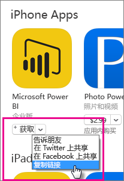

它应类似于下面这样。

    https://itunes.apple.com/us/app/microsoft-power-bi/id929738808?mt=8

### Android
可以从 [Power BI 移动页面](https://powerbi.microsoft.com/mobile/)获取指向 Google Play 的 url。 单击**从 Google Play 下载**图标会使你转到应用页面。 可以从浏览器地址栏复制 URL。 它应类似于下面这样。

    https://play.google.com/store/apps/details?id=com.microsoft.powerbim

## 步骤 2：创建移动应用程序管理策略
移动应用程序管理策略使你可以强制实施访问 PIN 这类项目。 可以在 Intune 门户中创建策略。 

可以先创建应用程序或策略。 添加它们的顺序并不重要。 它们只需在部署步骤中同时存在。

1. 选择**策略**  >  **配置策略**。
   
    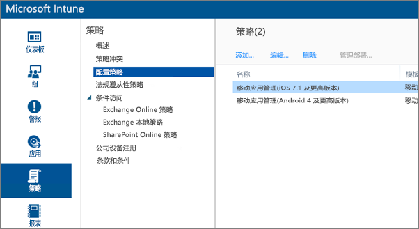
2. 选择**添加…**。
3. 在**软件**下，可以为 Android 或 iOS 选择移动应用程序管理。 若要快速开始，可以选择**创建带有推荐设置的策略**，也可以创建自定义策略。
4. 编辑策略以对应用程序配置所需限制。

## 步骤 3：创建应用程序
应用程序是保存到 Intune 中以进行部署的引用或包。 我们需要创建应用程序并引用我们从 Google Play 或 iTunes 获取的应用 url。

可以先创建应用程序或策略。 添加它们的顺序并不重要。 它们只需在部署步骤中同时存在。

1. 转到 Intune 门户，然后从左侧菜单中选择**应用**。
2. 选择**添加应用**。 这会启动**添加软件**应用程序。

### iOS
1. 从下拉菜单中选择**来自应用程序商店的托管 iOS 应用程序**。
2. 输入我们从[步骤 1](#step-1-get-the-url-for-the-application) 获取的应用 url，然后选择**下一步**。
   
    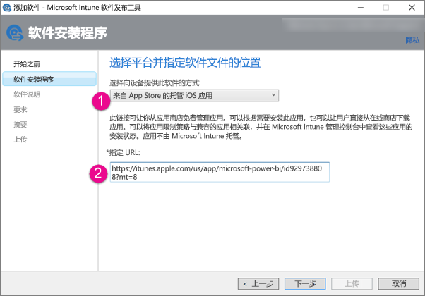
3. 提供**发布者**、**名称**和**说明**。 你可以根据需要提供**图标**。 **类别**用于公司门户应用。 完成之后，可选择**下一步**。
4. 可以决定是要将应用作为**任何**（默认值）、**iPad** 还是 **iPhone**进行发布。 默认情况下，它会显示**任何**，并且会同时适用于这两种设备类型。 Power BI 应用对于 iPhone 和 iPad 是相同 url。 选择**下一步**。
5. 选择**上载**。

> [!NOTE]
> 在刷新页面之前，你可能不会看到它在应用列表中出现。 你可以单击**概述**并返回到**应用**以重新加载页面。
> 
> 

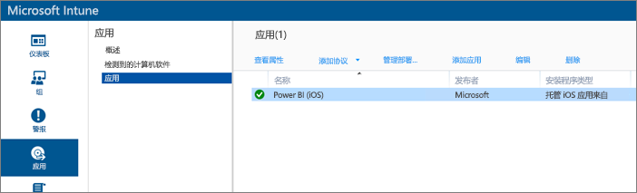

### Android
1. 从下拉菜单中选择**外部链接**。
2. 输入我们从[步骤 1](#step-1-get-the-url-for-the-application) 获取的应用 url，然后选择**下一步**。
   
    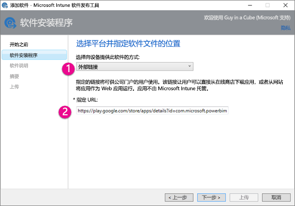
3. 提供**发布者**、**名称**和**说明**。 你可以根据需要提供**图标**。 **类别**用于公司门户应用。 完成之后，可选择**下一步**。
4. 选择**上载**。

> [!NOTE]
> 在刷新页面之前，你可能不会看到它在应用列表中出现。 你可以单击**概述**并返回到**应用**以重新加载页面。
> 
> 

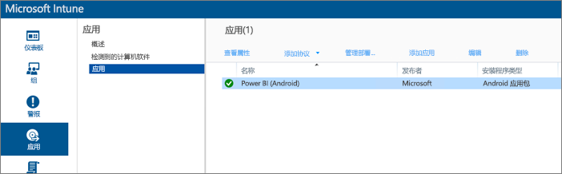

## 步骤 4：部署应用程序
添加应用程序之后，你需要部署它，以便它可供最终用户使用。 这是将创建的策略与应用绑定的步骤。

### iOS
1. 在应用屏幕上，选择创建的应用。 然后选择**管理部署...** 链接。
   
    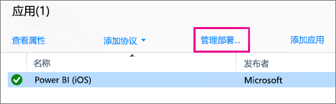
2. 在**选择组**屏幕上，可以选择你要将此应用部署到的组。 选择**下一步**。
3. 在**部署操作**屏幕上，可以选择要如何部署此应用。 选择**可用安装**或**所需的安装**会使应用在公司门户中可供用户按需安装。 进行选择之后，选择**下一步**。
   
    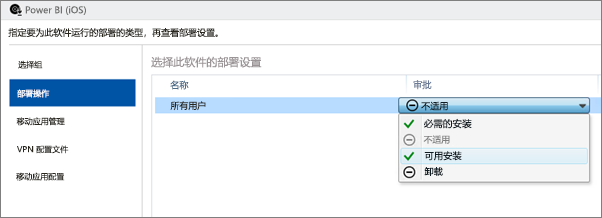
4. 在**移动应用程序管理**屏幕上，可以选择我们在[步骤 2](#step-2-create-a-mobile-application-management-policy) 中创建的移动应用管理策略。 它会默认为你创建的策略（如果这是唯一可用的 iOS 策略）。 选择**下一步**。
   
    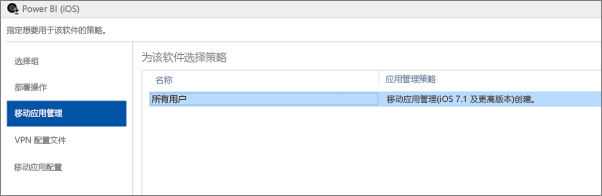
5. 在 **VPN 配置文件**屏幕上，可以选择策略（如果你具有用于组织的策略）。 它会默认为**无**。 选择**下一步**。
6. 在**移动应用程序配置**屏幕上，可以选择**应用程序配置策略**（如果你创建了一个）。 它会默认为**无**。 这不是必需的。 选择**完成**。

部署应用之后，应在应用页面上对已部署显示**是**。

### Android
1. 在应用屏幕上，选择创建的应用。 然后选择**管理部署...** 链接。
   
    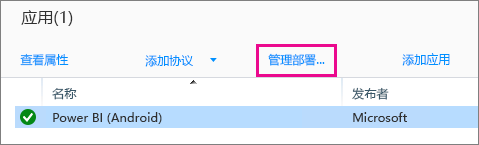
2. 在**选择组**屏幕上，可以选择你要将此应用部署到的组。 选择**下一步**。
3. 在**部署操作**屏幕上，可以选择要如何部署此应用。 选择**可用安装**或**所需的安装**会使应用在公司门户中可供用户按需安装。 进行选择之后，选择**下一步**。
   
    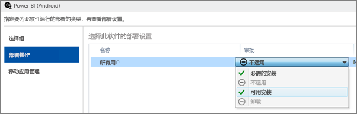
4. 在**移动应用程序管理**屏幕上，可以选择我们在[步骤 2](#step-2-create-a-mobile-application-management-policy) 中创建的移动应用管理策略。 它会默认为你创建的策略（如果这是唯一可用的 Android 策略）。 选择**完成**。
   
    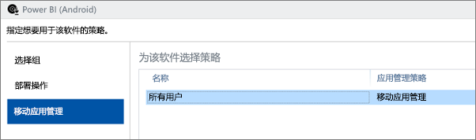

部署应用之后，应在应用页面上对已部署显示**是**。

## 步骤 5：在设备上安装应用程序
你会通过公司门户应用安装应用程序。 如果你尚未安装公司门户，则可以通过 iOS 平台上的 App Store 或 Android 平台上的应用商店获取它。 你会使用组织登录名登录公司门户。

1. 打开公司门户应用。
2. 如果看不到 Power BI 应用列为特色应用，请选择**公司应用**。
   
    
3. 选择部署的 Power BI 应用。
   
    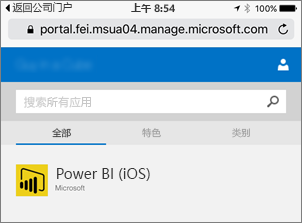
4. 选择**安装**。
   
    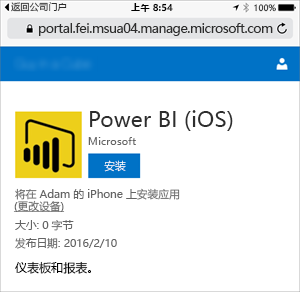
5. 如果你在使用 iOS，则它会将应用推送给你。 在推送对话框中选择**安装**。
   
    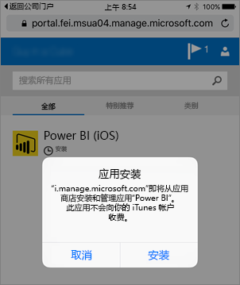

安装之后，你会看到它**由你的公司管理**。 如果在策略中启用了使用 PIN 进行的访问，则你会看到以下内容。

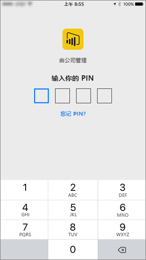

## 后续步骤
[在 Microsoft Intune 控制台中配置和部署移动应用程序管理策略](https://technet.microsoft.com/library/dn878026.aspx)  
[适用于移动设备的 Power BI 应用](mobile-apps-for-mobile-devices.md)  

更多问题？ [尝试咨询 Power BI 社区](http://community.powerbi.com/)

