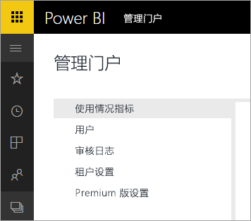

# Power BI for Office 365 已停用
Power BI for Office 365 是 Power BI 的早期版本，已转换为当前版本的 [Power BI](https://powerbi.microsoft.com)。 使用过 **Power BI for Office 365** 的用户都可以使用当前版本的 Power BI。 [了解 Power BI 的详细信息](service-get-started.md)。

## 管理门户
对 **Power BI for Office 365** 管理门户的访问将不再可用。 管理员可以使用新[管理门户](https://app.powerbi.com/admin-portal)来管理组织的 Power BI 订阅。

有关详细信息，请参阅 [Power BI 管理门户](service-admin-portal.md)。

## 后续步骤
[Power BI 入门](service-get-started.md)

[Power BI Desktop 入门](desktop-getting-started.md)

[在组织中管理 Power BI](service-admin-administering-power-bi-in-your-organization.md)