# Power BI 管理门户

通过管理门户允许对组织中的 Power BI 进行租户管理。 它包括诸如使用情况指标、对 Office 365 管理中心的访问以及设置这类项目。

针对公司的 Power BI 租户管理通过 Power BI 管理门户进行。 Office 365 中的全局管理员或分配有 Power BI 服务管理员角色的用户都可以访问管理门户。 若要详细了解 Power BI 服务管理员角色，请参阅[了解 Power BI 管理员角色](service-admin-role.md)。

所有用户都将看到齿轮图标下的“管理员门户”。 如果他们不是管理员，他们将只能看到“Premium 设置”部分，并且将只能看到他们有权管理的容量。

## 如何访问管理门户

帐户必须标记为 Office 365 或 Azure Active Directory 中的 **全局管理员** ，或者已分配到 Power BI 服务管理员角色，才能获取对 Power BI 管理门户的访问权限。 若要详细了解 Power BI 服务管理员角色，请参阅[了解 Power BI 管理员角色](service-admin-role.md)。 若要访问 Power BI 管理门户，请执行以下操作。

1. 在 Power BI 服务右上角选择设置齿轮。
2. 选择**管理门户**。

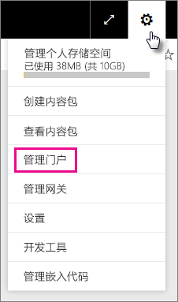

该门户中有 6 个选项卡。 下面介绍了这些选项卡。

* [使用情况指标](#usage-metrics)
* [用户](#users)
* [审核日志](#audit-logs)
* [租户设置](#tenant-settings)
* [Premium 设置](#premium-settings)
* [嵌入代码](#embed-codes)
* [组织视觉对象](#Organization-visuals)

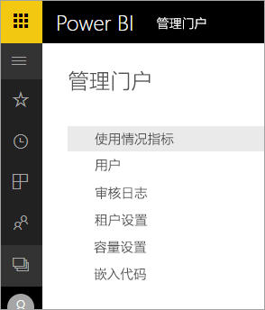

## 使用情况指标
管理门户中的第一个选项卡是**使用情况指标**。 使用情况指标报表使你能够为组织监视 Power BI 中的使用情况。 通过它还可以查看对于组织，哪些用户和组在 Power BI 中最活跃。

> [!NOTE]
> 首次访问仪表板时，或在长时间未查看仪表板后再次进行访问之后，你可能会在我们加载仪表板时看到加载屏幕。

仪表板加载之后，你会看到两个部分的磁贴。 第一个部分包含单个用户的使用情况数据，第二个部分包含有关组织中的组的类似信息。

下面是每个磁贴中显示的内容的细分：

* 用户工作区中的所有仪表板、报表和数据集的非重复计数
  
    

* 按可以进行访问的用户数划分的使用量最大的仪表板。 例如，如果你将 1 个仪表板与 3 个用户共享，并且还将它添加到 2 个不同用户连接到的内容包，则其计数会是 6 (1 + 3 + 2)
  
    

* 用户连接到的最受欢迎内容。 这是用户可以通过“获取数据”过程访问的任何内容，如 SaaS 内容包、组织内容包、文件或数据库。
  
    

* 基于用户具有的仪表板数（他们自己创建的仪表板以及与他们共享的仪表板）的排名靠前用户视图。
  
    

* 基于用户具有的报表数的排名靠前用户视图
  
    

第二个部分显示相同类型的信息，不过是基于组。 这使你可以查看组织中最活跃的组以及它们所使用的信息种类。

借助此信息，你能够真正地深入了解用户在组织中如何使用 Power BI，并能够识别在组织中非常活跃的用户和组。

## 用户

管理门户中的第二个选项卡是**管理用户**。 针对 Power BI 的用户管理在 Office 365 管理中心中进行，因此通过此部分可以快速访问用于在 Office 365 中管理用户、管理员和组的区域。

单击**转到 O365 管理中心**时，你会直接转到 Office 365 管理中心登陆页，以便管理租户的用户。

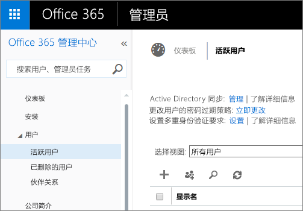

## 审核日志

管理门户中的第三张选项卡为“审核日志”。 这些日志位于 Office 365 安全与合规中心内。 通过此分区，可在 Office 365 内快速访问该区域。

有关审核日志的详细信息，请参阅[在组织中审核 Power BI](service-admin-auditing.md)

## 租户设置

管理门户中的第三个选项卡是**租户设置**。 租户设置使你可以更好地控制向组织提供的功能。 如果你担心敏感数据、我们的某些功能可能不适合你的组织，或者你只需要为特定组提供给定的功能。 如果出现这种情况，则可以在租户中关闭它。

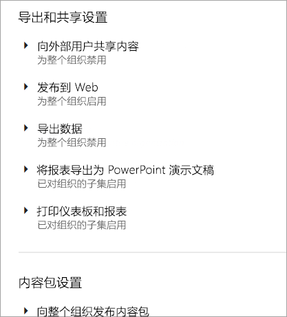

> [!NOTE]
> 可能需要 10 分钟才会使设置对租户中的每个人生效。

设置可以有三种状态：

* **为整个组织禁用**：可禁用某个功能，使用户无法使用该功能。

    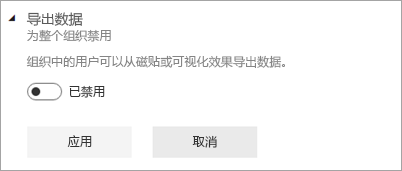

* **为整个组织启用**：可为整个组织启用某个功能，让所有用户都有权访问该功能。

    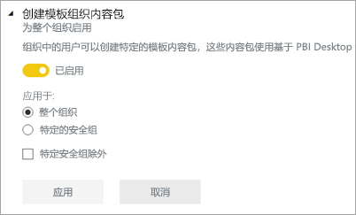

* **为组织的子集启用**：还可为组织的一部分启用某个功能。 这可以以多种不同的方式来实现。 可以为除特定用户组之外的整个组织启用功能。

    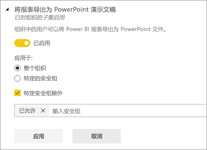

    还可以仅为特定用户组启用功能，还可以为某个用户组禁用功能。 这将确保即使某些用户属于允许的组，但仍没有访问该功能的权限。

    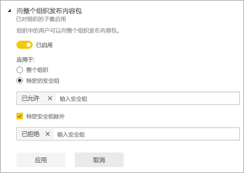

接下来的几节概述了不同类型的租户设置。

## 工作区设置

### 创建工作区（预览）
组织中的用户可创建应用工作区，以在仪表板、报表和其他内容上进行协作。

有关详细信息，请参阅[创建新工作区](service-create-the-new-workspaces.md)。

## 导出和共享设置

### 向外部用户共享内容

组织中的用户可以与组织外部的用户共享仪表板。

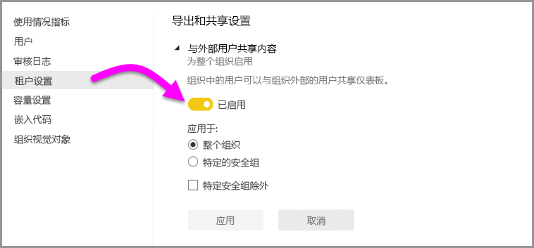

与外部用户共享时将显示以下消息。

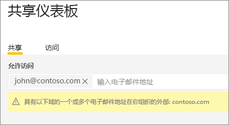

### 发布到 Web

组织中的用户可以将报表发布到 Web。 [了解详细信息](service-publish-to-web.md)

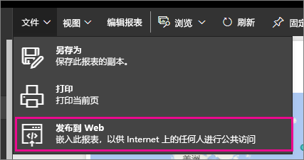

根据发布到 Web 设置的内容，用户会在 UI 中看到不同的选项。

|功能 |为整个组织启用 |为整个组织禁用 |特定的安全组   |
|---------|---------|---------|---------|
|报表“文件”菜单下的“发布到 Web”。|为所有对象启用|向所有对象隐藏|仅向已授权的用户或组显示。|
|“设置”下的“管理嵌入代码”|为所有对象启用|为所有对象启用|为所有对象启用  仅向已授权的用户或组显示“删除”选项。*  为所有对象启用“获取代码”。* |
|管理门户中的“嵌入代码”|“状态”将反映以下状态之一： * 活动 * 不支持 * 已阻止|状态将显示“已禁用”|“状态”将反映以下状态之一： * 活动 * 不支持 * 已阻止  如果未根据租户设置为某个用户授权，状态将显示为“侵权”。|
|现有的已发布报表|全部已启用|全部已禁用|继续向所有对象呈现报表。|

### 导出数据

组织中的用户可以从磁贴或可视化效果导出数据。 [了解详细信息](power-bi-visualization-export-data.md)

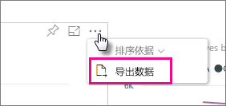

> [!NOTE]
> 禁用“导出数据”还会阻止用户使用“在 Excel 中分析”功能，同时也会阻止用户使用 Power BI 服务实时连接。

### 将报表导出为 PowerPoint 演示文稿

组织中的用户可以将 Power BI 报表导出为 PowerPoint 文件。 [了解详细信息](service-publish-to-powerpoint.md)

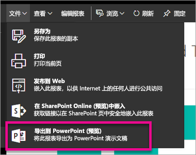

### 打印仪表板和报表

组织中的用户可以打印仪表板和报表。 [了解详细信息](service-print.md)

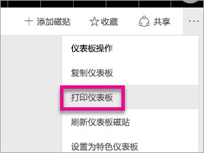

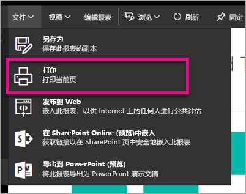

## 内容包设置

### 向整个组织发布内容包

组织中的用户可以向整个组织发布内容包。

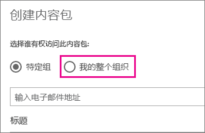

### 创建模板组织内容包

组织中的用户可以创建特定的模板内容包，这些内容包使用基于 Power BI Desktop 中某个数据源生成的数据集。

### 将应用推送给最终用户

你的租户管理员启用在“租户设置”中推送应用的功能。

   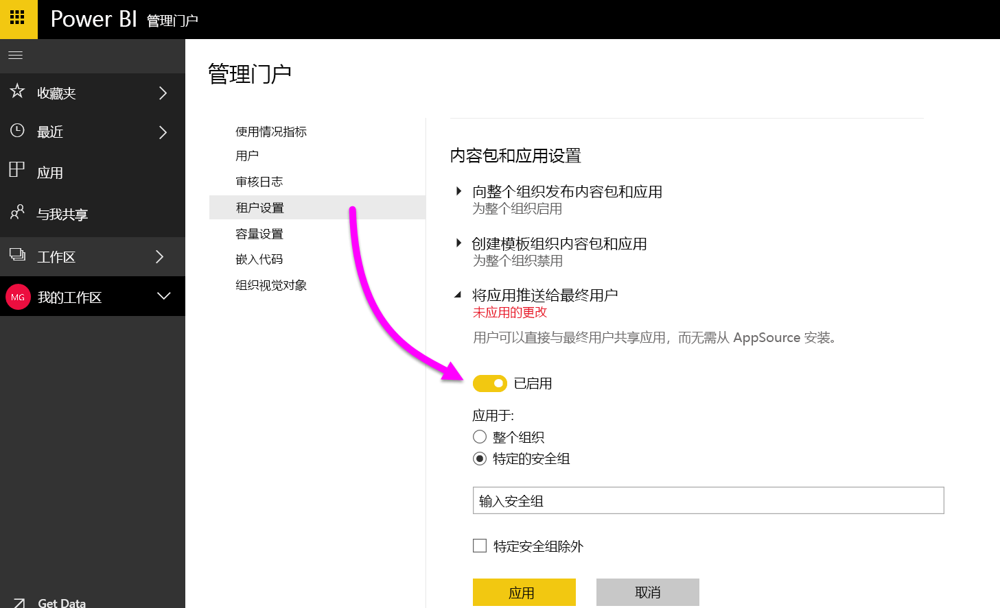

可以将设置切换为“已启用”，然后指定获取此功能的用户（整个组织或特定安全组）。

> [!NOTE]
> 请记住，租户设置更改可能需要一些时间才能生效。

转到此处以了解有关[推送应用](service-create-distribute-apps.md#how-to-install-an-app-automatically-for-end-users)的详细信息。

## 集成设置

### 使用 Cortana 询问有关数据的问题
组织中的用户可以使用 Cortana 询问有关其数据的问题。

> [!NOTE]
> 此设置应用于整个组织，并且不能限制为特定组。

### 结合使用“在 Excel 中分析”功能和本地数据集
组织中的用户可以使用 Excel 查看本地 Power BI 数据集，并与其进行交互。 [了解详细信息](service-analyze-in-excel.md)

> [!NOTE]
> 禁用“**导出数据**”还会阻止用户使用“**在 Excel 中分析**”功能。

### 使用 ArcGIS Maps for Power BI

组织中的用户可以使用 Esri 提供的 ArcGIS Maps for Power BI 可视化效果。 [了解详细信息](power-bi-visualization-arcgis.md)

### 使用 Power BI（预览版）的全局搜索

组织中的用户可以使用依赖于 Azure 搜索的的外部搜索功能。 例如，用户可以使用 Cortana 直接从 Power BI 仪表板和报表检索关键信息。 [了解详细信息](service-cortana-intro.md)

## 自定义视觉对象设置
### 为整个组织启用自定义视觉对象
组织中的用户可以与自定义视觉对象进行交互并共享。 [了解详细信息](power-bi-custom-visuals.md)

> [!NOTE]
> 此设置应用于整个组织，并且不能限制为特定组。

## R 视觉对象设置

### 与 R 视觉对象进行交互并共享

组织中的用户可以与使用 R 脚本创建的视觉对象进行交互并共享。 [了解详细信息](service-r-visuals.md)

> [!NOTE]
> 此设置应用于整个组织，并且不能限制为特定组。

## 审核和使用情况设置

### 为实现内部活动审核和符合性而创建审核日志

组织中的用户可以使用审核来监视组织中的其他用户在 Power BI 中执行的操作。 [了解详细信息](service-admin-auditing.md)

需要为审核日志条目启用此设置，才能对其进行记录。 启用审核后，最多可能会延迟 48 小时才能查看审核数据。 如果无法立即查看数据，请稍后检查审核日志。 获取查看审核日志的权限和得以访问日志之间也存在类似的延迟。

> [!NOTE]
> 此设置应用于整个组织，并且不能限制为特定组。

### 内容创建者的使用指标
组织中的用户可以查看他们创建的仪表板和报表的使用指标。 [了解详细信息](service-usage-metrics.md)。

可将设置切换为“已启用”，然后指定可查看使用情况指标的用户（整个组织或特定安全组）。

> [!NOTE]
> 请记住，租户设置更改可能需要一些时间才能生效。

### 内容创建者的使用情况指标中的每用户数据
内容创建者的使用情况指标将公开正在访问内容的用户的显示名称和电子邮件地址。 [了解详细信息](service-usage-metrics.md)。

可将设置切换为“已启用”，然后指定可查看使用情况指标中的显示名称和电子邮件地址的用户（整个组织或特定安全组）。

默认情况下，每个用户的数据都启用了使用指标并在指标报表中包含内容创建者帐户信息。 如果不希望某些或所有用户包含此信息，请为特定安全组或整个组织禁用此功能。 帐户信息随后会在报表中显示为“未命名”。

> [!NOTE]
> 请记住，租户设置更改可能需要一些时间才能生效。

## 仪表板设置

### 仪表板的数据分类

组织中的用户可以通过分类标记仪表板，指示仪表板的安全级别。 [了解详细信息](service-data-classification.md)

> [!NOTE]
> 此设置应用于整个组织，并且不能限制为特定组。

## 开发人员设置

### 在应用中嵌入内容

组织中的用户可以在软件即服务 (SaaS) 应用程序中嵌入 Power BI 仪表板和报表。 禁用此设置将阻止用户使用 REST API 将 Power BI 内容嵌入到其应用程序中。

## 容量设置

通过“容量设置”选项卡，可管理已为组织购买的任何 Power BI Premium 容量。 组织中的所有用户将看到“Premium 设置”选项卡，但如果将他们分配为容量管理员或具有分配权限的用户，他们将只看到其中的内容。 如果用户没有任何权限，他们会看到以下消息。

有关如何管理 Premium 设置的详细信息，请参阅[管理 Power BI Premium](service-admin-premium-manage.md)。

## 嵌入代码

管理员可以查看针对其租户生成的嵌入代码。 可以执行相应的操作来查看报表，以及删除嵌入代码以将其撤消。

## 组织视觉对象

使用组织视觉对象选项卡，可以在组织内部署和管理自定义视觉对象，从而在组织中轻松部署专有自定义视觉对象，使报表作者能够轻松发现这些视觉对象并将其从 Power BI Desktop 直接导入报表。
 
该页面显示了组织存储库中当前部署的所有自定义视觉对象。
 
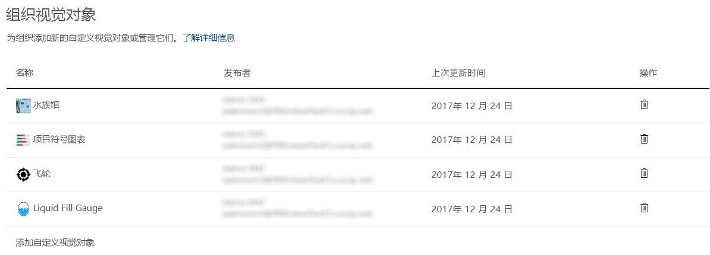

### 添加新的自定义视觉对象

若要将新的自定义视觉对象添加到列表，请选择“添加自定义视觉对象”

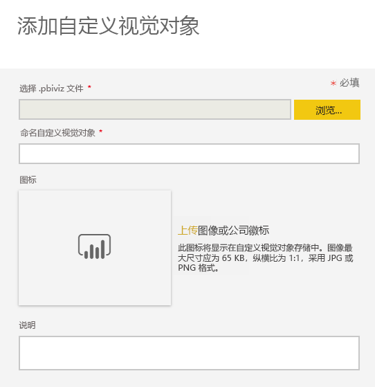

> [!WARNING]
> 自定义视觉对象可能包含存在安全或隐私风险的代码；在部署到组织存储库之前，请务必信任此自定义视觉对象的作者和来源。
> 

填写字段：
 
* 选择 .pbiviz 文件（必选）：选择要上传的自定义视觉对象文件。 仅支持经版本控制的 API 自定义视觉对象（阅读此处内容了解其含义）。
在上传自定义视觉对象之前，应查看有关视觉对象的安全和隐私，确保它符合组织的标准。 详细了解自定义视觉对象安全性。
 
* 为自定义视觉对象命名（必选）：为视觉对象提供一个简短标题，以便 Power BI Desktop 用户可轻松理解它的内容
 
* 图标（必选）：将显示在 Power BI Desktop UI 中的图标文件。
 
* 说明：视觉对象的简短描述，用于向用户提供更多上下文和说明
 
选择“应用”发起上传请求。 如果成功，将在列表中看到新项目。 如果失败，将会收到相应的错误消息
 
### 从列表中删除自定义视觉对象

选择回收站图标，从存储库中永久删除视觉对象。
重要提示：删除操作不可逆。 一旦删除，此视觉对象将立即停止在现有报表中呈现。 即使再次上传相同的视觉对象，也不会替换之前被删除的视觉对象，用户必须再次导入新的视觉对象并替换其报表中的实例。
 
### 如何更新视觉对象

如果要更新存储库中的视觉对象，原因是其中没有新版本的视觉对象（例如 bug 修复、新功能等），请选择“更新”图标，然后上传新文件。 确保视觉对象 ID 保持不变。 新文件将替换整个组织中所有报表的旧文件。 但是，如果新版本的视觉对象可能会破坏以前版本的视觉对象的任何使用情况或数据结构，则它们不会取代以前的版本。 相反，应创建新版本视觉对象的新列表。 例如，向新列出的视觉对象的标题添加新版本号（版本 X.X）。 通过这种方式，很明显可以看到，它还是相同的版本，只不过更新了版本号，因此现有报表不会破坏它们的功能。 同样，确保视觉对象 ID 保持不变。 然后，下一次用户从 Power BI Desktop 进入组织存储库时，他们就可以导入新版本，系统将提示他们替换报表中存在的当前版本。

## 后续步骤

[了解 Power BI 管理员角色](service-admin-role.md)  
[在组织中审核 Power BI](service-admin-auditing.md)  
[管理 Power BI Premium](service-admin-premium-manage.md)  
[在组织中管理 Power BI](service-admin-administering-power-bi-in-your-organization.md)  

更多问题？ [尝试咨询 Power BI 社区](http://community.powerbi.com/)
