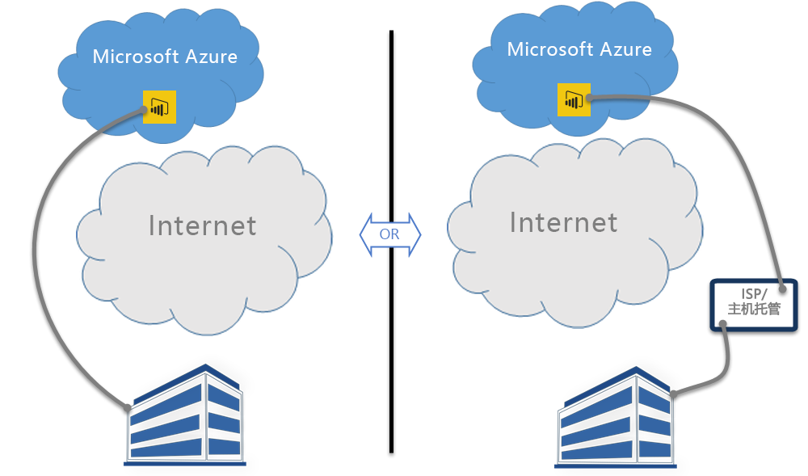

# Power BI 和 ExpressRoute
借助 **Power BI** 和 **ExpressRoute**，可以创建从组织到 Power BI 的专用网络连接（或使用 ISP 的主机托管设施），从而绕过 Internet 以更好地保护敏感 Power BI 数据和连接。

**ExpressRoute** 是一种 Azure 服务，使你可以在 Azure 数据中心（Power BI 所在的位置）与本地基础结构之间创建专用连接，或是在 Azure 数据中心与主机托管环境之间创建专用连接。

你可以获取[有关 ExpressRoute 的详细信息](https://azure.microsoft.com/services/expressroute/)，或了解[如何注册](https://azure.microsoft.com/pricing/details/expressroute/)。

> [!NOTE]
> 公共对等模式支持 Power BI，如[此常见问题](https://docs.microsoft.com/azure/expressroute/expressroute-faqs)中所述。
> 
> 

## Power BI ExpressRoute 例外情况
Power BI 符合 ExpressRoute 标准，但是在少数例外情况下 Power BI 会通过公共 Internet 获取或发送数据。 这些特定例外情况通常包括静态数据，例如从最近的**内容交付网络 (CDN)** 节点下载的浏览器配置文件。 有一些适用于所有 Power BI 的广泛例外情况，还有一些特定于服务或功能的例外情况（以下各部分中记录了每种例外情况下）。

### Power BI 和 ExpressRoute 的整体例外情况
**Power BI** 和 **ExpressRoute** 的例外情况意味着与 Power BI 之间来回传输的数据要通过公共 Internet 传输，而不是通过专用 ExpressRoute 链路传输。

使用 ExpressRoute 的 Power BI 的两个整体例外情况是：

* 从**内容交付网络 (CDN)** 和网站下载的静态文件
* 通过公共 Internet 发送的**遥测**数据

Power BI 使用多个**内容交付网络 (CDN)** 或网站来高效地根据地理区域设置将所需的静态内容和文件通过公共 Internet 分发到用户。 这些静态文件包括产品下载（如 Power BI Desktop、本地数据网关或来自各个独立服务提供商的 Power BI 内容包）、用于发起和建立与 Power BI 的任何后续连接的浏览器配置文件以及初始安全 Power BI 登录页 - 实际凭据仅通过 ExpressRoute 进行发送。   

某些**遥测数据**也通过公共 Internet 和 ExpressRoute 进行发送。 遥测数据包括使用情况统计信息和相似数据，它们会传输给用于监视使用情况和活动的服务。

### Power BI SaaS 应用程序和 ExpressRoute
当用户发起与 Power BI 服务的连接（powerbi.com 或通过 Cortana）时，Power BI 登陆页、登录页以及使浏览器准备好与 Power BI 进行连接和交互的静态文件会从 CDN 或网站（通过公共 Internet 连接）进行检索。

建立登录之后，后续 Power BI 数据交互会通过 ExpressRoute 进行，但依赖于公共 Internet 数据的某些功能和服务除外：

* **地图视觉对象**需要与必应虚拟地球服务或必应地理编码服务之间的连接和数据传输，它们各自通过公共 Internet 进行建立。
* Power BI 与 **Cortana** 的集成需要通过公共 Internet 访问必应。
* 当用户添加**自定义链接**（如图像小组件或视频）时，Power BI 会基于用户提供的链接请求数据，这可能会使用也可能不会使用 ExpressRoute。
* 用户可以通过 User Voice 反馈机制（使用公共 Internet 进行传输）采用文本（并且可以选择使用图像）**向 Power BI 发送反馈**。
* **必应新闻内容提供商**会使用公共 Internet 从必应下载内容。
* 当连接到**应用**（例如，内容包）时，用户通常需要使用由 SaaS 提供商提供的页面输入凭据和设置。 这类页面可能会也可能不会使用 ExpressRoute。

| 用户活动 | 目标 |
| --- | --- |
| 登陆页（登录之前） |`maxcdn.bootstrapcdn.com ; ajax.aspnetcdn.com ; netdna.bootstrapcdn.com ; cdn.optimizely.com; google-analytics.com ` |
| 登录 |`*.mktoresp.com ; *.aadcdn.microsoftonline-p.com ; *.msecnd.com ; *.localytics.com ; ajax.aspnetcdn.com` |
| 仪表板、报表、数据集管理（包括地图和地理编码） |`*.localytics.com ; *.virtualearth.net ; platform.bing.com; powerbi.microsoft.com; c.microsoft.com; app.powerbi.com; *.powerbi.com; dc.services.visualstudio.com ` |
| 支持 |`support.powerbi.com ; powerbi.uservoice.com ; go.microsoft.com ` |

### Power BI Desktop 和 ExpressRoute
Power BI Desktop 也符合 ExpressRoute 标准，除了下面列表中所述的几种例外情况：

* **更新通知**（用于检测用户是否具有最新版本的 Power BI Desktop）通过公共 Internet 传输。
* 某些**遥测数据**通过公共 Internet 传输。
* **地图视觉对象**需要与**必应虚拟地球**服务或**必应地理编码**服务之间的连接和数据传输，它们各自通过公共 Internet 进行建立。
* 来自几个数据源（如 **Web** 或第三方 SaaS 提供商）的**获取数据**通过公共 Internet 传输。

### Power BI PaaS 和 ExpressRoute
Power BI 提供 API 和其他基于平台的功能，使开发人员可以创建自定义 Power BI 解决方案和应用。 除了本主题前面讨论的遥测和 CDN 数据之外，通过公共 Internet 传输 Power BI PaaS 数据时还会使用以下服务：

| PaaS 活动 | 使用的其他目标 |
| --- | --- |
| 公共嵌入式（遥测） |`c1.microsoft.com` |
| 自定义视觉对象 (CDN) |`*.azureedge.net` |

某些**自定义视觉对象**由第三方创建，另一些由 Microsoft 创建。 这些内容可能会也可能不会使用 ExpressRoute。

### Power BI Mobile 和 ExpressRoute
本文档不涉及 Power BI Mobile 应用的使用。  

### 本地数据网关和 ExpressRoute
将本地数据网关与 Power BI 一起使用时，传输符合 ExpressRoute 标准，本主题前面的 Power BI SaaS 应用程序和 ExpressRoute 中记录的用户活动除外。  

