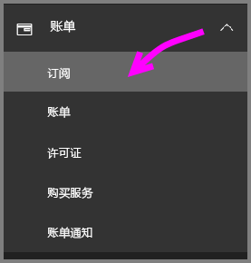
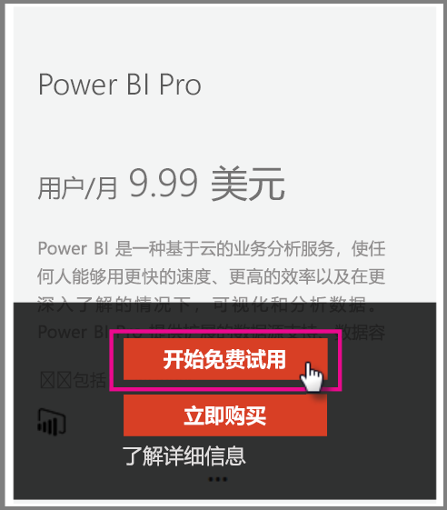

# 组织中的 Power BI Pro

Power BI Pro 是一种付费许可证，购买以后可以使用更多功能。 如果团队想通过与他人分享和协作来做出数据驱动的决策，Power BI Pro 许可证会很有帮助。  每个创建或查看共享 Power BI 内容的团队成员都需要 Pro 许可证，除非此内容与使用 Power BI Premium 的专用容量相关。

下列功能都需要 Power BI Pro 许可证：

* **在 Excel 或 Power BI Desktop 中分析数据** - 使用 Excel 或 Power BI Desktop 查看 Power BI 中发布的数据集并与其交互。 有关详细信息，请参阅[在 Excel 中分析](service-analyze-in-excel.md)。

* **共享仪表板并在工作区中协作** - Power BI 工作区可以促进同事协作处理仪表板、报表和数据集。 有关详细信息，请参阅[在 Power BI 应用工作区中展开协作](service-collaborate-power-bi-workspace.md)。

* **查看共享内容** - Pro 用户可以查看、交互和（如果允许）重新共享他们获得的共享仪表板和报表。 但是，Pro 用户无法编辑这些仪表板或报表。 有关详细信息，请参阅[与同事和他人共享 Power BI 仪表板和报表](service-share-dashboards.md)。

* **与 Microsoft Teams 集成内容**：可以在 Microsoft (MS) Teams 通道中添加 Power BI 选项卡。 MS Teams 会自动检测工作区中的所有报表。 有关详细信息，请参阅 [Power BI teams up with Microsoft Teams](https://powerbi.microsoft.com/en-us/blog/power-bi-teams-up-with-microsoft-teams/)（Power BI 与 Microsoft Teams 结合）。 

## 面向个人提供的 Power BI Pro 60 天试用版

注册了免费帐户之后，你可以根据需要选择免费试用 Power BI Pro 60 天。 在试用版的持续时间内，你有权访问所有 Pro 功能。 Power BI Pro 具有 Power BI 免费版本的所有功能，以及其他共享和协作功能。 有关详细信息，请参阅 [Power BI 定价](https://powerbi.microsoft.com/en-us/pricing/)。 要试用 Power BI Pro 60 天免费试用版，请登录 Power BI，然后尝试以下这些 Power BI Pro 功能之一。

* [创建工作区](consumer/end-user-create-apps.md)
* [共享仪表板](service-share-dashboards.md)

尝试其中任何功能时，系统都会提示你开始免费试用。 还可以通过转到齿轮图标并选择“管理个人存储”来选择使用它。 然后选择右侧的“免费试用 Pro”。

   
    
   

然后可以选择“开始试用”。

   

> [!NOTE]
> 利用此产品内 Power BI Pro 试用版的用户不会在 Office 365 管理门户内显示为 Power BI Pro 试用版用户（他们显示为 Power BI 免费用户）。 但是，他们会在 Power BI 中管理存储页面上显示为 Power BI Pro 试用版用户。
>

> [!NOTE]
> 如果你是 IT 管理员，并且希望获取 Power BI 试用版许可证并部署给组织中的多个用户，而无需让单独用户分别接受试用条款，则可以注册“Power BI Pro 订阅试用版”。 你需要是 Office 365 全局或计帐管理员，或是创建新租户以注册管理员试用版。 有关详细信息，请参阅[购买 Power BI Pro](service-admin-purchasing-power-bi-pro.md)。
>

使用服务时，可以转到齿轮图标，然后选择“管理个人存储”，从而验证拥有的是否是 Pro 试用版帐户。

   

## Office 365 中的订阅试用

可以为组织以试用版的形式获取 Power BI Pro。 订阅之后，你可以将 Power BI Pro 许可证分配给用户。 有关如何分配许可证的详细信息，请参阅[向 Office 365 中的用户分配许可证](https://support.office.com/en-us/article/assign-licenses-to-users-in-office-365-for-business-997596b5-4173-4627-b915-36abac6786dc?ui=en-US&rs=en-US&ad=US)。

> [!NOTE]
> 每个租户限制使用一个组织试用版。 这意味着如果有人已将 Power BI Pro 试用版应用到你的租户，则无法再次应用。 如果需要这方面的帮助，可以联系 [Office 365 计费支持](https://support.office.microsoft.com/en-us/article/contact-support-for-business-products-admin-help-32a17ca7-6fa0-4870-8a8d-e25ba4ccfd4b?CorrelationId=552bbf37-214f-4202-80cb-b94240dcd671&ui=en-US&rs=en-US&ad=US)。
>

请在 Offiec 365 中按这些步骤获取试用版订阅：

1. 导航到 [Office 365 管理中心](https://portal.office.com/adminportal/home#/homepage)。
2. 在左侧导航窗格中，选择“计帐”然后单击“订阅”。

   

3. 选择右侧的“添加订阅”。

   

4. 在“其他计划”下，将鼠标悬停在 Power BI Pro 的省略号 (...) 上方，然后选择“开始免费试用”。

    

5. 在确认订单屏幕上，选择“立即试用”。
6. 在订单签收上选择“继续”。

## 购买 Power BI Pro

可以通过 Microsoft Office 365 或已认证的 Microsoft 合作伙伴购买 Power BI Pro。 有关如何购买 Power BI Pro 的详细信息，请参阅[购买 Power BI Pro](service-admin-purchasing-power-bi-pro.md)。

## 后续步骤
[自助注册 Power BI](service-admin-signing-up-for-power-bi-with-a-new-office-365-trial.md)
 
[组织中的 Power BI（免费）](service-admin-service-free-in-your-organization.md)
 
[购买 Power BI Pro](service-admin-purchasing-power-bi-pro.md)
 
[激活延长的 Power BI Pro 试用期](service-extended-pro-trial.md)
 
[分配 Power BI Pro 许可证](service-admin-assigning-power-bi-pro-licenses.md)
 
[什么是 Power BI Premium？](service-admin-premium-manage.md)
 
[如何购买 Power BI Premium](service-admin-premium-purchase.md)
 
[Power BI Premium 白皮书](https://aka.ms/pbipremiumwhitepaper)

更多问题？ [尝试咨询 Power BI 社区](https://community.powerbi.com/)