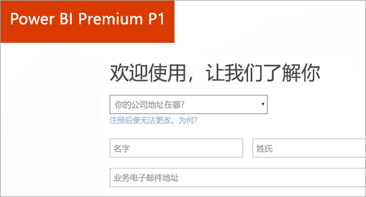
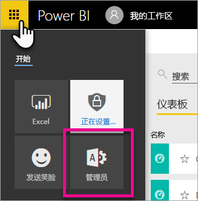
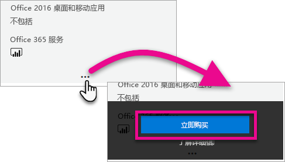
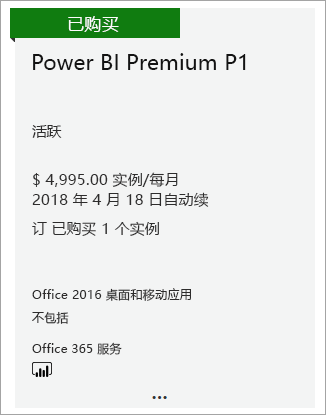
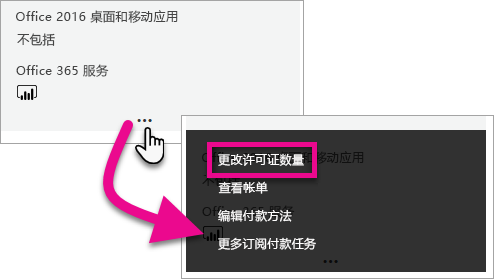
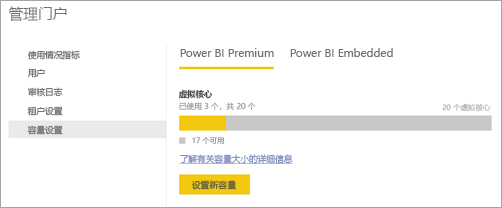
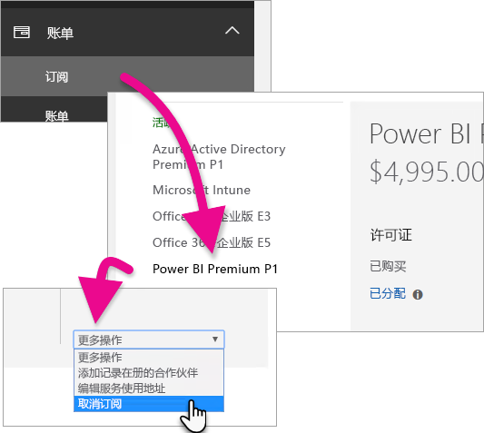

# 如何购买 Power BI Premium
了解如何为你的组织购买 Power BI 高级容量。

<iframe width="640" height="360" src="https://www.youtube.com/embed/NkvYs5Qp4iA?rel=0&amp;showinfo=0" frameborder="0" allowfullscreen></iframe>

可以通过 Office 365 管理中心购买 Power BI 高级容量节点。 也可以在组织中拥有任何高级容量 SKU（P1 到 P3）组合。 它们提供不同的资源容量。

有关 Power BI Premium 的详细信息，请参阅[什么是 Power BI Premium？](service-premium.md)。 若要查看 Power BI 的当前定价，请参阅[Power BI 定价页](https://powerbi.microsoft.com/pricing/)。 还可以使用[Power BI Premium 计算器](https://powerbi.microsoft.com/calculator/)计划 Power BI Premium 的成本。

> [!IMPORTANT]
> 即使你购买了 Power BI Premium，内容的作者还是需要一个 Power BI Pro 许可证。
> 
> 

## 使用 Power BI Premium P1 新建租户
如果尚无租户并且想要创建一个，可以同时购买 Power BI Premium。 单击下面的链接后，可以了解如何逐步新建用于 Office 365 的租户，并购买 Power BI Premium。 需要在创建租户后为用户购买 Power BI Pro 许可证。 创建租户后，你将自动成为此租户的全局管理员。

若要进行购买，请参阅 [Power BI Premium P1 优惠](https://signup.microsoft.com/Signup?OfferId=b3ec5615-cc11-48de-967d-8d79f7cb0af1)。

## 为现有组织购买 Power BI Premium 容量
对于现有组织，必须是全局管理员或计费管理员，才能购买订阅和许可证。 有关详细信息，请参阅[关于 Office 365 管理员角色](https://support.office.com/article/About-Office-365-admin-roles-da585eea-f576-4f55-a1e0-87090b6aaa9d)。

若要购买高级容量，需要执行以下操作。

1. 在 Power BI 服务中，选择“Office 365 应用选取器” > “管理员”。或者，可以浏览到 Office 365 管理中心。 如需访问，请转到 https://portal.office.com 并选择“管理员”。
   
    
2. 选择“计费” > “购买服务”。
3. 在“其他计划”下查找 Power BI Premium 产品。 这将会列出 P1 至 P3、EM3 和 P1（按月）。
4. 将鼠标悬停在“省略号 (...)”上，然后选择“立即购买”。
   
    
5. 按照以下步骤完成购买。

还可以选中以下链接，直接转到这些项的购买页面。 有关这些 SKU 的详细信息，请参阅[什么是 Power BI Premium？](service-premium.md#premiumskus)。

必须是租户内的全局管理员或计费管理员，才能购买 Power BI Premium SKU。 如果不是管理员，选择以下链接后将会看到错误消息。

| 直接购买链接 |
| --- |
| [EM3（按月）SKU](https://portal.office.com/commerce/completeorder.aspx?OfferId=4004702D-749C-4F74-BF47-3048F1833780&adminportal=1) |
| [P1 SKU](https://portal.office.com/commerce/completeorder.aspx?OfferId=b3ec5615-cc11-48de-967d-8d79f7cb0af1&adminportal=1) |
| [P1（按月）SKU](https://portal.office.com/commerce/completeorder.aspx?OfferId=E4C8EDD3-74A1-4D42-A738-C647972FBE81&adminportal=1) |
| [P2 SKU](https://portal.office.com/commerce/completeorder.aspx?OfferId=062F2AA7-B4BC-4B0E-980F-2072102D8605&adminportal=1) |
| [P3 SKU](https://portal.office.com/commerce/completeorder.aspx?OfferId=40c7d673-375c-42a1-84ca-f993a524fed0&adminportal=1) |

完成购买后，购买服务屏幕将显示该项目已购买且处于活动状态。

现在可以在 Power BI 管理中心内管理该容量。 有关详细信息，请参阅[管理 Power BI Premium](service-admin-premium-manage.md)。

## 购买更多容量
位于 Power BI 管理门户的“高级设置”部分时，如果你是管理员，将看到“购买更多”按钮。 此按钮可转到 Office 365 门户。 位于 Office 365 管理中心后，可以执行以下操作。

1. 选择“计费” > “购买服务”。
2. 在“其他计划”下找到需额外购买的 Power BI Premium 项目。
3. 将鼠标悬停在“省略号 (...)”上，然后选择“更改许可证数量”。
   
    
4. 更改此项目需要具有的实例数。 完成后，选择“提交”。
   
   > [!IMPORTANT]
   > 选择“提交”将向记录的信用卡收费。
   > 
   > 

然后“购买服务”页面上将显示你拥有的实例数。 在 Power BI 管理门户的“容量设置”下，可用的 V 核心反映购买的新容量。

现在可以在 Power BI 管理中心内管理该容量。 有关详细信息，请参阅[管理 Power BI Premium](service-admin-premium-manage.md)。

## 取消订阅
可以在 Office 365 管理中心内取消订阅。 若要取消 Premium 订阅，请执行以下操作。

1. 转到 Office 365 管理中心。
2. 依次选择“计费” > “订阅”。
3. 从列表中选择 Power BI Premium 订阅。
4. 在“更多操作”下拉列表中，选择“取消订阅”。
   
    
5. “取消订阅”页会指明是否需要支付[提前终止费](https://support.office.com/article/early-termination-fees-6487d4de-401a-466f-8bc3-c0beb5cc40d3)。 此页还会指明何时删除订阅数据。
6. 请仔细阅读这些信息。若要继续，请选择“取消订阅”。

## 后续步骤
[Power BI 定价页](https://powerbi.microsoft.com/pricing/)  
[Power BI Pemium 计算器](https://powerbi.microsoft.com/calculator/)  
[什么是 Power BI Premium？](service-premium.md)  
[管理 Power BI Premium](service-admin-premium-manage.md)  
[Power BI Premium 常见问题解答](service-premium-faq.md)  
[Power BI Premium 发行说明](service-premium-release-notes.md)  
[Microsoft Power BI Premium 白皮书](https://aka.ms/pbipremiumwhitepaper)  
[规划 Power BI Enterprise 部署白皮书](https://aka.ms/pbienterprisedeploy)  
[Power BI 管理门户](service-admin-portal.md)  
[在组织中管理 Power BI](service-admin-administering-power-bi-in-your-organization.md)  

更多问题？ [尝试咨询 Power BI 社区](http://community.powerbi.com/)

