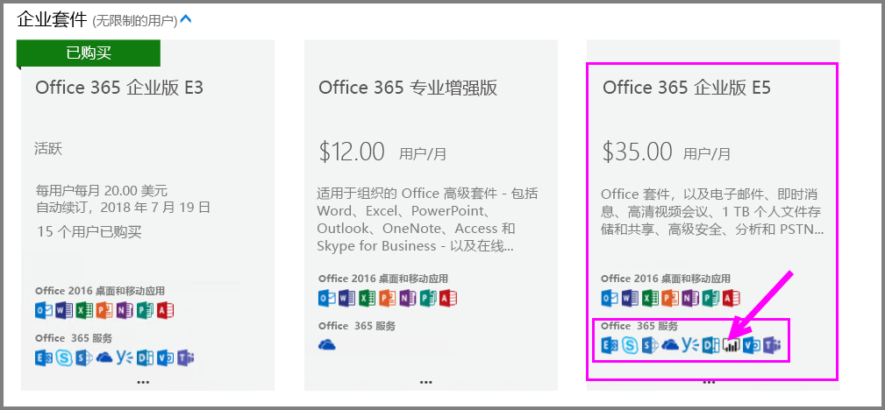
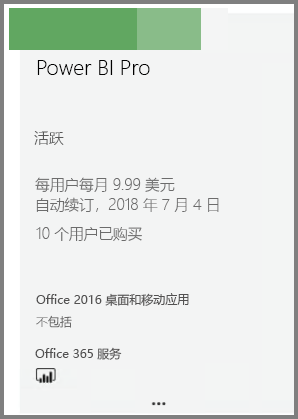
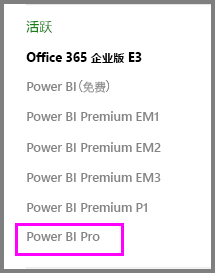

# 快速入门：购买 Power BI Pro 许可证

Power BI Pro 是单个许可证，允许访问 Power BI 服务中的所有内容和功能，包括共享内容以及与其他 Pro 用户协作的功能。 只有 Pro 用户可以将内容发布到应用工作区，使用这些内容，共享仪表板并订阅仪表板及报表。 本文介绍了如何在 Office 365 中购买 Power BI Pro 许可证。

## 先决条件

你必须是 Office 365 中[全局管理员或帐务管理员](https://support.office.com/article/about-office-365-admin-roles-da585eea-f576-4f55-a1e0-87090b6aaa9d?ui=en-US&rs=en-US&ad=US)角色的成员。 

## 通过 Office 365 购买 Power BI Pro 许可证

按照以下步骤购买 Power BI Pro 许可证：

1. 打开 [Office 365 管理中心](https://portal.office.com/adminportal/home#/homepage)。

2. 在左侧导航窗格中，选择**计帐**  >  **订阅**。

    

3. 在“订阅”页面的右上角，选择“添加订阅”。

    

4. 找到所需的订阅产品/服务：

    在“企业套件”下选择“Office 365 企业版 E5”。

    

    在“其他计划”下选择“Power BI Pro”。

    

5. 将鼠标悬停在所需订阅的省略号 (...) 处，选择“立即购买”。

    

6. 根据你的计费偏好，选择“按月付费”或“按年付费”。

7. 在“需要多少个用户?”下，输入所需的许可证数量，然后选择“立即签出”完成此交易。

8. 验证获取的订阅是否已在“订阅”页面上列出。

   

9. 若要在最初购买后添加更多许可证，请从“订阅”页面中选择“Power BI Pro”，然后选择“添加/删除许可证”。

## 后续步骤

现已购买许可证，可以将它们分配给租户中的用户。

[在 Office 365 中向用户分配许可证](service-admin-assigning-power-bi-pro-licenses.md)

[在 Azure 中向用户分配许可证](service-admin-assigning-power-bi-pro-licenses-azure.md)

[Power BI 定价](https://powerbi.microsoft.com/en-us/pricing/)
