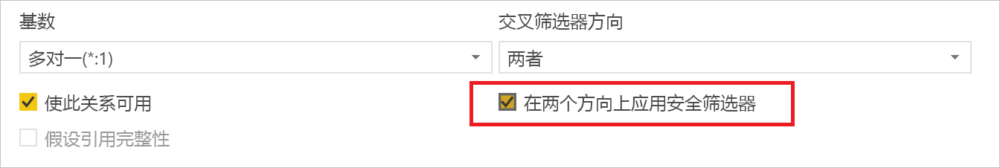
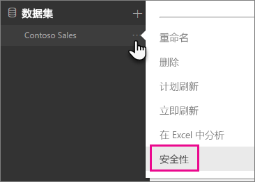
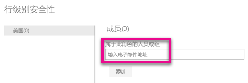
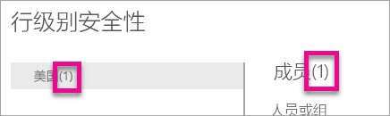
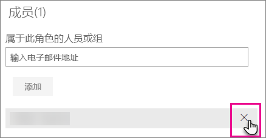
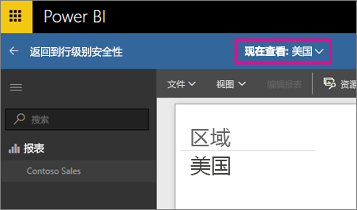
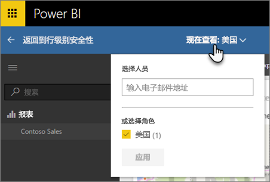
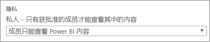

# Power BI 行级别安全性 (RLS)
Power BI 行级别安全性 (RLS) 可用于限制给定用户的数据访问。 筛选器限制行级别的数据访问，你可以定义角色中的筛选器。 请注意，在 Power BI 服务中，工作区的成员有权访问工作区中的数据集。 RLS 不限制此类数据访问。 

可以使用 Power BI Desktop 为导入到 Power BI 的数据模型配置 RLS。 你还可以在使用 DirectQuery（如 SQL Server）的数据集上配置 RLS。 在此之前，你只能在 Power BI 外的本地 Analysis Services 模型中实现 RLS。 对于 Analysis Services 的实时连接，你可以在本地模型上配置行级别安全性。 实时连接数据集不会显示安全选项。

[!INCLUDE [include-short-name](./includes/rls-desktop-define-roles.md)]

默认情况下，行级别安全性筛选采用单双向筛选器，无需考虑关系是设置为单向还是双向。 通过选择关系并勾选“在两个方向上应用安全筛选器”复选框，可手动启用具有行级别安全性的双向交叉筛选器。 在实现[动态行级别安全性](https://docs.microsoft.com/sql/analysis-services/supplemental-lesson-implement-dynamic-security-by-using-row-filters)时应选中此复选框，以便从中基于用户名或登录 ID 提供行级别安全性 

有关详细信息，请参阅[在 Power BI Desktop 中使用 DirectQuery 的双向交叉筛选](desktop-bidirectional-filtering.md)和[保护表格 BI 语义模型](http://download.microsoft.com/download/D/2/0/D20E1C5F-72EA-4505-9F26-FEF9550EFD44/Securing%20the%20Tabular%20BI%20Semantic%20Model.docx)技术文章。

[!INCLUDE [include-short-name](./includes/rls-desktop-view-as-roles.md)]

## 管理模型上的安全性
若要管理数据模型上的安全性，你需要执行以下操作。

1. 为数据集选择“省略号(...)”。
2. 选择“安全”。
   
   

这将转到 RLS 页面，使你可以为 Power BI Desktop 中创建的角色添加成员。 只有数据集的所有者才能看到可用的安全性。 如果数据集在某个组中，则只有该组的管理员才能看到安全选项。 

你只能创建或修改 Power BI Desktop 中的角色。

## 使用成员
### 添加成员
你可以通过键入邮件地址、用户姓名、你想要添加的安全组或通讯组列表，以向你的角色添加成员。 此成员需在你的组织内。 不能添加在 Power BI 内创建的组。

你还可以通过角色名称或“成员”旁边的括号内的数字看到有多少成员属于该角色。

### 移除成员
你可以通过选择成员名称旁的 X 来移除成员。 

## 验证 Power BI 服务中的角色
你可以通过测试角色来验证你定义的角色是否正常工作。 

1. 选择角色旁的“省略号 (...)”。
2. 选择“作为角色测试数据”

然后你会看到对该角色可用的报表。 仪表板不在此视图中显示。 在上面的蓝色栏中，你将看到被应用的内容。

可通过选择“立即以此角色查看”来测试其他角色或角色组合。

可选择以特定人员的身份查看数据，或选择可用角色的组合以验证它们是否工作。 

选择“返回到行级安全性”以返回到正常查看。

[!INCLUDE [include-short-name](./includes/rls-usernames.md)]

## 在 Power BI 中使用 RLS 和应用工作区
如果将 Power BI Desktop 报表发布到 Power BI 服务中的应用工作区，这些角色将应用于只读成员。 将需要指示这些成员只可以查看应用工作区设置中的 Power BI 内容。

> [!WARNING]
> 如果已配置应用工作区，因此成员具有编辑权限，那么将不会向这些成员应用 RLS 角色。 用户将能看到所有数据。
> 
> 

[!INCLUDE [include-short-name](./includes/rls-limitations.md)]

[!INCLUDE [include-short-name](./includes/rls-faq.md)]

## 后续步骤
[Power BI Desktop 行级别安全性 (RLS)](desktop-rls.md)  

更多问题？ [尝试咨询 Power BI 社区](http://community.powerbi.com/)

