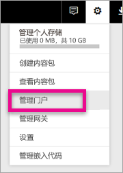
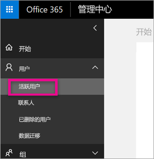
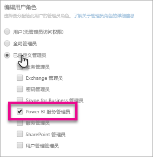

# <a name="understanding-the-power-bi-admin-role"></a>了解 Power BI 管理员角色
了解如何在组织中使用 Power BI 管理员角色。

<iframe width="640" height="360" src="https://www.youtube.com/embed/PQRbdJgEm3k?showinfo=0" frameborder="0" allowfullscreen></iframe>

可以向应有权访问 Power BI 管理门户的用户分配 Power BI 服务管理员角色，但并未向其授予其他 Office 365 管理访问权限。 例如，全局管理员角色。 这适合分配给负责为组织管理 Power BI 的人员。

Office 365 用户管理员可以在 Office 365 管理中心内或通过 PowerShell 脚本，将用户分配为 Power BI 管理员。 分配为管理员后，用户便可以访问 [Power BI 管理门户](service-admin-portal.md)。 在管理门户中，用户可以访问整个租户范围内的使用情况指标，并能控制整个租户范围内的 Power BI 功能使用情况。



## <a name="using-the-office-365-admin-center-to-assign-a-role"></a>使用 Office 365 管理中心分配角色
若要在 Office 365 管理中心内为用户分配 Power BI 管理员角色，可以执行以下操作。

1. 转到 Office 365 管理中心，然后依次选择“**用户**” > “**活动用户**”。
   
    
2. 选择要向其分配角色的用户。
3. 选择相应角色旁边的“**编辑**”。
   
    
4. 依次选中“**自定义管理员**” > “**Power BI 服务管理员**”
   
    
5. 选择**保存**。

此时，系统应该会列出相应用户拥有的“**Power BI 服务管理员**”角色。 他们现在将有权访问 [Power BI 管理门户](service-admin-portal.md)。


## <a name="using-powershell-to-assign-a-role"></a>使用 PowerShell 分配角色
若要运行 PowerShell 命令，必须安装 Azure Active Directory PowerShell 模块。

### <a name="download-azure-ad-powershell-module"></a>下载 Azure AD PowerShell 模块
[下载 Azure Active Directory PowerShell 版本 2](https://github.com/Azure/azure-docs-powershell-azuread/blob/master/Azure%20AD%20Cmdlets/AzureAD/index.md)

[下载 Azure Active Directory PowerShell 版本 1.1.166.0 GA](http://connect.microsoft.com/site1164/Downloads/DownloadDetails.aspx?DownloadID=59185)

### <a name="command-to-add-role-to-member"></a>用于向成员添加角色的命令
**Azure AD PowerShell v2 命令**

需要为 **Power BI 服务管理员**角色获取 **ObjectId**。 可以运行 [Get-AzureADDirectoryRole](https://docs.microsoft.com/powershell/azuread/v2/get-azureaddirectoryrole) 获取 **ObjectId**

```
PS C:\Windows\system32> Get-AzureADDirectoryRole

ObjectId                             DisplayName                        Description
--------                             -----------                        -----------
00f79122-c45d-436d-8d4a-2c0c6ca246bf Power BI Service Administrator     Full access in the Power BI Service.
250d1222-4bc0-4b4b-8466-5d5765d14af9 Helpdesk Administrator             Helpdesk Administrator has access to perform..
3ddec257-efdc-423d-9d24-b7cf29e0c86b Directory Synchronization Accounts Directory Synchronization Accounts
50daa576-896c-4bf3-a84e-1d9d1875c7a7 Company Administrator              Company Administrator role has full access t..
6a452384-6eb9-4793-8782-f4e7313b4dfd Device Administrators              Device Administrators
9900b7db-35d9-4e56-a8e3-c5026cac3a11 AdHoc License Administrator        Allows access manage AdHoc license.
a3631cce-16ce-47a3-bbe1-79b9774a0570 Directory Readers                  Allows access to various read only tasks in ..
f727e2f3-0829-41a7-8c5c-5af83c37f57b Email Verified User Creator        Allows creation of new email verified users.
```

在此示例中，角色 objectid 为 00f79122-c45d-436d-8d4a-2c0c6ca246bf。

还需要知道用户 **ObjectID**。 为此，可以运行 [Get-AzureADUser](https://docs.microsoft.com/powershell/azuread/v2/get-azureaduser)。

```
PS C:\Windows\system32> Get-AzureADUser -SearchString 'tim@contoso.com'

ObjectId                             DisplayName UserPrincipalName      UserType
--------                             ----------- -----------------      --------
6a2bfca2-98ba-413a-be61-6e4bbb8b8a4c Tim         tim@contoso.com        Member
```

若要向成员添加角色，请运行 [Add-AzureADDirectoryRoleMember](https://docs.microsoft.com/powershell/azuread/v2/add-azureaddirectoryrolemember)。

| 参数 | 说明 |
| --- | --- |
| ObjectId |角色 ObjectId。 |
| RefObjectId |成员 ObjectId。 |

```
Add-AzureADDirectoryRoleMember -ObjectId 00f79122-c45d-436d-8d4a-2c0c6ca246bf -RefObjectId 6a2bfca2-98ba-413a-be61-6e4bbb8b8a4c
```

**Azure AD PowerShell v1 命令**

若要使用 Azure AD v1 cmdlet 向成员添加角色，需要运行 [Add-MsolRoleMember](https://docs.microsoft.com/powershell/msonline/v1/add-msolrolemember) 命令。

```
Add-MsolRoleMember -RoleMemberEmailAddress "tim@contoso.com" -RoleName "Power BI Service Administrator"
```

## <a name="limitations-and-considerations"></a>限制和注意事项
Power BI 服务管理员角色不提供以下功能。

* 在 Office 365 管理中心内修改用户和许可证的功能
* 访问审核日志的功能。 有关详细信息，请参阅[在组织内使用审核](service-admin-auditing.md)。

## <a name="next-steps"></a>后续步骤
[Power BI 管理门户](service-admin-portal.md)  
[Add-AzureADDirectoryRoleMember](https://docs.microsoft.com/powershell/azuread/v2/add-azureaddirectoryrolemember)  
[Add-MsolRoleMember](https://docs.microsoft.com/powershell/msonline/v1/add-msolrolemember)  
[在组织中审核 Power BI](service-admin-auditing.md)  
[在组织中管理 Power BI](service-admin-administering-power-bi-in-your-organization.md)  

更多问题？ [尝试咨询 Power BI 社区](http://community.powerbi.com/)

