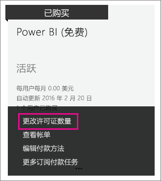

# 组织中的 Power BI（免费）
这着眼于如何在组织中使用 Power BI（免费）产品/服务。 组织意味着你具有一个租户，可以在该租户中管理用户和服务。 作为管理员，你可以控制许可证分配，也可以允许用户以个人身份注册。 我们会介绍 Power BI（免费）许可证以及如何控制个人登录。

## 个人注册与许可证分配
组织中的用户可以通过两种不同方式获取对 Power BI 的访问权限。 他们可以个人方式注册 Power BI，你也可以在 Office 365 管理门户内向他们分配 Power BI 许可证。

允许个人注册可允许对 Power BI 感兴趣的用户免费注册，从而减轻组织管理员的负担。

为获得更多控制，你可以在 Office 365 管理中心内阻止个人注册并自己分配 Power BI 许可证。 这使你可以具体确定组织中的哪些人员可以访问哪些服务。 如果你必须处理审核并且需要确切地知道哪些人员可以使用哪些内容，那么这也是很好的选择。

## 如何获取无限制许可证块
在 Office 365 管理中心内的**计帐**  >  **许可证**下，你可能会也可能不会看到具有无限制许可证的 Power BI（免费）。

此许可证块会在某人首次以个人身份注册 Power BI 之后显示。 在该过程中，此许可证块会附加到你的组织，一个许可证会分配给进行注册的用户。

如果阻止个人用户注册并且没有人进行了注册，则你不会看到此许可证块。 你可以允许个人用户注册并让一个用户注册，也可以通过接下来会讨论的添加订阅 Office 365 流程来获取免费许可证。

Power BI（免费）许可证块可用之后，你便可以将这些许可证分配给用户。 有关如何分配许可证的详细信息，请参阅[向 Office 365 中的用户分配许可证](https://support.office.com/article/Assign-or-unassign-licenses-for-Office-365-for-business-997596b5-4173-4627-b915-36abac6786dc)。

## 通过在 Office 365 中添加订阅来获取免费许可证
1. 导航到 [Office 365 管理中心](https://portal.office.com/admin/default.aspx)。
2. 在左侧导航窗格中，选择**计帐**  >  **订阅**。
3. 选择右侧的**添加订阅 +**。
4. 在“其他计划”下，将鼠标悬停在 Power BI （免费）的**省略号 (...)** 上方，然后选择**立即购买**。
   
    
5. 输入要添加的许可证数，并选择**立即结帐**或**添加到购物车**。
   
   > [!NOTE]
   > 如果需要，可以在以后添加更多。
   > 
   > 
6. 输入结帐流程中的所需信息。

使用此方法时不会进行任何购买，不过你需要输入信用卡信息以进行计帐或选择开票。

如果你以后决定要添加更多许可证，则可以返回到**添加订阅**，然后对 Power BI（免费）选择**更改许可证数量**。

你现在可以向用户分配这些许可证。 有关如何分配许可证的详细信息，请参阅[向 Office 365 中的用户分配许可证](https://support.office.com/article/Assign-or-unassign-licenses-for-Office-365-for-business-997596b5-4173-4627-b915-36abac6786dc)。

## 在 Azure Active Directory 中启用或禁用个人用户注册
作为管理员，你可以在 Azure Active Directory (AAD) 中选择启用或禁用个人用户注册。 如果你知道如何利用 AAD PowerShell 命令，则可以自己启用或禁用临时订阅。 [了解详细信息](https://technet.microsoft.com/library/jj151815.aspx)

对此进行控制的 AAD 设置是 **AllowAdHocSubscriptions**。 大多数租户会将此设置设置为 true，这意味着它处于启用状态。 如果你是通过合作伙伴获取 Power BI，则这可能会在默认情况下设置为 false，这意味着它处于禁用状态。

1. 你需要首先使用 Office 365 凭据登录 Azure Active Directory。 第一行会提示你输入凭据。 第二行连接到 Azure Active Directory。
   
     $msolcred = get-credential   connect-msolservice -credential $msolcred
   
   
2. 登录之后，你便可以发出以下命令以查看租户当前是针对哪种类型配置的。
   
     Get-MsolCompanyInformation | fl AllowAdHocSubscriptions
3. 可以使用此命令启用 ($true) 或禁用 ($false) AllowAdHocSubscriptions。
   
     Set-MsolCompanySettings -AllowAdHocSubscriptions $true

> [!NOTE]
> 该阻止行为将阻止组织中的新用户注册 Power BI。 在为组织禁用新注册之前注册 Power BI 的用户仍会保留其许可证。
> 
> 

## 后续步骤
[自助注册 Power BI](service-self-service-signup-for-power-bi.md)  
[购买 Power BI Pro](service-admin-purchasing-power-bi-pro.md)  
[使用自定义 Azure Active Directory 租户注册 Power BI（免费）](developer/create-an-azure-active-directory-tenant.md)  
[Power BI Premium 有哪些特权？](service-premium.md)  
[Power BI Premium 白皮书](https://aka.ms/pbipremiumwhitepaper)  

更多问题？ [尝试咨询 Power BI 社区](http://community.powerbi.com/)

