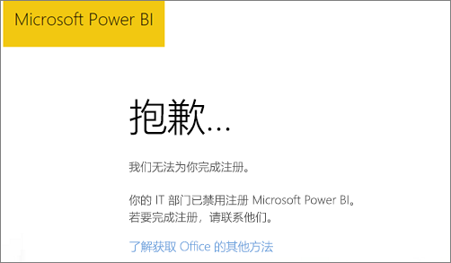
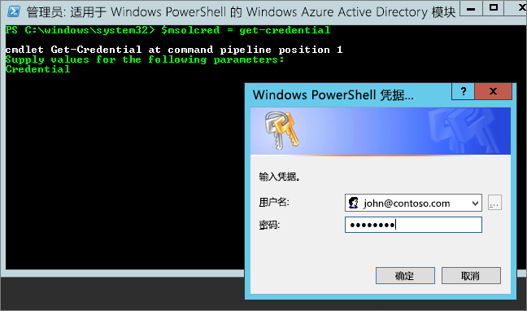

# 无法将 Power BI 添加到 Office 365 合作伙伴订阅
Office 365 允许公司转售与自己的解决方案捆绑和集成的 Office 365，从而为最终客户提供用于购买、计帐和支持的单点联系。

如果你有兴趣随 Office 365 订阅一起获取 Power BI，则我们建议你与合作伙伴联系以实现此目的。 如果你的合作伙伴不提供 Power BI，则你可以考虑不同的选择。

1. 你能够从其他渠道（直接从 Microsoft 或从其他合作伙伴）购买该服务。 此选择并非对所有客户都可用，具体取决于他们与合作伙伴的关系。 可以通过转到**Office 365 管理门户**  >  **计帐**  >  **订阅**，来验证这一点。 如果你看到**订阅**，则可以直接从 Microsoft 获取该服务，也可以与提供 Power BI 的合作伙伴联系。
   
    
2. 如果你未看到**订阅**在**计帐**下列出，则无法直接从 Microsoft 或从其他合作伙伴购买。 
   
   

如果无法直接购买 Power BI，根据你感兴趣的 Power BI 订阅的类型，你仍有一些选择。

[Power BI（免费）](#power-bi-free)

[Power BI Pro 和 Premium](#power-bi-pro)

## Power BI（免费）
如果你对 Power BI 的免费产品/服务感到满意，则可以注册免费服务。 默认情况下，个人注册（也称为临时订阅）处于禁用状态。 尝试注册 Power BI 时，你会看到一条消息，指示 IT 部门已关闭了 Microsoft Power BI 的注册。

    Your IT department has turned off signup for Microsoft Power BI.

若要启用临时订阅，可以与合作伙伴联系并请求打开该功能。 如果你是租户的管理员，并且知道如何利用 Azure Active Directory PowerShell 命令，则可以自己启用临时订阅。 [了解详细信息](https://technet.microsoft.com/library/jj151815.aspx)

1. 你需要首先使用 Office 365 凭据登录 Azure Active Directory。 第一行会提示你输入凭据。 第二行连接到 Azure Active Directory。
   
        $msolcred = get-credential
        connect-msolservice -credential $msolcred
   
    
2. 登录之后，你便可以发出以下命令以启用免费注册。
   
        Set-MsolCompanySettings -AllowAdHocSubscriptions $true

## Power BI Pro 和 Premium
如果要购买 Power BI Pro 或 Power BI Premium 订阅，则必须与合作伙伴合作以考虑所具有的选择。

* 合作伙伴同意将 Power BI 添加到其产品组合，以便你可以从他们那里购买。
* 合作伙伴能够将你转换到一种模型，在其中可以直接从 Microsoft 或从提供 Power BI 的其他合作伙伴购买 Power BI。

此视频介绍 Office 365 联合以及如何购买 Power BI：

<iframe width="560" height="315" src="https://www.youtube.com/embed/C357phT94A8" frameborder="0" allowfullscreen></iframe>

## 后续步骤
[使用 Windows PowerShell 管理 Azure AD](https://technet.microsoft.com/library/jj151815.aspx)  
[Power BI Premium 有哪些特权？](service-premium.md)

更多问题？ [尝试咨询 Power BI 社区](http://community.powerbi.com/)

